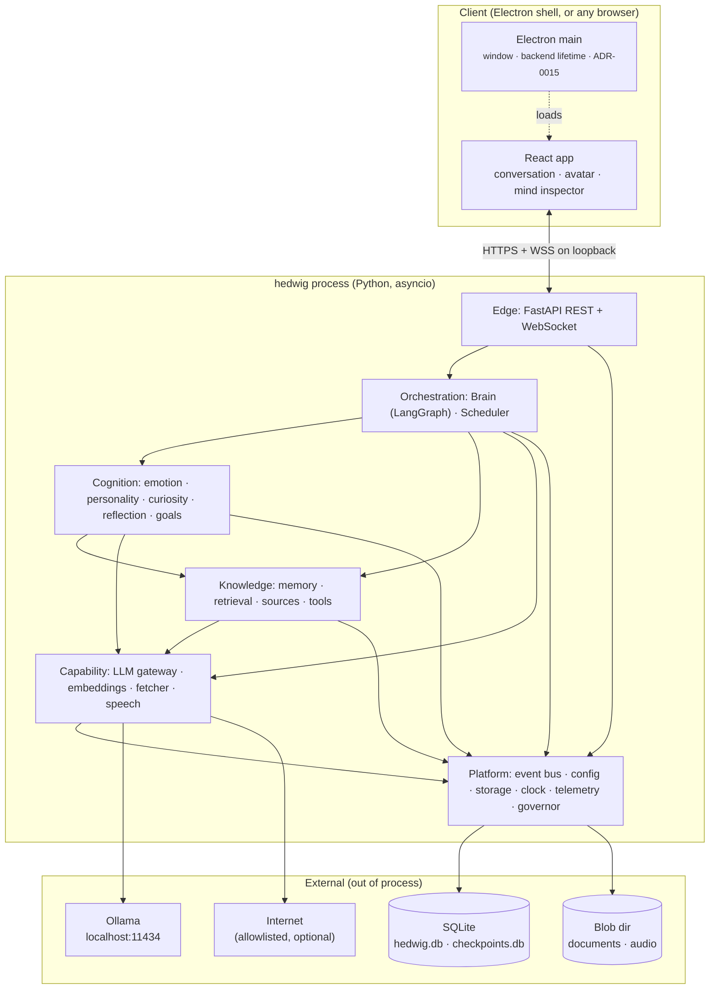
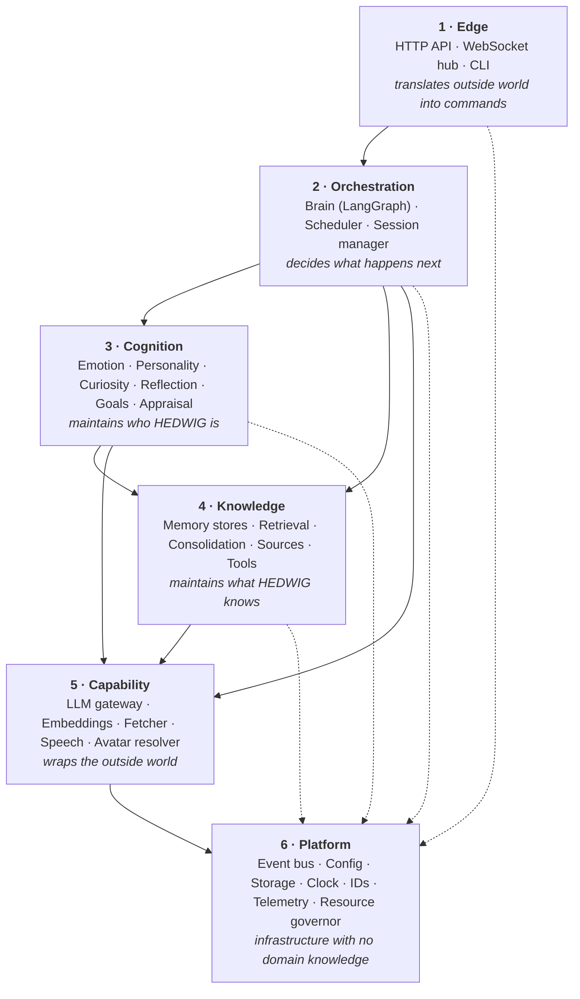
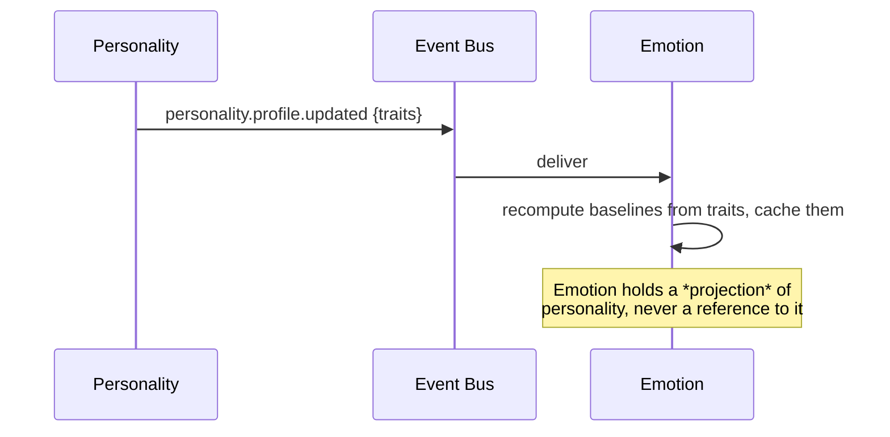
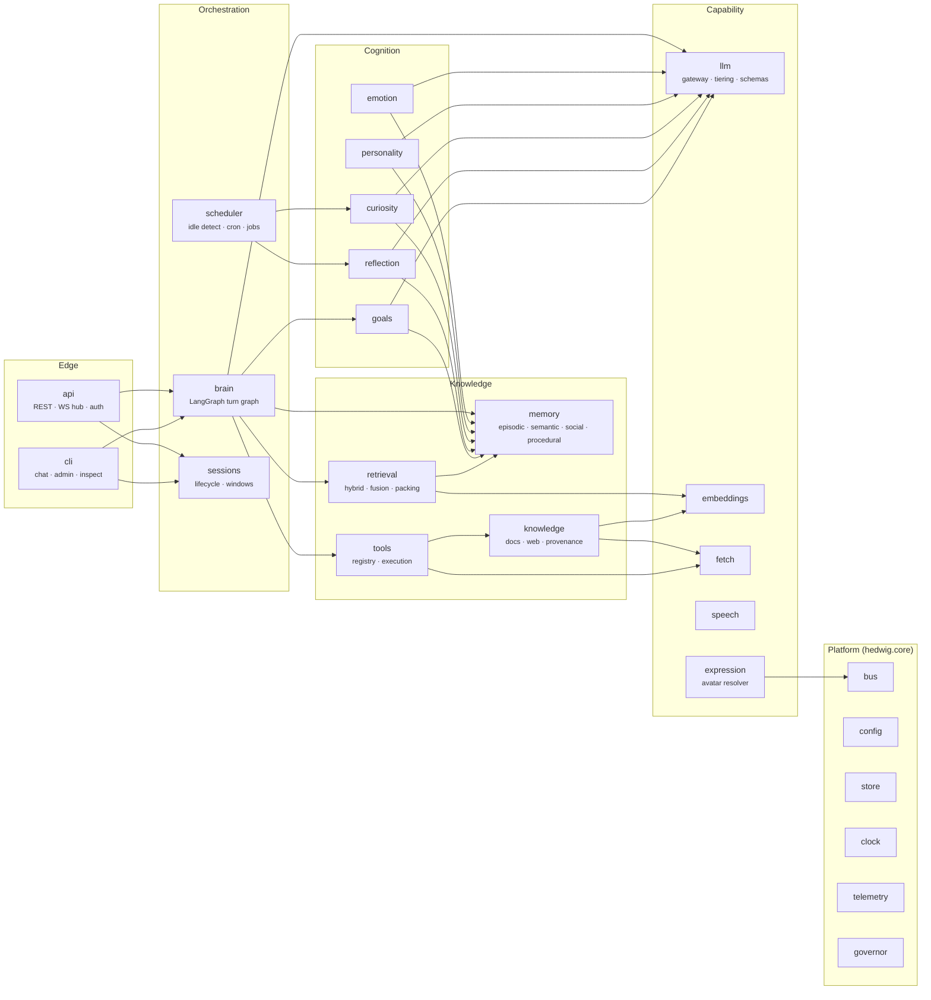
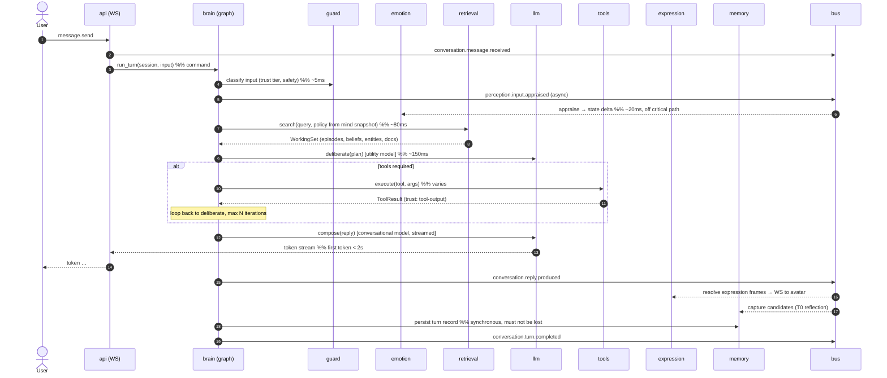

# 02 — System Architecture

**Status:** Design · **Depends on:** [01](01-vision-and-scope.md) · **Depended on by:** all subsystem documents

---

## 1. Purpose

Defines the shape of the system: how it is deployed, what the modules are, which
directions dependencies may point, and where the code lives. Every rule in §4 is
mechanically enforced by a test, because architecture rules that rely on discipline decay.

---

## 2. Deployment shape

**One process. A modular monolith with an in-process event bus.**



### Why a monolith

Microservices are the reflexive answer to "modular", and they are the wrong answer here.
Modularity is a property of *dependency structure*, not of process boundaries. Splitting
across processes for a single-user local application buys us nothing we need (independent
scaling, independent deploys, fault isolation across teams) and costs us plenty: network
serialisation on every memory read, distributed debugging of an already hard-to-debug
cognitive loop, and operational burden on a user who just wants to run one thing.

We get modularity from ports (§4) instead, and we keep the ability to extract later: the
event bus has a transport port, so a module can be moved out of process by swapping the
in-process transport for one that speaks over a socket, without touching the module.

> **Extraction trigger:** if any single module needs a different runtime (e.g. a Rust
> retrieval core) or a hard resource isolation boundary, extract *that one module* behind
> its existing port. Do not split everything.

---

## 3. Layers

Six layers. Dependencies point strictly downward. Nothing in a lower layer may know that a
higher layer exists.



| Layer | Contains | May depend on | Key constraint |
|---|---|---|---|
| 1 Edge | `api`, `ws`, `cli` | 2, 6 | No domain logic. Validates, authenticates, translates, streams. |
| 2 Orchestration | `brain`, `scheduler`, `sessions` | 3, 4, 5, 6 | Sequences work; contains no cognitive rules of its own. |
| 3 Cognition | `emotion`, `personality`, `curiosity`, `reflection`, `goals` | 4, 5, 6 | **Cognition modules may not depend on each other.** See §4.2. |
| 4 Knowledge | `memory`, `retrieval`, `knowledge`, `tools` | 5, 6 | Knows nothing about emotion or personality; receives weights as parameters. |
| 5 Capability | `llm`, `embeddings`, `fetch`, `speech`, `expression` | 6 | Pure adapters over external systems. No persistence of domain state. |
| 6 Platform | `bus`, `config`, `store`, `clock`, `ids`, `telemetry`, `governor` | — | Zero domain vocabulary. Could be lifted into another project unchanged. |

The one rule that carries the most weight: **Layer 4 does not know Layer 3 exists.** The
retrieval engine does not import the emotion engine to find out how curious HEDWIG is; it
accepts a `RetrievalPolicy` value object with weights in it. Whoever calls it decides the
weights. This keeps the entire knowledge subsystem testable and reusable without a
cognitive stack, and it prevents the single most likely coupling disaster in this design.

---

## 4. Dependency rules

### 4.1 Ports at every boundary

A module is consumed only through a `Protocol` declared in `hedwig/core/ports/`. Concrete
implementations live in the owning package and are registered in one wiring module. No
package imports another package's internals. Full port catalogue:
[03-module-contracts.md](03-module-contracts.md).

Enforced by [import-linter](https://import-linter.readthedocs.io/) contracts checked in
CI:

```ini
# .importlinter (illustrative)
[importlinter:contract:layers]
type = layers
layers =
    hedwig.api | hedwig.cli
    hedwig.brain | hedwig.scheduler | hedwig.sessions
    hedwig.emotion | hedwig.personality | hedwig.curiosity | hedwig.reflection | hedwig.goals
    hedwig.memory | hedwig.retrieval | hedwig.knowledge | hedwig.tools
    hedwig.llm | hedwig.embeddings | hedwig.fetch | hedwig.speech | hedwig.expression
    hedwig.core

[importlinter:contract:cognition-siblings]
type = independence
modules =
    hedwig.emotion
    hedwig.personality
    hedwig.curiosity
    hedwig.reflection
    hedwig.goals
```

### 4.2 Cognition siblings are independent

Emotion needs personality (baselines come from traits). Curiosity needs goals. Reflection
needs everything. Direct imports would weld the cognitive core into one lump — exactly
the outcome the project forbids.

Resolution: **siblings communicate by events plus cached projections.**



Consequences, accepted with eyes open:

- **Eventual consistency.** Emotion's baselines can lag a personality change by the bus
  delivery latency (in-process: microseconds; after a restart: bounded by replay of the
  last profile event, which is a snapshot event, so lag is zero on boot).
- **Duplication.** Each consumer keeps a small projection. This is the price of
  decoupling, and the projections are tiny.
- **Ordering.** Snapshot-style events (`*.updated` carrying full state, not deltas) make
  out-of-order delivery harmless. This is a rule: **cross-module state events carry
  snapshots; deltas are internal only.**

### 4.3 Commands are calls; facts are events

The most common failure of "prefer event-driven" is making *everything* an event, which
turns every code path into an untraceable choreography. Our rule:

| | Mechanism | Example |
|---|---|---|
| **Command** — "do this, I need the result" | Direct call through a port, synchronous in the caller's control flow, typed return, errors propagate | `retrieval.search(query, policy) -> WorkingSet` |
| **Event** — "this happened, whoever cares may react" | Published to the bus, fire-and-forget, no return value, no caller assumptions about handlers | `conversation.message.received` |

The Brain issues commands. Cognition modules react to events. A module never publishes an
event and then waits for a consequence — if it needs a result, it makes a call. Detailed
rationale and the full event catalogue: [04](04-communication-and-event-bus.md).

### 4.4 One writer per field

Every piece of durable state has exactly one module allowed to write it. Everyone else
reads. This makes concurrent background work safe without distributed locking and makes
"who changed this?" always answerable. Ownership table: [08-state-management.md](08-state-management.md) §3.

---

## 5. Module map



### 5.1 Module responsibilities, one line each

| Module | Owns | Document |
|---|---|---|
| `api` | HTTP/WS surface, envelopes, auth, streaming, backpressure | [16](16-api-structure.md) |
| `cli` | Headless chat and admin commands; the Phase-0 interface | [17](17-backend-architecture.md) |
| `brain` | The turn graph: perceive → recall → deliberate → act → compose → learn | [07](07-brain-langgraph-workflow.md) |
| `scheduler` | Idle detection, cron-like triggers, job queue, run records | [17](17-backend-architecture.md) §6 |
| `sessions` | The conversation log: sessions, messages, turns, the working-set log, and the recent-turn window | [08](08-state-management.md) §5, [26](26-turn-memory-loop.md) §4 |
| `emotion` | Emotional state vector, appraisal, decay, behaviour bindings | [09](09-emotion-engine.md) |
| `personality` | Trait vector, drift proposals and application, identity core | [10](10-personality-engine.md) |
| `curiosity` | Gap register, exploration scheduling, findings, interruption policy | [11](11-curiosity-engine.md) |
| `reflection` | Five-tier reflection, consolidation, decay/forgetting passes | [12](12-reflection-engine.md) |
| `goals` | Goal lifecycle, priority, progress, influence on retrieval and initiative | [08](08-state-management.md) §6 |
| `memory` | The four durable memory stores and their write paths | [06](06-memory-architecture.md) |
| `retrieval` | Query planning, hybrid search, fusion, diversification, context packing | [06](06-memory-architecture.md) §6 |
| `knowledge` | Local document ingestion, web reading, provenance and trust tiers | [13](13-knowledge-and-tools.md) |
| `tools` | Tool registry, argument validation, execution, approval gates, audit | [13](13-knowledge-and-tools.md) §5 |
| `llm` | Provider abstraction, model tiering, prompt assembly, structured decoding | [14](14-language-model-gateway.md) |
| `embeddings` | Embedding generation, model identity tracking, re-embed jobs | [14](14-language-model-gateway.md) §7 |
| `fetch` | Outbound HTTP with allowlist, robots, caching, sanitisation | [13](13-knowledge-and-tools.md) §4 |
| `speech` | TTS/ASR adapters, phoneme timings for lip sync | [15](15-avatar-controller.md) §6 |
| `expression` | Emotion + speech → expression frames | [15](15-avatar-controller.md) |
| `core.bus` | Publish/subscribe, durable outbox, replay | [04](04-communication-and-event-bus.md) |
| `core.config` | Layered config load, validation, hot-reload of safe keys | §7 below |
| `core.store` | Connection management, migrations, transactions, repositories | [05](05-data-model-and-database.md) |
| `core.clock` | Injectable time; the reason time-travel tests are possible | [20](20-testing-strategy.md) §3 |
| `core.telemetry` | Structured logs, spans, correlation, metrics | [19](19-observability.md) |
| `core.governor` | Resource admission control: model lock, budgets, priorities | [17](17-backend-architecture.md) §7 |

---

## 6. The turn, end to end

The single most important flow in the system. Numbers are the latency budget on target
hardware for a typical turn.



Design notes visible in this diagram:

- **Appraisal is off the critical path.** Emotion updates concurrently with retrieval. The
  emotional state used for *this* turn's policy is the snapshot taken at turn start; the
  appraisal of this input affects the *next* turn. This is a deliberate tradeoff: it costs
  one turn of emotional latency and buys us a clean, fast, non-blocking path. Humans
  arguably work the same way.
- **Two model tiers.** Planning, appraisal and extraction use the small utility model.
  Only composition uses the big one. This is what makes the whole cognitive apparatus
  affordable on a laptop.
- **Persistence of the turn is a command, not an event.** Losing a message is
  unacceptable, so it is not fire-and-forget.
- **Memory capture is an event.** Losing a *candidate* memory extraction is tolerable
  because the durable turn record lets a later reflection pass re-derive it.

---

## 7. Configuration

One layered configuration model, resolved at startup, validated by a Pydantic model, and
frozen thereafter except for keys explicitly marked hot-reloadable.

```
defaults (in code)
  ← config/hedwig.toml          (checked-in, safe defaults)
    ← config/hedwig.local.toml  (gitignored, machine-specific)
      ← HEDWIG_* environment variables
        ← CLI flags
```

Structure (illustrative, not exhaustive):

```toml
[runtime]
data_dir = "~/.hedwig"
bind = "127.0.0.1:8730"

[llm]
provider = "ollama"
endpoint = "http://127.0.0.1:11434"
conversational = "llama3.1:8b"
utility = "qwen2.5:3b"
embedding = "nomic-embed-text"

[memory]
recent_turn_window = 8
context_token_budget = 3000
decay_half_life_days = 30

[emotion]
tick_seconds = 30
max_delta_per_tick = 0.15

[personality]
weekly_drift_cap = 0.02
lifetime_drift_cap = 0.25

[curiosity]
enabled = false            # opt-in: it is the only module that touches the network
daily_token_budget = 40000
allowlist = ["docs.python.org", "arxiv.org"]

[privacy]
allow_network = false
telemetry = "local-only"
```

Rules:

- **Secrets never live in config files** — only in the OS keychain, read through a port.
- **Every module reads its own typed sub-config**, injected at construction. No module
  reaches into global config.
- **Curiosity and network access are opt-in**, satisfying INV-8.

---

## 8. Repository layout

```
hedwig/
├── README.md
├── CLAUDE.md
├── docs/                       ← this directory; the source of truth
│   └── adr/                    ← one file per decision from Phase 1 onward
├── config/
│   ├── hedwig.toml
│   └── hedwig.local.toml       (gitignored)
├── src/hedwig/
│   ├── core/                   ← Layer 6
│   │   ├── ports/              ← ALL protocols live here, one file per boundary
│   │   ├── bus/                ← event bus + outbox
│   │   ├── store/              ← connection, migrations, repositories
│   │   ├── config.py  clock.py  ids.py  telemetry.py  governor.py
│   │   └── types.py            ← shared value objects (Episode, Belief, WorkingSet…)
│   ├── llm/  embeddings/  fetch/  speech/  expression/       ← Layer 5
│   ├── memory/  retrieval/  knowledge/  tools/               ← Layer 4
│   ├── emotion/  personality/  curiosity/  reflection/  goals/  ← Layer 3
│   ├── brain/  scheduler/  sessions/                         ← Layer 2
│   ├── api/  cli/                                            ← Layer 1
│   └── wiring.py               ← the ONLY place concrete types meet ports
├── migrations/
│   └── 0001_initial.sql …
├── electron/                   ← desktop shell: window + backend lifetime only (ADR-0015)
│   ├── main.ts  preload.ts  tsconfig.json
├── frontend/                   ← React app, independent build
│   ├── src/
│   └── package.json
├── scripts/dev.mjs             ← one command: backend + Vite + shell, unified logs
├── docker/                     ← development only; see docs/17 §10
├── tests/
│   ├── unit/  integration/  scenario/  evals/  redteam/
│   └── fixtures/llm/           ← recorded model interactions
├── tools/                      ← dev scripts (db inspect, replay, seed)
├── pyproject.toml
└── .importlinter
```

Each module package has the same internal shape, so navigation is predictable:

```
memory/
├── README.md          ← points at docs/06, lists local decisions
├── service.py         ← the class that implements the port
├── models.py          ← module-internal value objects
├── repository.py      ← SQL, owned by this module alone
├── handlers.py        ← event subscriptions
└── tests/
```

---

## 9. Technology choices

| Concern | Choice | Why | Replaceability |
|---|---|---|---|
| Language (backend) | Python 3.12+ | LangGraph, the ML ecosystem, and every model runtime are Python-first | Whole-system rewrite; not replaceable, and that's fine |
| Orchestration | LangGraph | Checkpointing, interrupts, streaming, typed state — all things we would otherwise build | Nodes are thin adapters, so logic survives replacement ([ADR-0004](24-decision-records.md#adr-0004)) |
| Web framework | FastAPI + uvicorn | Async, WebSockets, Pydantic validation, OpenAPI for free | Behind Layer 1 only |
| Database | SQLite (WAL) | Single-file, zero-admin, user-owned, transactional, fast enough by orders of magnitude | Repository ports; Postgres adapter is a Phase-8+ option |
| Lexical search | SQLite FTS5 | In the same file, in the same transaction as the data | Behind `LexicalIndex` port |
| Vector search | `sqlite-vec` | Same file, no second daemon; sufficient to ~10⁶ vectors | Behind `VectorIndex` port; LanceDB/Qdrant adapters are drop-in |
| Data access | `sqlite3` + hand-written SQL in repositories | No ORM: the schema is the design, and we want to read it | If SQL sprawls, insert SQLAlchemy Core behind the same repositories |
| Migrations | Numbered `.sql` files + `schema_migrations` table + tiny runner | ~50 lines, fully comprehensible, no framework | Alembic if branching migrations ever become real |
| Models | Ollama | Local-first, model swapping without code change | `LLMProvider` port; llama.cpp / vLLM / cloud adapters possible |
| Validation | Pydantic v2 | Shared with FastAPI; also the schema source for structured LLM output | — |
| Frontend | React + TypeScript + Vite | Boring, well-understood, good 3D story via three.js | Transport layer is isolated; another UI can speak the same WS protocol |
| Frontend state | Zustand + one WS reducer | Small, no ceremony; a single event-stream reducer matches the backend model | — |
| Avatar | 2D layered SVG (Phase 6) → VRM/three.js (Phase 7) | Ship expressiveness before fidelity | `Renderer` interface with semantic frames ([15](15-avatar-controller.md)) |
| Desktop shell | Electron ([ADR-0015](24-decision-records.md)) | A companion opened dozens of times a day needs an app, not a tab; the shell also owns the backend's lifetime | Thin by construction — window and lifecycle only; the browser stays a supported client |
| Packaging | `uv` + `pyproject.toml`; single `hedwig` console script | Fast, reproducible | — |

### Deliberate omissions

No Redis, no Kafka, no Celery, no Docker Compose stack, no Kubernetes, no separate vector
database daemon, no ORM, no GraphQL, no auth provider. Each of those would be an
unnecessary abstraction for a single-user local application, and each has a named
replacement path if the constraint that justified its absence changes.

---

## 10. Tradeoffs

| Decision | Gained | Given up | Would revisit if |
|---|---|---|---|
| Monolith, in-process bus | Simplicity, debuggability, low latency | Independent scaling and fault isolation | A module needs a different runtime or hard resource isolation |
| SQLite as single source of truth | Portability, transactions across memory + vectors, user ownership | Concurrent multi-writer throughput; network access | Multi-device sync or multi-user becomes a goal |
| Python everywhere | Ecosystem alignment | Raw performance; GIL constraints on CPU-bound work | Retrieval becomes CPU-bound (then extract that module) |
| Two-tier local models | Cognitive machinery affordable on a laptop | Utility-model quality on extraction/appraisal tasks | Small-model structured output proves unreliable → see [14](14-language-model-gateway.md) §6 |
| Cognition siblings decoupled by events | Genuine replaceability of the cognitive core | Eventual consistency; small projection duplication | Never — this is the load-bearing rule |
| Appraisal off the critical path | Fast turns, no blocking | One turn of emotional latency | Users notice the lag in practice |
| No ORM | Schema legibility, exact queries | Boilerplate; manual mapping | Repository code exceeds ~1.5k lines of SQL |

---

## 11. Failure modes

| Failure | Detection | Behaviour |
|---|---|---|
| Ollama down / model missing | Health probe at startup and per call | API returns a typed `capability_unavailable`; chat degrades to an explicit "my language faculty is unavailable" state; memory and inspection stay usable |
| Database locked | `SQLITE_BUSY` after retry with backoff | Write commands fail loudly; reads continue; background jobs pause via governor |
| Database corrupt | `PRAGMA integrity_check` at startup | Refuse to start; point at the latest backup; never auto-repair |
| Event handler raises | Bus catches per handler | Error logged with correlation ID, event marked failed in outbox, other handlers still run, retried per policy ([04](04-communication-and-event-bus.md) §7) |
| Background job starves conversation | Governor queue latency metric | Governor preempts: background model work yields the model lock to interactive work |
| Frontend disconnects mid-stream | WS close | Turn continues to completion server-side and is persisted; client resumes from the session log on reconnect |
| Disk full | Pre-write space check | Read-only mode; loud user-facing notice; no silent memory loss |

---

## 12. Future improvements

| Improvement | Trigger |
|---|---|
| Extract retrieval into a separate process/runtime | Retrieval p95 > 200 ms on a realistic corpus |
| Postgres + pgvector adapter | Multi-device or multi-user becomes a goal |
| Replace in-process bus transport with a socket transport | First module extraction |
| Structured-output-constrained decoding (grammar-level) | Utility-model JSON failure rate > 2% |
| Second frontend (mobile/terminal TUI) | WS protocol stable for one full phase |
| Model-agnostic embedding migration tooling | First embedding model upgrade |
