# 03 — Module Contracts

**Status:** Design · **Depends on:** [02](02-system-architecture.md) · **Depended on by:** every subsystem document

---

## 1. Purpose

"Every module should be replaceable" is only true if there is a written contract at each
boundary. This document is that catalogue. It is the single place to look up what a module
promises.

**These are contracts, not code.** They are expressed in Python typing syntax because it
is the precise notation available. When implementation begins, they become
`hedwig/core/ports/*.py` — and this document must be updated in the same commit as any
signature change.

---

## 2. Rules

1. **Ports are `typing.Protocol`, structural, not ABCs.** No inheritance from framework
   base classes; a class satisfies a port by shape. This keeps adapters free of our
   vocabulary and honours *composition over inheritance*.
2. **Ports live in `hedwig/core/ports/`, not next to implementations.** A port next to its
   only implementation is not a boundary, it is decoration.
3. **Ports speak in value objects from `hedwig.core.types`** — never in database rows,
   ORM entities, framework requests, or provider-specific payloads.
4. **Every value object crossing a port is immutable** (`@dataclass(frozen=True)` or a
   frozen Pydantic model). Shared mutable state across modules is the bug we are
   preventing.
5. **Errors are typed and declared.** Each port names the exceptions it may raise; ports
   never leak provider exceptions (`httpx.HTTPError`, `sqlite3.OperationalError`).
6. **No port method takes a callback into a higher layer.** If a lower layer needs to
   inform a higher one, it publishes an event.
7. **Async by default.** Anything that may touch I/O is `async def`. Pure computation
   (decay maths, fusion) is sync.
8. **A port with one implementation and no plausible second one should not exist.** Named
   exception: ports needed for test seams (`Clock`, `LLMProvider`) always earn their place.

A quick test for whether a port is real: *can you write a second implementation without
opening the first?* If not, the port leaks.

---

## 3. Port map

```mermaid
graph TB
    subgraph consumers["Consumers"]
        brain["brain"]:::c
        cog["cognition modules"]:::c
        api["api"]:::c
        sched["scheduler"]:::c
    end
    subgraph ports["hedwig.core.ports"]
        P1["MemoryStore"]:::p
        P2["RetrievalEngine"]:::p
        P3["LLMProvider"]:::p
        P4["Embedder"]:::p
        P5["VectorIndex"]:::p
        P6["LexicalIndex"]:::p
        P7["EventBus"]:::p
        P8["Clock"]:::p
        P9["ToolRegistry"]:::p
        P10["ContentFetcher"]:::p
        P11["MindStateProvider"]:::p
        P12["ExpressionSink"]:::p
        P13["SpeechSynthesizer"]:::p
        P14["JobScheduler"]:::p
        P15["SecretStore"]:::p
        P16["ResourceGovernor"]:::p
        P17["DocumentIndex"]:::p
    end
    subgraph impls["Adapters (swappable)"]
        A1["SqliteMemoryStore"]:::a
        A2["HybridRetrieval"]:::a
        A3["OllamaProvider / RecordedProvider"]:::a
        A5["SqliteVecIndex / LanceDbIndex"]:::a
        A7["InProcessBus / SocketBus"]:::a
        A8["SystemClock / FakeClock"]:::a
        A10["AllowlistFetcher / OfflineFetcher"]:::a
        A13["PiperTTS / NullTTS"]:::a
    end

    brain & cog & api & sched --> ports
    P1 --> A1
    P2 --> A2
    P3 --> A3
    P5 --> A5
    P7 --> A7
    P8 --> A8
    P10 --> A10
    P13 --> A13

    classDef c fill:#e8f0fe,stroke:#4a6fa5
    classDef p fill:#fff4e0,stroke:#b8860b
    classDef a fill:#e9f7ef,stroke:#2e8b57
```



---

## 4. Shared value objects

Defined once in `hedwig.core.types`. Every port below speaks these.

```python
# --- identity & provenance -------------------------------------------------

MemoryId = NewType("MemoryId", str)  # ULID: sortable by creation time
EntityId = NewType("EntityId", str)
SessionId = NewType("SessionId", str)
EventId = NewType("EventId", str)


class TrustTier(StrEnum):
    """Determines whether content may be treated as instruction. See doc 13 §3."""

    USER = "user"  # the principal said it. May instruct.
    SELF = "self"  # HEDWIG derived it. May inform, not instruct.
    TOOL = "tool"  # deterministic tool output. Data only.
    CURATED = "curated"  # user-added local documents. Data only.
    UNTRUSTED = "untrusted"  # anything fetched from the network. Data only, quarantined.


@dataclass(frozen=True)
class Provenance:
    tier: TrustTier
    source_ref: str | None  # url, file path, tool name, session id
    derived_from: tuple[MemoryId, ...] = ()
    model_id: str | None = None  # which model produced it, if any
    captured_at: datetime = ...


# --- memory units ----------------------------------------------------------


class MemoryKind(StrEnum):
    EPISODE = "episode"  # something that happened
    BELIEF = "belief"  # something held to be true
    PROCEDURE = "procedure"  # a learned behavioural preference
    RELATION = "relation"  # state of a relationship with an entity


@dataclass(frozen=True)
class Episode:
    id: MemoryId
    occurred_at: datetime
    ended_at: datetime | None
    title: str  # one line, human readable
    content: str  # the durable narrative
    session_id: SessionId | None
    entities: tuple[EntityId, ...]
    salience: float  # 0..1, see doc 06 §7
    emotional_charge: float  # -1..1 valence at capture time
    confidence: float  # 0..1
    provenance: Provenance


@dataclass(frozen=True)
class Belief:
    id: MemoryId
    statement: str  # natural language proposition
    subject: EntityId | None
    predicate: str | None  # optional light structure; NOT a full ontology
    object_: str | None
    confidence: float
    valid_from: datetime
    valid_to: datetime | None  # non-null => historical, superseded
    superseded_by: MemoryId | None
    provenance: Provenance


@dataclass(frozen=True)
class Entity:
    id: EntityId
    kind: Literal["person", "place", "topic", "project", "artifact", "org"]
    name: str
    aliases: tuple[str, ...]


@dataclass(frozen=True)
class Relation:
    entity_id: EntityId
    familiarity: float  # 0..1 how well known
    affinity: float  # -1..1 how positively regarded
    trust: float  # 0..1 how much its claims are weighted
    interaction_count: int
    last_interaction_at: datetime | None
    notes: str


# --- retrieval -------------------------------------------------------------


@dataclass(frozen=True)
class RetrievalPolicy:
    """The ONLY way cognition influences retrieval. Knowledge layer stays ignorant
    of emotion and personality (doc 02 §3)."""

    token_budget: int
    recency_weight: float
    salience_weight: float
    semantic_weight: float
    lexical_weight: float
    diversity: float  # 0 = most relevant, 1 = maximally diverse (MMR λ)
    include_kinds: frozenset[MemoryKind]
    entity_focus: tuple[EntityId, ...] = ()
    goal_focus: tuple[str, ...] = ()
    min_confidence: float = 0.0
    max_trust_tier: TrustTier = TrustTier.UNTRUSTED


@dataclass(frozen=True)
class RetrievedItem:
    memory_id: MemoryId
    kind: MemoryKind
    text: str  # render-ready
    score: float
    score_breakdown: Mapping[str, float]  # for the explainability endpoint
    provenance: Provenance


@dataclass(frozen=True)
class WorkingSet:
    """Everything assembled for one turn. Ephemeral, never persisted as-is."""

    items: tuple[RetrievedItem, ...]
    token_count: int
    query: str
    policy: RetrievalPolicy
    dropped_count: int  # how many candidates the budget excluded
    trace_id: str


# --- mind state ------------------------------------------------------------


@dataclass(frozen=True)
class EmotionState:
    valence: float  # -1..1
    arousal: float  # 0..1
    curiosity: float  # 0..1
    happiness: float
    confidence: float
    stress: float
    energy: float
    warmth: float
    updated_at: datetime
    version: int


@dataclass(frozen=True)
class PersonalityProfile:
    traits: Mapping[str, float]  # name -> 0..1
    anchors: Mapping[str, float]  # initial values, for drift accounting
    version: int
    updated_at: datetime


@dataclass(frozen=True)
class Goal:
    id: str
    kind: Literal["user_stated", "self_generated", "maintenance"]
    description: str
    status: Literal["proposed", "active", "blocked", "done", "abandoned"]
    priority: float
    progress: float
    parent_id: str | None
    due_at: datetime | None


@dataclass(frozen=True)
class MindSnapshot:
    """An immutable read of all cognitive state at one instant. Taken once per
    turn so a turn is internally consistent."""

    emotion: EmotionState
    personality: PersonalityProfile
    active_goals: tuple[Goal, ...]
    relation_to_user: Relation
    taken_at: datetime
```

Note on `Belief`: the optional subject/predicate/object is deliberately *light*. Building a
real ontology is a multi-year project that fails long before it helps. The primary
representation is natural language with an embedding; the triple fields are opportunistic
structure used only when extraction is confident, and only to accelerate entity-scoped
queries.

---

## 5. Port catalogue

### 5.1 `MemoryStore` — durable memory writes and reads by identity

```python
class MemoryStore(Protocol):
    # episodic
    async def add_episode(self, e: Episode) -> MemoryId: ...
    async def get_episode(self, id: MemoryId) -> Episode | None: ...
    async def recent_episodes(
        self, *, limit: int, before: datetime | None = None
    ) -> Sequence[Episode]: ...

    # semantic
    async def add_belief(self, b: Belief) -> MemoryId: ...
    async def supersede_belief(self, old: MemoryId, new: Belief) -> MemoryId: ...
    async def beliefs_about(
        self, entity: EntityId, *, include_historical: bool = False
    ) -> Sequence[Belief]: ...

    # entities & relations
    async def upsert_entity(self, e: Entity) -> EntityId: ...
    async def resolve_entity(self, name: str) -> Entity | None: ...
    async def get_relation(self, entity: EntityId) -> Relation | None: ...
    async def update_relation(self, r: Relation) -> None: ...

    # lifecycle
    async def reinforce(self, ids: Sequence[MemoryId], amount: float) -> None: ...
    async def set_salience(self, id: MemoryId, salience: float) -> None: ...
    async def tombstone(self, id: MemoryId, reason: str) -> None: ...
    async def restore(self, id: MemoryId) -> None: ...

    # bulk, for reflection passes
    async def iter_for_consolidation(
        self, *, since: datetime, kinds: frozenset[MemoryKind]
    ) -> AsyncIterator[Episode | Belief]: ...


# raises: MemoryNotFound, StorageUnavailable, IntegrityViolation
```

`tombstone` + `restore` rather than `delete` is INV-5 made structural: forgetting is
reversible by construction. Hard deletion exists only in the privacy-driven purge path
([21](21-security-privacy-ethics.md) §7), which is a separate, explicitly-invoked
operation.

### 5.2 `RetrievalEngine` — turning a situation into a working set

```python
class RetrievalEngine(Protocol):
    async def search(self, query: str, policy: RetrievalPolicy) -> WorkingSet: ...
    async def search_multi(self, queries: Sequence[str], policy: RetrievalPolicy) -> WorkingSet: ...
    async def explain(self, trace_id: str) -> RetrievalTrace: ...


# raises: RetrievalUnavailable (index missing/rebuilding)
```

### 5.3 `LLMProvider` — the language faculty

```python
class ModelTier(StrEnum):
    CONVERSATIONAL = "conversational"  # user-facing prose
    UTILITY = "utility"  # extraction, appraisal, summarisation
    EMBEDDING = "embedding"


@dataclass(frozen=True)
class GenerationRequest:
    tier: ModelTier
    messages: Sequence[Message]
    max_tokens: int
    temperature: float
    stop: tuple[str, ...] = ()
    json_schema: Mapping[str, Any] | None = None  # structured output
    purpose: str = ""  # for telemetry & budgets
    priority: Literal["interactive", "background"] = "interactive"


@dataclass(frozen=True)
class GenerationResult:
    text: str
    parsed: Any | None  # populated iff json_schema was supplied
    model_id: str
    tokens_in: int
    tokens_out: int
    duration_ms: int
    truncated: bool


class LLMProvider(Protocol):
    async def generate(self, req: GenerationRequest) -> GenerationResult: ...
    def stream(self, req: GenerationRequest) -> AsyncIterator[StreamChunk]: ...
    async def count_tokens(self, text: str, tier: ModelTier) -> int: ...
    async def health(self) -> ProviderHealth: ...
    @property
    def model_ids(self) -> Mapping[ModelTier, str]: ...


# raises: ModelUnavailable, GenerationTimeout, SchemaValidationFailed, BudgetExceeded
```

`purpose` and `priority` are not decoration: the resource governor uses `priority` for the
model lock, and `purpose` is how we answer "what spent the token budget last night?".

### 5.4 `Embedder`, `VectorIndex`, `LexicalIndex`

```python
class Embedder(Protocol):
    async def embed(self, texts: Sequence[str]) -> Sequence[Vector]: ...
    @property
    def model_id(self) -> str: ...  # persisted with every vector
    @property
    def dimensions(self) -> int: ...


class VectorIndex(Protocol):
    async def upsert(self, items: Sequence[tuple[MemoryId, Vector, VectorMeta]]) -> None: ...
    async def query(
        self, v: Vector, *, k: int, filter: VectorFilter | None = None
    ) -> Sequence[tuple[MemoryId, float]]: ...
    async def delete(self, ids: Sequence[MemoryId]) -> None: ...
    async def rebuild(self, source: AsyncIterator[tuple[MemoryId, Vector, VectorMeta]]) -> None: ...
    @property
    def embedding_model_id(self) -> str: ...


class LexicalIndex(Protocol):
    async def index(self, id: MemoryId, text: str, meta: LexicalMeta) -> None: ...
    async def query(
        self, text: str, *, k: int, filter: LexicalFilter | None = None
    ) -> Sequence[tuple[MemoryId, float]]: ...
    async def delete(self, ids: Sequence[MemoryId]) -> None: ...
```

`embedding_model_id` on the index is what makes model upgrades survivable: a mismatch
between `Embedder.model_id` and `VectorIndex.embedding_model_id` is detected at startup and
schedules a re-embed job rather than silently returning garbage neighbours. This is a bug
that is nearly undetectable at runtime and trivially preventable here.

### 5.5 `EventBus`

```python
@dataclass(frozen=True)
class Event:
    id: EventId
    type: str  # "domain.noun.verb_past", see doc 04 §4
    occurred_at: datetime
    source: str  # module name
    correlation_id: str  # groups a whole turn / job
    causation_id: EventId | None  # the event that caused this one
    payload: Mapping[str, Any]  # JSON-serialisable, schema per type


class EventBus(Protocol):
    async def publish(self, event: Event) -> None: ...
    def subscribe(
        self,
        pattern: str,
        handler: Handler,
        *,
        name: str,
        delivery: Delivery = Delivery.AT_LEAST_ONCE,
    ) -> Subscription: ...
    async def replay(self, *, since: datetime, pattern: str = "*") -> AsyncIterator[Event]: ...
    async def drain(self) -> None: ...  # test/shutdown: wait for in-flight handlers
```

### 5.6 `Clock`

```python
class Clock(Protocol):
    def now(self) -> datetime: ...  # always tz-aware UTC
    def monotonic(self) -> float: ...
    async def sleep(self, seconds: float) -> None: ...
```

The smallest port with the largest payoff. Because nothing in HEDWIG calls
`datetime.now()`, a test can simulate three months of memory decay, reflection cycles and
personality drift in milliseconds. Enforced by a lint rule banning direct `datetime.now`
and `time.time` outside `core/clock.py`.

### 5.7 `MindStateProvider` — the read model for cognitive state

```python
class MindStateProvider(Protocol):
    async def snapshot(self) -> MindSnapshot: ...
    async def emotion(self) -> EmotionState: ...
    async def personality(self) -> PersonalityProfile: ...
    async def active_goals(self, *, limit: int = 10) -> Sequence[Goal]: ...
```

Read-only, by design. Writes go through each owning module's own commands
([08](08-state-management.md) §3). This is the port the Brain uses to build a
`RetrievalPolicy` and prompt directives, and it is why the Brain does not import the
emotion or personality modules.

### 5.8 `ToolRegistry`

```python
@dataclass(frozen=True)
class ToolSpec:
    name: str
    description: str
    args_schema: Mapping[str, Any]  # JSON Schema, given to the model
    trust_of_output: TrustTier
    side_effects: Literal["none", "local_write", "network", "external_write"]
    requires_approval: bool
    cost_hint_ms: int


class ToolRegistry(Protocol):
    def list_tools(self, *, allow_side_effects: bool = True) -> Sequence[ToolSpec]: ...
    async def execute(
        self, name: str, args: Mapping[str, Any], *, correlation_id: str
    ) -> ToolResult: ...


# raises: ToolNotFound, ToolArgumentInvalid, ToolApprovalRequired, ToolExecutionFailed
```

`ToolApprovalRequired` is an exception, not a boolean, because it must be impossible to
ignore accidentally. It maps onto a LangGraph interrupt ([07](07-brain-langgraph-workflow.md) §7).

### 5.9 `ContentFetcher`

```python
class ContentFetcher(Protocol):
    async def fetch(self, url: str, *, purpose: str) -> FetchedDocument: ...
    async def is_allowed(self, url: str) -> AllowDecision: ...


@dataclass(frozen=True)
class FetchedDocument:
    url: str
    final_url: str
    fetched_at: datetime
    content_type: str
    text: str  # sanitised, markup and scripts removed
    raw_ref: str | None  # blob path for the original
    trust: TrustTier  # ALWAYS UNTRUSTED
    etag: str | None
```

`trust` is typed as `TrustTier` but the contract states it is always `UNTRUSTED`. There is
no code path by which fetched content becomes instruction. See
[13](13-knowledge-and-tools.md) §6.

### 5.10 `ExpressionSink`, `SpeechSynthesizer`

```python
class ExpressionSink(Protocol):
    async def emit(self, frame: ExpressionFrame) -> None: ...


class SpeechSynthesizer(Protocol):
    async def synthesize(self, text: str, *, voice: str) -> SpeechAudio: ...
    # SpeechAudio carries audio_ref plus optional phoneme timings for lip sync
    @property
    def provides_phonemes(self) -> bool: ...
```

### 5.11 `JobScheduler`, `ResourceGovernor`, `SecretStore`

```python
class JobScheduler(Protocol):
    def register(self, spec: JobSpec) -> None: ...
    async def trigger(self, name: str, *, reason: str) -> JobRunId: ...
    async def status(self, name: str) -> JobStatus: ...
    async def pause(self, name: str) -> None: ...


class ResourceGovernor(Protocol):
    @asynccontextmanager
    async def admit(
        self, *, resource: str, priority: Priority, estimated_ms: int
    ) -> AsyncIterator[Lease]: ...
    async def budget_remaining(self, name: str) -> Budget: ...
    async def consume(self, name: str, amount: float) -> None: ...


class SecretStore(Protocol):
    async def get(self, key: str) -> str | None: ...  # OS keychain, never a file
```

### 5.12 `DocumentIndex`

```python
class DocumentIndex(Protocol):
    async def add_path(self, path: Path, *, recursive: bool) -> IngestReport: ...
    async def search(self, query: str, *, k: int) -> Sequence[DocumentChunk]: ...
    async def reindex(self, path: Path | None = None) -> IngestReport: ...
    async def forget_path(self, path: Path) -> None: ...
```

---

## 6. Wiring

Exactly one module, `hedwig/wiring.py`, knows both ports and concrete classes. It is a
plain composition function — no DI framework, no decorators, no service locator, no magic.

```python
def build_container(cfg: Config, *, clock: Clock | None = None) -> Container:
    clock = clock or SystemClock()
    store = SqliteStore(cfg.runtime.data_dir / "hedwig.db")
    bus = InProcessBus(outbox=OutboxRepository(store), clock=clock)

    embedder = OllamaEmbedder(cfg.llm)
    vectors = SqliteVecIndex(store, embedding_model_id=embedder.model_id)
    lexical = Fts5Index(store)
    memory = SqliteMemoryStore(store, clock=clock)
    retrieval = HybridRetrieval(memory, vectors, lexical, embedder, clock=clock)
    llm = GovernedLLM(OllamaProvider(cfg.llm), governor)
    ...
    return Container(...)  # frozen dataclass of ports
```

Why a function and not a framework: it is readable top to bottom, it is where startup
ordering lives, and swapping an implementation is a one-line edit in a file whose entire
purpose is to be edited. Tests build a container with `FakeClock`, `RecordedProvider`, and
an in-memory database — this is the whole test-seam story.

---

## 7. How a module gets replaced

The procedure that makes INV-9 concrete. Worked example: replacing `sqlite-vec` with
LanceDB.

1. Read `docs/03` §5.4 for the `VectorIndex` contract. Do **not** read
   `SqliteVecIndex`.
2. Create `hedwig/embeddings/lancedb_index.py` implementing `VectorIndex`.
3. Run the **port conformance suite**: `tests/unit/ports/test_vector_index.py` is
   parameterised over every registered implementation and asserts the contract
   (upsert-then-query returns the item, filters apply, deletes take effect, `rebuild` is
   idempotent, model-id mismatch raises). A new adapter passes this suite or it is not an
   adapter.
4. Add a config key, register in `wiring.py`.
5. Run the retrieval integration and eval suites; compare recall@k against the recorded
   baseline.
6. Update the table in `docs/02` §9 and add an ADR if the default changed.

No file outside `hedwig/embeddings/` and `wiring.py` is edited. If that is not true, the
port was leaking and the leak is the bug to fix first.

---

## 8. Tradeoffs

| Decision | Gained | Given up | Revisit if |
|---|---|---|---|
| Structural `Protocol` over ABC | Adapters need no dependency on us; trivial fakes | No runtime enforcement of the interface | Duck-typing mistakes actually escape to production (they should be caught by the conformance suites) |
| Ports centralised in `core/ports/` | One place to learn the system's seams | Slight distance between port and implementation | Never |
| Immutable value objects everywhere | No shared mutable state; cheap reasoning | Allocation churn; more explicit construction | Profiling shows allocation is a real cost (it will not be) |
| Hand-written wiring function | Total transparency of startup | Manual edits when adding modules | The function exceeds ~300 lines |
| Light structure on beliefs | Avoids the ontology tarpit | No rich graph queries | Entity-scoped reasoning demonstrably needs real graph traversal |
| Rich `RetrievalPolicy` as the only cognition→knowledge channel | Knowledge layer stays independent | Policy object grows over time | It exceeds ~15 fields; then split into named presets |

---

## 9. Testing

- **Port conformance suites** — one parameterised suite per port, run against every
  implementation including the fakes. The fakes must pass the same suite, otherwise tests
  built on them are lying.
- **Import-linter contracts** — layering and cognition-sibling independence, in CI.
- **Lint rules** — ban `datetime.now`/`time.time` outside `core/clock.py`; ban cross-module
  concrete imports; ban `Any` in port signatures except declared JSON payloads.
- **Frozen-type assertion** — a meta-test walks `core.types` and asserts every dataclass is
  frozen.

---

## 10. Future improvements

| Improvement | Trigger |
|---|---|
| Generate the port catalogue in this document from source, so it cannot drift | After Phase 3, when signatures stabilise |
| Runtime contract checks in dev mode (pre/postcondition decorators) | A port violation escapes the conformance suite |
| Versioned ports (`MemoryStoreV2`) with adapters | First backwards-incompatible port change after an external adapter exists |
| Split `MemoryStore` into per-kind stores | It exceeds ~20 methods |
