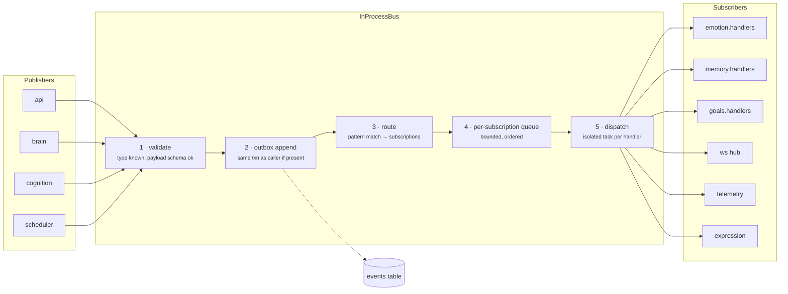
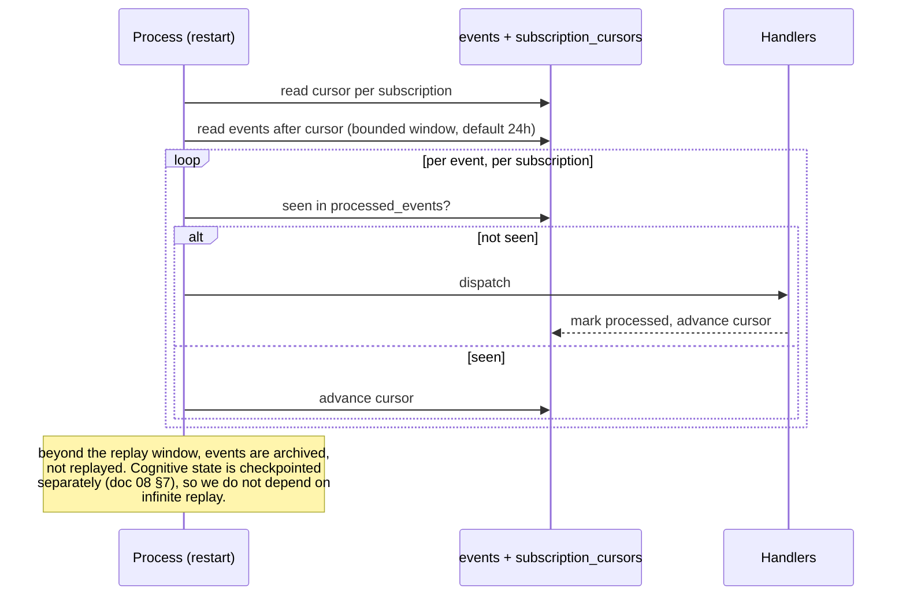
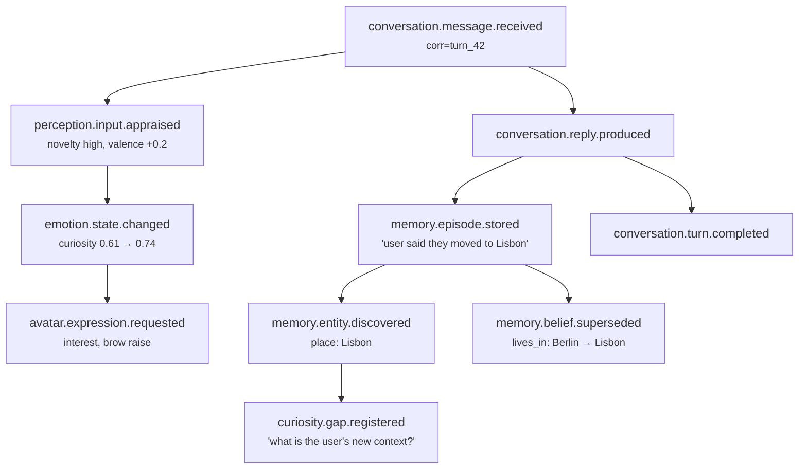

# 04 — Communication and the Event Bus

**Status:** Design · **Depends on:** [02](02-system-architecture.md), [03](03-module-contracts.md) · **Depended on by:** all cognition documents

---

## 1. Purpose

`CLAUDE.md` says *prefer event-driven communication where appropriate*. The three words
that matter are "where appropriate". This document defines exactly where, specifies the
bus, and catalogues every event in the system.

---

## 2. The command/event rule

The failure mode of enthusiastic event-driven design is that no code path can be read.
You open a handler, and to know what happens next you must grep for a string. Repeat six
times. Debugging becomes archaeology. We avoid that with one rule:

> **Commands are direct calls. Events are published facts.**
> If the caller needs a result, or needs to know it succeeded, it is a command.

| | Command | Event |
|---|---|---|
| Question it answers | "Do this and tell me what happened" | "This happened; react if you care" |
| Mechanism | Port method call | `bus.publish(...)` |
| Return value | Typed | None |
| Errors | Propagate to caller | Handled by bus, never seen by publisher |
| Coupling | Caller knows the port | Publisher knows nothing about subscribers |
| Cardinality | Exactly one handler | Zero or more |
| Naming | Imperative: `search`, `execute`, `add_episode` | Past tense: `message.received`, `state.changed` |
| Ordering | Caller's control flow | No guarantee across types |

### Corollaries

1. **A module never publishes an event and then waits for its effects.** No
   request/reply over the bus. If you catch yourself wanting a correlation-id-keyed
   future, you wanted a command.
2. **Events must not be load-bearing for correctness of the current turn.** Anything the
   user would notice as data loss is a command with a transaction. Emotional appraisal
   may be lost (it re-derives from the turn record); a stored message may not.
3. **Handlers must be independent and commutative where practical.** If handler B needs A
   to have run first, they are one handler, or A's outcome is itself an event B subscribes
   to.
4. **The bus is not a work queue.** Long-running work is a *job* ([17](17-backend-architecture.md) §6). An
   event may *trigger* a job; the handler enqueues and returns.

### Where events are the right answer

- **Cognition siblings.** Emotion, personality, curiosity, reflection and goals must not
  import each other ([02](02-system-architecture.md) §4.2). Events are how they stay apart.
- **Fan-out from the turn.** A completed turn matters to memory capture, emotion, goals,
  relationship tracking, avatar and telemetry. None of them belongs in the Brain's
  control flow.
- **Live UI updates.** The WebSocket hub is just another subscriber, which is why the Mind
  Inspector needs no special plumbing.
- **Audit and replay.** A persisted event log gives us "what happened last Tuesday at
  2am?" for free.

### Where events are the wrong answer

- Retrieval, generation, tool execution, persistence of the turn, reading mind state.
  All commands.

---

## 3. Bus design



### 3.1 Properties

| Property | Choice | Rationale |
|---|---|---|
| Transport | In-process asyncio, behind a `Transport` seam inside the bus | Microsecond latency; socket transport becomes possible without touching modules |
| Durability | Every event appended to the `events` table before dispatch | Replay, audit, and crash recovery |
| Delivery | At-least-once per subscription, with per-subscription cursor | A restart mid-handler must not silently drop the effect |
| Ordering | Per-subscription FIFO; **no global ordering guarantee** | Global ordering would serialise the whole system for a benefit we do not need |
| Handler isolation | Each handler runs in its own task with a timeout; one failure never affects another | A crashing emotion handler must not lose a memory |
| Backpressure | Bounded queue per subscription; on overflow, oldest low-priority events are dropped **and the drop is logged and counted** | Silent drops are how event systems lie to you |
| Idempotency | Handlers must be idempotent; `(subscription_name, event_id)` is recorded | At-least-once requires it |
| Reentrancy | A handler may publish; depth is capped at 8 with the causation chain checked for cycles | Prevents runaway event storms |

### 3.2 Why at-least-once and not exactly-once

Exactly-once across a process boundary is a fiction; across a handler that writes to the
same SQLite database it is achievable but requires every handler to participate in the
bus's transaction. That couples handlers to bus internals. Instead: at-least-once plus
mandatory idempotency, with `processed_events(subscription, event_id)` as the dedupe
table. Handlers that are naturally idempotent (state snapshots, upserts) need nothing;
handlers that append rows check the table first. The cost is one small insert per
delivery; the benefit is that handlers stay ordinary functions.

### 3.3 Crash recovery



We deliberately do **not** build event sourcing. The events table is an audit log and a
short-horizon recovery mechanism; the authoritative state lives in ordinary tables.
Rebuilding all cognitive state by replaying six months of events sounds elegant and is a
trap: it makes every handler change retroactively meaningful and every replay a
correctness hazard. Stated as a decision: [ADR-0003](24-decision-records.md#adr-0003).

---

## 4. Event naming and envelope

**Format:** `domain.noun.verb_past` — always three segments, always past tense.

```json
{
  "v": 1,
  "id": "01JQ8Z...",
  "type": "conversation.message.received",
  "occurred_at": "2026-07-30T18:22:03.114Z",
  "source": "api",
  "correlation_id": "turn_01JQ8Z...",
  "causation_id": null,
  "principal_id": "local",
  "payload": { "...": "type-specific, schema-validated" }
}
```

- `correlation_id` — constant for a whole turn or job run. This is what makes the
  explainability endpoint and the trace viewer possible.
- `causation_id` — the event that caused this one. Together these form the causal tree
  rendered in the Mind Inspector's trace view.
- `payload` schemas live in `hedwig/core/bus/schemas/<type>.json` and are validated on
  publish in dev and test, sampled in production. An unknown `type` is a hard error, not a
  warning — typo'd event names that silently go nowhere are among the nastiest bugs in
  event systems.

Pattern subscriptions use `*` per segment: `conversation.*.*`, `*.state.changed`,
`memory.episode.*`.

---

## 5. Event catalogue

The complete set. Adding an event means adding a row here plus a payload schema. A ✅ marks
a type that is registered in `core/bus/catalogue.py` and actually published today.

Two rows changed with Milestone 6 ([26](26-turn-memory-loop.md) §7.1). The publisher of the
first two is the graph's `ingest` node rather than `api`, because no HTTP path drives a turn
yet and the node is where a session is opened either way. And `conversation.turn.completed`
carries the turn's substance, not only its identifiers — the reason is
[ADR-0018](adr/0018-capture-reads-the-event-not-the-turn-row.md), and it moves memory
capture from `reply.produced` to this event, where a single subscriber sees the whole turn.

### 5.1 Conversation

| Event | Publisher | Payload (key fields) | Notable subscribers |
|---|---|---|---|
| `conversation.session.started` | brain (`ingest`) ✅ | session_id, channel | telemetry, ws, emotion (greeting warmth) |
| `conversation.message.received` | brain (`ingest`) ✅ | session_id, message_id, text, trust | emotion (appraise), telemetry, ws |
| `conversation.reply.produced` | brain (`emit`) ✅ | session_id, message_id, text, working_set_ref | expression, goals, ws |
| `conversation.turn.completed` | brain (`learn`) ✅ | turn_id, session_id, status, input, reply, intent, recalled_memory_ids, tool_calls, latency_ms | **memory (capture)**, reflection (T0), telemetry, curiosity (idle timer reset) |
| `conversation.session.ended` | sessions | session_id, reason, turn_count | reflection (T1), relationship update |
| `conversation.feedback.given` | api | message_id, signal (+1/-1/edit), note | personality (drift evidence), memory (reinforce) |

### 5.2 Perception & memory

| Event | Publisher | Payload | Subscribers |
|---|---|---|---|
| `perception.input.appraised` | emotion | appraisal dims, deltas, target_event_id | telemetry, ws |
| `memory.episode.stored` | memory | memory_id, salience, entities | curiosity (gap detection), ws |
| `memory.belief.formed` | memory | memory_id, statement, confidence, provenance | ws, goals |
| `memory.belief.superseded` | memory | old_id, new_id, reason | ws, telemetry |
| `memory.item.reinforced` | memory | memory_ids, amount, cause | telemetry |
| `memory.item.forgotten` | memory | memory_id, reason, tombstone_id | ws, telemetry |
| `memory.entity.discovered` | memory | entity_id, kind, name | curiosity, ws |
| `memory.relation.updated` | memory | entity_id, familiarity, affinity, trust | ws, personality (evidence) |
| `memory.reembed.required` | embeddings | old_model_id, new_model_id, count | scheduler |

### 5.3 Cognition

| Event | Publisher | Payload | Subscribers |
|---|---|---|---|
| `emotion.state.changed` | emotion | **full snapshot** + cause | expression, ws, brain's next snapshot, curiosity |
| `emotion.threshold.crossed` | emotion | dimension, direction, value | curiosity (initiative), ws |
| `personality.profile.updated` | personality | **full snapshot** + reason | emotion (baselines), llm prompt builder, ws |
| `personality.drift.proposed` | reflection | trait, delta, evidence_ids, rationale | personality, ws |
| `personality.drift.rejected` | personality | trait, delta, rule_violated | ws, telemetry |
| `goals.goal.created` | goals | goal_id, kind, description, priority | curiosity, retrieval policy builder, ws |
| `goals.goal.progressed` | goals | goal_id, progress, evidence | ws |
| `goals.goal.closed` | goals | goal_id, status | reflection, emotion (satisfaction) |
| `curiosity.gap.registered` | curiosity | gap_id, question, origin, priority | ws |
| `curiosity.exploration.started` | curiosity | run_id, gap_ids, budget | ws, telemetry |
| `curiosity.finding.produced` | curiosity | finding_id, gap_id, summary, source, trust, quality | ws |
| `curiosity.finding.promoted` | curiosity | finding_id, belief_id | memory, ws |
| `curiosity.surfacing.suggested` | curiosity | finding_id, relevance, urgency | api (interruption policy), ws |
| `reflection.cycle.started` | reflection | run_id, tier, cursor | ws, telemetry |
| `reflection.cycle.completed` | reflection | run_id, tier, stats | ws, telemetry, personality |
| `reflection.summary.written` | reflection | memory_id, tier, covers_range | memory, ws |

Note the two `*.state.changed` / `*.profile.updated` events carry **full snapshots**, per
[02](02-system-architecture.md) §4.2. Deltas stay internal to the owning module.

### 5.4 Capability & system

| Event | Publisher | Payload | Subscribers |
|---|---|---|---|
| `tools.call.requested` | brain | call_id, tool, args_digest | ws, telemetry |
| `tools.call.completed` | tools | call_id, status, duration_ms, trust | ws, telemetry, emotion (frustration on repeated failure) |
| `tools.approval.required` | tools | call_id, tool, args, reason | api (user prompt), ws |
| `knowledge.document.ingested` | knowledge | doc_id, path, chunks | ws |
| `knowledge.fetch.blocked` | fetch | url, rule | ws, telemetry |
| `avatar.expression.requested` | expression | frame | ws |
| `system.model.unavailable` | llm | tier, model_id, error | api, ws, scheduler (pause jobs) |
| `llm.model.switched` | llm | tier, previous, current, reason | ws, telemetry |
| `system.budget.exhausted` | governor | budget_name, window | curiosity, reflection, ws |
| `system.degraded` | governor | subsystem, reason | api, ws |
| `system.startup.completed` | wiring | version, migrations_applied | telemetry |

---

## 6. Worked example: one causal chain

What actually happens when the user says *"Actually, I've moved to Lisbon."*



Every node shares `correlation_id=turn_42`, and each arrow is a `causation_id`. The Mind
Inspector renders exactly this graph. When HEDWIG later says something informed by the
Lisbon belief, `/v1/explain/{message_id}` walks back to `E7` and from there to `E1`.

Two things to notice about the design this reveals:

1. **The belief supersession is not the episode.** "The user said they moved" (episodic,
   permanently true) is separate from "the user lives in Lisbon" (semantic, currently
   true, may be superseded again). Conflating these is the most common memory-design
   error, and it produces companions that cannot tell what they *used* to believe.
2. **The reply was composed before the belief was written.** Capture happens after
   response, off the critical path. If the user's very next message depends on the new
   belief, the recent-turn window covers it. See [06](06-memory-architecture.md) §4.3 for
   the read-your-own-write discussion.

---

## 7. Error handling and retries

| Situation | Policy |
|---|---|
| Handler raises | Log with correlation id, record `failed` in `processed_events`, retry with backoff (1s, 8s, 60s), then dead-letter |
| Dead letter | Row in `event_dead_letters`; surfaced in the Mind Inspector as a system notice; never silently discarded |
| Handler timeout | Per-subscription timeout (default 30 s, jobs excluded); treated as a failure |
| Payload fails validation on publish | Hard error to the publisher (a bug, fail fast in dev; log + drop in production) |
| Unknown event type | Hard error, always |
| Queue overflow | Drop oldest events whose subscription is marked `lossy: true` (telemetry, ws); never drop for `lossy: false` (memory, goals) — instead apply backpressure to the publisher |

The `lossy` flag per subscription is the important detail. It forces every subscriber to
declare whether losing an event is acceptable, at registration time, in code review.

---

## 8. Tradeoffs

| Decision | Gained | Given up | Revisit if |
|---|---|---|---|
| Command/event split | Readable control flow with decoupled reactions | Some ceremony deciding which one you want | Never |
| In-process bus | Sub-ms latency, no infrastructure | Cross-process modules need the transport swap | First module extraction |
| Durable outbox on every event | Audit, replay, recovery | One insert per event (~10 µs on WAL SQLite) | Event volume exceeds ~50/s sustained (it will not) |
| At-least-once + idempotency | Handlers stay ordinary functions | Every appending handler needs a dedupe check | Handler authors keep getting it wrong → then add a decorator |
| No global ordering | No system-wide serialisation | Handlers cannot assume cross-type order | A genuine cross-type ordering need appears; solve it with a single handler, not global order |
| Not event-sourced | Simple state, no replay hazards | No free time-travel debugging of state | Never — state checkpoints ([08](08-state-management.md) §7) cover the real need |
| Snapshot events for cross-module state | Order-independent, restart-safe | Slightly larger payloads | Never |

---

## 9. Failure modes

| Failure | Consequence | Mitigation |
|---|---|---|
| Event storm (handler publishes what it consumes) | CPU spin | Depth cap 8, cycle detection on the causation chain, storm metric with alert |
| Slow handler blocks its queue | That subscriber falls behind | Per-subscription queue + timeout; queue depth is a metric; governor can pause background subscribers |
| Schema drift between publisher and subscriber | Handler errors | Versioned payloads (`v`), schema validation in CI, contract tests per event type |
| Dead-letter pile-up ignored | Silent cognitive degradation | Startup check + persistent UI notice while any dead letter is unresolved |
| Replay after a handler's logic changed | Handler behaves differently for old events | Bounded 24 h replay window; handlers are idempotent; state is not derived from replay |

---

## 10. Testing

- **Contract test per event type** — publish a fixture payload, assert schema validity and
  that each declared subscriber handles it without error.
- **Idempotency test** — every subscription receives the same event twice; asserts
  identical resulting state.
- **Ordering-independence test** — for handlers that consume multiple event types, feed
  permutations and assert convergent state.
- **Crash-recovery test** — kill mid-dispatch (simulated), restart, assert no lost
  non-lossy events and no duplicated effects.
- **Storm test** — a deliberately recursive handler must be stopped by the depth cap.
- **Catalogue completeness test** — every `bus.publish` call site's event type appears in
  this document's tables (parsed from the markdown) and has a schema file.

That last test is unusual and worth keeping: it makes documentation drift a build failure
rather than a discipline problem.

---

## 11. Future improvements

| Improvement | Trigger |
|---|---|
| Socket/IPC transport adapter | First module extracted from the process |
| Event schema registry with codegen for payload types | Payload schemas exceed ~30 types |
| Sampling/downsampling of high-frequency events (expression frames) | Expression frames on the bus cost measurable CPU — likely; they may bypass the bus and go straight to the WS hub |
| Time-travel debugger UI over the causal graph | Mind Inspector proves useful and users ask for history scrubbing |
| Cross-device event federation | Multi-device becomes a goal (see [23](23-challenged-assumptions.md) §12) |
