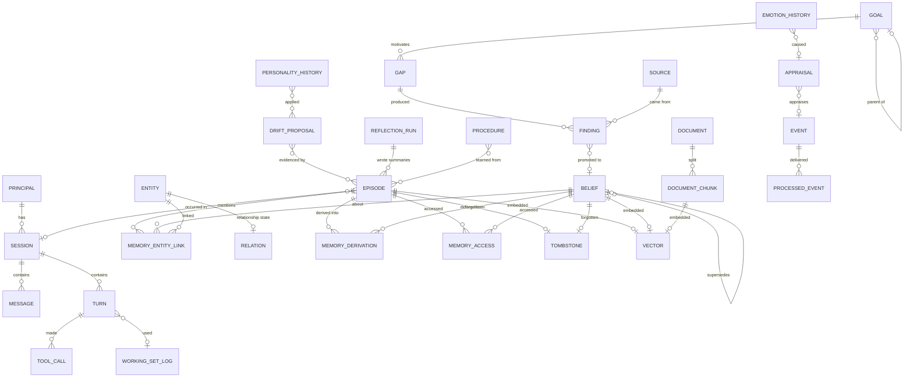

# 05 — Data Model and Database

**Status:** Design · **Depends on:** [02](02-system-architecture.md), [03](03-module-contracts.md) · **Depended on by:** [06](06-memory-architecture.md), [08](08-state-management.md), [12](12-reflection-engine.md)

---

## 1. Purpose

The database *is* HEDWIG's identity. The models are interchangeable, the code will be
rewritten, the UI will be replaced; the SQLite file is the thing that must survive years.
This document specifies it fully, and specifies the rules that keep it survivable.

---

## 2. Storage engines

| Store | Technology | Contents | Why |
|---|---|---|---|
| `hedwig.db` | SQLite, WAL mode | All domain state, FTS5 indexes, `sqlite-vec` vectors | One transactional file; a memory write and its index update are atomic together |
| `checkpoints.db` | SQLite (LangGraph `SqliteSaver`) | Turn-graph checkpoints | Separate because it is *framework* state with a foreign schema and a different lifecycle; deleting it must never risk domain data |
| `blobs/` | Filesystem, content-addressed (`blobs/ab/cd/<sha256>`) | Original documents, fetched HTML, audio | Blobs in SQLite bloat the page cache and make backups slow |
| `archive/` | Filesystem, JSONL, gzipped | Tombstoned memory bodies, archived events | Forgetting must be reversible without keeping dead weight in the hot database |

Deliberately separate, deliberately few. Notably absent: a vector database daemon, a cache
server, a message broker. Each would be a second source of truth to keep consistent.

### 2.1 Pragmas

```sql
PRAGMA journal_mode = WAL;        -- concurrent readers with one writer
PRAGMA synchronous = NORMAL;      -- WAL makes this safe enough; FULL for the nightly backup
PRAGMA foreign_keys = ON;         -- yes, really: integrity over convenience
PRAGMA busy_timeout = 5000;
PRAGMA temp_store = MEMORY;
PRAGMA mmap_size = 268435456;     -- 256 MB
PRAGMA auto_vacuum = INCREMENTAL;
```

---

## 3. Schema conventions

Non-negotiable, and checked by a schema-lint test:

1. **IDs are ULIDs stored as `TEXT`.** Sortable by creation time, globally unique, no
   coordination, readable in logs. Not integers (they leak ordering into semantics and
   break merges), not UUID4 (no locality).
2. **All timestamps are `TEXT` ISO-8601 UTC with milliseconds.** Human-readable in a
   `sqlite3` shell in five years, sortable lexically, no epoch-unit ambiguity. Local time
   is a presentation concern.
3. **Every table has `created_at`; every mutable table has `updated_at` and `version`
   (integer, incremented on write, used for optimistic concurrency).**
4. **Every table has `principal_id TEXT NOT NULL DEFAULT 'local'`.** Single-user today;
   this column costs nothing now and prevents a brutal migration later.
5. **No destructive deletes in domain tables.** `deleted_at` or a tombstone row. The only
   `DELETE` statements permitted are in the explicit privacy purge and in index tables.
6. **JSON columns are allowed for genuinely open-ended payloads only** (`payload`,
   `score_breakdown`, `meta`), never for anything you would want to query or constrain.
   A JSON column that gets queried is a schema you refused to write.
7. **Enumerations are `TEXT` with a `CHECK` constraint**, not lookup tables. Readable, and
   migrations are one `ALTER`.
8. **Foreign keys are declared** even though SQLite makes them optional. Referential
   integrity in a memory system is not a nicety: a dangling entity reference is a false
   memory.

---

## 4. Entity–relationship overview



---

## 5. Table definitions

Grouped by owning module. **Owner** is the only module permitted to write
([08](08-state-management.md) §3).

### 5.1 Conversation — owner: `sessions`, `brain`

```sql
CREATE TABLE session (
    id            TEXT PRIMARY KEY,
    principal_id  TEXT NOT NULL DEFAULT 'local',
    channel       TEXT NOT NULL CHECK (channel IN ('cli','web','api','internal')),
    started_at    TEXT NOT NULL,
    ended_at      TEXT,
    end_reason    TEXT CHECK (end_reason IN ('explicit','timeout','shutdown',NULL)),
    turn_count    INTEGER NOT NULL DEFAULT 0,
    summary_id    TEXT REFERENCES episode(id),   -- T1 reflection output
    created_at    TEXT NOT NULL,
    updated_at    TEXT NOT NULL,
    version       INTEGER NOT NULL DEFAULT 1
);

CREATE TABLE message (
    id            TEXT PRIMARY KEY,
    session_id    TEXT NOT NULL REFERENCES session(id),
    seq           INTEGER NOT NULL,              -- position within session
    role          TEXT NOT NULL CHECK (role IN ('user','hedwig','system','tool')),
    text          TEXT NOT NULL,
    trust_tier    TEXT NOT NULL,
    token_count   INTEGER,
    emotion_ref   TEXT REFERENCES emotion_history(id),  -- state when produced
    meta          TEXT,                          -- JSON: model_id, latency, flags
    created_at    TEXT NOT NULL,
    UNIQUE (session_id, seq)
);

CREATE TABLE turn (
    id              TEXT PRIMARY KEY,
    session_id      TEXT NOT NULL REFERENCES session(id),
    user_message_id TEXT REFERENCES message(id),
    reply_message_id TEXT REFERENCES message(id),
    correlation_id  TEXT NOT NULL,
    started_at      TEXT NOT NULL,
    completed_at    TEXT,
    status          TEXT NOT NULL CHECK (status IN ('running','completed','failed','interrupted')),
    latency_ms      INTEGER,
    tokens_in       INTEGER, tokens_out INTEGER,
    working_set_id  TEXT,                        -- no FK: written before the turn row (26 §7)
    checkpoint_ref  TEXT,                        -- LangGraph thread/checkpoint id
    created_at      TEXT NOT NULL
);

-- What was retrieved for a turn. Kept for explainability; pruned after 90 days.
CREATE TABLE working_set_log (
    id            TEXT PRIMARY KEY,
    turn_id       TEXT,
    query         TEXT NOT NULL,
    policy        TEXT NOT NULL,                 -- JSON RetrievalPolicy
    items         TEXT NOT NULL,                 -- JSON [{memory_id, score, breakdown}]
    token_count   INTEGER NOT NULL,
    dropped_count INTEGER NOT NULL,
    created_at    TEXT NOT NULL
);
```

### 5.2 Memory — owner: `memory`

```sql
CREATE TABLE episode (
    id                TEXT PRIMARY KEY,
    principal_id      TEXT NOT NULL DEFAULT 'local',
    kind              TEXT NOT NULL CHECK (kind IN
                        ('interaction','observation','reflection','session_summary',
                         'period_summary','self_action','milestone')),
    occurred_at       TEXT NOT NULL,
    ended_at          TEXT,
    title             TEXT NOT NULL,
    content           TEXT NOT NULL,
    session_id        TEXT REFERENCES session(id),
    salience          REAL NOT NULL DEFAULT 0.5 CHECK (salience BETWEEN 0 AND 1),
    base_importance   REAL NOT NULL DEFAULT 0.5,   -- assigned at capture, never decays
    emotional_charge  REAL NOT NULL DEFAULT 0 CHECK (emotional_charge BETWEEN -1 AND 1),
    confidence        REAL NOT NULL DEFAULT 1.0,
    access_count      INTEGER NOT NULL DEFAULT 0,
    last_accessed_at  TEXT,
    pinned            INTEGER NOT NULL DEFAULT 0,  -- user-protected: never forgotten
    trust_tier        TEXT NOT NULL,
    source_ref        TEXT,
    model_id          TEXT,
    reflection_run_id TEXT REFERENCES reflection_run(id),
    tombstoned_at     TEXT,
    created_at        TEXT NOT NULL,
    updated_at        TEXT NOT NULL,
    version           INTEGER NOT NULL DEFAULT 1
);
CREATE INDEX idx_episode_time     ON episode(occurred_at DESC) WHERE tombstoned_at IS NULL;
CREATE INDEX idx_episode_salience ON episode(salience DESC)    WHERE tombstoned_at IS NULL;
CREATE INDEX idx_episode_session  ON episode(session_id);
CREATE INDEX idx_episode_kind     ON episode(kind, occurred_at DESC);

CREATE TABLE belief (
    id            TEXT PRIMARY KEY,
    principal_id  TEXT NOT NULL DEFAULT 'local',
    statement     TEXT NOT NULL,                 -- natural language, the primary form
    subject_id    TEXT REFERENCES entity(id),    -- optional light structure
    predicate     TEXT,
    object_text   TEXT,
    confidence    REAL NOT NULL CHECK (confidence BETWEEN 0 AND 1),
    status        TEXT NOT NULL DEFAULT 'active'
                  CHECK (status IN ('tentative','active','superseded','retracted')),
    valid_from    TEXT NOT NULL,
    valid_to      TEXT,
    superseded_by TEXT REFERENCES belief(id),
    salience      REAL NOT NULL DEFAULT 0.5,
    access_count  INTEGER NOT NULL DEFAULT 0,
    last_accessed_at TEXT,
    pinned        INTEGER NOT NULL DEFAULT 0,
    trust_tier    TEXT NOT NULL,
    source_ref    TEXT,
    model_id      TEXT,
    tombstoned_at TEXT,
    created_at    TEXT NOT NULL,
    updated_at    TEXT NOT NULL,
    version       INTEGER NOT NULL DEFAULT 1
);
CREATE INDEX idx_belief_subject ON belief(subject_id, status);
CREATE INDEX idx_belief_active  ON belief(status, salience DESC) WHERE tombstoned_at IS NULL;
CREATE UNIQUE INDEX idx_belief_spo ON belief(subject_id, predicate, object_text)
    WHERE status = 'active' AND predicate IS NOT NULL;

CREATE TABLE entity (
    id            TEXT PRIMARY KEY,
    kind          TEXT NOT NULL CHECK (kind IN
                    ('person','place','topic','project','artifact','org','self')),
    name          TEXT NOT NULL,
    canonical_key TEXT NOT NULL,                 -- normalised for dedupe
    aliases       TEXT NOT NULL DEFAULT '[]',    -- JSON array
    first_seen_at TEXT NOT NULL,
    mention_count INTEGER NOT NULL DEFAULT 0,
    merged_into   TEXT REFERENCES entity(id),    -- entity resolution, non-destructive
    created_at    TEXT NOT NULL,
    updated_at    TEXT NOT NULL,
    version       INTEGER NOT NULL DEFAULT 1,
    UNIQUE (kind, canonical_key)
);

CREATE TABLE memory_entity_link (
    memory_id   TEXT NOT NULL,
    memory_kind TEXT NOT NULL CHECK (memory_kind IN ('episode','belief','procedure')),
    entity_id   TEXT NOT NULL REFERENCES entity(id),
    role        TEXT,                            -- 'subject','mentioned','location',...
    weight      REAL NOT NULL DEFAULT 1.0,
    created_at  TEXT NOT NULL,
    PRIMARY KEY (memory_id, entity_id, role)
);
CREATE INDEX idx_mel_entity ON memory_entity_link(entity_id, memory_kind);

-- Relationship memory: one row per entity HEDWIG has a relationship with.
CREATE TABLE relation (
    entity_id           TEXT PRIMARY KEY REFERENCES entity(id),
    familiarity         REAL NOT NULL DEFAULT 0 CHECK (familiarity BETWEEN 0 AND 1),
    affinity            REAL NOT NULL DEFAULT 0 CHECK (affinity BETWEEN -1 AND 1),
    trust               REAL NOT NULL DEFAULT 0.5 CHECK (trust BETWEEN 0 AND 1),
    interaction_count   INTEGER NOT NULL DEFAULT 0,
    last_interaction_at TEXT,
    notes               TEXT NOT NULL DEFAULT '',
    created_at          TEXT NOT NULL,
    updated_at          TEXT NOT NULL,
    version             INTEGER NOT NULL DEFAULT 1
);

-- Procedural memory: learned behavioural preferences. "How to be with this person."
CREATE TABLE procedure (
    id            TEXT PRIMARY KEY,
    trigger       TEXT NOT NULL,                 -- "when the user is debugging"
    action        TEXT NOT NULL,                 -- "give the answer first, then context"
    strength      REAL NOT NULL DEFAULT 0.3 CHECK (strength BETWEEN 0 AND 1),
    evidence_count INTEGER NOT NULL DEFAULT 1,
    contradiction_count INTEGER NOT NULL DEFAULT 0,
    status        TEXT NOT NULL DEFAULT 'candidate'
                  CHECK (status IN ('candidate','active','retired')),
    scope_entity_id TEXT REFERENCES entity(id),
    created_at    TEXT NOT NULL,
    updated_at    TEXT NOT NULL,
    version       INTEGER NOT NULL DEFAULT 1
);

-- Lineage: which memories produced which. Makes "why do you believe that?" answerable.
CREATE TABLE memory_derivation (
    derived_id    TEXT NOT NULL,
    derived_kind  TEXT NOT NULL,
    source_id     TEXT NOT NULL,
    source_kind   TEXT NOT NULL,
    relation      TEXT NOT NULL CHECK (relation IN
                    ('summarised_from','extracted_from','merged_from','corroborated_by',
                     'contradicted_by','promoted_from')),
    created_at    TEXT NOT NULL,
    PRIMARY KEY (derived_id, source_id, relation)
);

-- Every retrieval that surfaced a memory. Drives reinforcement (doc 06 §7).
CREATE TABLE memory_access (
    id            TEXT PRIMARY KEY,
    memory_id     TEXT NOT NULL,
    memory_kind   TEXT NOT NULL,
    accessed_at   TEXT NOT NULL,
    retrieval_score REAL,
    used_in_reply INTEGER NOT NULL DEFAULT 0,    -- retrieved vs actually cited
    turn_id       TEXT REFERENCES turn(id),
    correlation_id TEXT
);
CREATE INDEX idx_access_memory ON memory_access(memory_id, accessed_at DESC);

CREATE TABLE tombstone (
    id            TEXT PRIMARY KEY,
    memory_id     TEXT NOT NULL,
    memory_kind   TEXT NOT NULL,
    reason        TEXT NOT NULL CHECK (reason IN
                    ('decayed','merged','contradicted','user_request','privacy_purge')),
    salience_at_death REAL,
    archive_ref   TEXT,                          -- archive/YYYY-MM.jsonl.gz#offset
    reversible    INTEGER NOT NULL DEFAULT 1,
    created_at    TEXT NOT NULL
);
```

Three design points worth defending here:

- **`base_importance` is separate from `salience`.** Salience decays and is reinforced;
  base importance is the judgement made at capture ("this was a big deal") and never
  changes. Without the split, a genuinely important memory that has not been touched for a
  year becomes indistinguishable from noise. With it, decay can be floored by importance.
- **`pinned`.** The user must be able to say "never forget this", and it must be a column,
  not a convention. A companion that forgets something the user asked it to keep has
  committed the one unforgivable failure.
- **`idx_belief_spo` unique partial index.** Where structure was extracted confidently, it
  prevents the same triple being asserted twice as active — the mechanism that stops
  belief tables from filling with near-duplicates.

### 5.3 Indexes for search — owner: `retrieval`, `embeddings`

```sql
-- Lexical (FTS5), external-content so the base tables stay authoritative
CREATE VIRTUAL TABLE episode_fts USING fts5(
    title, content, content='episode', content_rowid='rowid', tokenize='porter unicode61'
);
CREATE VIRTUAL TABLE belief_fts USING fts5(
    statement, content='belief', content_rowid='rowid', tokenize='porter unicode61'
);
CREATE VIRTUAL TABLE document_chunk_fts USING fts5(
    text, content='document_chunk', content_rowid='rowid'
);
-- Triggers keep FTS in sync inside the same transaction as the write.

-- Vectors (sqlite-vec)
CREATE VIRTUAL TABLE vec_memory USING vec0(
    memory_id      TEXT PRIMARY KEY,
    embedding      FLOAT[768],
    memory_kind    TEXT,
    embedding_model TEXT,       -- CRITICAL: mismatch => re-embed, never silent bad results
    created_at     TEXT
);

CREATE TABLE embedding_state (
    scope           TEXT PRIMARY KEY,            -- 'memory' | 'documents'
    model_id        TEXT NOT NULL,
    dimensions      INTEGER NOT NULL,
    reembed_status  TEXT NOT NULL DEFAULT 'current'
                    CHECK (reembed_status IN ('current','pending','in_progress')),
    reembed_cursor  TEXT,
    updated_at      TEXT NOT NULL
);
```

### 5.4 Mind state — owners: `emotion`, `personality`, `goals`

```sql
-- Current emotional state: exactly one row, guarded.
-- Six dimensions, fixed by ADR-0019. `valence` and `arousal` are derived in code and
-- deliberately not stored: a stored summary can disagree with what it summarises.
CREATE TABLE emotion_state (
    id           INTEGER PRIMARY KEY CHECK (id = 1),
    happiness REAL NOT NULL, trust REAL NOT NULL, curiosity REAL NOT NULL,
    confidence REAL NOT NULL, energy REAL NOT NULL, stress REAL NOT NULL,
    ticked_at    TEXT NOT NULL,     -- when the integrator last ran; decay measures from here
    updated_at   TEXT NOT NULL,
    version      INTEGER NOT NULL DEFAULT 1
);

-- Time series, written on meaningful change; downsampled after 30 days.
CREATE TABLE emotion_history (
    id           TEXT PRIMARY KEY,
    recorded_at  TEXT NOT NULL,
    dims         TEXT NOT NULL,                  -- JSON snapshot of all dimensions
    cause        TEXT,                            -- 'appraisal','decay','reflection','manual'
    appraisal_id TEXT REFERENCES appraisal(id),
    correlation_id TEXT
);
CREATE INDEX idx_emohist_time ON emotion_history(recorded_at DESC);

CREATE TABLE appraisal (
    id            TEXT PRIMARY KEY,
    target_event_id TEXT,
    created_at    TEXT NOT NULL,
    dims          TEXT NOT NULL,                 -- JSON: novelty, goal_congruence, agency,
                                                 -- certainty, social_valence, effort, norm_fit
    deltas        TEXT NOT NULL,                 -- JSON: dimension -> delta actually applied
    rationale     TEXT,                          -- one line, for the inspector
    model_id      TEXT,
    correlation_id TEXT
);

-- Personality: current profile as one row per trait (queryable, unlike a JSON blob)
CREATE TABLE personality_trait (
    name          TEXT PRIMARY KEY,
    value         REAL NOT NULL CHECK (value BETWEEN 0 AND 1),
    anchor        REAL NOT NULL,                 -- initial value; drift measured from here
    floor         REAL NOT NULL DEFAULT 0,
    ceiling       REAL NOT NULL DEFAULT 1,
    lifetime_drift REAL NOT NULL DEFAULT 0,      -- cumulative |change| from anchor
    updated_at    TEXT NOT NULL,
    version       INTEGER NOT NULL DEFAULT 1
);

CREATE TABLE personality_history (
    id            TEXT PRIMARY KEY,
    trait         TEXT NOT NULL REFERENCES personality_trait(name),
    old_value     REAL NOT NULL,
    new_value     REAL NOT NULL,
    proposal_id   TEXT REFERENCES drift_proposal(id),
    applied_at    TEXT NOT NULL,
    reverted_at   TEXT
);

CREATE TABLE drift_proposal (
    id            TEXT PRIMARY KEY,
    trait         TEXT NOT NULL,
    proposed_delta REAL NOT NULL,
    rationale     TEXT NOT NULL,
    evidence      TEXT NOT NULL,                 -- JSON array of memory ids
    evidence_count INTEGER NOT NULL,
    status        TEXT NOT NULL CHECK (status IN
                    ('pending','applied','partially_applied','rejected','expired')),
    rejection_rule TEXT,                         -- which guardrail refused it
    reflection_run_id TEXT REFERENCES reflection_run(id),
    created_at    TEXT NOT NULL,
    decided_at    TEXT
);

-- Immutable-by-default identity core. Changing a row requires explicit user consent.
CREATE TABLE identity_core (
    key           TEXT PRIMARY KEY,              -- 'values','prohibitions','self_description'
    value         TEXT NOT NULL,
    revision      INTEGER NOT NULL DEFAULT 1,
    changed_by    TEXT NOT NULL CHECK (changed_by IN ('bootstrap','user_consent')),
    updated_at    TEXT NOT NULL
);

CREATE TABLE goal (
    id            TEXT PRIMARY KEY,
    kind          TEXT NOT NULL CHECK (kind IN ('user_stated','self_generated','maintenance')),
    description   TEXT NOT NULL,
    status        TEXT NOT NULL CHECK (status IN
                    ('proposed','active','blocked','done','abandoned')),
    priority      REAL NOT NULL DEFAULT 0.5,
    progress      REAL NOT NULL DEFAULT 0,
    parent_id     TEXT REFERENCES goal(id),
    origin_memory_id TEXT,
    due_at        TEXT,
    last_touched_at TEXT,
    created_at    TEXT NOT NULL,
    updated_at    TEXT NOT NULL,
    version       INTEGER NOT NULL DEFAULT 1
);
CREATE INDEX idx_goal_active ON goal(status, priority DESC);
```

### 5.5 Curiosity and knowledge — owners: `curiosity`, `knowledge`

```sql
CREATE TABLE gap (
    id            TEXT PRIMARY KEY,
    question      TEXT NOT NULL,
    origin        TEXT NOT NULL CHECK (origin IN
                    ('unanswered_question','low_confidence_belief','contradiction',
                     'user_interest','goal_support','source_watch')),
    origin_ref    TEXT,
    priority      REAL NOT NULL DEFAULT 0.5,
    status        TEXT NOT NULL DEFAULT 'open'
                  CHECK (status IN ('open','exploring','satisfied','abandoned','blocked')),
    attempt_count INTEGER NOT NULL DEFAULT 0,
    goal_id       TEXT REFERENCES goal(id),
    created_at    TEXT NOT NULL,
    updated_at    TEXT NOT NULL,
    version       INTEGER NOT NULL DEFAULT 1
);

CREATE TABLE source (
    id            TEXT PRIMARY KEY,
    locator       TEXT NOT NULL UNIQUE,          -- url or path
    kind          TEXT NOT NULL CHECK (kind IN ('web','feed','file','directory')),
    trust_tier    TEXT NOT NULL,
    allow_state   TEXT NOT NULL DEFAULT 'allowed'
                  CHECK (allow_state IN ('allowed','blocked','pending_user')),
    watch         INTEGER NOT NULL DEFAULT 0,
    last_fetched_at TEXT,
    etag          TEXT,
    fetch_count   INTEGER NOT NULL DEFAULT 0,
    error_count   INTEGER NOT NULL DEFAULT 0,
    created_at    TEXT NOT NULL,
    updated_at    TEXT NOT NULL
);

CREATE TABLE finding (
    id            TEXT PRIMARY KEY,
    gap_id        TEXT REFERENCES gap(id),
    source_id     TEXT REFERENCES source(id),
    summary       TEXT NOT NULL,
    raw_ref       TEXT,                          -- blob path
    quality_score REAL NOT NULL DEFAULT 0,
    novelty_score REAL NOT NULL DEFAULT 0,
    relevance_score REAL NOT NULL DEFAULT 0,
    trust_tier    TEXT NOT NULL,                 -- always 'untrusted' for web
    status        TEXT NOT NULL DEFAULT 'new'
                  CHECK (status IN ('new','promoted','surfaced','discarded','quarantined')),
    promoted_belief_id TEXT REFERENCES belief(id),
    exploration_run_id TEXT,
    created_at    TEXT NOT NULL,
    updated_at    TEXT NOT NULL
);

CREATE TABLE document (
    id            TEXT PRIMARY KEY,
    path          TEXT NOT NULL UNIQUE,
    content_hash  TEXT NOT NULL,
    mime          TEXT,
    bytes         INTEGER,
    trust_tier    TEXT NOT NULL DEFAULT 'curated',
    ingested_at   TEXT NOT NULL,
    chunk_count   INTEGER NOT NULL DEFAULT 0,
    removed_at    TEXT
);

CREATE TABLE document_chunk (
    id            TEXT PRIMARY KEY,
    document_id   TEXT NOT NULL REFERENCES document(id),
    seq           INTEGER NOT NULL,
    text          TEXT NOT NULL,
    heading_path  TEXT,
    token_count   INTEGER,
    created_at    TEXT NOT NULL,
    UNIQUE (document_id, seq)
);
```

### 5.6 Process, jobs and platform — owners: `core`, `reflection`, `tools`

```sql
CREATE TABLE event (
    id            TEXT PRIMARY KEY,
    type          TEXT NOT NULL,
    schema_version INTEGER NOT NULL DEFAULT 1,
    occurred_at   TEXT NOT NULL,
    source        TEXT NOT NULL,
    correlation_id TEXT NOT NULL,
    causation_id  TEXT,
    principal_id  TEXT NOT NULL DEFAULT 'local',
    payload       TEXT NOT NULL                  -- JSON
);
CREATE INDEX idx_event_time ON event(occurred_at DESC);
CREATE INDEX idx_event_corr ON event(correlation_id);
CREATE INDEX idx_event_type ON event(type, occurred_at DESC);

CREATE TABLE processed_event (
    subscription  TEXT NOT NULL,
    event_id      TEXT NOT NULL REFERENCES event(id),
    status        TEXT NOT NULL CHECK (status IN ('ok','failed','dead')),
    attempts      INTEGER NOT NULL DEFAULT 1,
    last_error    TEXT,
    processed_at  TEXT NOT NULL,
    PRIMARY KEY (subscription, event_id)
);

CREATE TABLE subscription_cursor (
    subscription  TEXT PRIMARY KEY,
    last_event_id TEXT,
    updated_at    TEXT NOT NULL
);

CREATE TABLE job_run (
    id            TEXT PRIMARY KEY,
    job_name      TEXT NOT NULL,
    trigger       TEXT NOT NULL CHECK (trigger IN ('schedule','idle','manual','event')),
    status        TEXT NOT NULL CHECK (status IN
                    ('queued','running','completed','failed','cancelled','preempted')),
    started_at    TEXT, finished_at TEXT,
    cursor        TEXT,                          -- resumable position
    stats         TEXT,                          -- JSON
    error         TEXT,
    correlation_id TEXT NOT NULL,
    created_at    TEXT NOT NULL
);

CREATE TABLE reflection_run (
    id            TEXT PRIMARY KEY,
    job_run_id    TEXT REFERENCES job_run(id),
    tier          TEXT NOT NULL CHECK (tier IN ('T0','T1','T2','T3','T4')),
    covers_from   TEXT, covers_to TEXT,
    input_count   INTEGER, output_count INTEGER,
    merged_count  INTEGER, forgotten_count INTEGER,
    tokens_used   INTEGER,
    content_hash  TEXT,                          -- idempotency: same inputs => skip
    status        TEXT NOT NULL,
    created_at    TEXT NOT NULL
);

CREATE TABLE tool_call (
    id            TEXT PRIMARY KEY,
    turn_id       TEXT REFERENCES turn(id),
    tool_name     TEXT NOT NULL,
    args          TEXT NOT NULL,                 -- JSON
    result_ref    TEXT,                          -- blob for large results
    result_digest TEXT,
    status        TEXT NOT NULL CHECK (status IN
                    ('requested','approved','denied','running','ok','failed','timeout')),
    approved_by   TEXT,
    duration_ms   INTEGER,
    correlation_id TEXT NOT NULL,
    created_at    TEXT NOT NULL
);

CREATE TABLE llm_call (
    id            TEXT PRIMARY KEY,
    tier          TEXT NOT NULL,
    model_id      TEXT NOT NULL,
    purpose       TEXT NOT NULL,
    priority      TEXT NOT NULL,
    tokens_in     INTEGER, tokens_out INTEGER,
    duration_ms   INTEGER,
    status        TEXT NOT NULL,
    prompt_ref    TEXT,                          -- blob, only when tracing is on
    correlation_id TEXT,
    created_at    TEXT NOT NULL
);

CREATE TABLE budget_ledger (
    id            TEXT PRIMARY KEY,
    budget_name   TEXT NOT NULL,                 -- 'curiosity_tokens_daily', ...
    window_start  TEXT NOT NULL,
    amount        REAL NOT NULL,
    reason        TEXT,
    created_at    TEXT NOT NULL
);

CREATE TABLE schema_migration (
    version       INTEGER PRIMARY KEY,
    name          TEXT NOT NULL,
    checksum      TEXT NOT NULL,
    applied_at    TEXT NOT NULL
);
```

---

## 6. Migrations

Numbered forward-only SQL files plus a ~50-line runner. No framework.

What exists today, each landing with the milestone that needed it:

```
migrations/
├── 0001_platform.sql       ← M2: event outbox, state documents, task runs, blob metadata
├── 0002_llm.sql            ← M3: model registry, generation log
├── 0003_conversation.sql   ← M5: session, message, turn  (§5.1)
├── 0004_memory.sql         ← M5: episode, belief, entity, lineage, access, tombstone, FTS5
├── 0005_working_set.sql    ← M6: working_set_log, turn.working_set_id  (§5.1)
├── 0006_emotion.sql        ← M7: emotion_state, emotion_history, appraisal  (§5.4)
└── 0007_message_emotion.sql ← M8: message.emotion_ref — the mood a reply was produced under
```

Rules:

1. **Forward only.** No `down` scripts. Rollback is restore-from-backup, which is what
   actually happens in practice; maintaining untested down-migrations is theatre.
2. **Each file is one transaction.** Checksum recorded; a modified applied migration is a
   startup error.
3. **Migrations run automatically at startup**, after an automatic pre-migration backup of
   `hedwig.db` to `backups/pre-<version>-<timestamp>.db`. Non-negotiable: the user's memory
   is at stake.
4. **Data migrations that need the LLM** (e.g. re-summarising) are *jobs*, not migrations.
   Migrations only change shape; jobs change content, resumably.
5. **Schema-lint test** asserts the conventions in §3 across the whole schema.

Why not Alembic: we have one linear history, one database, one developer's machine.
Alembic's value is branching histories and autogeneration from an ORM — we have neither.
Trigger to adopt it: a second concurrent schema branch actually exists.

---

## 7. Retention and growth

Estimated at 20 turns/day of real use:

| Table | Growth/year | Policy |
|---|---|---|
| `message`, `turn` | ~15 MB | Kept indefinitely (raw record is the fallback for re-derivation) |
| `episode` | ~40 k rows, ~60 MB | Decay + forgetting keeps *active* set bounded (~10 k); tombstoned bodies move to `archive/` |
| `belief` | ~5 k rows | Merged and superseded aggressively by T2 |
| `event` | ~500 k rows, ~300 MB | Archived to `archive/events-YYYY-MM.jsonl.gz` after 90 days |
| `emotion_history` | ~100 k rows | Downsampled after 30 days to hourly means; after a year to daily |
| `memory_access` | ~200 k rows | Aggregated into `access_count`/`last_accessed_at` after 30 days, rows dropped |
| `working_set_log` | ~150 MB | Pruned after 90 days (explainability window) |
| `llm_call` prompts | large | `prompt_ref` blobs only when tracing enabled; pruned after 7 days |
| `vec_memory` | 768 × 4 B × rows ≈ 120 MB | Follows episode/belief lifecycle |

Target: **under 1 GB of hot database after a year of daily use.** A `db compact` job runs
weekly (archive + incremental vacuum) and reports before/after sizes.

### Backups

- Pre-migration snapshot, always.
- Nightly `VACUUM INTO backups/hedwig-YYYY-MM-DD.db`, keep 7 daily + 4 weekly + 12 monthly.
- `hedwig export` produces a single portable archive: database + blobs + config, with a
  manifest. This is also the user's escape hatch (INV-8, and see
  [21](21-security-privacy-ethics.md) §7).
- A restore test runs in CI against a seeded database, because an untested backup is not a
  backup.

---

## 8. Tradeoffs

| Decision | Gained | Given up | Revisit if |
|---|---|---|---|
| SQLite for everything | Atomic memory+index writes, one file, zero admin, user ownership | Single-writer; no network access; vector scale ceiling ~10⁶ | Multi-device sync, or vector count approaching 10⁶ |
| Vectors in the same file (`sqlite-vec`) | No second source of truth, transactional index updates | Fewer ANN knobs than a dedicated engine; brute-force-ish at scale | Vector query p95 > 100 ms |
| Text ULIDs and ISO timestamps | Debuggable in a shell in five years | ~2× storage vs integers, marginally slower joins | Never (this is a comprehensibility-over-performance call, and §6 of doc 01 ranks it) |
| Natural-language beliefs with optional triples | No ontology tarpit; embeddings do the work | No rich graph queries | Entity reasoning demonstrably needs traversal |
| Forward-only hand-written migrations | Full comprehension, no framework | Manual care; no autogeneration | A second schema branch exists |
| Separate `checkpoints.db` | Framework state is disposable | Two files to back up | LangGraph is replaced |
| Tombstones instead of deletes | Reversible forgetting, auditability | Storage overhead; every query needs the `tombstoned_at IS NULL` filter | Never — but the filter is enforced by going through repositories, not raw SQL |
| `emotion_state` as a single guarded row | Trivially readable current state | Needs the history table for trends | Never |

---

## 9. Failure modes

| Failure | Detection | Response |
|---|---|---|
| Corruption | `PRAGMA integrity_check` at startup and nightly | Refuse to start; name the newest good backup; never auto-repair |
| Migration fails mid-way | Transaction rollback + checksum mismatch | Restore the pre-migration snapshot automatically, then report |
| `SQLITE_BUSY` under background load | Busy timeout exceeded | Governor pauses background writers; interactive path retries with jitter |
| Embedding model changed underneath us | `embedding_state.model_id` ≠ `Embedder.model_id` at startup | Mark `reembed_status='pending'`, run re-embed job, retrieval falls back to lexical-only meanwhile |
| FTS index out of sync | Weekly consistency job comparing row counts and sampled contents | Rebuild the affected FTS table |
| Dangling FK because of a bug | `PRAGMA foreign_key_check` in the nightly job | Report as an integrity incident; quarantine the offending rows rather than deleting |
| Disk full mid-write | Pre-write free-space check + write error | Read-only mode, loud notice; WAL guarantees no torn commit |

---

## 10. Testing

- **Schema lint** — conventions in §3, mechanically.
- **Migration chain test** — apply all migrations to an empty database, assert the result
  equals a checked-in `schema.sql` snapshot. Catches drift between migrations and intent.
- **Round-trip repository tests** — every value object survives write→read unchanged,
  including timezone and float precision.
- **FK integrity fuzz** — random operation sequences, then `foreign_key_check`.
- **Growth simulation** — a scenario test drives one simulated year via `FakeClock` and
  asserts the retention targets in §7 hold.
- **Restore test** — back up, corrupt, restore, verify.

---

## 11. Future improvements

| Improvement | Trigger |
|---|---|
| Postgres + pgvector adapter behind the same repositories | Multi-device or multi-user |
| Quantised vectors (int8) | Vector storage exceeds ~500 MB |
| A real graph store for entity relations | Graph traversal shows measurable retrieval gains |
| Encryption at rest (SQLCipher) | The user asks, or the install runs on a shared machine |
| Column-level provenance on beliefs (per-clause sourcing) | Beliefs routinely merge several sources and attribution gets muddy |
| Incremental backup (WAL shipping) instead of nightly `VACUUM INTO` | Database exceeds ~2 GB and nightly copies become slow |
