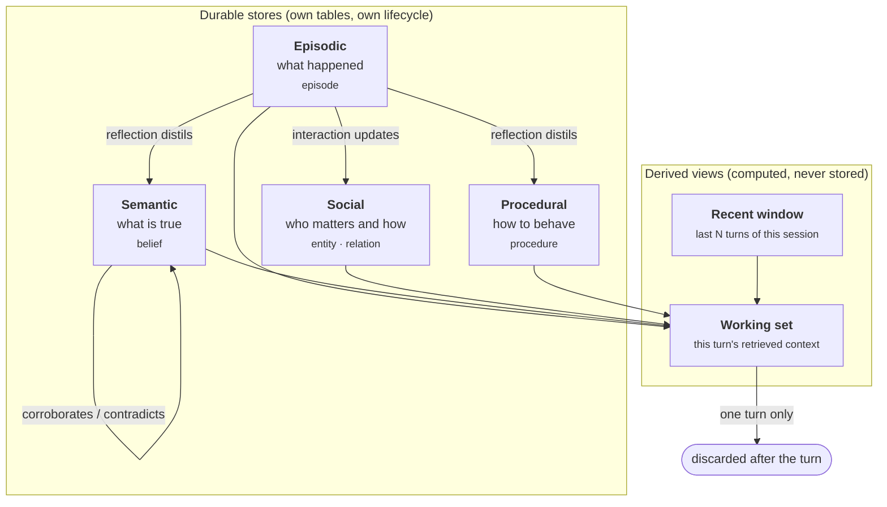
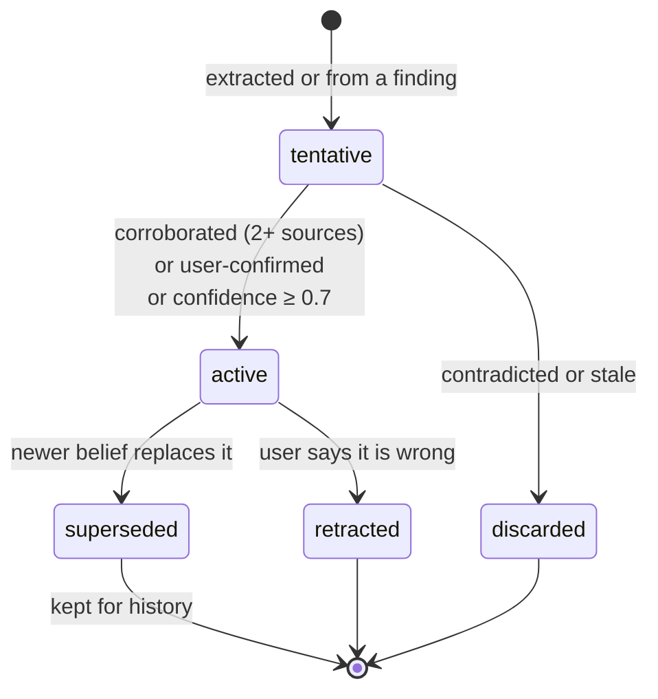
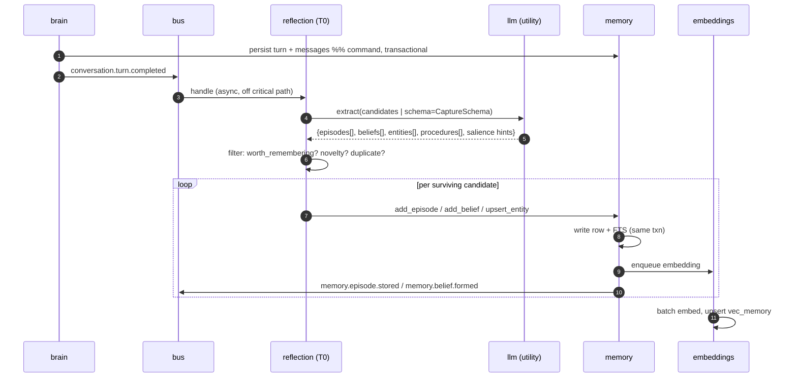
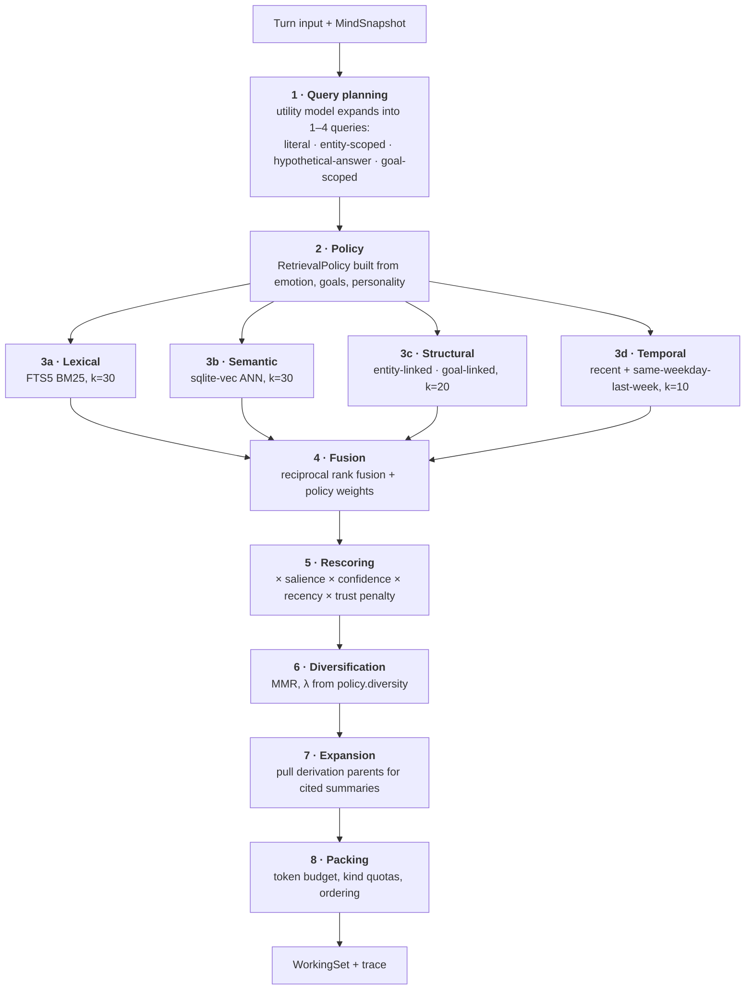
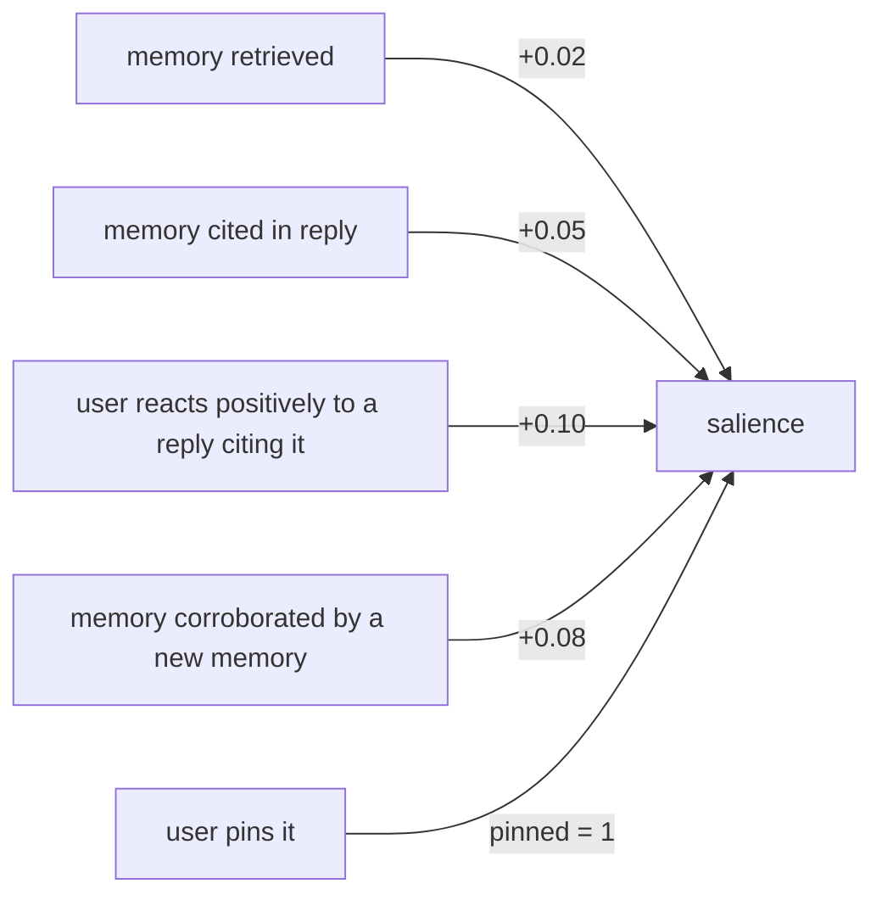

# 06 — Memory Architecture

**Status:** Implemented, partially (Milestone 5) · **Depends on:** [03](03-module-contracts.md), [05](05-data-model-and-database.md) · **Depended on by:** [07](07-brain-langgraph-workflow.md), [11](11-curiosity-engine.md), [12](12-reflection-engine.md)

---

## 1. Purpose

Memory is what distinguishes HEDWIG from a chatbot with a long context window. This
document defines what is stored, how it gets there, how it is found again, how it fades,
and how it dies.

---

## 2. Challenging the README's memory taxonomy

The README lists five memory types: long-term, short-term, working, semantic, relationship.
Taken literally this produces five stores, and that is a mistake — three of the five are
not stores at all, and one important kind is missing.

| README type | Verdict | Why |
|---|---|---|
| Long-term | Not a type — a *property* | Every store is long-term. "Long-term memory" as a container tells you nothing about what goes in it. The real distinctions are episodic vs. semantic. |
| Short-term | Not a store — a *query* | "The last N turns" is `SELECT … ORDER BY seq DESC LIMIT N`. Giving it its own store creates a synchronisation problem for zero benefit. |
| Working | Not a store — a *projection* | The working set is assembled per turn and thrown away. Persisting it is how you end up with three copies of the truth. |
| Semantic | Real store | Beliefs about the world and the user. |
| Relationship | Real store | Per-entity social state. |
| *(missing)* Episodic | Real store, and the foundation | Without a record of *what happened*, semantic memory has no provenance and reflection has no input. |
| *(missing)* Procedural | Real store | *How to behave with this person* — learned interaction preferences. Distinct from beliefs, and it is what makes long-term adaptation felt rather than merely known. |

**Revised model: four durable stores, two derived views.**



This is a net simplification (five stores → four) *and* an increase in capability (episodic
provenance, procedural learning). It is the single most important design decision in this
document.

### 2.1 Why the episodic/semantic split is load-bearing

- *"You said last month that you were moving to Lisbon"* — episodic. Permanently true,
  never superseded, because the saying happened.
- *"You live in Lisbon"* — semantic. Currently true, will be superseded, must carry
  validity bounds.

Systems that store only one of these produce a characteristic failure: they either cannot
recall the conversation ("I don't remember discussing that") or cannot revise a fact
("you live in Berlin — no wait, Lisbon — no wait…"). Keeping both, with
`memory_derivation` linking the belief to the episode that produced it, is what makes
*"why do you think that?"* answerable.

---

## 3. The four stores

### 3.1 Episodic — `episode`

The append-mostly log of experience. Types (`kind` column):

| Kind | Written by | Example |
|---|---|---|
| `interaction` | T0 reflection after a turn | "User asked how to structure the retrieval layer; we settled on RRF." |
| `observation` | curiosity, tools | "Read the sqlite-vec README; it supports partial-index filters." |
| `reflection` | T2–T4 reflection | "Over the past week the user has been consistently short on time." |
| `session_summary` | T1 reflection | One per session. |
| `period_summary` | T3/T4 reflection | Weekly and monthly. |
| `self_action` | scheduler/curiosity | "Ran a nightly consolidation; merged 12 beliefs." |
| `milestone` | any, high `base_importance` | "First conversation." "User said they got the job." |

Episodes are written at the granularity of *a meaningful thing that happened*, not per
message. One turn typically yields zero or one episode. A turn that is pure pleasantry
yields none — this is intentional; a memory system that stores everything retrieves
nothing.

Summaries are episodes too, not a separate table. That is what makes hierarchical
summarisation work: a monthly summary derives from weekly summaries derives from session
summaries, all through the same `memory_derivation` edges, all retrievable by the same
query path.

### 3.2 Semantic — `belief`

Propositions, with confidence, validity interval, and provenance. Lifecycle:



The `tentative` state is the guard against the most dangerous failure in a memory system:
**confabulation hardening into fact.** An LLM extraction from one ambiguous sentence enters
as tentative, with confidence ≤ 0.5, and is *never presented as certain*. It becomes
`active` only on corroboration or user confirmation. Findings from the network additionally
carry `trust_tier = untrusted` for their whole life
([13](13-knowledge-and-tools.md) §3).

Supersession, not mutation. Old beliefs keep `valid_to` and `superseded_by`, which is what
lets HEDWIG say *"I used to think you were in Berlin"* — a signature companion behaviour
that is impossible with in-place updates.

### 3.3 Social — `entity` + `relation`

The user is an entity (`kind='person'`), as is HEDWIG itself (`kind='self'`). Relations
carry `familiarity`, `affinity`, `trust`, interaction counts.

**Design correction:** the README lists *trust* as an emotion. It is not. Trust is a slow,
per-entity, evidence-accumulated relationship property; emotions are fast and global.
Modelling trust as an emotion would let one bad turn reset a year of relationship, which is
both wrong and, in a companion, hurtful. Trust therefore lives here, and the emotion engine
gets `warmth` (a fast, transient social feeling) instead. See [09](09-emotion-engine.md) §3.

Update rule (applied at session end, not per turn — relationships do not lurch):

```
familiarity ← familiarity + k_f · (1 − familiarity) · interaction_weight
affinity    ← affinity    + k_a · (session_valence − affinity)
trust       ← trust       + k_t · (reliability_signal − trust)
```

with `k_f ≈ 0.05`, `k_a ≈ 0.08`, `k_t ≈ 0.03`. `trust` moves slowest by design.
`reliability_signal` comes from corroboration outcomes: did this entity's claims hold up?

### 3.4 Procedural — `procedure`

Learned `trigger → action` pairs about *how to interact*, distinct from facts.

| Trigger | Action | Learned from |
|---|---|---|
| "user is debugging" | "answer first, explain after" | repeated `conversation.feedback.given` on long preambles |
| "user asks for architecture" | "include diagrams and tradeoffs" | explicit instruction, plus positive feedback |
| "it is late at night" | "shorter replies" | observed session lengths and terseness |

Lifecycle: `candidate` (1 piece of evidence) → `active` (≥3 corroborations, no recent
contradictions) → `retired` (contradictions exceed corroborations). `strength` modulates how
strongly the directive appears in the prompt. Active procedures are rendered into the
system prompt as behavioural directives — this is the mechanism by which HEDWIG *visibly*
learns how to be with someone, which users read as personality even more than trait drift.

---

## 4. Write path: capture



### 4.1 The capture filter

Not everything is remembered. Candidates pass four gates, in this order (cheapest first):

1. **Substance** — is there a fact, a decision, a preference, an event, or an emotional
   moment? Pure acknowledgement is dropped.
2. **Novelty** — nearest-neighbour search against existing memories; if cosine similarity
   > 0.92 and no new information, reinforce the existing memory instead of adding one.
   *Reinforcing rather than duplicating is what keeps the store clean.*
3. **Confidence** — extraction confidence below 0.3 is dropped, not stored as tentative.
   Garbage tentative beliefs are worse than no beliefs.
4. **Budget** — at most `max_captures_per_turn` (default 5). A turn that seems to yield
   twelve memories has usually had a bad extraction.

### 4.2 Initial salience

```
base_importance = clamp(
      0.35
    + 0.25 · user_explicit_flag        # "remember this"
    + 0.20 · |emotional_charge|
    + 0.15 · goal_relevance
    + 0.10 · novelty
    + 0.10 · entity_centrality         # involves the user or a core project
    − 0.15 · redundancy
)
salience = base_importance             # at birth; diverges thereafter
```

`base_importance` is then frozen forever. `salience` is what moves.

### 4.3 Read-your-own-write

Capture happens after the reply, so within one turn HEDWIG cannot retrieve what it just
learned. This is fine, because the recent-turn window (§5.1) covers the current session
verbatim — the information is present, just not via retrieval. The one case that matters:
a user correcting a fact ("no, Lisbon") and then immediately relying on it. The window
handles it; the belief supersession lands moments later.

We accept the alternative's cost consciously: making capture synchronous would add
150–400 ms of utility-model latency to every turn, for a benefit the window already
provides.

---

## 5. Read path: retrieval

Retrieval is the highest-leverage component in the system. A perfect memory store with
mediocre retrieval behaves exactly like amnesia.



### 5.1 The window is separate from retrieval

The last N turns of the current session (default 8) are included **verbatim and always**,
outside the retrieval budget. Retrieval fills the *rest* of the context. Conflating them
causes the classic bug where the model loses the thread of the current conversation
because a two-year-old memory outranked the previous sentence.

### 5.2 Query planning

One query against one index is not retrieval, it is keyword search. The utility model
expands the situation into up to four queries:

| Query type | Example (user: "how did we decide on the fusion approach?") |
|---|---|
| Literal | "fusion approach decision" |
| Entity-scoped | entity=`retrieval subsystem`, all linked memories |
| Hypothetical answer (HyDE) | "We chose reciprocal rank fusion because…" — embedded and searched; matches how memories are actually *written* rather than how questions are asked |
| Goal-scoped | active goal "design HEDWIG's retrieval" → linked memories |

HyDE earns its cost here specifically because memories are written as statements while
inputs arrive as questions; embedding a question and searching statements has a systematic
mismatch.

### 5.3 Fusion

Reciprocal rank fusion, not score normalisation:

```
score(m) = Σ_channels  w_channel / (60 + rank_channel(m))
```

BM25 scores and cosine similarities are not commensurable and normalising them is
guesswork that quietly changes with corpus size. RRF only needs ranks. `w_channel` comes
from `RetrievalPolicy`, which is how cognition influences retrieval *without the retrieval
module knowing what emotion is* ([02](02-system-architecture.md) §3).

### 5.4 Rescoring

```
final(m) = fusion(m)
         · (0.5 + 0.5 · salience(m))
         · confidence(m)^0.5
         · recency_boost(m)                     # 1 + 0.3·exp(−age_days/14)
         · trust_factor(m)                      # untrusted: 0.6
         · kind_weight(m)                       # from policy.include_kinds
```

### 5.5 Diversification and packing

MMR with λ from `policy.diversity` prevents the top-10 from being ten paraphrases of one
memory — a real and common failure with vector search over a corpus that contains repeated
summaries of the same events.

Packing enforces quotas so no kind can crowd out the others (defaults: session summaries
≤ 25 %, beliefs ≤ 35 %, episodes ≤ 40 %, documents ≤ 30 %), then orders items
chronologically rather than by score, because a chronological context reads as a coherent
history to the model, while a score-ordered one reads as a pile of fragments.

Every dropped candidate is counted (`WorkingSet.dropped_count`) and the whole scoring path
is recorded in `working_set_log`, which is what powers `/v1/explain`
([19](19-observability.md) §5).

---

## 6. Consolidation

Runs in reflection tiers T2–T4 ([12](12-reflection-engine.md)). Four operations:

| Operation | Rule | Result |
|---|---|---|
| **Summarise** | ≥ 5 episodes in a period → one `period_summary` episode | New episode + `summarised_from` edges. Sources are *not* deleted; they decay naturally, and the summary's existence raises their retrieval cost, not their survival. |
| **Merge** | Two beliefs with similarity > 0.93 and no contradiction | One belief, confidence combined (noisy-OR), `merged_from` edges, loser tombstoned as `merged` |
| **Resolve contradiction** | Two active beliefs asserting incompatible things | Newer supersedes older if provenance is at least as trustworthy; otherwise both drop to `tentative` and a gap is registered for the curiosity engine. **Never silently pick one.** |
| **Promote** | Tentative belief corroborated ≥ 2 independent sources | `status='active'`, confidence raised |

Contradiction handling deserves emphasis: an agent that silently resolves conflicts becomes
confidently wrong. Registering a gap and, when it matters, *asking the user* is both more
honest and better behaviour for a companion.

---

## 7. Decay, reinforcement and forgetting

### 7.1 Decay

Salience decays exponentially toward a floor set by base importance:

```
floor(m)    = 0.15 · base_importance(m)
half_life(m)= H · (1 + 2·base_importance(m)) · (1 + 0.5·log₁₊(access_count))
salience(m) = floor + (salience_prev − floor) · 2^(−Δdays / half_life)
```

with `H` = `memory.decay_half_life_days` (default 30). Consequences: a trivial memory
touched once fades below the retrieval threshold in about a month; an important,
frequently-recalled memory effectively never fades. Pinned memories skip decay entirely.

Decay is applied in a nightly batch pass, not lazily at read time. Batch keeps reads
cheap and pure, and makes the decay curve inspectable in the Mind Inspector.

### 7.2 Reinforcement



Retrieval alone reinforces less than being *used*, and being used less than being
*validated*. `memory_access.used_in_reply` is how we distinguish the first two, which
requires attributing the reply to its sources — done by asking the composition step to
emit the memory ids it relied on (cheap, and it also powers citation display in the UI).

### 7.3 Forgetting

A memory is tombstoned when **all** hold:

- `salience < forget_threshold` (default 0.08)
- `pinned = 0`
- no access in the last 60 days
- not the sole source of an active belief (protected by `memory_derivation`)
- age > 14 days (nothing recent is ever forgotten)

Tombstoning writes the body to `archive/YYYY-MM.jsonl.gz`, sets `tombstoned_at`, removes
the vector and FTS entries, and emits `memory.item.forgotten`. It is reversible via
`MemoryStore.restore`.

The derivation guard matters: forgetting the only episode that justifies a belief would
leave HEDWIG holding an opinion it cannot account for. That is exactly how humans acquire
prejudices, and it is not a feature we want.

**Forgetting is capped at 2 % of active memories per night.** A bug in the salience maths
must not be able to cause mass amnesia overnight, and a rate cap is the cheapest possible
insurance against that class of catastrophe.

---

## 8. Data ownership

`memory` is the sole writer of `episode`, `belief`, `entity`, `memory_entity_link`,
`relation`, `procedure`, `memory_derivation`, `memory_access`, `tombstone`. Reflection,
curiosity and the Brain all mutate memory *only* through `MemoryStore` commands. This is
enforced by a repository-ownership test that greps for the table names outside the owning
package.

---

## 9. Tradeoffs

| Decision | Gained | Given up | Revisit if |
|---|---|---|---|
| Four stores, two derived views | Simpler than five stores and more capable | Deviates from the README's wording | Never; documented here as the correction |
| Episodic/semantic split | Provenance, revisable facts, "I used to think…" | Two write paths, extraction cost | Never |
| Asynchronous capture | Fast turns | No read-your-own-write within a turn | Users hit the gap in practice |
| Batch nightly decay | Cheap pure reads, inspectable curves | Salience is up to 24 h stale | Retrieval quality visibly suffers |
| Tombstone + archive, never delete | Reversible forgetting, trust | Storage overhead | Never |
| RRF over score normalisation | Robust to corpus growth, no tuning | Loses score magnitude information | A learned reranker replaces fusion entirely |
| HyDE query expansion | Big recall win on question→statement mismatch | One extra utility-model call (~120 ms) | Latency budget tightens |
| Natural-language beliefs | No ontology work; embeddings do the lifting | No structured graph queries | Traversal proves necessary |
| 2 %/night forgetting cap | Catastrophe insurance | Slow cleanup of a genuinely bloated store | Store growth outruns cleanup (then raise the cap deliberately) |

---

## 10. Failure modes

| Failure | Symptom | Mitigation |
|---|---|---|
| **Confabulation hardening** | HEDWIG confidently states something it inferred once | `tentative` state, corroboration requirement, confidence surfaced in the UI, provenance always retrievable |
| **Retrieval amnesia** | "I don't remember that" when the memory exists | Multi-channel retrieval; eval suite tracks recall@k against a labelled corpus; `dropped_count` monitored |
| **Context flooding** | Model overwhelmed, replies generic | Token budget, kind quotas, MMR diversification |
| **Duplicate explosion** | Thousands of near-identical memories | Novelty gate at capture, T2 merging, unique SPO index |
| **Mass amnesia from a maths bug** | Memories vanish | 2 %/night cap, tombstones reversible, nightly forgotten-count metric with an alert |
| **Embedding model change** | Neighbours become nonsense, silently | `embedding_model` stored per vector; startup mismatch check; re-embed job; lexical-only fallback |
| **Entity fragmentation** | "Amaan", "the user", "you" as three entities | `canonical_key` normalisation, T2 entity resolution with non-destructive `merged_into` |
| **Contradiction thrash** | Belief flips every session | Supersession requires equal-or-better provenance; repeated flips register a gap instead |
| **Privacy leak through memory** | Something the user wanted forgotten resurfaces | Purge path deletes across `episode`, `belief`, vectors, FTS, archive and events ([21](21-security-privacy-ethics.md) §7) |

---

## 11. Testing

- **Recall evals** — a labelled corpus of ~200 synthetic memories with ~100 queries;
  tracks recall@5/@10 and MRR as a regression gate on every retrieval change.
- **Decay property tests** — monotonicity, floor respected, pinned never decays, cap
  honoured. Property-based, over random histories.
- **Time-travel scenarios** — `FakeClock` drives a simulated 90-day relationship; asserts
  that a Day-1 important memory is still retrievable on Day 90 and a Day-1 trivial one is
  not.
- **Contradiction scenarios** — assert no silent resolution; assert a gap is registered.
- **Idempotency** — running capture twice on the same turn produces one memory, not two.
- **Derivation-guard test** — attempting to forget the sole source of an active belief must
  fail.
- **Confabulation test** — a single ambiguous statement must not produce an `active`
  belief.

---

## 12. Future improvements

| Improvement | Trigger |
|---|---|
| Learned cross-encoder reranker replacing hand-tuned rescoring | Eval suite shows fusion+rescoring is the bottleneck |
| Graph traversal over `memory_entity_link` (2-hop expansion) | Entity-centric questions score poorly in evals |
| Sleep-style replay: re-embedding old memories with the current model *and* current understanding | After the first embedding upgrade |
| Emotion-tagged retrieval ("what were we doing when I was stressed?") | `emotional_charge` proves discriminative in evals |
| Per-memory forgetting curves learned from access patterns | ≥6 months of real access data |
| User-facing memory editor (browse, correct, pin, forget) | Phase 5, when the Mind Inspector lands — arguably essential, not optional |
| Multi-modal episodes (images, audio) | Speech or vision input is added |


---

## 13. Implementation record (Milestone 5)

| Piece | Where |
|---|---|
| Shared value objects (`TrustTier`, `Provenance`, `MemoryKind`) | `core/types.py` |
| `MemoryStore` / `RetrievalEngine` ports | `core/ports/memory.py` |
| Schema — episode, belief, entity, lineage, access, tombstone, FTS5 | `migrations/0004_memory.sql` |
| Conversation substrate — session, message, turn | `migrations/0003_conversation.sql` |
| Importance, decay, reinforcement, forget rules (pure) | `memory/salience.py` |
| Persistence | `memory/store.py` |
| Hybrid retrieval | `memory/retrieval.py` |
| Short-term window | `sessions/store.py` (moved in Milestone 6 — see §14) |
| Capture and its four gates | `memory/capture.py` |
| Decay and forget passes | `memory/maintenance.py` |
| Adapter into the turn graph | `memory/recaller.py` |
| Tests | `tests/unit/test_memory_{salience,store,retrieval,capture}.py`, `tests/integration/test_memory_in_the_brain.py` |

### 13.1 Short-term and long-term, as this document defines them

Milestone 5 was requested with "short-term memory" and "long-term memory" as separate
features. §2 of this document resolves both, and the implementation follows it:

* **Short-term memory is a query**, not a store — `RecentWindow` over the `message` table.
  It is included verbatim and is *never charged to the retrieval budget*, which is what
  stops a two-year-old memory outranking the previous sentence (§5.1).
* **Long-term memory is a property** every durable store has. `episode` and `belief` are
  the stores; "long-term" is what decay and forgetting act on.

Social and procedural memory (§3.3–3.4) are declared in `MemoryKind` but not implemented:
they belong with the personality and relationship work that gives them meaning.

### 13.2 The semantic channel is deferred, not faked

§5 specifies four retrieval channels. Three are implemented — lexical (FTS5), structural
(entity links) and temporal. The **semantic/embedding channel is not**, and this is the one
place where the milestone falls short of the design.

The reason is `sqlite-vec` (ADR-0005): loading a SQLite extension needs
`enable_load_extension`, which is not available on every system Python, and shipping a
vector index that silently fails would be worse than shipping three honest channels. The
policy carries `semantic_weight` and `_fuse` accepts any number of channels, so turning it
on is a channel registration rather than a rewrite.

Two consequences, stated plainly rather than left to be discovered:

* **Recall is weaker than designed.** Paraphrase without shared vocabulary will not be
  found. HyDE query expansion (§5.2) is pointless without it and is therefore also absent.
* **Novelty detection at capture uses word overlap** rather than cosine similarity, at the
  same 0.92 threshold. It catches the case it exists for — a near-verbatim duplicate — and
  will miss a reworded one.

### 13.3 Two bugs the schema caught

**Supersession violated a foreign key.** `supersede_belief` pointed the old belief at the
new one *before* inserting it. `PRAGMA foreign_keys = ON` — which docs/05 §3 argues for on
exactly these grounds, "a dangling reference in a memory system is a false memory" — turned
a silent corruption into a test failure.

**The conversation tables did not exist.** Migration 0001 was platform-only, so `episode`
referenced a `session` table that had never been created, and the short-term window had no
`message` table to read. Added as `0003_conversation.sql`.

### 13.4 Verified behaviour

The long-horizon scenarios of docs/20 §6 run against a `FakeClock`, so a simulated quarter
costs milliseconds:

* A user-flagged fact is still recalled after 90 nightly decay passes, while the same day's
  small talk has faded below it.
* A memory that is retrieved and cited daily resists decay; its unused sibling does not.
* Ninety low-importance captures do not become ninety permanent memories, and the store is
  never emptied — the 2%-per-pass cap holds throughout.
* A pinned memory survives a simulated year untouched.

### 13.5 Next

The semantic channel needs the embedding tier from Milestone 3 plus a vector index. The
`Embedder` port already exists in docs/03 §5.4 and the gateway already embeds; what is
missing is the index and the `embedding_state` model-identity guard (docs/05 §5.3).

---

## 14. Implementation record (Milestone 6)

Milestone 5 built memory and connected it to the turn graph **on the read side only**.
Milestone 6 closed the loop: a finished turn now teaches memory something. Full design in
[26](26-turn-memory-loop.md); what changed *here* is:

* **The write path of §4 exists.** `conversation.turn.completed` → a subscriber → the four
  gates → `add_episode`. The sequence diagram in §4 is now a description rather than a plan,
  with one ordering difference argued in
  [ADR-0018](adr/0018-capture-reads-the-event-not-the-turn-row.md).
* **The extraction step is rule-based, not a model call.** §4's diagram has the utility
  model produce candidates; `memory/turn_capture.py` builds one `interaction` episode from
  the exchange instead, reading only the signal it can read honestly — an explicit request
  to remember. It captures *the exchange*, not the fact inside it. That is reflection's job
  ([12](12-reflection-engine.md) §3) and the seam is one function signature wide.
* **Reinforcement (§7.2) is live.** Two of the four signals are observable now: `retrieved`
  when a search returns a memory, and `cited` when it reached a reply. "Cited" means shown
  to the model rather than used by it — an over-count, recorded in
  [26](26-turn-memory-loop.md) §6.2 so nobody later reads the access log as stronger
  evidence than it is.
* **The recent-turn window moved to `sessions/store.py`.** It is a query over `message`, a
  table `sessions` owns, and it now lives with it. §2's claim is untouched and was in fact
  the argument for moving it: short-term memory is a *query*, so it belongs to whoever owns
  the rows, not to whoever reads them. §5.1's budget rule is unchanged and tested.
* **Nothing produces a `BeliefCandidate` yet.** The semantic half of §3.2 is built and
  unexercised, because forming a belief from a conversation is extraction. This is the most
  visible gap after the semantic retrieval channel of §13.2, and it closes with the same
  milestone.
