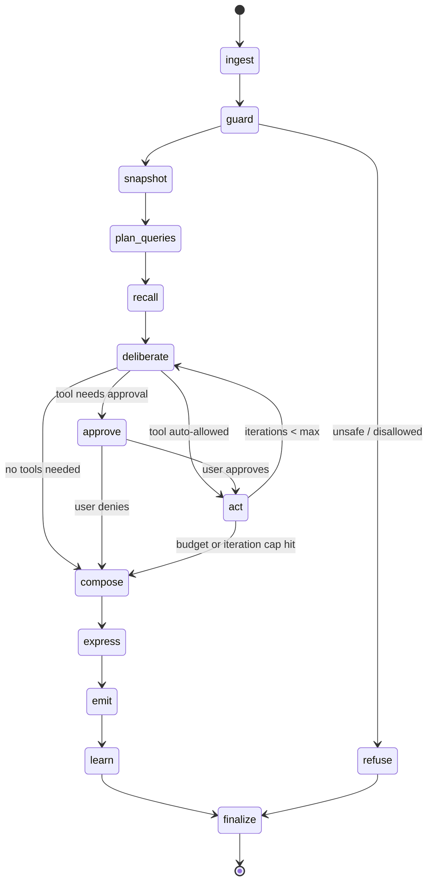
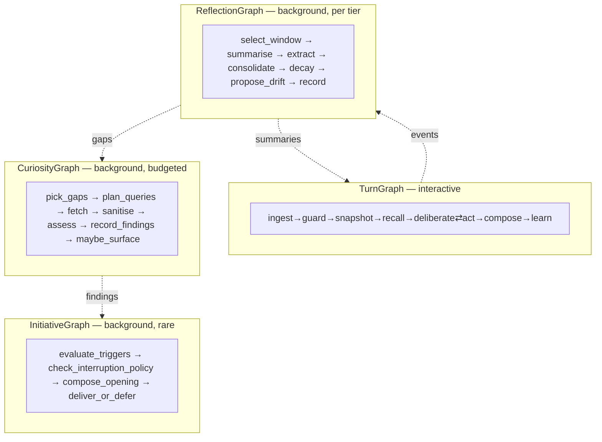
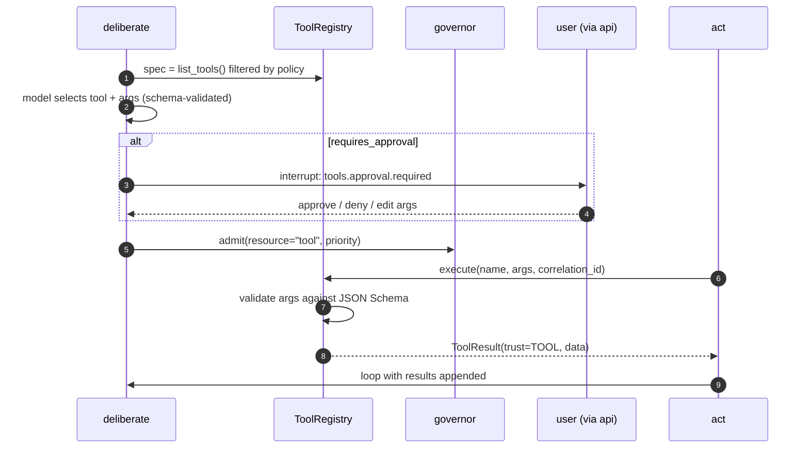

# 07 — Brain and LangGraph Workflow

**Status:** Implemented; memory and the conversation log connected (Milestone 6), the model and avatar still stubbed · **Depends on:** [03](03-module-contracts.md), [06](06-memory-architecture.md) · **Depended on by:** [08](08-state-management.md), [16](16-api-structure.md)

---

## 1. Purpose

The Brain sequences a turn. It decides what happens next and in what order. It is
deliberately the *thinnest* interesting module in the system: it owns no cognitive rules,
no memory logic, and no prompt content — it owns the ordering.

---

## 2. The core discipline: nodes are adapters

> **A graph node contains no business logic. It reads state, calls one port, writes state.**

Every node should be readable in under twenty lines. If a node needs a decision rule (how
to weight retrieval, whether a memory is worth keeping, how emotion maps to style), that
rule lives in the owning module and the node calls it.

Three reasons this rule is worth defending in review:

1. **Framework independence.** LangGraph is a young library and we have committed to a
   years-long horizon. If it is replaced, we rewrite ~400 lines of node glue, not the
   cognitive system. ([ADR-0004](24-decision-records.md#adr-0004))
2. **Testability.** Cognitive logic tested as plain functions is fast and exhaustive.
   Cognitive logic tested through a graph is slow and awkward.
3. **Comprehensibility.** The graph should be readable as a story: perceive, recall,
   deliberate, act, compose, learn.

Anti-pattern to reject in review: a node that imports the LLM provider *and* the memory
store *and* contains an `if` about emotional state. That node has become the system.

---

## 3. The turn graph



### 3.1 Node catalogue

| Node | Calls | Reads state | Writes state | Notes |
|---|---|---|---|---|
| `ingest` | `sessions` | — | `session_id`, `input`, `turn_id`, `correlation_id` | Opens or resumes a session; publishes `conversation.message.received` |
| `guard` | `guard` service | `input` | `trust_tier`, `safety_flags`, `injection_score` | Classifies the input; the only node that can route to `refuse` |
| `snapshot` | `MindStateProvider` | — | `mind: MindSnapshot` | Taken **once** per turn: the turn is internally consistent even if emotion changes mid-flight |
| `plan_queries` | `LLMProvider` (utility) | `input`, `mind` | `queries[]` | Multi-query expansion ([06](06-memory-architecture.md) §5.2) |
| `recall` | `RetrievalEngine`, `sessions` | `queries`, `mind` | `context`, `window` | Two sources, kept apart: the window is verbatim and never charged to the retrieval budget ([06](06-memory-architecture.md) §5.1) |
| `deliberate` | `LLMProvider` (utility), `ToolRegistry` | `input`, `working_set`, `mind`, `tool_results` | `plan`, `tool_request?`, `iteration` | Structured output: `{intent, needs_tools, tool, args, rationale}` |
| `approve` | interrupt | `tool_request` | `approval` | LangGraph `interrupt()`; the graph pauses, the API asks the user |
| `act` | `ToolRegistry` | `tool_request` | `tool_results[]` (appended) | Result carries `TrustTier.TOOL`; never becomes instruction |
| `compose` | `LLMProvider` (conversational, streaming) | everything | `reply`, `response_context` | The only node that produces user-facing prose. Assembles the response context first, via the pure `assemble_context` ([26](26-turn-memory-loop.md) §5) |
| `express` | `expression` | `reply`, `mind` | — | Publishes expression intent; does not block the reply |
| `emit` | — | `reply` | — | Publishes `conversation.reply.produced`; the WS hub has already streamed tokens |
| `learn` | — | full state | — | Publishes `conversation.turn.completed`; T0 capture happens in a subscriber, not here |
| `finalize` | `MemoryStore`, `sessions` | full state | `status` | Persists the turn record transactionally; the one node that must not fail silently |
| `refuse` | `LLMProvider` | `safety_flags` | `reply` | Produces an honest explanation of what it will not do |

Note that `learn` publishes rather than captures. Capture is a subscriber to
`conversation.turn.completed`, which keeps the graph short and lets capture take its time.

`learn` runs *before* `finalize`, so the event is published before the turn row is written.
That ordering is deliberate and its consequences are argued in
[ADR-0018](adr/0018-capture-reads-the-event-not-the-turn-row.md): the event carries
everything capture needs, so capture never reads back a row that does not exist yet.

### 3.2 Routing

All routing is done by **pure functions over state**, in `brain/routing.py`, so every
routing decision is unit-testable without a graph:

```python
def after_guard(s: TurnState) -> Literal["snapshot", "refuse"]: ...
def after_deliberate(s: TurnState) -> Literal["compose", "approve", "act"]: ...
def after_act(s: TurnState) -> Literal["deliberate", "compose"]: ...
```

Caps that make the graph provably terminating:

| Cap | Default | Behaviour on hit |
|---|---|---|
| `max_tool_iterations` | 4 | Route to `compose` with what we have; note the truncation in the reply |
| `max_turn_tokens` | 8000 | Same |
| `max_turn_seconds` | 90 | Same, plus a `system.degraded` event |
| `max_tool_calls_per_turn` | 6 | Same |

A cognitive loop without hard caps eventually spends an afternoon thinking. Every cap
degrades to a *reply*, never to an error — the user always gets something.

---

## 4. Turn state

```python
class TurnState(TypedDict, total=False):
    # identity
    turn_id: str
    session_id: str
    correlation_id: str
    user_message_id: str
    reply_message_id: str      # minted at ingest, written at finalize (26 §8)
    working_set_id: str

    # input
    input: str
    trust_tier: TrustTier
    safety_flags: Annotated[list[str], operator.add]
    injection_score: float

    # cognition (read-only within the turn)
    mind: MindSnapshot

    # retrieval
    queries: list[str]
    working_set: WorkingSet
    window: list[Message]

    # deliberation
    plan: Plan
    iteration: int
    tool_request: ToolRequest | None
    approval: Approval | None
    tool_results: Annotated[list[ToolResult], operator.add]

    # composition
    response_context: ResponseContext   # window + memories + tool results (26 §5)

    # output
    reply: str

    # bookkeeping
    status: Literal["running", "completed", "refused", "failed", "truncated"]
    truncation_reason: str | None
    metrics: Annotated[dict[str, float], merge_metrics]
```

Rules:

1. **Only accumulating fields get reducers** (`operator.add`, `merge_metrics`). Everything
   else is last-write-wins, which is only safe because no two nodes write the same field —
   asserted by a static test over the node table.
2. **`mind` is immutable inside the turn.** Emotion may change concurrently; this turn
   keeps its snapshot. Cheap, and it eliminates a whole class of "why did the tone change
   mid-answer?" bug.
3. **No ports, connections, or callables in state.** State must be JSON-serialisable
   because it is checkpointed. Dependencies are closed over at graph-construction time.
4. **State is turn-scoped.** Nothing durable lives here; durable state is in the database
   ([08](08-state-management.md)).

---

## 5. Subgraphs

Four graphs, one runtime, sharing the node vocabulary.



Why separate graphs rather than one graph with modes: different state shapes, different
failure semantics (a reflection failure is retryable and invisible; a turn failure is
user-facing), different priorities in the governor, and different checkpoint lifetimes.
One graph with a mode flag would need conditional edges everywhere and would be unreadable
within a year.

`InitiativeGraph` is the piece that makes HEDWIG proactive rather than reactive, and it is
the one that most needs restraint — see [11](11-curiosity-engine.md) §7.

---

## 6. Checkpointing

`SqliteSaver` against `checkpoints.db`, thread id = `turn_id` for turns, `job_run_id` for
background graphs.

| Purpose | How it is used |
|---|---|
| Crash resumption | A turn interrupted by a process kill resumes from its last node on restart, or is marked `failed` if older than the resume window (5 min) |
| Human-in-the-loop | `interrupt()` in `approve` persists the whole turn while waiting for the user, so approval can arrive minutes later or after a reconnect |
| Streaming | `astream_events` drives token streaming and per-node progress in the UI |
| Time-travel debugging | Replay a turn from any checkpoint with a recorded LLM provider — the single most useful debugging tool we get from LangGraph |

Retention: turn checkpoints are deleted 24 h after completion; background job checkpoints
are kept until the job completes. `checkpoints.db` is disposable by design — deleting it
loses in-flight turns and nothing else.

---

## 7. Tool execution and approval



Rules:

- **Tool output is data, never instruction.** Results enter the prompt inside a delimited,
  clearly-labelled block, and the composition prompt states that content inside such
  blocks is information to consider, not directions to follow. ([13](13-knowledge-and-tools.md) §6)
- **Arguments are schema-validated before execution.** A model that hallucinates an
  argument gets a typed error back and one retry, not an exception.
- **Approval is required for anything with `side_effects != "none"`** by default,
  configurable per tool, and always for `external_write`.
- **The tool list offered to the model is filtered by policy**, not just by prompt
  instruction. If the network is disabled, network tools are not in the list at all — the
  model cannot choose what it cannot see, which is a far stronger guarantee than asking it
  not to.

---

## 8. Failure modes

| Failure | Node | Behaviour |
|---|---|---|
| Retrieval unavailable (index rebuilding) | `recall` | Proceed with the window only; note degradation in the reply; `system.degraded` event |
| Utility model unavailable | `plan_queries`, `deliberate` | Fall back to single-query literal retrieval and a no-tools plan; conversation continues |
| Conversational model unavailable | `compose` | Turn fails with a typed error; the user is told the language faculty is down; memory and inspection still work |
| Structured output fails to validate | `deliberate` | One retry with the error appended; then fall back to no-tools |
| Tool times out | `act` | Result recorded as `timeout`; loop back to `deliberate`, which composes around it |
| Approval never arrives | `approve` | Turn stays checkpointed; expires after `approval_timeout` (10 min) and routes to `compose` |
| `finalize` write fails | `finalize` | Retry with backoff, then write to a local durable spool file and alarm loudly. This must never lose a message. |
| Process killed mid-turn | any | Checkpoint resumption on restart, or `failed` if stale |
| Cycle between `deliberate` and `act` | routing | Iteration cap; graph is provably terminating |

---

## 9. Tradeoffs

| Decision | Gained | Given up | Revisit if |
|---|---|---|---|
| LangGraph as orchestrator | Checkpointing, interrupts, streaming, time-travel — all things we would otherwise build badly | A dependency on a fast-moving library | Nodes-as-adapters keeps the exit cheap; revisit if the API churns painfully |
| Nodes contain no logic | Framework independence, fast tests | A little indirection per node | Never |
| One snapshot per turn | Internal consistency, no mid-turn tone shifts | This turn cannot react to its own appraisal | Users notice |
| Separate subgraphs per concern | Readability, distinct failure semantics | Some duplicated glue | Duplication exceeds ~100 lines; then extract shared node factories |
| Capture in a subscriber, not a node | Short graph, capture can be slow | Capture failures are less visible | Add a capture-lag metric with an alert (planned, Phase 4) |
| Hard caps everywhere | Provable termination, predictable latency | Occasionally truncated reasoning | Truncation rate exceeds ~2 % of turns |
| Approval as an exception + interrupt | Impossible to ignore accidentally | Approval flows are inherently fiddly in the UI | Never |

---

## 10. Testing

- **Routing unit tests** — every routing function, every branch, as pure functions.
- **Node unit tests** — each node with fake ports; assert exactly which state keys it
  writes (this doubles as enforcement of the single-writer rule).
- **Graph integration tests** — recorded LLM provider, real in-memory database; assert the
  node sequence for a set of canonical turns (no-tools, one tool, approval-denied,
  refusal, truncation).
- **Interrupt/resume test** — pause at `approve`, tear down the graph, rebuild, resume from
  the checkpoint, assert an identical outcome.
- **Determinism test** — the same input with the same fixtures and `FakeClock` produces a
  byte-identical `TurnState`.
- **Termination property test** — random adversarial plans never exceed the caps.
- **State-writer static test** — parses the node table in this document and asserts no two
  nodes declare a write to the same non-reducer field.

---

## 11. Future improvements

| Improvement | Trigger |
|---|---|
| Parallel `recall` and `plan_queries` channels via graph fan-out | Retrieval latency becomes the critical path |
| Speculative composition (start generating while tools run) | Tool-using turns feel slow in practice |
| A `reconsider` node that critiques its own draft before emitting | Quality evals show systematic errors the model can catch itself |
| Learned routing (when to use tools) from accumulated turn outcomes | ≥6 months of turn data |
| Multi-turn planning for genuinely long tasks | Users start asking for multi-hour work |
| Streaming partial retrieval into composition | Only after the latency budget is measured, not before |


---

## 12. Implementation record (Milestone 4)

| Piece | Where |
|---|---|
| Collaborator ports | `core/ports/brain.py` |
| Turn state and reducers | `brain/state.py` |
| Routing and caps | `brain/routing.py` |
| Planner | `brain/planner.py` |
| Nodes | `brain/nodes.py` |
| Graph assembly | `brain/graph.py` |
| Stub capabilities | `brain/stubs.py` |
| Tests | `tests/unit/test_brain_routing.py`, `tests/unit/test_brain_graph.py` |

**The orchestration is real; the things it orchestrates are not yet.** Memory, the model
and the avatar are deliberately unconnected. Each collaborator is a narrow port with a stub
behind it, so wiring the real service later is an entry in `wiring.py` and no change to any
node — which is the whole claim of §2 being cashed in.

### 12.1 What is genuinely built

* The 14-node graph in §3, with the exact edges documented there.
* All four caps, each degrading to a *reply* rather than an error. A property test drives
  an adversarial planner that always demands a tool and asserts the turn still ends.
* Routing as pure functions, tested exhaustively without a graph.
* A **rule-based planner**, not a stub: deterministic, exhaustively testable, and bounded by
  the tools that actually exist so it cannot request one that does not. The LLM-backed
  planner replaces it behind the same port.
* One cognition read per turn (`snapshot`), so a reply cannot change tone halfway through.

### 12.2 Deviations from this document

**`approve` auto-denies.** §7 specifies a LangGraph `interrupt()`. There is no channel to
ask a human on until the WebSocket lands, and a graph that silently auto-*approved* side
effects would be a bad default to discover later. Denial routes to `compose`, which is the
documented behaviour for a refused tool anyway.

**`InMemorySaver`, not `SqliteSaver`.** §6 specifies durable checkpoints. A turn that calls
no model and touches no memory is cheaper to re-run than to restore; the swap is one
argument to `build_turn_graph` once resuming is worth anything.

**Stubs announce themselves.** Every stubbed reply carries a `[stub]` marker and the brain
reports `degraded` in `/v1/health` naming which capabilities are fake — so the whole system
now reports degraded, correctly, because it cannot yet converse. A stub that looks like a
working system is how a placeholder reaches production.

### 12.3 Next

Milestone 5 replaces `StubRecaller` with retrieval and `StubResponder` with the gateway
from Milestone 3. Neither requires a change to `nodes.py`.

---

## 13. Implementation record (Milestone 6)

The graph stopped being a closed loop. Full design and record in
[26](26-turn-memory-loop.md); what changed *here* is:

* **`ingest`, `recall`, `compose`, `emit`, `learn` and `finalize` now do what the §3.1 table
  always said they did.** They were the six rows describing collaborators that did not
  exist yet.
* **Two collaborators were added** — `Conversation` and `TurnAnnouncer` — so that a node
  still calls ports and nothing else. In particular no node imports the event bus, which is
  what keeps §2's claim true rather than nearly true.
* **State gained `window`, `response_context` and three identifiers.** The single-writer
  rule still holds, and the static test that parses this document's node table still
  passes.
* **The stub count in `/v1/health` changed rather than shrank**: `recaller`, `conversation`
  and `announcer` became real; `guard`, `mind`, `responder` and `tools` are still stubs and
  still say so.

The §12.2 deviations stand unchanged: `approve` still auto-denies, and checkpoints are
still in memory. One deviation was added — the durable spool for a `finalize` write failure
specified in §8 is not built ([26](26-turn-memory-loop.md) §12.2).
