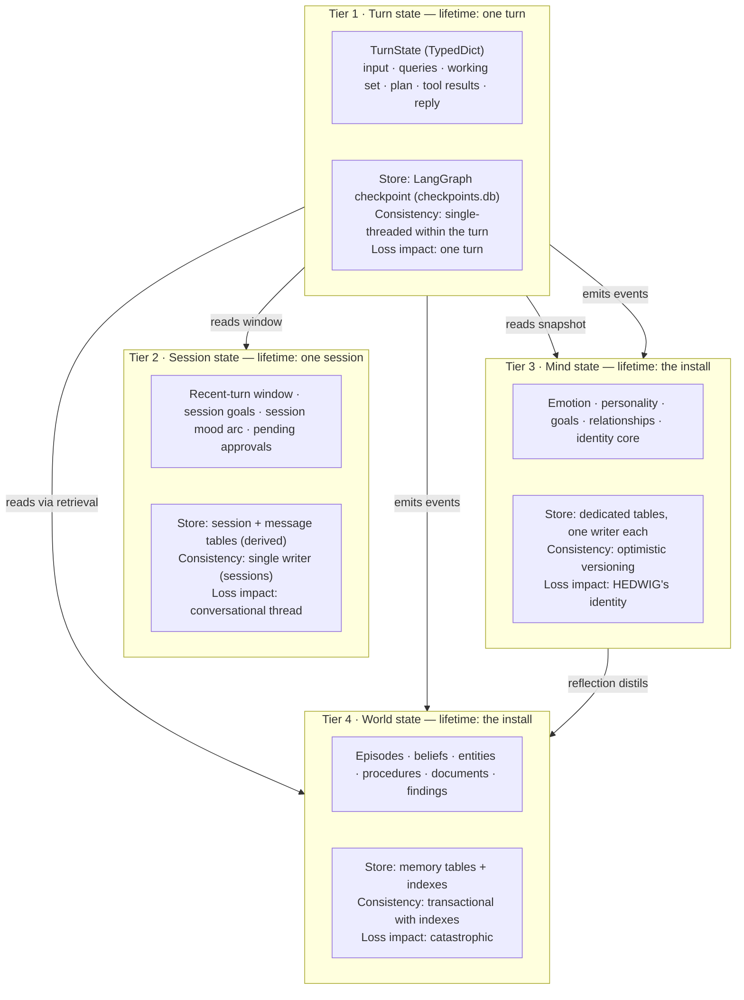
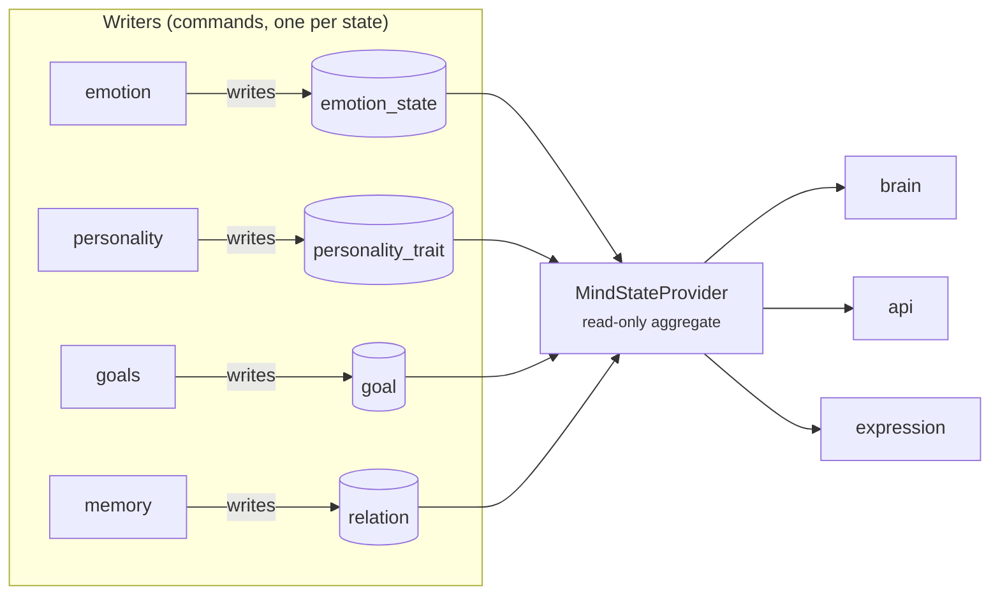
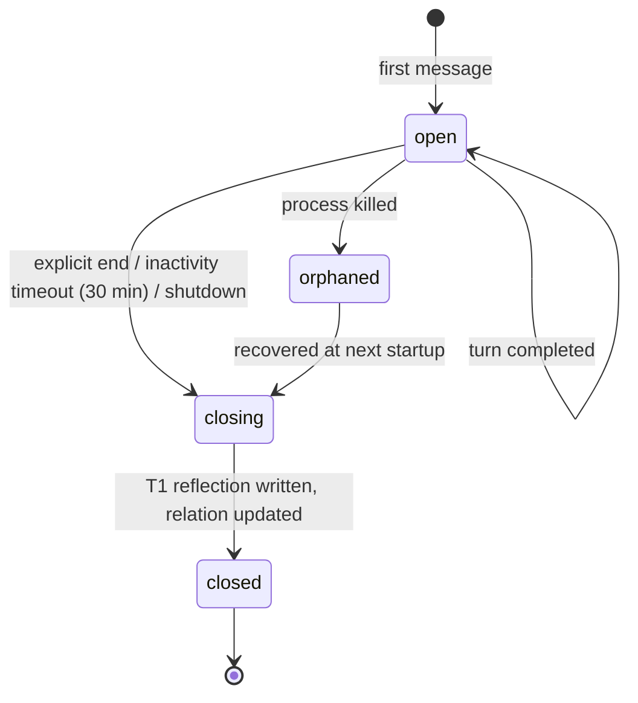
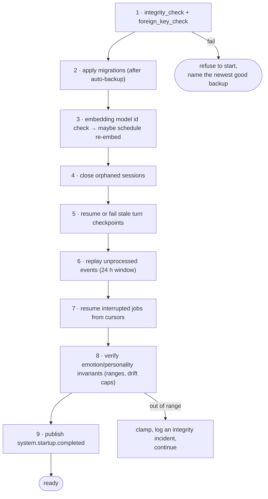

# 08 — State Management

**Status:** Design · **Depends on:** [04](04-communication-and-event-bus.md), [05](05-data-model-and-database.md), [07](07-brain-langgraph-workflow.md) · **Depended on by:** [09](09-emotion-engine.md), [10](10-personality-engine.md), [12](12-reflection-engine.md)

---

## 1. Purpose

A system with emotion, personality, goals, relationships, memory and background jobs has a
lot of mutable state. Without explicit rules about who owns what and how it is read, this
is where the architecture rots first. This document sets those rules.

---

## 2. The four tiers



The tiers differ in exactly the way that matters: **how bad it is to lose them.** Tier 1 is
disposable, Tier 2 is annoying, Tier 3 is HEDWIG's personality, Tier 4 is everything. That
ordering drives the durability, backup and testing effort spent on each.

| Tier | Volatility | Durability mechanism | Backed up |
|---|---|---|---|
| 1 Turn | Milliseconds | Checkpoint, deleted after 24 h | No |
| 2 Session | Minutes–hours | Derived from `message`/`session` rows | Yes (as part of Tier 4's file) |
| 3 Mind | Hours–months | Tables + history tables + snapshots | Yes, plus nightly identity snapshot |
| 4 World | Permanent | Tables + FTS + vectors, one transaction | Yes, everything |

---

## 3. Ownership table

**Exactly one module writes each piece of state.** This is the rule that makes concurrent
background work safe without distributed locking, and makes "who changed this?" always
answerable. Enforced by a test that greps for table names outside their owning package.

| State | Owner (sole writer) | Readers | Read mechanism |
|---|---|---|---|
| `emotion_state`, `emotion_history`, `appraisal` | `emotion` | brain, api, expression, curiosity | `MindStateProvider` |
| `personality_trait`, `personality_history` | `personality` | brain, llm prompt builder, api | `MindStateProvider` |
| `drift_proposal` | `reflection` (creates) / `personality` (decides) | api | port |
| `identity_core` | `personality` (user-consent path only) | brain, api | `MindStateProvider` |
| `goal` | `goals` | brain, curiosity, reflection, api | `MindStateProvider` |
| `episode`, `belief`, `entity`, `relation`, `procedure`, `memory_*`, `tombstone` | `memory` | everyone, read-only | `MemoryStore`, `RetrievalEngine` |
| `session`, `message`, `turn` | `sessions` (+ `brain` for `turn`) | everyone | port |
| `gap`, `finding`, `source` | `curiosity` | api, reflection | port |
| `document`, `document_chunk` | `knowledge` | retrieval, api | `DocumentIndex` |
| `vec_memory`, `*_fts`, `embedding_state` | `embeddings` / `memory` (same txn) | retrieval | indexes |
| `event`, `processed_event`, `subscription_cursor` | `core.bus` | api (trace views) | port |
| `job_run`, `reflection_run` | `scheduler` / `reflection` | api | port |
| `tool_call` | `tools` | api | port |
| `llm_call`, `budget_ledger` | `llm` / `governor` | api | port |

### 3.1 Why a read model rather than shared access

Cognition modules must not import each other ([02](02-system-architecture.md) §4.2), and the
Brain must not import cognition modules. `MindStateProvider` ([03](03-module-contracts.md) §5.7)
is the seam: a read-only aggregate over Tier 3.



The provider reads the tables directly (they are in the same database; there is no reason
to route reads through the owning module and pay an extra hop). This is a deliberate,
narrow exception to "go through the owner": **reads go to the tables, writes go through the
owner.** The exception is safe because the tables are append-or-version-guarded and the
provider constructs immutable snapshots.

---

## 4. Concurrency

Everything runs in one asyncio event loop, so there is no thread-level data race. The real
concurrency hazards are *logical*:

| Hazard | Example | Control |
|---|---|---|
| Lost update | Nightly reflection and an interactive turn both update `relation` | Optimistic concurrency: `UPDATE … WHERE version = ?`; on conflict, re-read and re-apply the delta (all Tier-3 updates are formulated as deltas, so replay is safe) |
| Torn read | A snapshot read while personality is mid-update | Snapshots are taken in one `BEGIN DEFERRED` read transaction |
| Write skew | Two handlers both promote the same tentative belief | Unique partial index on active SPO; loser gets an integrity error and treats it as "already done" |
| Interleaved job and turn | T2 consolidation deletes a memory the current turn is citing | Tombstoning is soft; the turn's `WorkingSet` already holds the text; citation resolution tolerates tombstoned sources and marks them "archived" |
| Background starving interactive | Nightly reflection holds the model | `ResourceGovernor` priority + preemption ([17](17-backend-architecture.md) §7) |
| Double job run | Idle trigger fires while a scheduled run is active | `job_run` has a unique partial index on `(job_name, status='running')` |

### 4.1 Delta-formulated updates

Every Tier-3 write is expressed as *"apply this delta to whatever is current"*, never
*"set to this value"*. This is what makes optimistic-concurrency retries correct rather
than merely convenient:

```python
# not: emotion.set(curiosity=0.74)
await emotion.apply(EmotionDelta(curiosity=+0.13, cause="appraisal", appraisal_id=...))
```

Retry on version conflict then produces the intuitively right answer instead of clobbering
a concurrent change.

---

## 5. Session state

Sessions are a *derived* concept: there is no session cache to keep in sync.

| Field | Derivation |
|---|---|
| Recent window | `SELECT … FROM message WHERE session_id = ? ORDER BY seq DESC LIMIT n` |
| Session mood arc | `emotion_history` rows within the session's time range |
| Session goals | `goal` rows touched during the session |
| Pending approvals | `tool_call` rows with `status='requested'` |

Lifecycle:



The orphaned path matters: a killed process must not leave a session that never gets
summarised, or the user loses a conversation from HEDWIG's memory. Startup sweeps sessions
with `ended_at IS NULL` and no recent activity, and closes them with
`end_reason='shutdown'`.

---

## 6. Goals

Goals are Tier-3 state, given first-class treatment because INV-6 demands it and because
the README leaves them underspecified.

| Kind | Origin | Example |
|---|---|---|
| `user_stated` | The user asked for something spanning turns | "Help me design HEDWIG" |
| `self_generated` | Reflection identified something worth pursuing | "Understand the user's preferred level of detail" |
| `maintenance` | System hygiene, always present | "Keep memory consolidated", "keep beliefs corroborated" |

Goals influence three things, concretely — otherwise they are decoration:

1. **Retrieval** — `RetrievalPolicy.goal_focus` boosts goal-linked memories.
2. **Curiosity** — gaps supporting active goals get priority ([11](11-curiosity-engine.md) §4).
3. **Initiative** — the `InitiativeGraph` only ever speaks up in service of a goal.

Lifecycle rules that keep the goal list from becoming a graveyard: `proposed` goals expire
after 7 untouched days; `active` goals with no progress in 30 days are auto-`blocked` and
surfaced for review; the active set is capped at 12 by priority.

---

## 7. Snapshots and recovery

Two independent recovery mechanisms, deliberately not one:

### 7.1 Identity snapshots

Nightly, `personality_trait`, `emotion_state`, `identity_core`, and aggregate relationship
state are written to a single `identity_snapshot` row (JSON, ~4 KB). Kept 90 days.

Purpose: **rollback of cognitive drift.** If a bug (or a bad month of interactions) skews
personality, the user can restore Tier 3 to any night in the last 90 days without touching
memory. Losing a month of trait drift is trivial; losing a month of memory is not — which
is exactly why the two are restorable independently.

### 7.2 Startup recovery sequence



Step 8 is worth having: a state file that has been hand-edited, or corrupted by a bug,
should not produce a HEDWIG whose stress level is 4.7.

---

## 8. What is deliberately *not* state

| Not state | Why |
|---|---|
| Prompt templates | Code and config, versioned in git. A prompt that changes at runtime is untestable. |
| Emotion→behaviour mappings | Config tables in code ([09](09-emotion-engine.md) §6), tuned by a human, not learned at runtime |
| The working set | Ephemeral per turn ([06](06-memory-architecture.md) §2) |
| "Conversation history" as a first-class object | Messages are rows; history is a query (INV-1) |
| LLM KV-cache / model internals | Provider concern; explicitly not part of identity ([01](01-vision-and-scope.md) §5) |
| Derived aggregates (mention counts, familiarity) | Stored as columns for speed, but always recomputable from primary data; a repair job verifies them weekly |

That last row is a rule worth naming: **every denormalised value must have a recompute
path.** Otherwise a bug in an increment is permanent.

---

## 9. Tradeoffs

| Decision | Gained | Given up | Revisit if |
|---|---|---|---|
| Four explicit tiers | Clear durability and testing effort per tier | Some ceremony in deciding where new state goes | Never |
| Single-writer per state | No locking, always-answerable provenance | Occasional awkwardness when two modules want to write | A genuine co-ownership case appears; then split the state, not the rule |
| Read model reads tables directly | No extra hop, simple | Readers know the schema | Schema churn starts breaking readers; then move behind the port fully |
| Optimistic concurrency with delta updates | Correct retries, no locks | Every Tier-3 update must be expressible as a delta | Never — the constraint improves the design |
| Sessions derived, not cached | No cache invalidation bugs | A query per window read (indexed, sub-ms) | Profiling says otherwise |
| Separate identity snapshots | Cognitive rollback without memory loss | A second backup mechanism | Never |
| Checkpoints disposable | Simple retention, no growth | Killed turns are lost after 5 min | Turn loss becomes visible to users |
| No event sourcing | Simple, comprehensible state | No free replay-based reconstruction | Never ([ADR-0003](24-decision-records.md#adr-0003)) |

---

## 10. Failure modes

| Failure | Detection | Response |
|---|---|---|
| Version conflict storm on `emotion_state` | Retry counter metric | Coalesce appraisals: emotion applies deltas on a 30 s tick rather than per event |
| Snapshot read during a write | Read transaction isolation | None needed; DEFERRED read sees a consistent view |
| Orphaned session never summarised | Startup sweep + a daily audit query | Close and summarise late; the episode records the delay honestly |
| Job cursor points at deleted data | Job resume validation | Restart the job from a safe checkpoint; log |
| Tier-3 values out of range | Startup invariant check + per-write clamps | Clamp, log an integrity incident, surface in the inspector |
| Denormalised counter drifts | Weekly repair job comparing against primary data | Recompute; log the delta (a persistent delta indicates a bug to fix) |
| Two processes started against one database | Advisory lock file + `SQLITE_BUSY` pattern | Second process refuses to start with a clear message |

---

## 11. Testing

- **Ownership test** — table names appear in SQL only inside their owning package.
- **Single-writer graph test** — parses the ownership table in this document; fails if code
  contradicts it.
- **Concurrency scenario tests** — an interactive turn and a T2 reflection run against the
  same relation/belief rows concurrently; assert no lost updates and no crashes.
- **Recovery tests** — kill at each of the nine startup steps; assert the next start
  completes and no Tier-3/4 state is lost.
- **Snapshot rollback test** — drift personality over simulated weeks, roll back, assert
  traits restored and memory untouched.
- **Invariant property tests** — random delta sequences never push a dimension out of range.
- **Recompute test** — every denormalised column matches its recomputation after a random
  workload.

---

## 12. Future improvements

| Improvement | Trigger |
|---|---|
| A single `hedwig state diff <t1> <t2>` CLI over identity snapshots | Debugging drift becomes routine |
| Per-entity relationship snapshots (not just aggregate) | Multi-person relationship modelling matters |
| CRDT-shaped Tier-3 state | Multi-device sync becomes a goal ([23](23-challenged-assumptions.md) §12) |
| Move session window assembly into a materialised view | Window queries appear in profiles |
| User-visible "state history" timeline in the inspector | Phase 5 feedback asks for it |
