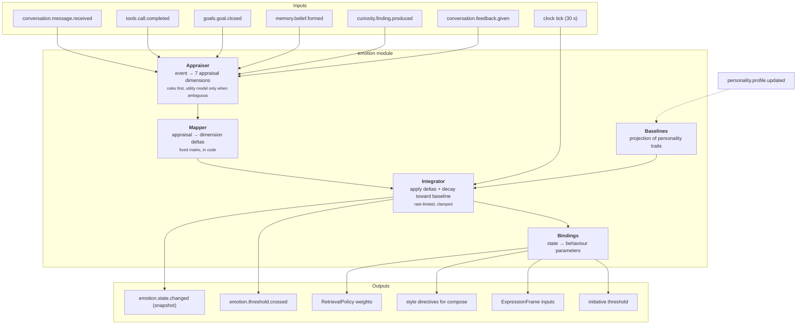
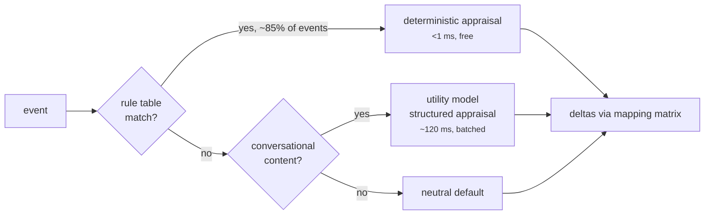

# 09 — Emotion Engine

**Status:** Design · **Depends on:** [04](04-communication-and-event-bus.md), [08](08-state-management.md) · **Depended on by:** [10](10-personality-engine.md), [15](15-avatar-controller.md)

---

## 1. Purpose

Maintains a numeric internal state that modulates behaviour. The README is explicit and
correct: *emotions influence behaviour but are not real feelings*. This document takes that
seriously in both directions — it builds a real mechanism, and it refuses to claim the
mechanism is experience.

**The design constraint that keeps this honest:** every emotional dimension must change at
least one *measurable* behaviour. A dimension nothing reads is deleted (INV-3). Emotion
that only appears in prose about how HEDWIG feels is decoration, and decoration is worse
than nothing because it invites the user to believe something false.

---

## 2. Architecture



---

## 3. The state vector

Eight dimensions. Two are core affect; six are drives/moods.

| Dimension | Range | Baseline source | Half-life | What it means |
|---|---|---|---|---|
| `valence` | −1…1 | 0 + 0.3·(warmth trait) | 20 min | Positive/negative tone of the moment |
| `arousal` | 0…1 | 0.35 | 15 min | Activation; how energised the response is |
| `curiosity` | 0…1 | 0.3 + 0.5·(curiosity trait) | 4 h | Drive to explore and ask |
| `happiness` | 0…1 | 0.4 + 0.3·(optimism trait) | 2 h | Sustained positive mood |
| `confidence` | 0…1 | 0.4 + 0.4·(assertiveness trait) | 1 h | Willingness to assert without hedging |
| `stress` | 0…1 | 0.15 | 45 min | Load/pressure; degrades elaboration |
| `energy` | 0…1 | circadian curve, see §5.3 | 8 h | Capacity for effort |
| `warmth` | 0…1 | 0.4 + 0.4·(empathy trait) | 30 min | Momentary social closeness |

### 3.1 Two changes from the README's list

**Trust is removed.** The README lists trust as an emotion. Trust toward an entity is a
slow, evidence-accumulated *relationship* property and belongs in relationship memory
([06](06-memory-architecture.md) §3.3). Modelling it as an emotion would let a single bad
turn erase a year of relationship, and would let it decay back to baseline overnight —
both wrong, and in a companion, actively hurtful. `warmth` fills the transient-social role.

**`valence` and `arousal` are added.** Six named drives with no underlying affective core
means the avatar and the prose have to guess at overall tone from six semi-independent
numbers. Core affect gives one well-understood 2-D substrate (the circumplex model) that
expression can read directly, with the named drives layered on top. This is a real
simplification at the output end.

### 3.2 What is deliberately absent

No anger, fear, disgust, sadness, jealousy. Reasons: (a) they have no legitimate behavioural
binding in this system — there is nothing for HEDWIG to be angry *at*; (b) a companion that
displays anger or sadness at the user is a manipulation risk we will not design in;
(c) each would need its own appraisal path for no functional gain. Negative states are
represented as low valence, high stress, low energy — which is enough to be honest about
having a hard time without performing distress at someone.

---

## 4. Appraisal

Appraisal turns an event into seven dimensions, then a fixed matrix turns those into state
deltas. Two stages, because the appraisal dimensions are the *interpretable* layer — they
are what the Mind Inspector shows and what a human tunes.

### 4.1 Appraisal dimensions (OCC-inspired, trimmed)

| Dimension | Range | Question |
|---|---|---|
| `novelty` | 0…1 | Is this new? |
| `goal_congruence` | −1…1 | Does it help or hinder an active goal? |
| `certainty` | 0…1 | How clear is the situation? |
| `agency` | −1…1 | Was this HEDWIG's doing, the user's, or neither? |
| `social_valence` | −1…1 | Warm, neutral, or cold interaction? |
| `effort` | 0…1 | How much work does this imply? |
| `norm_fit` | −1…1 | Consistent with identity-core values? |

### 4.2 Rules first, model second



Rule examples (in code, `emotion/rules.py`):

| Event | Appraisal |
|---|---|
| `tools.call.completed` status=failed | `goal_congruence=−0.4, certainty=−0.2, effort=+0.3` |
| `tools.call.completed` 3rd consecutive failure | `goal_congruence=−0.7, agency=−0.3` |
| `goals.goal.closed` status=done | `goal_congruence=+0.8, effort=−0.3` |
| `memory.belief.formed` novel entity | `novelty=+0.5` |
| `curiosity.finding.produced` quality>0.7 | `novelty=+0.6, goal_congruence=+0.3` |
| `conversation.feedback.given` −1 | `goal_congruence=−0.5, social_valence=−0.3, certainty=−0.2` |
| `conversation.session.started` after >3 days | `social_valence=+0.4, novelty=+0.2` |

Only *user message content* genuinely needs the model, and even then it is one small
structured call, batched with the T0 capture call where possible. This keeps the emotional
apparatus nearly free: the alternative — an LLM call per event — would cost more than the
conversation itself.

### 4.3 Mapping matrix

Fixed coefficients, in code, reviewed by a human, never learned at runtime (see
[08](08-state-management.md) §8 for why).

| appraisal → | valence | arousal | curiosity | happiness | confidence | stress | energy | warmth |
|---|---|---|---|---|---|---|---|---|
| novelty | +0.1 | +0.3 | **+0.6** | +0.1 | 0 | +0.1 | −0.05 | 0 |
| goal_congruence | **+0.5** | +0.1 | −0.1 | **+0.4** | **+0.3** | **−0.3** | +0.1 | +0.1 |
| certainty | +0.1 | −0.1 | −0.2 | +0.1 | **+0.4** | **−0.3** | 0 | 0 |
| agency | +0.1 | +0.1 | 0 | +0.1 | +0.2 | −0.1 | −0.1 | 0 |
| social_valence | **+0.3** | +0.1 | +0.1 | +0.3 | +0.1 | −0.2 | +0.05 | **+0.6** |
| effort | −0.05 | +0.2 | 0 | 0 | 0 | **+0.4** | **−0.3** | 0 |
| norm_fit | +0.2 | 0 | 0 | +0.2 | +0.2 | −0.2 | 0 | +0.1 |

Read a row as: *"a unit of this appraisal pushes these dimensions by these amounts."*
Deltas are scaled by an event-significance factor before application.

---

## 5. Integration

### 5.1 The update equation

Applied on a 30-second tick, coalescing all appraisals received since the last tick:

```
for each dimension d:
    Δ_appraise = Σ_events  M[d] · appraisal(event) · significance(event)
    Δ_appraise = clip(Δ_appraise, −max_delta_per_tick, +max_delta_per_tick)   # default 0.15
    decay      = (1 − 2^(−Δt / half_life[d])) · (baseline[d] − s[d])
    s'[d]      = clamp(s[d] + Δ_appraise + decay, range[d])
```

Three properties this guarantees, each of which is a bug we are pre-empting:

1. **Bounded rate of change** — no whiplash from one dramatic message. A companion whose
   mood snaps is unsettling, and it makes the avatar twitch.
2. **Return to baseline** — homeostasis. Without it, state random-walks to a boundary and
   stays there, which is the most common failure of naive emotion models.
3. **Personality determines where "normal" is** — a curious personality idles curious.

### 5.2 Why a tick rather than per-event

Per-event updates cause version-conflict storms on `emotion_state`
([08](08-state-management.md) §10), fire `emotion.state.changed` dozens of times per turn
(which the avatar would try to render), and make the state history unreadable. A 30-second
coalescing tick fixes all three at the cost of latency that no one can perceive.

`emotion.state.changed` is published only when the L1 norm of the change exceeds
`min_publish_delta` (0.02), which keeps the event log and the avatar quiet during idle
periods.

### 5.3 Energy and the circadian curve

`energy` is the one dimension with a time-of-day baseline, not a personality baseline:

```
baseline_energy(t) = 0.45 + 0.3·sin(2π·(hour(t) − 9)/24)   clamped to [0.25, 0.85]
```

Peaks mid-afternoon, troughs around 3 am. It is a small touch with an outsized effect on
believability, and it has real behavioural teeth: low energy shortens replies and defers
background work. It is derived from the user's local timezone — a companion whose energy
tracks UTC while the user is in Lisbon is worse than one with no circadian model at all.

An explicit honesty note: this is a *simulation of a pattern*, not fatigue. HEDWIG may say
"it's late, I'll keep this short"; it may not say "I'm tired".

---

## 6. Behaviour bindings

The table that makes INV-3 checkable. Every dimension appears at least once as a *source*.

| Dimension | Binding | Mechanism | Magnitude |
|---|---|---|---|
| `curiosity` | Question rate in replies | Style directive: "ask a follow-up when genuinely useful" above 0.6 | ±1 question |
| `curiosity` | Retrieval diversity | `RetrievalPolicy.diversity = 0.2 + 0.5·curiosity` | λ 0.2→0.7 |
| `curiosity` | Exploration priority | Curiosity engine budget multiplier `0.5 + curiosity` | ×0.5–1.5 |
| `confidence` | Hedging | Style directive: hedge below 0.4, assert above 0.7 | phrasing |
| `confidence` | Retrieval depth | Low confidence → `token_budget × 1.3`, `min_confidence` raised | more evidence before speaking |
| `stress` | Response length | `max_tokens × (1 − 0.4·stress)` | up to −40 % |
| `stress` | Tool parallelism | Above 0.7, one tool at a time | serialised |
| `stress` | Language complexity | Style directive: simpler sentences above 0.6 | phrasing |
| `energy` | Background work admission | Governor refuses non-urgent jobs below 0.3 | on/off |
| `energy` | Elaboration | Style directive: fewer digressions below 0.4 | phrasing |
| `valence` | Avatar mood axis | Direct input to `ExpressionFrame.mood` | continuous |
| `valence` | Greeting warmth | Session-open template selection | phrasing |
| `arousal` | Avatar animation intensity | `ExpressionFrame.intensity` | continuous |
| `arousal` | Streaming pace hint | TTS rate, avatar gesture frequency | ±15 % |
| `happiness` | Playfulness gate | Enables humour directives when × humour trait > 0.5 | on/off |
| `warmth` | Address style | Directive for personal vs. neutral register | phrasing |
| `warmth` | Relationship update rate | Session-end `affinity` learning rate ×(0.5+warmth) | learning rate |

### 6.1 The hard prohibitions

Emotion **may not** influence:

| Prohibited | Why |
|---|---|
| Factual content | A stressed HEDWIG must not give worse facts. Style may vary; truth may not. |
| Tool safety decisions | Approval requirements are policy, never mood. A confident HEDWIG does not get to skip approval. |
| Memory write correctness | High `curiosity` may raise `novelty` weighting at capture; it may not lower the confidence floor. |
| Refusals | Safety behaviour is invariant to state. |
| Honesty | No state permits claiming feelings are real (INV-10). |

These are enforced by test, not just by intent: the emotion-influence test drives the state
vector to every extreme and asserts that factual-answer correctness, approval requirements
and refusal behaviour are unchanged.

---

## 7. Data

Owns `emotion_state` (single guarded row), `emotion_history`, `appraisal`
([05](05-data-model-and-database.md) §5.4). Reads a cached projection of
`personality_trait` via `personality.profile.updated`. Writes nothing else.

`emotion_history` is downsampled after 30 days (hourly means) and after a year (daily), so
the mood timeline in the inspector stays queryable indefinitely without unbounded growth.

---

## 8. Tradeoffs

| Decision | Gained | Given up | Revisit if |
|---|---|---|---|
| Two-stage appraisal (dimensions → matrix) | Interpretable, tunable, inspectable | An extra layer of indirection | Never — the interpretability is the point |
| Rules for ~85 % of events | Nearly free emotional processing | Rule table needs maintenance | Rule coverage falls below ~70 % |
| Fixed mapping matrix, hand-tuned | Predictable, reviewable, no runtime learning | Not adaptive | We have data showing a better matrix; then change it in code, with an ADR |
| 30 s coalescing tick | No conflict storms, calm avatar, readable history | Up to 30 s of emotional latency | Perceptible lag is reported |
| Eight dimensions | Enough for rich behaviour, few enough to reason about | Coarser than a full affect model | A binding needs a dimension we do not have |
| Trust moved to relationships | Correct semantics, stable relationships | Deviates from the README | Never |
| Circadian energy | Believability, sensible work scheduling | One more time dependency (and a timezone bug class) | Never |
| Emotion cannot touch facts or safety | Trustworthiness | Slightly less "moody" behaviour | Never |

---

## 9. Failure modes

| Failure | Symptom | Mitigation |
|---|---|---|
| **Runaway dimension** | Stress pinned at 1.0 for days | Clamps, per-tick caps, baseline decay, startup range check, alert on >6 h at an extreme |
| **Emotional flatline** | Every value at baseline forever | Metric on state variance; a flat week is a bug report, not a mood |
| **Whiplash** | Mood inverts between consecutive turns | `max_delta_per_tick`; avatar additionally smooths ([15](15-avatar-controller.md) §5) |
| **Appraisal hallucination** | Utility model returns nonsense dimensions | Schema validation, range clamps, one retry, then neutral default |
| **Feedback loop with personality** | Emotion drifts baselines drift emotion | Personality drift is rate-limited and requires episodic evidence, never raw emotional state ([10](10-personality-engine.md) §5) |
| **Theatrical emotion** | HEDWIG narrates feelings that change nothing | Binding-coverage test; prose about internal state is capped by a style rule |
| **Sympathy manipulation** | Low mood used to influence the user | Prohibited by INV-10 and by a red-team eval; expression never escalates to distress |
| **Timezone drift** | Energy curve out of phase with the user | Timezone from config, verified at startup; energy peak logged daily |

---

## 10. Testing

- **Property tests** — random appraisal streams never leave the valid ranges; per-tick caps
  hold; with no input, every dimension converges to baseline within 5 half-lives.
- **Binding coverage test** — parses §6 and asserts every dimension has ≥1 binding and every
  binding's parameter is actually read by the consumer.
- **Prohibition tests** — drive the state to extremes; assert unchanged factual accuracy on
  a fixed Q&A set, unchanged approval requirements, unchanged refusals.
- **Rule-table tests** — one case per rule, deterministic.
- **Scenario tests** — a simulated week (`FakeClock`): assert plausible arcs (curiosity rises
  during exploration, stress rises with tool failures and recovers overnight, energy tracks
  the clock).
- **Honesty eval** — an adversarial prompt set that tries to elicit claims of real feeling;
  zero tolerance.
- **Inspector snapshot test** — the emotion timeline renders correctly from downsampled
  history.

---

## 11. Future improvements

| Improvement | Trigger |
|---|---|
| Learn the mapping matrix from user feedback | ≥6 months of feedback data *and* a way to validate offline; high risk of sycophancy, needs its own ADR |
| Emotion-tagged retrieval ("what were we doing when I was stressed?") | `emotional_charge` proves discriminative in memory evals |
| Anticipatory appraisal (expected outcomes, not just actual) | Goal-directed behaviour gets richer in Phase 7 |
| Per-entity emotional colouring | Multi-person interaction becomes real |
| Physiological analogues (compute load → stress) | Fun, honest, and cheap; do it when the governor exposes load metrics |
| Configurable expressiveness (a slider from flat to vivid) | Users differ on how much internal state they want to see |
