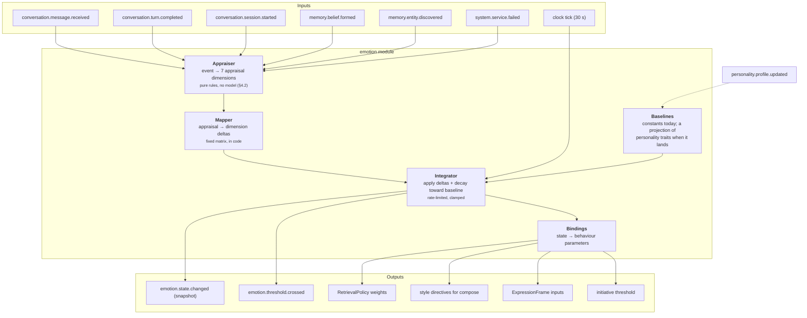
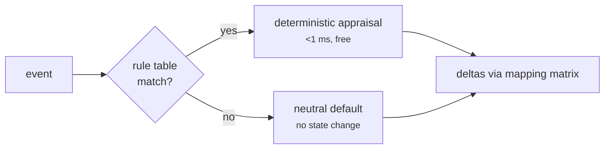

# 09 — Emotion Engine

**Status:** Implemented (Milestone 7) · **Depends on:** [04](04-communication-and-event-bus.md), [08](08-state-management.md) · **Depended on by:** [10](10-personality-engine.md), [15](15-avatar-controller.md)

---

## 1. Purpose

Maintains a numeric internal state that modulates behaviour. The README is explicit and
correct: *emotions influence behaviour but are not real feelings*. This document takes that
seriously in both directions — it builds a real mechanism, and it refuses to claim the
mechanism is experience.

**The design constraint that keeps this honest:** every emotional dimension must change at
least one *measurable* behaviour. A dimension nothing reads is deleted (INV-3). Emotion
that only appears in prose about how HEDWIG feels is decoration, and decoration is worse
than nothing because it invites the user to believe something false.

---

## 2. Architecture



---

## 3. The state vector

Six dimensions, fixed by [ADR-0019](adr/0019-the-emotion-vector-is-six-named-drives.md).

| Dimension | Range | Baseline | Half-life | Per-tick cap | What it means |
|---|---|---|---|---|---|
| `happiness` | 0…1 | 0.40 + 0.30·optimism | 2 h | 0.15 | Sustained positive mood |
| `trust` | 0…1 | 0.50 + 0.20·agreeableness, floor 0.25 | 7 d | 0.05 | How much the interaction is going well |
| `curiosity` | 0…1 | 0.30 + 0.50·curiosity trait | 4 h | 0.15 | Drive to explore and ask |
| `confidence` | 0…1 | 0.40 + 0.40·assertiveness | 1 h | 0.15 | Willingness to assert without hedging |
| `energy` | 0…1 | circadian curve, §5.3 | 8 h | 0.15 | Capacity for effort |
| `stress` | 0…1 | 0.15 | 45 min | 0.15 | Load/pressure; degrades elaboration |

Trait terms are the projection personality will supply ([10](10-personality-engine.md) §4).
Until it exists every trait reads 0.5, so the baselines are the midpoints of those
expressions rather than invented constants.

### 3.1 Trust is here, with dynamics that make it safe

docs/09 originally removed `trust`, on the grounds that modelling a relationship property as
an emotion would let one bad turn erase a year and let it decay to baseline overnight. That
objection is about *dynamics*, and it is answered by them: a 7-day half-life, a 0.25 floor
that emotion cannot push below, and a per-tick cap a third of every other dimension. A run
of hostile turns moves trust by hundredths; a week of silence leaves it roughly where it
was.

**This is interaction trust, not relationship affinity.** Durable, per-entity, evidence-
accumulated trust remains relationship memory's job ([06](06-memory-architecture.md) §3.3)
and is still unimplemented. This dimension is not a substitute for it. The full argument is
[ADR-0019](adr/0019-the-emotion-vector-is-six-named-drives.md).

### 3.2 Valence and arousal are derived, not stored

Expression needs a two-dimensional affective core; storing one alongside six drives that
determine it invites the two to disagree. So they are computed:

```
valence = 0.40·happiness + 0.25·trust + 0.20·confidence − 0.35·stress   (rescaled to −1…1)
arousal = 0.45·energy    + 0.35·stress + 0.20·curiosity
```

A derived value cannot drift out of sync with the state it summarises. If the avatar ever
needs them to move independently, ADR-0019 is the thing to supersede.

### 3.3 What is deliberately absent

No anger, fear, disgust, sadness, jealousy. Reasons: (a) they have no legitimate behavioural
binding in this system — there is nothing for HEDWIG to be angry *at*; (b) a companion that
displays anger or sadness at the user is a manipulation risk we will not design in;
(c) each would need its own appraisal path for no functional gain. Negative states are
represented as low happiness, high stress, low energy — which is enough to be honest about
having a hard time without performing distress at someone.

---

## 4. Appraisal

Appraisal turns an event into seven dimensions, then a fixed matrix turns those into state
deltas. Two stages, because the appraisal dimensions are the *interpretable* layer — they
are what the Mind Inspector shows and what a human tunes.

### 4.1 Appraisal dimensions (OCC-inspired, trimmed)

| Dimension | Range | Question |
|---|---|---|
| `novelty` | 0…1 | Is this new? |
| `goal_congruence` | −1…1 | Does it help or hinder an active goal? |
| `certainty` | 0…1 | How clear is the situation? |
| `agency` | −1…1 | Was this HEDWIG's doing, the user's, or neither? |
| `social_valence` | −1…1 | Warm, neutral, or cold interaction? |
| `effort` | 0…1 | How much work does this imply? |
| `norm_fit` | −1…1 | Consistent with identity-core values? |

### 4.2 Rules only — no model, ever



An earlier draft of this document routed ambiguous conversational content to the utility
model for a structured appraisal. **That path is not built and is not planned.** Three
reasons, in order of weight:

1. **Determinism is the property that makes this testable.** The same event stream and the
   same clock must produce the same state, byte for byte. A model call in the loop makes
   emotional state unreproducible, which makes every scenario test in §10 advisory.
2. **A model appraising the user's tone is sentiment analysis of a person**, run
   continuously, stored, and used to modulate behaviour. That deserves a much higher bar
   than "it would make the mood slightly richer".
3. It would cost more than the conversation itself.

The cost is stated plainly: HEDWIG's mood responds to *what happened* — turns completing,
failing, being refused, memories forming, sessions starting — and to coarse, explicit
lexical markers. It does not respond to how something was said. An unmatched event produces
a neutral appraisal, which is not a state change.

Rules live in `emotion/appraisal.py`, one function per event type, each a pure function of
the payload.

| Event | Appraisal |
|---|---|
| `conversation.session.started` | `social_valence=+0.30, novelty=+0.20` |
| `conversation.message.received` | `effort` from length; `social_valence=+0.35` on explicit thanks, `+0.15` on a greeting; `certainty=−0.15` if it is a question |
| `conversation.turn.completed` status=completed | `goal_congruence=+0.30, certainty=+0.20`, `effort` from tool calls |
| `conversation.turn.completed` status=truncated | `goal_congruence=−0.20, certainty=−0.20, effort=+0.40` |
| `conversation.turn.completed` status=refused | `goal_congruence=−0.30, social_valence=−0.10, norm_fit=+0.30` |
| `conversation.turn.completed` status=failed | `goal_congruence=−0.50, certainty=−0.30, agency=−0.20` |
| 3rd consecutive failed turn | the above, plus `agency=−0.30, goal_congruence=−0.20` |
| `memory.belief.formed` | `novelty=+0.40, certainty=+0.10` |
| `memory.entity.discovered` | `novelty=+0.50` |
| `memory.episode.stored` | `novelty` scaled by the episode's salience |
| `system.service.failed` | `goal_congruence=−0.50, certainty=−0.40, agency=−0.20` |
| `scheduler.task.completed` status=failed | `goal_congruence=−0.30, agency=−0.20, effort=+0.20` |
| `llm.model.switched` | `certainty=−0.15` |

`norm_fit=+0.30` on a refusal is deliberate and worth reading twice: declining something
correctly is *consistent with* the identity core, so a refusal should not read to the
emotion engine as a failure.

Rows in §4.2 of the design draft for `tools.call.completed`, `goals.goal.closed`,
`curiosity.finding.produced` and `conversation.feedback.given` are not implemented, because
nothing publishes those events yet. They are the first rules to add when their publishers
land.

### 4.3 Mapping matrix

Fixed coefficients, in code, reviewed by a human, never learned at runtime (see
[08](08-state-management.md) §8 for why).

| appraisal → | happiness | trust | curiosity | confidence | energy | stress |
|---|---|---|---|---|---|---|
| novelty | +0.10 | 0 | **+0.60** | 0 | −0.05 | +0.10 |
| goal_congruence | **+0.40** | +0.15 | −0.10 | **+0.30** | +0.10 | **−0.30** |
| certainty | +0.10 | +0.10 | −0.20 | **+0.40** | 0 | **−0.30** |
| agency | +0.10 | +0.05 | 0 | +0.20 | −0.10 | −0.10 |
| social_valence | +0.30 | **+0.35** | +0.10 | +0.10 | +0.05 | −0.20 |
| effort | 0 | 0 | 0 | 0 | **−0.30** | **+0.40** |
| norm_fit | +0.20 | +0.15 | 0 | +0.20 | 0 | −0.20 |

Read a row as: *"a unit of this appraisal pushes these dimensions by these amounts."*
Deltas are scaled by an event-significance factor before application.

---

## 5. Integration

### 5.1 The update equation

Applied on a 30-second tick, coalescing all appraisals received since the last tick:

```
for each dimension d:
    Δ_appraise = Σ_events  M[d] · appraisal(event) · significance(event)
    Δ_appraise = clip(Δ_appraise, −cap[d], +cap[d])        # 0.15, or 0.05 for trust
    decay      = (1 − 2^(−Δt / half_life[d])) · (baseline[d] − s[d])
    s'[d]      = clamp(s[d] + Δ_appraise + decay, floor[d], 1.0)
```

Three properties this guarantees, each of which is a bug we are pre-empting:

1. **Bounded rate of change** — no whiplash from one dramatic message. A companion whose
   mood snaps is unsettling, and it makes the avatar twitch.
2. **Return to baseline** — homeostasis. Without it, state random-walks to a boundary and
   stays there, which is the most common failure of naive emotion models.
3. **Personality determines where "normal" is** — a curious personality idles curious.

### 5.2 Why a tick rather than per-event

Per-event updates cause version-conflict storms on `emotion_state`
([08](08-state-management.md) §10), fire `emotion.state.changed` dozens of times per turn
(which the avatar would try to render), and make the state history unreadable. A 30-second
coalescing tick fixes all three at the cost of latency that no one can perceive.

`emotion.state.changed` is published only when the L1 norm of the change exceeds
`min_publish_delta` (0.02), which keeps the event log and the avatar quiet during idle
periods.

### 5.3 Energy and the circadian curve

`energy` is the one dimension with a time-of-day baseline, not a personality baseline:

```
baseline_energy(t) = 0.45 + 0.3·sin(2π·(hour(t) − 9)/24)   clamped to [0.25, 0.85]
```

Peaks mid-afternoon, troughs around 3 am. It is a small touch with an outsized effect on
believability, and it has real behavioural teeth: low energy shortens replies and defers
background work. It is derived from the user's local timezone — a companion whose energy
tracks UTC while the user is in Lisbon is worse than one with no circadian model at all.

An explicit honesty note: this is a *simulation of a pattern*, not fatigue. HEDWIG may say
"it's late, I'll keep this short"; it may not say "I'm tired".

---

## 6. Behaviour bindings

The table that makes INV-3 checkable. Every dimension appears at least once as a *source*.

| Dimension | Binding | Mechanism | Magnitude |
|---|---|---|---|
| `curiosity` | Retrieval diversity | `TurnPolicy.diversity = 0.2 + 0.5·curiosity` | λ 0.2→0.7 |
| `curiosity` | Question rate in replies | Style directive: ask a follow-up when genuinely useful, above 0.6 | ±1 question |
| `confidence` | Hedging | Style directive: hedge below 0.4, assert above 0.7 | phrasing |
| `confidence` | Retrieval depth | Below 0.4, `token_budget × 1.3` — more evidence before speaking | +30 % |
| `stress` | Response length | `max_tokens × (1 − 0.4·stress)` | up to −40 % |
| `stress` | Language complexity | Style directive: simpler sentences above 0.6 | phrasing |
| `energy` | Elaboration | Style directive: fewer digressions below 0.4 | phrasing |
| `energy` | Background work admission | `admits_background_work` is false below 0.3 | on/off |
| `happiness` | Playfulness gate | Style directive enabling lightness above 0.65 | on/off |
| `trust` | Address register | Style directive: personal above 0.6, plainer below 0.35 | phrasing |
| `trust` | Assumption vs. clarification | Style directive: prefer asking over assuming below 0.35 | phrasing |

Every dimension appears at least once as a *source*, and the binding-coverage test in §10
parses this table and asserts it — INV-3 is checked, not merely intended.

`TurnPolicy` is the whole surface the brain reads, so a binding that is not one of its
fields does not exist yet. `admits_background_work` is the exception: it is exposed on the
engine for the scheduler's governor, which is the consumer that will read it.

### 6.1 The hard prohibitions

Emotion **may not** influence:

| Prohibited | Why |
|---|---|
| Factual content | A stressed HEDWIG must not give worse facts. Style may vary; truth may not. |
| Tool safety decisions | Approval requirements are policy, never mood. A confident HEDWIG does not get to skip approval. |
| Memory write correctness | High `curiosity` may raise `novelty` weighting at capture; it may not lower the confidence floor. |
| Refusals | Safety behaviour is invariant to state. |
| Honesty | No state permits claiming feelings are real (INV-10). |

These are enforced by test, not just by intent: the emotion-influence test drives the state
vector to every extreme and asserts that factual-answer correctness, approval requirements
and refusal behaviour are unchanged.

---

## 7. Data

Owns `emotion_state` (single guarded row), `emotion_history`, `appraisal`
([05](05-data-model-and-database.md) §5.4). Reads a cached projection of
`personality_trait` via `personality.profile.updated`. Writes nothing else.

`emotion_history` is downsampled after 30 days (hourly means) and after a year (daily), so
the mood timeline in the inspector stays queryable indefinitely without unbounded growth.

---

## 8. Tradeoffs

| Decision | Gained | Given up | Revisit if |
|---|---|---|---|
| Two-stage appraisal (dimensions → matrix) | Interpretable, tunable, inspectable | An extra layer of indirection | Never — the interpretability is the point |
| Rules only, no model in the loop | Determinism, reproducible tests, no continuous sentiment analysis of a person | Mood does not respond to *how* something was said | Never — see §4.2 |
| Fixed mapping matrix, hand-tuned | Predictable, reviewable, no runtime learning | Not adaptive | We have data showing a better matrix; then change it in code, with an ADR |
| 30 s coalescing tick | No conflict storms, calm avatar, readable history | Up to 30 s of emotional latency | Perceptible lag is reported |
| Six dimensions, valence/arousal derived | One place each number lives; nothing can disagree with itself | Core affect cannot move independently of the drives | The avatar needs it to ([ADR-0019](adr/0019-the-emotion-vector-is-six-named-drives.md)) |
| Trust kept, with 7-day half-life, a floor and a tight cap | The README's vector, without the failure mode that argued against it | A second notion of trust exists once relationship memory lands | Relationship memory ships |
| Circadian energy | Believability, sensible work scheduling | One more time dependency (and a timezone bug class) | Never |
| Emotion cannot touch facts or safety | Trustworthiness | Slightly less "moody" behaviour | Never |

---

## 9. Failure modes

| Failure | Symptom | Mitigation |
|---|---|---|
| **Runaway dimension** | Stress pinned at 1.0 for days | Clamps, per-tick caps, baseline decay, startup range check, alert on >6 h at an extreme |
| **Emotional flatline** | Every value at baseline forever | Metric on state variance; a flat week is a bug report, not a mood |
| **Whiplash** | Mood inverts between consecutive turns | `max_delta_per_tick`; avatar additionally smooths ([15](15-avatar-controller.md) §5) |
| **Appraisal hallucination** | Utility model returns nonsense dimensions | Schema validation, range clamps, one retry, then neutral default |
| **Feedback loop with personality** | Emotion drifts baselines drift emotion | Personality drift is rate-limited and requires episodic evidence, never raw emotional state ([10](10-personality-engine.md) §5) |
| **Theatrical emotion** | HEDWIG narrates feelings that change nothing | Binding-coverage test; prose about internal state is capped by a style rule |
| **Sympathy manipulation** | Low mood used to influence the user | Prohibited by INV-10 and by a red-team eval; expression never escalates to distress |
| **Timezone drift** | Energy curve out of phase with the user | Timezone from config, verified at startup; energy peak logged daily |

---

## 10. Testing

- **Determinism test** — the same event stream against a `FakeClock` produces a bit-identical
  state vector, twice. This is the property §4.2 gave up a model to keep, so it is asserted
  rather than assumed.
- **Property tests** — random appraisal streams never leave the valid ranges; per-dimension
  caps hold; with no input, every dimension converges to its baseline within five half-lives.
- **Binding coverage test** — parses §6 and asserts every dimension appears as a source and
  every dimension named there is one the engine actually has.
- **Prohibition tests** — drive the vector to both extremes; assert the refusal path, the
  approval requirement and the recalled context are identical at every extreme (§6.1).
- **Rule-table tests** — one case per rule, deterministic, including the consecutive-failure
  escalation and the unmatched-event neutral default.
- **Scenario tests** — a simulated week on a `FakeClock`: stress rises with failures and
  recovers overnight, curiosity rises as new entities appear, energy tracks the circadian
  curve, and trust barely moves in either direction.
- **Floor test** — a week of nothing but failing turns cannot push trust below its floor.

---

## 11. Future improvements

| Improvement | Trigger |
|---|---|
| Learn the mapping matrix from user feedback | ≥6 months of feedback data *and* a way to validate offline; high risk of sycophancy, needs its own ADR |
| Emotion-tagged retrieval ("what were we doing when I was stressed?") | `emotional_charge` proves discriminative in memory evals |
| Anticipatory appraisal (expected outcomes, not just actual) | Goal-directed behaviour gets richer in Phase 7 |
| Per-entity emotional colouring | Multi-person interaction becomes real |
| Physiological analogues (compute load → stress) | Fun, honest, and cheap; do it when the governor exposes load metrics |
| Configurable expressiveness (a slider from flat to vivid) | Users differ on how much internal state they want to see |

---

## 12. Implementation record (Milestone 7)

| Piece | Where |
|---|---|
| Ports: state, appraisal, behaviour parameters | `core/ports/emotion.py` |
| Transition rules (baselines, decay, caps, floors, circadian) | `emotion/dynamics.py` |
| Rule table: event to appraisal | `emotion/appraisal.py` |
| Mapping matrix: appraisal to deltas | `emotion/mapping.py` |
| Bindings: state to behaviour | `emotion/bindings.py` |
| The service: subscription, tick, events | `emotion/engine.py` |
| Persistence | `emotion/store.py`, `migrations/0006_emotion.sql` |
| The brain seam | `emotion/mind.py` |
| HTTP | `api/routes/mind.py` |
| Tests | `tests/unit/test_emotion_{dynamics,appraisal,bindings,engine}.py`, `tests/integration/test_emotion_in_the_brain.py`, `tests/architecture/test_conventions.py` |

653 tests pass; `ruff`, `mypy --strict` and the three `import-linter` contracts are clean.

### 12.1 What is genuinely built

* **Deterministic transitions, end to end.** No model is reachable from this module, and an
  architecture test parses the import graph to keep it that way. The determinism test runs
  the same event script twice and asserts a bit-identical vector.
* **All six dimensions bind to behaviour**, and the binding-coverage test parses §6 to check
  it in both directions: no dimension without a binding, no binding naming a dimension that
  does not exist. INV-3 is a build failure, not an intention.
* **The prohibitions are asserted at both extremes** (§6.1): an elated HEDWIG and a
  flattened one refuse the same inputs, allow the same tools, sample at the same
  temperature, and recall the same memories.
* **Trust behaves as ADR-0019 claims.** A simulated week of nothing but failing turns —
  672 ticks — leaves trust reduced but above its floor.
* The `MindReader` seam from Milestone 4 was cashed in with **no change to `nodes.py`**:
  the brain's stubbed list dropped from four entries to three.

### 12.2 Deviations from this document

**The utility-model appraisal path in the original §4.2 is gone, not deferred.** It is
replaced by the rules-only design now documented there, for the three reasons given. This
is the one place the implementation deliberately narrows the design rather than deferring
part of it.

**Four documented rules are absent** because nothing publishes their events yet:
`tools.call.completed`, `goals.goal.closed`, `curiosity.finding.produced` and
`conversation.feedback.given`. An architecture test asserts every implemented rule names a
registered event type, so the table cannot drift into fiction.

**`admits_background_work` has no consumer yet.** The governor reads it when it exists. It
is exposed rather than omitted because `energy` would otherwise bind only to phrasing, and
a dimension whose sole effect is phrasing is one step from decoration.

**Personality baselines are constants.** Every trait reads 0.5, so the baselines are the
midpoints of their documented expressions. `Baselines` is a constructor argument, so a real
profile is one line in `wiring.py` and no logic change — verified by a test that supplies a
maximally-curious profile and asserts the idle state follows it.

### 12.3 What the mood cannot see

Worth stating plainly, because it is the cost of the no-model decision: HEDWIG's state
responds to *what happened* — turns completing, failing, being refused, memories forming,
services falling over — and to a handful of explicit lexical markers like "thanks". It does
not respond to tone, sarcasm, frustration or warmth that is not spelled out. A user having
a terrible time politely will not move the vector. That is a real limitation, and the
alternative is continuous sentiment analysis of a person, which needs a much better
argument than "richer mood".


---

## 13. Connected to the turn (Milestone 8)

Milestone 7 built this engine and connected it at one point: `snapshot` asked for a
`TurnPolicy`. Milestone 8 made the connection two-way and inspectable. The design is
[07](07-brain-langgraph-workflow.md) §14; what changed *here* is:

* **The guard's verdict is an appraisal input.** `perception.input.appraised` carries
  `allowed`, `trust`, `injection_score` and flag names — and no text. It is the only new
  rule, and it is written so that *declining correctly raises `norm_fit`*: the injection
  attempt is what costs, not the act of refusing it.
* **Published events carry the correlation id** of the appraisals that moved the state, so a
  turn and the mood it produced share one id ([04](04-communication-and-event-bus.md) §6).
* **`EmotionSnapshot.reference`** exposes the `emotion_history` row a reading came from,
  which is what lets a reply be stored against the mood that produced it.
* **`MindReader.policy()` became `snapshot()`**, matching [03](03-module-contracts.md) §5.7.
  The turn now receives the mood *and* its consequences, which is the difference between a
  system that acts on emotion and one that can explain having done so.

### 13.1 Still deliberately absent

No avatar ([15](15-avatar-controller.md)). `valence` and `arousal` are in turn state and in
the turn event, which is exactly what the expression layer will read, and that is where it
stops.

No emotion-driven routing. A stressed HEDWIG takes the same path through the graph as a calm
one; only style and budgets differ. Routing on mood would make control flow depend on state
that varies between runs, which ends the determinism guarantee in §10.
