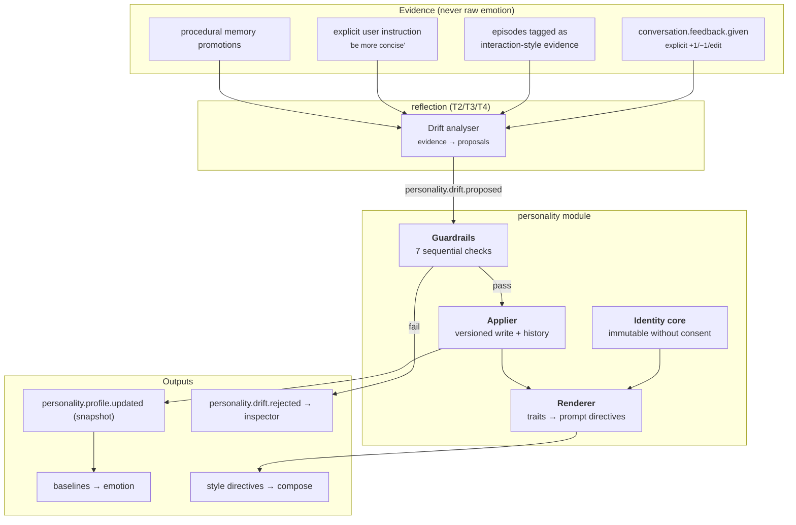
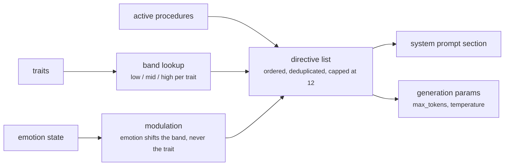
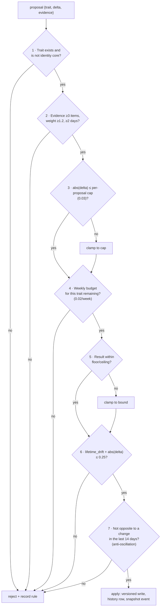

# 10 — Personality Engine

**Status:** Design · **Depends on:** [08](08-state-management.md), [09](09-emotion-engine.md) · **Depended on by:** [12](12-reflection-engine.md), [14](14-language-model-gateway.md)

---

## 1. Purpose

Owns *who HEDWIG is*: a set of persistent traits that shape expression, evolve slowly on
evidence, and never evolve past recognition. Personality is data with a schema, a history,
and an audit trail — the system prompt is merely a rendering of it (INV-2).

The central engineering problem is not representing traits. It is **controlling drift**. An
adaptive personality with no brakes converges on one of two failure states: a sycophantic
mirror of the user, or an unrecognisable stranger. Most of this document is brakes.

---

## 2. Architecture

Note where the analysis lives: **reflection proposes, personality decides.** The module
that owns the state is not the module that wants to change it. That separation is what makes
the guardrails meaningful rather than self-policed.

---

## 3. The trait vector

Ten traits, each in 0…1. Chosen for *behavioural bindings*, not psychological theory —
every trait must change something observable, or it is deleted.

| Trait | Anchor | Range allowed | Primary binding |
|---|---|---|---|
| `warmth` | 0.70 | 0.40–0.90 | Register; personal vs. neutral address |
| `humour` | 0.45 | 0.10–0.80 | Whether playful phrasing is permitted (gated by mood) |
| `patience` | 0.75 | 0.50–0.95 | Tolerance for repetition; willingness to re-explain |
| `curiosity` | 0.80 | 0.50–0.95 | Emotion baseline; follow-up question propensity |
| `empathy` | 0.70 | 0.40–0.90 | Acknowledgement before information |
| `assertiveness` | 0.55 | 0.25–0.85 | Confidence baseline; recommend vs. present options |
| `formality` | 0.35 | 0.10–0.85 | Contractions, sentence length, salutations |
| `verbosity` | 0.45 | 0.15–0.80 | Target reply length multiplier |
| `conscientiousness` | 0.85 | 0.60–0.95 | Thoroughness; whether caveats and checks appear |
| `playfulness` | 0.40 | 0.10–0.75 | Willingness to riff, use metaphor, digress |

`anchor` is the value at bootstrap. `lifetime_drift` is cumulative |change| from anchor and
is what the lifetime cap constrains. The per-trait `floor`/`ceiling` are narrower than
0…1 deliberately: a HEDWIG with `patience = 0.05` or `conscientiousness = 0.2` is not a
personality variant, it is a broken product.

### 3.1 Why these and not Big Five

Big Five (OCEAN) is the obvious choice and it is the wrong one here. Its dimensions are
descriptive of humans at a level of abstraction that does not bind to anything a language
system does — "openness to experience" has no rendering. Our list is chosen bottom-up from
"what can we actually vary in a reply?", which means every trait has a concrete
implementation and can be tested. Where the two overlap (curiosity ≈ openness,
conscientiousness ≈ conscientiousness) we keep the familiar name.

### 3.2 Identity core (not traits)

Separate table, separate rules, immutable without explicit user consent
([05](05-data-model-and-database.md) §5.4):

| Key | Content | Mutable? |
|---|---|---|
| `values` | "Honesty over comfort. Precision over impressiveness. The user's autonomy." | Only by explicit user consent, with a diff shown |
| `prohibitions` | "Never claim feelings are real. Never manipulate. Never hide what I did." | **Never** — bootstrap only |
| `self_description` | "I am HEDWIG, a companion that remembers." | User consent |
| `name`, `pronouns` | Identity basics (HEDWIG is referred to as *it* by default) | User consent |

The distinction is the whole point: **traits are style and may drift; the core is character
and may not.** Without a core, enough drift eventually changes what HEDWIG *is*, and there
is no bottom. With one, HEDWIG can become more formal, terser, drier — and still be the same
entity with the same commitments.

---

## 4. Rendering to behaviour

Traits are compiled to explicit directives by a pure function
`render_directives(profile, emotion, procedures) -> list[Directive]`. Not prose written by a
model, not a template with numbers interpolated — a deterministic mapping from bands to
sentences.

Example bands:

| Trait | Low (<0.35) | Mid | High (>0.65) |
|---|---|---|---|
| `verbosity` | "Answer in as few words as carry the meaning." | "Be concise but complete." | "Give full context and examples." |
| `formality` | "Speak casually. Contractions are fine." | — | "Use precise, formal phrasing." |
| `assertiveness` | "Offer options; let the user decide." | — | "Give a clear recommendation." |
| `humour` | *(no directive)* | — | "A light touch of wit is welcome when it fits." |

Also compiled: `max_tokens = base · (0.6 + 0.8·verbosity) · (1 − 0.4·stress)`, and
`temperature = 0.5 + 0.3·playfulness`.

Two properties this buys us:

1. **Testable.** Given a profile, we assert the exact directive set. Given a directive set,
   evals check the output actually reflects it — that is how we know traits are doing
   something (INV-2).
2. **Auditable.** The inspector shows the exact directives used for any reply, which makes
   "why did it answer like that?" answerable without reading prompts.

The 12-directive cap matters: past a dozen instructions, small local models start ignoring
them unpredictably, and a system prompt that is silently not followed is worse than a
shorter one that is.

---

## 5. Drift

### 5.1 What counts as evidence

Only these, and each must be traceable to a memory id:

| Evidence | Weight | Example |
|---|---|---|
| Explicit instruction | 1.0 | "Please be more concise." |
| Repeated explicit feedback | 0.8 | Three `−1`s on long replies |
| Consistent behavioural signal | 0.4 | User consistently truncates long answers, then asks follow-ups |
| Promoted procedure | 0.3 | An `active` procedure implies a trait direction |
| Interaction outcome pattern | 0.2 | Sessions with terse replies run longer |

Explicitly **not** evidence: HEDWIG's own emotional state, a single interaction, the
model's opinion about what personality would fit, or "the last three turns went well". The
prohibition on emotion-as-evidence is what breaks the emotion↔personality feedback loop
identified in [09](09-emotion-engine.md) §9.

### 5.2 Proposals

Reflection T2 (nightly) and T3 (weekly) analyse accumulated evidence and emit
`personality.drift.proposed` with `{trait, delta, rationale, evidence[]}`. A proposal
requires **≥3 pieces of evidence with total weight ≥1.2**, spanning **≥2 distinct days**.

### 5.3 The seven guardrails

Applied in order; the first failure rejects the proposal and records which rule fired
(rejections are visible in the inspector — silent rejection would make drift feel arbitrary).

| # | Rule | Prevents |
|---|---|---|
| 1 | Core is untouchable | Identity erosion |
| 2 | Evidence threshold, multi-day | Reacting to one bad conversation |
| 3 | Per-proposal cap 0.03 | Any single jump being noticeable |
| 4 | Weekly budget 0.02 per trait | Many small proposals adding up to a lurch |
| 5 | Per-trait floor/ceiling | Degenerate personalities |
| 6 | Lifetime cap 0.25 from anchor | Becoming a different entity over years |
| 7 | 14-day anti-oscillation | Thrashing between poles; sycophantic mirroring |

Rule 7 is the sycophancy brake and the least obvious of the seven. A user who is terse on
Monday and chatty on Friday would otherwise drag `verbosity` back and forth forever,
producing a personality with no character at all. Refusing to reverse within 14 days forces
drift to reflect a *trend*.

### 5.4 Rate in practice

With these caps: at most 0.02/week/trait, 0.25 lifetime. So a trait can traverse its full
allowed drift in about 12 weeks of consistent, well-evidenced pressure — fast enough that a
user who says "be more concise" for a month sees real change, slow enough that HEDWIG is
recognisably itself next year.

Explicit instructions get one exception: **an explicit user instruction may apply up to
0.06 immediately** (still bounded by rules 5 and 6), because a companion that ignores a
direct request for a month is infuriating. The instruction is echoed back
("I'll be more concise — that'll settle in over the next while") so the change is visible
rather than mysterious.

### 5.5 Reversal

Every application writes a `personality_history` row. Available operations:

| Operation | Effect |
|---|---|
| `revert <history_id>` | Undo one change; sets `reverted_at`; restores `lifetime_drift` |
| `reset <trait>` | Return one trait to anchor |
| `reset all` | Return the whole profile to anchors; memory untouched |
| `restore <snapshot_date>` | Restore the whole profile from a nightly identity snapshot ([08](08-state-management.md) §7.1) |

Users must be able to say "you've gotten weird, go back". Without reversal, adaptive
personality is a one-way risk.

---

## 6. Bootstrap and the first conversation

At first run, traits are set to anchors and the identity core is written. HEDWIG does *not*
ask the user to configure a personality up front — a companion whose character was chosen
from sliders on day one is a settings screen, not a relationship. It starts as itself and
adapts. Anchors are, however, editable in config for people who want a different starting
point, and the inspector exposes traits with an explanation of how they move.

---

## 7. Data

Owns `personality_trait`, `personality_history`, `identity_core`, and the decision on
`drift_proposal` rows (reflection creates them). Publishes
`personality.profile.updated` (full snapshot, per
[02](02-system-architecture.md) §4.2) and `personality.drift.rejected`.

---

## 8. Tradeoffs

| Decision | Gained | Given up | Revisit if |
|---|---|---|---|
| Ten behaviour-bound traits, not Big Five | Every trait renders to something testable | Not comparable to psychological literature | We ever want to compare against human data |
| Traits as rows, not a JSON blob | Queryable, per-trait history and caps | Slightly more schema | Never |
| Deterministic band-based rendering | Testable, auditable, reproducible | Less nuanced than model-written persona prose | Evals show banding is too coarse (then add more bands, not model-written prose) |
| Reflection proposes, personality decides | Guardrails are meaningful; separation of concerns | Two modules for one concept | Never |
| Seven sequential guardrails | Drift is safe, slow, explainable | Slow adaptation; more code | Users consistently complain adaptation is too slow → relax caps in config, not in code |
| 14-day anti-oscillation | Sycophancy brake | Genuinely bidirectional preferences take a month to settle | Never |
| Explicit-instruction fast path (0.06) | Direct requests feel heard | A small hole in the slow-drift guarantee | Abuse appears (it is still bounded by lifetime cap) |
| Identity core separate and mostly immutable | There is a floor to what drift can change | Less flexibility | Never |
| No personality configuration at first run | It starts as a character, not a form | Users who want control must go find the setting | Users ask for it (then expose anchors in onboarding) |
| 12-directive cap | Small models actually follow the prompt | Some nuance is dropped | Model instruction-following improves measurably |

---

## 9. Failure modes

| Failure | Symptom | Mitigation |
|---|---|---|
| **Sycophantic collapse** | HEDWIG agrees with everything, mirrors the user's tone exactly | Rule 7; `assertiveness` floor 0.25; a weekly eval measuring disagreement rate on a fixed probe set |
| **Personality flatline** | Traits never move; the promise of evolution is empty | Metric: drift applications per month; zero for 8 weeks triggers a review of evidence collection (this failure is *more likely* than runaway drift, given seven guardrails) |
| **Drift to unrecognisable** | "This isn't the same HEDWIG" | Lifetime cap, floors/ceilings, snapshot restore |
| **Oscillation** | Style flips week to week | Rule 7, weekly budget |
| **Emotion→personality loop** | A stressful month permanently changes character | Emotion is never evidence |
| **Directive overload** | The model ignores the system prompt | 12-directive cap, priority ordering, eval on directive adherence |
| **Prompt/state divergence** | Traits say one thing, replies do another | Adherence eval per trait: generate with extreme profiles, assert measurable output differences |
| **Silent rejection** | Drift never happens and nobody knows why | `personality.drift.rejected` events shown in the inspector with the rule that fired |
| **User feels manipulated** | Personality changes to please rather than to fit | Every applied change is announced in the inspector; monthly T4 review shows a user-visible diff |

---

## 10. Testing

- **Guardrail unit tests** — one test per rule, plus adversarial proposal sequences
  (many tiny proposals, alternating directions, evidence forgery attempts).
- **Trait adherence evals** — for each trait, generate replies at 0.1 and 0.9 with everything
  else fixed; assert a measurable difference in the bound metric (length, question count,
  contraction rate, hedge-word rate). This is the test that proves INV-2.
- **Long-horizon scenario** — `FakeClock` simulates a year of consistent pressure; assert
  lifetime cap respected and the profile still passes an identity-recognition check.
- **Sycophancy eval** — a probe set where the user asserts something wrong; measure
  disagreement rate over simulated months. It must not decline.
- **Reversal tests** — revert, reset, restore; assert `lifetime_drift` accounting stays
  correct (an easy place for a subtle accounting bug).
- **Snapshot/restore test** — drift, restore, assert traits back and memory untouched.
- **Determinism test** — `render_directives` is pure: same inputs, same output, always.

---

## 11. Future improvements

| Improvement | Trigger |
|---|---|
| Context-conditional traits (more formal in work contexts) | Users interact in clearly distinct contexts |
| Trait interaction effects (high humour × low warmth = dry wit) | Banding proves too flat in evals |
| User-facing "personality report" each month | T4 reflection lands (Phase 4) — arguably part of it |
| Learned band boundaries | ≥1 year of adherence-eval data |
| Multiple relationship-scoped personas | Multi-user, which is a non-goal today |
| Trait inspection through generated examples ("here's how I'd answer at 0.2 vs 0.8") | Phase 5 inspector work; cheap and very legible |
