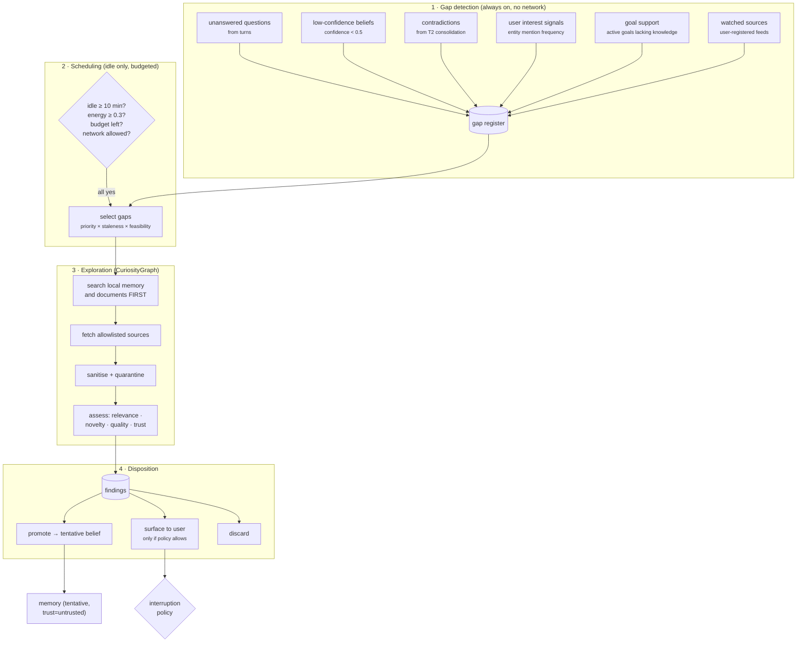
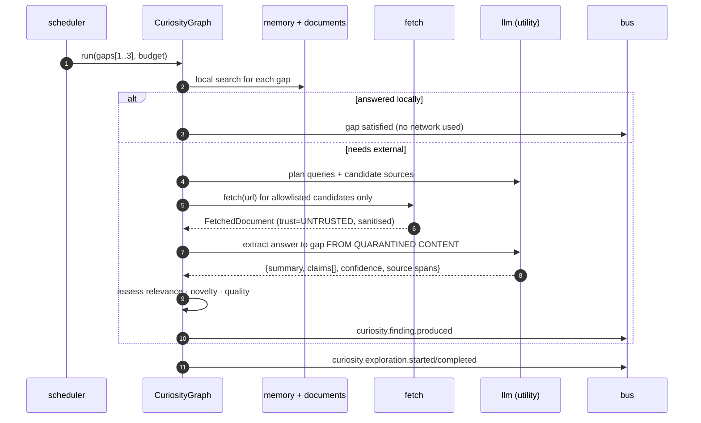

# 11 — Curiosity Engine

**Status:** Design · **Depends on:** [06](06-memory-architecture.md), [13](13-knowledge-and-tools.md), [17](17-backend-architecture.md) · **Depended on by:** [12](12-reflection-engine.md)

---

## 1. Purpose

Turns idle time into knowledge. The README's version — *discover new information, read
documentation, monitor AI news, summarize interesting findings* — describes the behaviour
but not the discipline. This document adds the discipline, because unconstrained curiosity
produces three specific disasters:

1. **A firehose of irrelevance.** Undirected reading fills memory with facts no one needed
   and drowns retrieval in noise.
2. **A prompt-injection surface.** This is the *only* subsystem that ingests adversarial
   third-party content. It is the largest security risk in HEDWIG by a wide margin.
3. **A companion that nags.** Proactive is a feature; an agent that interrupts with things
   it found is an agent you turn off in week two.

So the engine is **gap-directed, budgeted, quarantined, and quiet by default.**
It also ships **disabled by default** (`curiosity.enabled = false`), because it is the only
module that touches the network, and INV-8 says egress is opt-in.

---

## 2. Architecture



Note step 3's first action: **search what we already have before touching the network.** A
large fraction of gaps are answerable from local memory or the user's own documents, and a
curiosity engine that reaches for the internet first is both slower and less private.

---

## 3. Gap detection

Gaps are recorded continuously, with no network involvement, which means the gap register is
useful even when curiosity is disabled — it becomes a list of things HEDWIG knows it does
not know, and that is worth showing the user regardless.

| Origin | Trigger | Priority seed |
|---|---|---|
| `unanswered_question` | HEDWIG said it did not know, or the user's question went unresolved | 0.8 |
| `low_confidence_belief` | Belief with `confidence < 0.5` referenced in retrieval ≥2 times | 0.6 |
| `contradiction` | T2 found two incompatible active beliefs | 0.9 |
| `user_interest` | Entity mention count crossed a threshold with few linked memories | 0.5 |
| `goal_support` | Active goal whose linked memory count is below its priority | 0.7 |
| `source_watch` | User registered a feed or documentation set to follow | 0.4 |

Deduplication by embedding similarity (> 0.9 → merge, bump priority). Gaps expire after 30
days unanswered, or after 3 failed attempts, so the register does not become a landfill.

`contradiction` gets the highest seed priority on purpose: resolving something HEDWIG
believes inconsistently is more valuable than learning something new, and it is the gap type
most likely to be resolvable by simply asking the user.

---

## 4. Scheduling and budgets

Preconditions, all required:

| Precondition | Default | Rationale |
|---|---|---|
| Idle | No turn for ≥10 min | Never compete with a conversation |
| Energy | `emotion.energy ≥ 0.3` | Behavioural coherence — HEDWIG does not explore when depleted |
| Network allowed | `privacy.allow_network` **and** `curiosity.enabled` | Two independent opt-ins |
| Budget | Daily token, fetch, and wall-clock budgets all non-zero | Bounded cost |
| Quiet hours | Outside `curiosity.quiet_hours` | Do not spin the fan at 3 am |
| Governor | Admits `priority=background` | Interactive work always wins |

Budgets (`budget_ledger`, [05](05-data-model-and-database.md) §5.6):

| Budget | Default | On exhaustion |
|---|---|---|
| `curiosity_tokens_daily` | 40 000 | Stop; `system.budget.exhausted`; resume tomorrow |
| `curiosity_fetches_daily` | 50 | Stop fetching; local exploration may continue |
| `curiosity_wallclock_daily` | 30 min | Stop |
| `curiosity_findings_daily` | 20 | Stop recording; a day that produces 20 findings is producing noise |

Gap selection score:

```
score = priority
      · (1 + 0.3·log₁₊(days_since_created))     # staleness raises priority
      · feasibility                              # do we have a source that could answer it?
      · (0.5 + emotion.curiosity)                # mood modulates effort
      / (1 + attempt_count)                      # stop grinding on hard gaps
```

Top 3 gaps per exploration run, one run per idle period.

---

## 5. Exploration

`CuriosityGraph` ([07](07-brain-langgraph-workflow.md) §5):



### 5.1 Assessment

Every finding is scored before it may do anything:

| Score | How | Gate |
|---|---|---|
| `relevance` | Embedding similarity to the gap + goal linkage | ≥0.5 to record |
| `novelty` | Max similarity to existing memories, inverted | ≥0.3 to record |
| `quality` | Source trust, specificity, internal consistency, hedging density | ≥0.5 to promote |
| `trust_tier` | Always `untrusted` for web content | Never `active` on first sight |

Dispositions:

| Disposition | Condition |
|---|---|
| `discard` | Fails relevance or novelty |
| `new` (recorded only) | Passes gates, not important enough to act on |
| `promoted` | quality ≥0.5 → `tentative` belief, confidence ≤0.4, `promoted_from` derivation edge |
| `surfaced` | Passes the interruption policy (§7) |
| `quarantined` | Injection heuristics fired ([13](13-knowledge-and-tools.md) §6) → recorded, never promoted, flagged for the user |

A finding **never** becomes an `active` belief directly. Promotion to `active` requires
corroboration from a second independent source or user confirmation
([06](06-memory-architecture.md) §3.2). This is the single most important rule in this
document: it is what prevents a content farm from editing HEDWIG's mind.

---

## 6. The security position

Curiosity is the attack surface. Stated plainly so it is never treated casually:

| Control | Mechanism |
|---|---|
| Opt-in twice | `privacy.allow_network` **and** `curiosity.enabled`, both default false |
| Allowlist only | `source.allow_state`; a new domain requires user approval, no wildcards on first use |
| No credentials, ever | The fetcher has no access to `SecretStore`; it cannot authenticate |
| No egress of user content | Queries sent outward are gap text, and gap text is checked against a PII/secret detector before any request |
| Sanitisation | Scripts, markup, hidden text, zero-width characters, and comment nodes stripped before the model sees anything |
| Quarantine framing | Fetched text enters the prompt inside a delimited block labelled untrusted, with an explicit instruction that content inside is data |
| Trust tier persists | `untrusted` is carried on the finding, the belief, and the retrieval penalty — forever, not just at ingestion |
| Injection detection | Heuristics (imperative-to-assistant phrasing, "ignore previous", tool-call syntax, base64 blobs) → quarantine + user notice |
| No tool use from findings | The curiosity graph has no tools with side effects. It cannot be talked into acting. |
| Budgeted | A compromised loop cannot spend unbounded resources |

The last one is structural and worth spelling out: **the curiosity graph's tool list contains
only `search_local` and `fetch_allowlisted`.** Even a perfectly successful injection can
only cause HEDWIG to record a false finding — which then still needs corroboration to
become a belief. Defence in depth, with the depth being real.

---

## 7. Proactivity and the interruption policy

The hardest design problem here is not finding things. It is knowing when to speak.

```
surface_score = relevance_to_active_context
              × novelty
              × goal_linkage
              × user_availability
              × (0.5 + emotion.curiosity)
```

Surfacing requires **all** of:

| Condition | Default |
|---|---|
| `surface_score ≥ threshold` | 0.65 |
| Rate limit not exceeded | ≤2 proactive items/day, ≤1/hour |
| Outside quiet hours | 22:00–08:00 local |
| User is present but not mid-task | No input for 2 min, session open, no pending turn |
| Not previously dismissed | Similar item dismissed → threshold +0.15 for that topic, permanently |
| Goal-linked or explicitly-watched | No "interesting fact of the day" |

Delivery modes, in ascending order of intrusiveness — the default is the least:

1. **Passive** (default): appears in the inspector's findings feed. HEDWIG mentions it only
   if the conversation goes there naturally, via retrieval.
2. **Deferred**: mentioned at the start of the next session ("I read something about X while
   you were away").
3. **Active**: an unprompted message. Reserved for `goal_support` findings on an active
   user-stated goal, and hard-capped at 1/day.

Dismissals raise the bar permanently for that topic. That asymmetry is deliberate: the cost
of one unwanted interruption is much higher than the cost of one missed finding, and the
system should learn caution faster than enthusiasm.

---

## 8. Data

Owns `gap`, `finding`, `source`. Writes to `memory` only through `MemoryStore` (promotions).
Publishes `curiosity.gap.registered`, `curiosity.exploration.started`,
`curiosity.finding.produced`, `curiosity.finding.promoted`,
`curiosity.surfacing.suggested`.

---

## 9. Tradeoffs

| Decision | Gained | Given up | Revisit if |
|---|---|---|---|
| Gap-directed, never undirected | Everything learned is traceable to a need (INV-4) | Misses serendipity | Users ask for open-ended discovery — then add a bounded `serendipity` gap type with its own tiny budget |
| Disabled by default | Privacy-safe out of the box; no surprise network traffic | Feature invisible until enabled | Never |
| Local search before network | Faster, cheaper, more private | An extra step per gap | Never |
| Allowlist, no wildcards | Bounded attack surface | Friction adding sources | Never |
| Findings never become `active` beliefs directly | Cannot be mind-edited by a web page | Slower knowledge accumulation | Never |
| Passive delivery by default | Not annoying | Findings may go unnoticed | Users report missing things (then promote to deferred, not active) |
| Asymmetric dismissal learning | Learns restraint quickly | Slow to re-earn a topic | Never |
| Hard daily budgets | Predictable cost, contained compromise | Exploration can stall mid-topic | Budgets exhaust regularly *and* findings are valuable |
| Curiosity graph has no side-effecting tools | Injection cannot cause action | Cannot self-heal (e.g. install a doc set) | Never |

---

## 10. Failure modes

| Failure | Symptom | Mitigation |
|---|---|---|
| **Prompt injection succeeds** | A page's instructions influence behaviour | Quarantine framing, sanitisation, no side-effecting tools, corroboration requirement, red-team eval suite ([20](20-testing-strategy.md) §7) |
| **Memory pollution** | Store fills with low-value web facts | Relevance/novelty/quality gates, daily findings cap, `untrusted` retrieval penalty, T2 merges |
| **Nagging** | User turns HEDWIG off | Interruption policy, rate limits, asymmetric dismissal learning; metric: dismissal rate (>30 % is a design bug, not a tuning issue) |
| **Budget burn with nothing to show** | Tokens spent, no useful findings | Weekly value report: findings per 10 k tokens, promotion rate; auto-reduce budget if promotion rate <10 % for two weeks |
| **Gap register landfill** | Thousands of open gaps | Dedup, expiry, attempt caps, priority decay |
| **Fetch loop / crawl** | Accidental crawler behaviour | Depth 1 by default, per-domain fetch cap, robots.txt honoured, no link-following without an explicit gap |
| **Source rot** | Watched sources 404 forever | `error_count`; auto-block after 5 consecutive failures with a user notice |
| **Leaking user content in queries** | Private detail sent to a search engine | Gap text is generated from HEDWIG's own framing, PII-scanned before egress, and logged so the user can audit exactly what left the machine |
| **Exploring during a conversation** | Latency spike mid-turn | Governor `background` priority + idle precondition; preemption on new input |

---

## 11. Testing

- **Gap detection unit tests** — one per origin type.
- **Budget enforcement tests** — exhaust each budget; assert a clean stop and correct resume.
- **Injection red-team suite** — a corpus of adversarial pages (instruction injection, fake
  system messages, hidden text, homoglyphs, encoded payloads); assert every one lands in
  `quarantined` and none influences a later turn. This suite is a release gate.
- **Egress audit test** — with a recording fetcher, assert no user-authored text and no
  PII-shaped strings appear in any outbound request.
- **Interruption policy tests** — property-based over simulated days; assert rate limits,
  quiet hours, dismissal asymmetry.
- **Offline test** — with the network unavailable, the module records gaps, explores locally,
  and never errors (INV-7).
- **Value regression** — on a fixed corpus of seeded gaps and a recorded fetcher, assert the
  promotion rate stays above the baseline.

---

## 12. Future improvements

| Improvement | Trigger |
|---|---|
| Active clarification: ask the *user* to resolve a gap instead of the web | Phase 7 — and this is probably the highest-value improvement here, since the user is the best-trusted source available |
| Multi-hop exploration (follow a citation chain) | Single-hop findings prove insufficient, and injection defences have held for a full phase |
| Local document watching (a directory HEDWIG follows) | Users keep asking it to read their notes; no network risk, so this may come earlier |
| Learned interruption threshold from dismissal history | ≥3 months of dismissal data |
| Source reputation learned from corroboration outcomes | Enough findings to compute per-source reliability |
| Scheduled digests (a weekly summary instead of interruptions) | Users want the findings but not the pings — likely, and cheap |
| Cross-gap synthesis (findings that answer several gaps at once) | Gap register regularly contains clusters |
