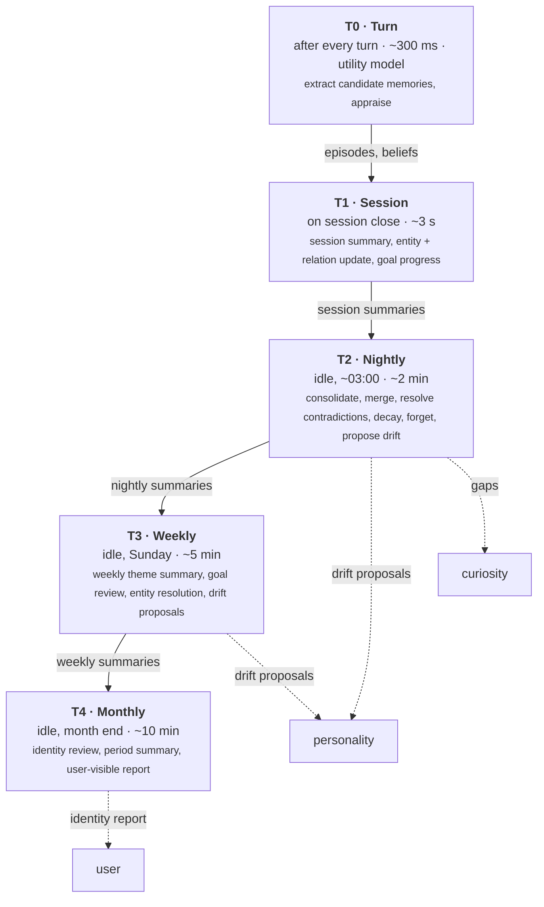
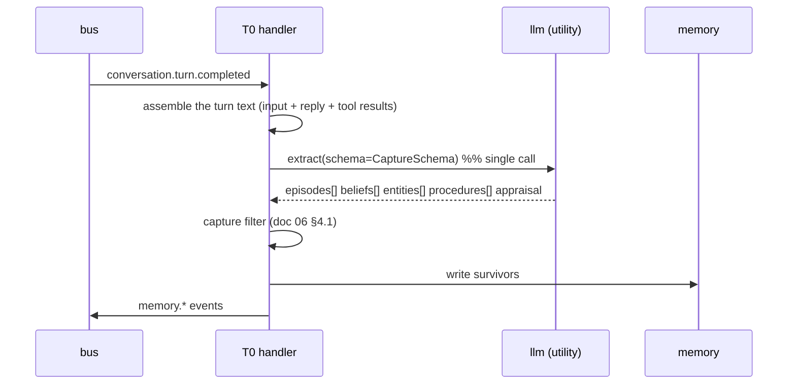
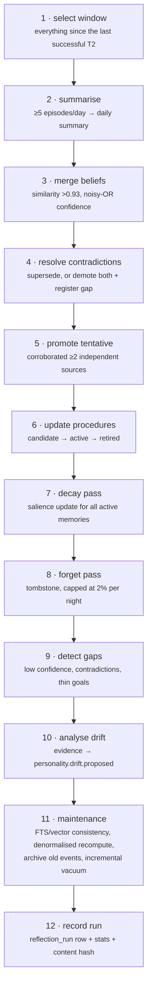
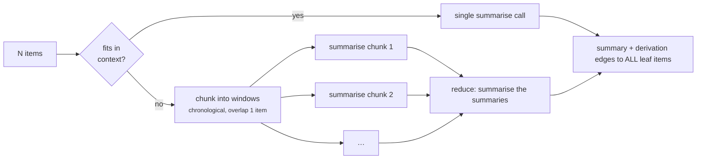

# 12 — Reflection Engine

**Status:** Design · **Depends on:** [06](06-memory-architecture.md), [08](08-state-management.md), [10](10-personality-engine.md) · **Depended on by:** [17](17-backend-architecture.md)

---

## 1. Purpose

Reflection is where raw experience becomes knowledge, where memory is pruned, and where
personality change is proposed. It is the process that makes HEDWIG's memory *organised*
rather than merely *large* — and organisation, not capacity, is what makes recall work.

If retrieval is the highest-leverage read path, reflection is the highest-leverage write
path. It is also the least visible subsystem, which is why it gets the most instrumentation.

---

## 2. Five tiers

One reflection process at five timescales. The tiering exists because the useful unit of
consolidation differs by horizon: a turn yields facts, a week yields themes, a month yields
identity.



| Tier | Trigger | Runs in | Interruptible | Idempotency key |
|---|---|---|---|---|
| T0 | `conversation.turn.completed` | Event handler | No (it is short) | `turn_id` |
| T1 | `conversation.session.ended` | Job | Yes, resumable | `session_id` |
| T2 | Scheduler, idle after 02:00 | Job (ReflectionGraph) | Yes, cursor-based | `date + input content hash` |
| T3 | Scheduler, idle Sunday | Job | Yes | `iso_week + hash` |
| T4 | Scheduler, idle on the 1st | Job | Yes | `month + hash` |

---

## 3. T0 — Turn reflection

The only tier on the interactive path's heels, so it is strictly bounded: **one utility-model
call, one schema, no retrieval, no writes to mind state.**



`CaptureSchema` (structured output, validated):

```json
{
  "worth_remembering": true,
  "episodes":   [{"title": "...", "content": "...", "importance": 0.7,
                  "emotional_charge": 0.2, "entities": ["..."]}],
  "beliefs":    [{"statement": "...", "confidence": 0.6, "subject": "user",
                  "predicate": "prefers", "object": "concise answers"}],
  "entities":   [{"name": "...", "kind": "project"}],
  "procedures": [{"trigger": "...", "action": "...", "evidence": "..."}],
  "appraisal":  {"novelty": 0.4, "goal_congruence": 0.6, "certainty": 0.8,
                 "agency": 0.0, "social_valence": 0.3, "effort": 0.2, "norm_fit": 0.9}
}
```

One call producing both capture and appraisal is deliberate: they need the same input, and
two calls would double the cost of the most frequent cognitive operation in the system.

`worth_remembering: false` short-circuits everything — the common case for "thanks" and
"ok".

---

## 4. T1 — Session reflection

On session close (explicit, timeout, or recovered-orphan):

| Step | Output |
|---|---|
| Assemble session transcript + T0 episodes | — |
| Summarise (map-reduce if > context window) | One `session_summary` episode, `summarised_from` edges to member episodes |
| Update entities | `mention_count`, aliases, new entities |
| Update relations | `familiarity`, `affinity`, `trust` per [06](06-memory-architecture.md) §3.3 |
| Assess goals | `goals.goal.progressed` / `closed` events |
| Compute session mood arc | Stored in the summary's metadata for later theme analysis |
| Link summary to session | `session.summary_id` |

Relationship updates happen here, not per turn, so that relationships move with the shape of
a conversation rather than with its last sentence.

---

## 5. T2 — Nightly consolidation

The heaviest tier and the one that keeps the store healthy. Runs as `ReflectionGraph`
([07](07-brain-langgraph-workflow.md) §5), cursor-resumable at every stage.



Ordering is not arbitrary and should not be rearranged casually:

- Summarise **before** decay, so summaries exist before their sources start fading.
- Merge **before** contradiction resolution, so near-duplicates do not look like conflicts.
- Promote **before** forgetting, so a memory that is about to become important is not
  dropped the night before.
- Forget **after** gap detection, so a forgotten memory can still have registered the gap it
  implied.

### 5.1 Resource discipline

T2 is the main threat to the "background never starves conversation" rule
([17](17-backend-architecture.md) §7):

| Control | Value |
|---|---|
| Governor priority | `background`, preemptible at any stage boundary |
| Model lock | Yields immediately when interactive work arrives |
| Token budget | 60 000/night; stages beyond the budget defer to the next night |
| Wall-clock budget | 15 min; the cursor persists |
| Batch size | 20 items per model call, so preemption granularity stays fine |

If a user starts typing at 03:07, T2 stops at the current batch boundary within a second or
two and resumes the following night from its cursor. That is the whole reason for
cursor-per-stage rather than run-to-completion.

### 5.2 Idempotency

Every run records `content_hash` over its input set. A re-run with the same inputs is a
no-op. Each stage is separately idempotent:

| Stage | Idempotency mechanism |
|---|---|
| Summarise | One summary per (period, kind); existing → skip |
| Merge | Merging already-merged beliefs is a no-op (loser is tombstoned) |
| Promote | Already-active → skip |
| Decay | Keyed on `last_decay_at`; applying twice in one day is prevented by the timestamp, not by luck |
| Forget | Already-tombstoned → skip |
| Drift proposals | Deduplicated by (trait, evidence set hash) |

Decay is the one that would silently corrupt state if it double-applied — hence an explicit
`last_decay_at` rather than "the job runs once a night, so it's fine".

---

## 6. T3 — Weekly review

| Step | Output |
|---|---|
| Theme extraction over the week's daily summaries | `period_summary` episode with themes |
| Goal review | Stale `active` goals → `blocked`; `proposed` goals expired; priorities rebalanced |
| Entity resolution | Merge duplicate entities (`merged_into`, non-destructive) |
| Relationship trajectory | Longer-horizon `affinity`/`trust` adjustment |
| Drift analysis | Higher-confidence proposals from a week of evidence |
| Curiosity value report | Findings per token, promotion rate; may auto-reduce budgets |
| Retrieval health report | recall proxies, `dropped_count` trends, index consistency |

Entity resolution sits at T3 rather than T2 because it needs enough mentions to be
confident, and a wrong merge is expensive to unpick.

---

## 7. T4 — Monthly identity review

The tier that makes growth legible to the user, and the only reflection tier with
user-visible output by default.

| Step | Output |
|---|---|
| Monthly `period_summary` | "What this month was about" |
| Trait diff | Every applied change with its evidence |
| Relationship diff | Familiarity/affinity/trust trajectory |
| Memory statistics | Formed, merged, forgotten; store size |
| Goal outcomes | Completed, abandoned, still open |
| Self-assessment | Where HEDWIG was useful, where it failed, from feedback data |
| **Identity report** | A user-facing document, and a prompt to confirm or revert drift |

The identity report is not a nicety. A system that changes itself over time and never says
how has crossed from adaptive into opaque, and opacity in something you talk to daily is
where trust dies. It is also the natural consent point for identity-core changes
([10](10-personality-engine.md) §3.2).

---

## 8. Summarisation mechanics

Map-reduce, since sessions can exceed the context window:



Rules:

- **Derivation edges always point to leaf items**, not to intermediate chunk summaries. The
  intermediates are discarded. Otherwise the lineage graph fills with scaffolding.
- **Chronological chunking with one item of overlap** preserves narrative continuity across
  chunk boundaries.
- **Summaries are extractive-biased**: the prompt requires that specifics (names, decisions,
  numbers) survive, because a summary that keeps only the gist is the fastest way to destroy
  a memory system's value. This is checked by an eval that asserts named entities in the
  input appear in the output.

---

## 9. Data

Owns `reflection_run` and `drift_proposal` creation. Writes memory only via `MemoryStore`,
mind state only via events and the personality module's decision path. Reads everything.

---

## 10. Tradeoffs

| Decision | Gained | Given up | Revisit if |
|---|---|---|---|
| Five tiers | Right consolidation unit per horizon | Five code paths | A tier stops earning its cost — most likely T3 |
| T0 as an event handler, not a job | Immediate capture, no queue latency | Slight coupling to bus timing | Capture lag becomes visible |
| One combined capture+appraisal call | Halves the cost of the most frequent operation | The two concerns are coupled in one schema | Schema grows unwieldy |
| Cursor-resumable stages | Preemptible; never blocks the user | More bookkeeping | Never |
| Nightly batch decay | Cheap pure reads, inspectable | Salience up to 24 h stale | Retrieval quality suffers measurably |
| Summaries do not delete sources | Lineage preserved; sources decay naturally | More storage | Storage becomes a real constraint |
| Reflection proposes drift, personality decides | Guardrails are external to the proposer | Two modules per concept | Never |
| T4 user-visible report | Trust, consent, legibility | Effort; a report nobody reads is wasted | Users ignore it (then make it shorter, not absent) |
| Extractive-biased summaries | Specifics survive | Longer summaries | Token pressure |

---

## 11. Failure modes

| Failure | Symptom | Mitigation |
|---|---|---|
| **Summary drift / telephone game** | Monthly summaries bear little relation to what happened | Derivation edges to leaves, extractive bias, entity-preservation eval, originals never deleted |
| **T2 never completes** | Store degrades silently | `reflection_run` monitoring; 3 consecutive incomplete nights raises a user-visible notice |
| **T2 starves the conversation** | Latency spike at night | Governor preemption, batch granularity, latency metric per priority class |
| **Double decay** | Memories fade twice as fast | `last_decay_at` guard; property test |
| **Mass forgetting** | Memories vanish | 2 %/night cap, tombstones reversible, forgotten-count alert |
| **Contradiction ping-pong** | A belief flips nightly | Supersession requires equal-or-better provenance; repeated flips register a gap and stop trying |
| **Bad merge** | Two distinct facts become one wrong fact | Similarity threshold 0.93, `merged_from` edges, restorable tombstones, merge-precision eval |
| **Runaway drift proposals** | Dozens per night | Evidence thresholds at the proposer, plus seven guardrails at the decider |
| **Utility model degradation** | Garbage summaries | Schema validation, entity-preservation check, quality sampling in the weekly report |
| **Reflection while the DB is busy** | `SQLITE_BUSY` | Governor pauses on lock contention; batches are short transactions |

---

## 12. Testing

- **Per-tier unit tests** — with recorded model responses, assert exact writes.
- **Idempotency tests** — every tier run twice produces identical state. This is the single
  most valuable test in this subsystem.
- **Resumption tests** — kill at each stage boundary; assert the resumed run completes and
  the result equals the uninterrupted run.
- **Preemption test** — inject interactive load mid-T2; assert yield within 2 s and a correct
  resume.
- **Long-horizon scenario** — `FakeClock` simulates 90 days with a realistic turn
  distribution; assert store size bounded, important memories survive, trivia does not,
  drift within caps, no orphaned lineage.
- **Summary fidelity eval** — named entities and decisions from the input appear in the
  summary; a fixed corpus with a regression baseline.
- **Merge precision eval** — a labelled set of belief pairs; assert precision ≥0.95 (recall
  matters less than not merging distinct facts).
- **Budget tests** — exhaust the token budget mid-run; assert clean deferral.

---

## 13. Future improvements

| Improvement | Trigger |
|---|---|
| Dream-style recombination: generate hypotheses by combining distant memories | After T2 is stable and cheap; genuinely interesting, and low-risk since output is `tentative` |
| Self-critique: reflect on where HEDWIG's answers were wrong, using feedback | Feedback volume supports it (~200 signals) |
| Learned salience model from access patterns | ≥6 months of access data |
| Adaptive tier scheduling (reflect more after busy days) | T2 regularly hits budget limits |
| Incremental summarisation (update a summary rather than rewriting) | Summarisation dominates the nightly token budget |
| Cross-session narrative arcs ("the month we redesigned retrieval") | T4 output proves valuable to the user |
| Collapse T3 into T2 with a weekly flag | If T3 proves not to earn its own code path |
