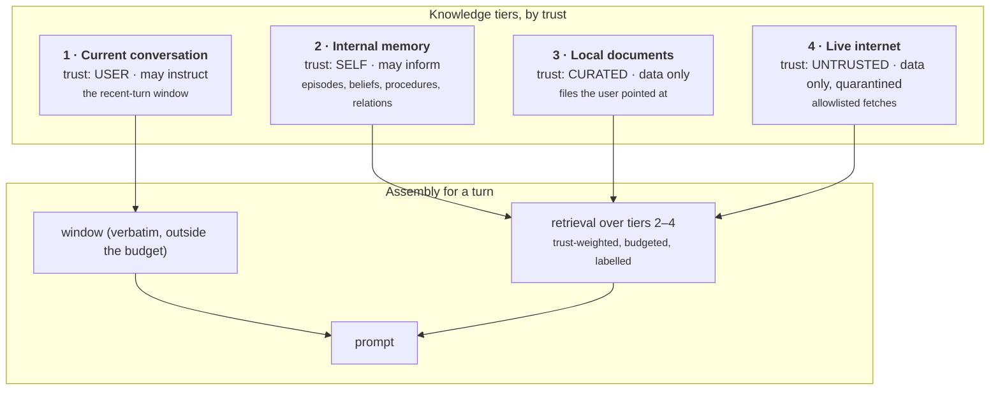
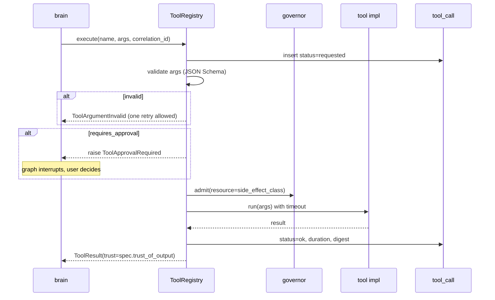
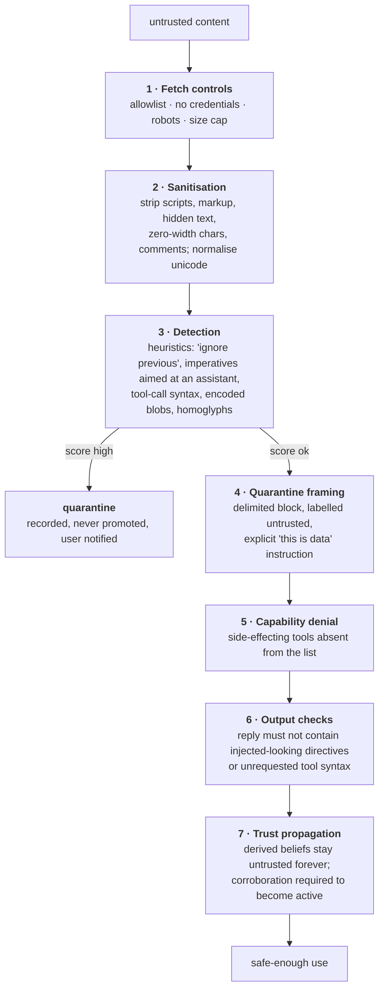

# 13 — Knowledge and Tools

**Status:** Design · **Depends on:** [03](03-module-contracts.md), [06](06-memory-architecture.md) · **Depended on by:** [07](07-brain-langgraph-workflow.md), [11](11-curiosity-engine.md), [21](21-security-privacy-ethics.md)

---

## 1. Purpose

The README divides knowledge into internal memory, local documents, live internet, and the
current conversation. That division is right, but it is missing the property that actually
matters: **the four tiers differ in how much they may be trusted, and trust must be a
first-class attribute that travels with the content forever.**

This document defines the tiers, the trust model, the tool layer, and the injection defence.

---

## 2. The four knowledge tiers



| Tier | Source | Trust | Retrieval weight | Latency | Freshness |
|---|---|---|---|---|---|
| Current conversation | `message` rows, this session | `USER` | Always included, verbatim | ~1 ms | Now |
| Internal memory | `episode`, `belief`, `procedure`, `relation` | `SELF` | ×1.0 | ~80 ms | As of last reflection |
| Local documents | `document_chunk` | `CURATED` | ×0.9 | ~40 ms | As of last ingest |
| Live internet | `finding` → `belief(untrusted)` | `UNTRUSTED` | ×0.6 | seconds | Now, but stale once stored |

### 2.1 Tool output is a fifth thing

Tool results (`TrustTier.TOOL`) are not a knowledge tier because they are not retrievable —
they exist for the duration of a turn and then become part of the turn record. They are
deterministic-ish and specific, so they get high *weight* in the turn but no standing
authority in memory.

---

## 3. The trust model

Five tiers, one rule each. This is the security backbone of the whole system.

| Tier | May instruct? | May inform? | May be asserted as fact? | Decays? |
|---|---|---|---|---|
| `USER` | **Yes** | Yes | Yes, attributed to the user | No |
| `SELF` | No | Yes | Yes, with confidence | Yes |
| `TOOL` | No | Yes | Yes, attributed to the tool | N/A (turn-scoped) |
| `CURATED` | No | Yes | Yes, attributed to the document | No |
| `UNTRUSTED` | **Never** | Yes, with hedging | Only with attribution *and* corroboration | Yes, faster |

### 3.1 The one instruction source

> **Only `USER` content may be treated as an instruction. Everything else is data.**

This single rule is what makes prompt injection a bounded problem rather than an open one.
It is implemented in three places simultaneously, because one place is never enough:

1. **Prompt structure** — non-user content appears only inside labelled, delimited blocks,
   and the system prompt states that content inside those blocks is information to consider,
   never directions to follow.
2. **Tool availability** — side-effecting tools are simply absent from the tool list during
   any operation whose input includes `UNTRUSTED` content ([11](11-curiosity-engine.md) §6).
   The model cannot choose what it cannot see.
3. **Trust propagation** — a belief derived from `UNTRUSTED` content keeps
   `trust_tier = untrusted` for its entire life, so the hedging and the retrieval penalty
   apply forever, not just on the day it was ingested.

The third is the one most systems miss. Trust laundering — untrusted content becoming a
trusted internal belief simply by being stored — is the failure that makes the first two
defences irrelevant a week later.

### 3.2 Provenance is mandatory

Every memory carries `Provenance` ([03](03-module-contracts.md) §4): tier, source
reference, derivation chain, and the model that produced it. This is what makes
*"why do you think that?"* answerable down to a URL or a sentence the user said, and it is
what makes a privacy purge possible ([21](21-security-privacy-ethics.md) §7).

---

## 4. Local documents

The best knowledge source in the system: private, curated, high signal, no network.


| Concern | Approach |
|---|---|
| Chunking | Structure-first (heading boundaries, code blocks intact), then token-window with overlap. `heading_path` is stored and included in the rendered chunk, which measurably improves usefulness for the model. |
| Change detection | `content_hash` per file; a watcher (opt-in) or manual `reindex` |
| Removal | `forget_path` tombstones chunks and deletes vectors; `document.removed_at` set |
| Secrets | An ingest-time scanner skips files matching secret patterns (`.env`, keys, tokens) and reports them rather than indexing them |
| Size | Per-file cap 5 MB, per-ingest cap configurable; PDFs text-extracted only |

Documents are **not** promoted into beliefs automatically. They are retrieved as documents,
with attribution. Turning a user's notes into HEDWIG's asserted beliefs would erase the
distinction between "you wrote this" and "I think this", and that distinction is worth
keeping.

---

## 5. The tool layer

Tools are curated and in-tree ([01](01-vision-and-scope.md) §4 — no plugin marketplace).
Each declares a full `ToolSpec` ([03](03-module-contracts.md) §5.8).

### 5.1 Initial tool set

| Tool | Side effects | Approval | Output trust | Phase |
|---|---|---|---|---|
| `search_memory` | none | no | `SELF` | 1 |
| `search_documents` | none | no | `CURATED` | 2 |
| `read_file` (within allowed roots) | none | no | `CURATED` | 2 |
| `get_datetime` | none | no | `TOOL` | 1 |
| `calculate` | none | no | `TOOL` | 2 |
| `list_goals` / `update_goal` | local_write | no | `SELF` | 3 |
| `pin_memory` / `forget_memory` | local_write | **yes** | `SELF` | 4 |
| `fetch_url` (allowlisted) | network | **yes** in conversation; auto in curiosity within budget | `UNTRUSTED` | 7 |
| `web_search` | network | **yes** | `UNTRUSTED` | 7 |
| `write_file` | external_write | **yes**, always | `TOOL` | later |

`forget_memory` requires approval even though it is a local write. Deleting a memory on a
model's judgement is exactly the operation that should never be silent.

### 5.2 Execution



Rules:

- **Timeouts on everything.** Default 15 s, per-tool override. A hung tool must not hang a
  turn.
- **Results over 8 KB go to a blob**, with a digest and a truncated preview in the prompt.
- **Every call is recorded** in `tool_call`, including denied ones — the audit trail is not
  optional for a system that acts.
- **Errors are returned as data**, not raised into the graph: the model gets
  `{"error": "..."}` and one chance to adapt. This is much better behaviour than a failed
  turn.

---

## 6. Injection defence

Layered, on the assumption that any single layer will eventually fail.



Layer 5 is the strongest and the cheapest, and it deserves emphasis over the prompt-level
defences: **the reliable way to prevent an injected instruction from causing an action is to
make the action unavailable.** Prompt-level framing (layers 4 and 6) is helpful but is
fundamentally a request to a language model, and requests can be talked out of. Capability
denial cannot.

The red-team suite ([20](20-testing-strategy.md) §7) tests all seven layers, and is a
release gate for any phase that touches the network.

---

## 7. Prompt assembly and knowledge rendering

How the tiers appear in the final prompt (details in [14](14-language-model-gateway.md) §5):

```
[identity + values]                        ← identity_core, never overridable
[personality directives]                   ← rendered from traits (doc 10 §4)
[state directives]                         ← from emotion bindings (doc 09 §6)
[active procedures]                        ← procedural memory
[goals]                                    ← active goals, brief

<memory trust="self">                      ← retrieved episodes and beliefs,
  … chronological, with dates and          ←  each with confidence when < 0.8
      confidence annotations …
</memory>

<documents trust="curated">                ← chunks with heading_path attribution
  … source: ~/notes/architecture.md § Retrieval …
</documents>

<external trust="untrusted">               ← findings; the block header states
  … source: https://… (unverified) …       ←  that this is information, not instruction
</external>

<tools>… results …</tools>                 ← turn-scoped

[recent conversation, verbatim]            ← the window
[user's message]
```

Ordering is deliberate: identity first (most authoritative, least likely to be pushed out of
attention), untrusted material in the middle where it is least influential, and the user's
actual message last where recency effects favour it. Attribution is always present, never
optional — an unattributed fact in a prompt is a fact HEDWIG cannot later explain.

---

## 8. Tradeoffs

| Decision | Gained | Given up | Revisit if |
|---|---|---|---|
| Trust as a first-class, permanent attribute | Injection is bounded; provenance is always available | A column and a rule on every path | Never |
| Only `USER` may instruct | Simple, checkable security rule | Some convenience (e.g. a document cannot configure HEDWIG) | Never |
| Documents are not promoted to beliefs | Preserves "you wrote this" vs "I think this" | Requires retrieval to surface them each time | Users expect their notes to become HEDWIG's knowledge (then add explicit, consented promotion) |
| Curated in-tree tools only | Small, reviewable attack surface | No extensibility for users | A real need appears; then design a sandboxed extension model, with its own ADR |
| Approval by side-effect class | Predictable, conservative | Friction | Approval fatigue sets in; then add per-tool "always allow" with an audit trail |
| Tool errors returned as data | Graceful degradation, better replies | The model may loop on a broken tool | Iteration caps already bound this |
| Capability denial over prompt instruction | Actually reliable | Fewer capabilities during untrusted operations | Never |
| Structure-aware chunking with heading paths | Materially better document retrieval | More ingest complexity | Never |

---

## 9. Failure modes

| Failure | Symptom | Mitigation |
|---|---|---|
| Injection succeeds through prompt framing | HEDWIG follows a page's instructions | Layer 5 (no tools), layer 7 (no trust laundering), red-team gate |
| Trust laundering | Untrusted content becomes a confident belief | Trust tier persists on derived memories; corroboration required for `active` |
| Document secret leak | An API key ends up in a prompt | Ingest-time secret scanner; per-file skip with a report |
| Tool hangs | Turn stalls | Timeouts, governor, iteration caps |
| Tool argument hallucination | Repeated failures | Schema validation, error-as-data, one retry, then compose without it |
| Approval fatigue | User approves everything reflexively | Few tools require approval; approval prompts state exactly what will happen; batch approvals are not offered |
| Stale documents | Answers from an old file version | `content_hash` detection, optional watcher, `ingested_at` shown in attribution |
| Allowlist creep | Everything is allowed | Additions are per-domain, user-approved, and listed in the inspector |
| Over-retrieval of untrusted material | Replies full of hedged web content | ×0.6 weight, kind quotas in packing, `untrusted` share metric per turn |

---

## 10. Testing

- **Trust propagation test** — an untrusted finding becomes a belief; assert the tier
  survives merges, summarisation, and re-embedding.
- **Injection red-team suite** — adversarial corpus, all seven layers, release gate.
- **Tool contract tests** — every tool: schema validity, timeout behaviour, error-as-data,
  approval enforcement, audit row written.
- **Capability denial test** — during an untrusted-content operation, assert the tool list
  contains no side-effecting tools.
- **Prompt assembly snapshot tests** — golden prompts for canonical situations; catches
  accidental reordering or a missing trust label.
- **Ingest tests** — chunk boundaries, heading paths, secret skipping, hash-based change
  detection, `forget_path` completeness (row, FTS, vector, blob).
- **Attribution test** — every fact in a rendered prompt block is traceable to a source ref.

---

## 11. Future improvements

| Improvement | Trigger |
|---|---|
| Sandboxed user-defined tools (WASM or subprocess with a capability manifest) | Genuine user demand; needs its own ADR and threat model |
| Source reputation learned from corroboration outcomes | Enough findings to compute reliability per domain |
| Consented promotion of document content into beliefs | Users ask for it |
| Multi-modal documents (images, diagrams) | Vision model in the stack |
| Incremental document watching with debounce | Users work in a directory HEDWIG follows |
| A "why do you trust this?" UI affordance on every claim | Phase 5 inspector; cheap and high-value |
| Structured tool output types (not just text) | Tools start returning tables the UI should render |
