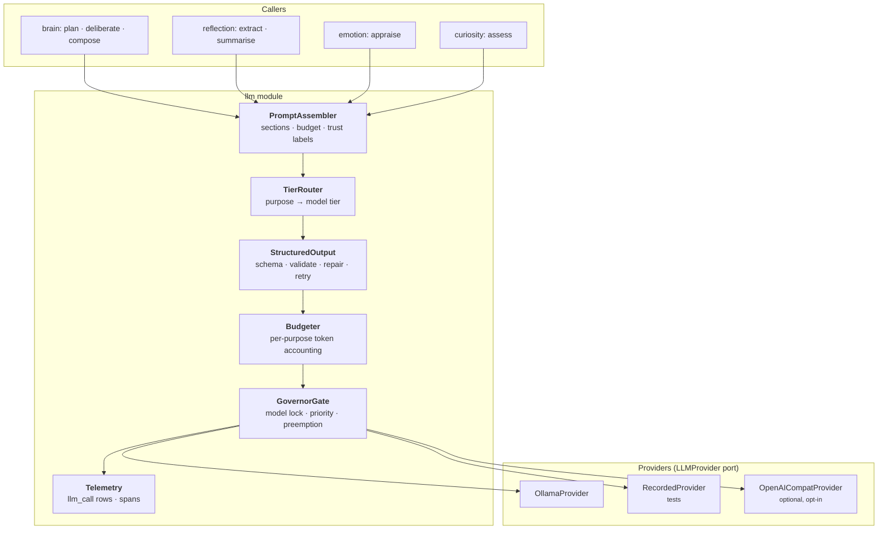
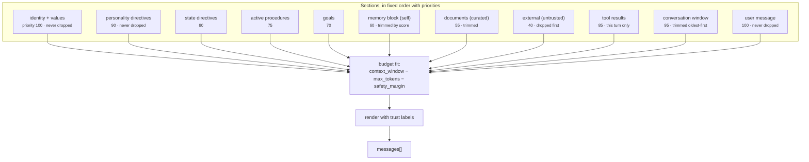
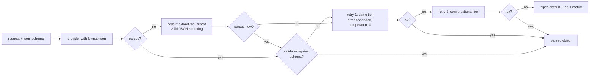

# 14 — Language Model Gateway

**Status:** Implemented (Milestone 3) · **Depends on:** [03](03-module-contracts.md), [10](10-personality-engine.md), [13](13-knowledge-and-tools.md) · **Depended on by:** [07](07-brain-langgraph-workflow.md), [12](12-reflection-engine.md)

---

## 1. Purpose

The gateway is the only part of HEDWIG that talks to a language model. Everything else asks
it for a bounded job. Its responsibilities: provider abstraction, model tiering, prompt
assembly, structured output, budgets, and telemetry.

The design premise from [01](01-vision-and-scope.md) §5 governs everything here: **the model
is a stateless faculty.** It holds nothing between calls. Every call is fully specified by
what the gateway assembles.

---

## 2. Architecture



Every stage is separable and testable. The one that will change most often is
`PromptAssembler`; the one that must never leak provider details is the port itself.

---

## 3. Model tiering

The decision that makes a full cognitive apparatus affordable on a laptop.

| Tier | Default model | Used for | Latency target | Calls/turn |
|---|---|---|---|---|
| `conversational` | `llama3.1:8b` (or the largest that fits) | The user-facing reply | first token <2 s | 1 |
| `utility` | `qwen2.5:3b` | Query planning, deliberation, appraisal, extraction, summarisation, assessment | <400 ms | 2–4 |
| `embedding` | `nomic-embed-text` (768-d) | All vectors | <50 ms/batch | varies |

A naive design uses one model for everything, and then every cognitive operation costs as
much as a reply. With tiering, a turn costs roughly one big generation plus a few small ones,
and the nightly reflection over hundreds of items uses only the small model.

### 3.1 Routing

Purpose strings map to tiers in a table, not by caller choice:

| Purpose | Tier | Why |
|---|---|---|
| `compose.reply`, `compose.refusal`, `compose.opening` | conversational | User-facing prose quality matters |
| `plan.queries`, `plan.deliberate` | utility | Short structured decisions |
| `reflect.extract`, `reflect.summarise`, `reflect.themes` | utility | High volume, structured |
| `emotion.appraise` | utility | High volume, tiny output |
| `curiosity.assess`, `curiosity.extract` | utility | Volume, and never user-facing |
| `personality.render` | *none* | Deterministic code, not a model call ([10](10-personality-engine.md) §4) |

Escalation: a utility call whose structured output fails validation twice is retried once on
the conversational tier before falling back to a default. This handles the known weakness of
small models on schema adherence without paying big-model cost for the 98 % that succeed.

---

## 4. Provider abstraction

`LLMProvider` ([03](03-module-contracts.md) §5.3) is deliberately narrow: generate, stream,
count tokens, health, model ids. Not in the port: chat memory, tool-calling protocol, agent
loops, retries. Those are ours — a provider that offers them is a provider whose abstractions
we would inherit.

| Provider | Status | Notes |
|---|---|---|
| `OllamaProvider` | Default | `/api/chat` with `format: json` for structured output; streaming via NDJSON |
| `RecordedProvider` | Tests | Replays fixtures keyed by a hash of the request; records in a special mode |
| `OpenAICompatProvider` | Optional, opt-in, off by default | For users who want cloud quality on the conversational tier. Requires `privacy.allow_network` **and** an explicit per-tier opt-in, and it logs every egress. INV-8 applies without exception. |

### 4.1 Model swapping

Changing `llm.conversational` requires no code change and must not change HEDWIG's identity
([01](01-vision-and-scope.md) §5). What it does change:

| Effect | Handling |
|---|---|
| Token counting differs | `count_tokens` is per-tier and per-model; budgets recomputed |
| Context window differs | Read from the provider at startup; prompt budget derived from it, not hardcoded |
| Instruction-following differs | Directive cap ([10](10-personality-engine.md) §4) and a golden-prompt eval run after any model change |
| Structured-output reliability differs | Tracked per model; the escalation path absorbs it |
| Embeddings — **must not silently change** | `embedding_state` mismatch triggers a re-embed job ([05](05-data-model-and-database.md) §5.3) |

A `hedwig model check` command runs the eval subset against a newly configured model and
reports adherence, latency and schema-failure rate before the user commits to it.

---

## 5. Prompt assembly

One assembler, one section model, one budget. No module builds a prompt by string
concatenation — an unenforced rule here is how prompt sprawl starts.



Rules:

1. **Sections have priorities; trimming is deterministic.** Untrusted content is dropped
   first, identity last. No prompt is ever silently over budget.
2. **Every non-user section is labelled with its trust tier and attribution**
   ([13](13-knowledge-and-tools.md) §7).
3. **Templates are files in `llm/prompts/`, versioned in git**, with a `prompt_version`
   recorded on every `llm_call` — so a quality regression can be traced to a template change.
4. **No f-string prompt building outside the assembler.** Enforced by a lint rule.
5. **Every assembled prompt is reproducible from the `llm_call` row** when tracing is on,
   which is what makes `/v1/explain` complete.

### 5.1 Budgeting

```
context_window       = provider-reported (e.g. 8192)
reserved_for_output  = max_tokens from personality/emotion bindings
safety_margin        = 256
available            = context_window − reserved_for_output − safety_margin
```

The window and the user message are allocated first, then retrieval fills the remainder up to
`memory.context_token_budget`. Overflow trims by section priority, then by item score within
the memory and document sections. Trim counts land in telemetry — a prompt that is silently
losing half its memory every turn is a bug that is otherwise invisible.

---

## 6. Structured output

The system depends on reliable structured output from a small model, in appraisal, capture,
deliberation and assessment. Treating this casually is how the whole cognitive layer becomes
flaky.



Practices that matter with small models:

| Practice | Why |
|---|---|
| Flat schemas, shallow nesting | Small models fail badly on deep nesting |
| Enums over free strings | Constrains the output space |
| Numbers as bounded floats with explicit ranges in the description | Prevents "0.7 out of 10" |
| Field names that describe the answer | The name is half the instruction |
| Arrays capped in the schema (`maxItems`) | Prevents 40-item hallucinated lists |
| One example in the prompt | Worth more than any amount of instruction |
| `temperature=0` for all structured calls | Determinism aids both quality and testing |

**Every caller must have a typed default.** No structured-output failure may abort a turn.
Appraisal defaults to neutral, capture to "nothing worth remembering", deliberation to
"no tools", assessment to "discard". Schema-failure rate per purpose is a monitored metric
with a 2 % alert threshold, because a rising rate is the earliest signal of model or template
degradation.

---

## 7. Embeddings

Separate module, separate port ([03](03-module-contracts.md) §5.4), because the failure modes
are entirely different from generation.

| Concern | Approach |
|---|---|
| Batching | Up to 32 texts per call; a queue drains on a 200 ms timer or at batch size |
| Model identity | `Embedder.model_id` persisted with every vector, and in `embedding_state` |
| Mismatch | Detected at startup → `memory.reembed.required` → re-embed job with a cursor |
| During re-embed | Retrieval falls back to lexical-only; the UI shows a degraded-search notice |
| Normalisation | Vectors L2-normalised on write, so cosine is a dot product |
| Text preparation | Consistent template per memory kind (title + content for episodes, statement for beliefs) — an inconsistency here silently degrades every neighbour search |

The re-embed job is the one piece of maintenance that must be resumable and interruptible:
re-embedding 40 000 memories takes hours on a laptop, and it will be interrupted.

---

## 8. Budgets and governance

| Budget | Scope | Default | On exhaustion |
|---|---|---|---|
| `llm_tokens_interactive` | per turn | 8 000 | Truncate the prompt, then the reply; never fail the turn |
| `llm_tokens_reflection` | per night | 60 000 | Defer remaining stages to the next night |
| `llm_tokens_curiosity` | per day | 40 000 | Stop exploring |
| `llm_concurrency` | global | 1 for the conversational tier, 2 for utility | Queue by priority |

The **model lock** is the single most important governance mechanism on a local install:
Ollama serves one model at a time efficiently, and a nightly reflection holding the model
while the user types is the worst possible experience. Interactive requests preempt: a
background request in flight is allowed to finish its current call (they are short by
design — batches of 20 items), and no new background call is admitted until the interactive
queue drains.

---

## 9. Tradeoffs

| Decision | Gained | Given up | Revisit if |
|---|---|---|---|
| Two model tiers | Affordable cognition on consumer hardware | Utility-model quality on structured tasks | Schema-failure rate >2 % sustained |
| Narrow provider port | No inherited abstractions; trivial fakes | We implement retries/streaming ourselves | Never |
| Central prompt assembler | Budget correctness, trust labelling, reproducibility | All prompt changes go through one module | Never |
| Prompt templates in git | Versioned, testable, diffable | No runtime prompt editing | Never — runtime-mutable prompts are untestable |
| Structured output with repair + escalation | Robustness without big-model cost | Complexity in the gateway | Constrained decoding (grammars) becomes available in Ollama; then simplify |
| Typed defaults everywhere | No cognitive failure aborts a turn | Silent degradation is possible | Metrics cover this (schema-failure rate per purpose) |
| Ollama default | Local-first, easy model swapping | Slower than a tuned llama.cpp/vLLM setup | Latency becomes the binding constraint |
| Cloud provider possible but opt-in | User choice preserved | A privacy footgun exists | Never remove the double opt-in |
| `temperature=0` for structured calls | Determinism, testability | Slightly less diverse extraction | Never |

---

## 10. Failure modes

| Failure | Detection | Response |
|---|---|---|
| Ollama not running | Startup probe + per-call error | `system.model.unavailable`; conversation degrades explicitly; background jobs pause |
| Model not pulled | Startup model list check | Clear error naming the exact `ollama pull` command |
| Context overflow | Token count before send | Deterministic trimming by section priority; trim counts logged |
| Schema failure | Validation | Repair → retry → escalate → typed default; metric per purpose |
| Streaming stall | No token for 20 s | Abort, surface a partial reply, mark the turn `truncated` |
| OOM / model eviction thrash | Provider errors, latency spikes | Model lock serialises; config warns if both tiers cannot be resident |
| Embedding model changed | `embedding_state` mismatch | Re-embed job; lexical-only fallback meanwhile |
| Silent quality regression after a model change | `hedwig model check` + golden evals | Report before commit; `prompt_version`/`model_id` on every call for bisection |
| Budget exhausted mid-turn | Budgeter | Truncate, never fail |
| Provider returns non-UTF8 / control characters | Sanitisation on read | Strip, log; never store raw control bytes in memory rows |

---

## 11. Testing

- **Port conformance suite** — every provider, including `RecordedProvider`.
- **Fixture recording** — real Ollama calls recorded once into `tests/fixtures/llm/`, keyed by
  request hash; the whole suite then runs offline and deterministically.
- **Prompt assembly golden tests** — canonical situations produce byte-identical prompts;
  budget overflow trims in the documented order.
- **Structured output stress** — malformed model outputs (truncated JSON, prose wrapper,
  wrong types, extra fields, out-of-range numbers) all resolve to a valid object or a typed
  default; never an exception.
- **Trim determinism** — the same over-budget input trims identically every time.
- **Embedding consistency** — same text → same vector; model-id mismatch is detected;
  re-embed resumes correctly from a cursor.
- **Preemption test** — background generation in flight, interactive request arrives; assert
  the interactive request starts within one background call.
- **Token accounting test** — counted tokens match provider-reported usage within 2 %.

---

## 12. Future improvements

| Improvement | Trigger |
|---|---|
| Grammar-constrained decoding for structured output | Ollama exposes it; would remove most of §6 |
| Speculative/parallel utility calls (appraise while planning) | Utility latency shows up in turn traces |
| Prompt caching across turns (stable prefix) | Provider supports prefix reuse; the section ordering already puts stable content first, which is half the work |
| Per-purpose model configuration (a different small model for summarisation) | Evals show a purpose-specific model wins |
| Local fine-tune on accumulated data | ≥6 months of data; needs its own ADR ([01](01-vision-and-scope.md) §4) |
| Multi-model ensembling for appraisal | Appraisal noise proves to matter |
| Streaming structured output for long extractions | Reflection latency becomes a problem |


---

## 13. Implementation record (Milestone 3)

| Piece | Where |
|---|---|
| `LLMProvider` port | `core/ports/llm.py` |
| Ollama backend | `llm/ollama.py` |
| Gateway (routing, retries, structured output, metrics) | `llm/gateway.py` |
| Scripted/replay provider | `llm/recorded.py` |
| JSON parse → repair → validate | `llm/structured.py` |
| Counters and histograms | `llm/metrics.py` |
| Call records | `migrations/0002_llm.sql` (`llm_call`) |
| Tests | `tests/unit/test_ollama_provider.py`, `tests/unit/test_llm_gateway.py` |

The gateway is registered as a non-critical service (`llm`) in `wiring.py`, so a missing
model degrades HEDWIG rather than preventing it from starting, and reports itself through
`/v1/health` like every other service. `hedwig models` drives it from the CLI through the
same container, which is what makes "reusable service" checkable rather than asserted.

### 13.1 Three things this document did not anticipate

**Reasoning models.** Ollama returns chain-of-thought from qwen3 and deepseek-r1 in a
separate `message.thinking` field. Reading only `content` produced an empty answer that
looked like a broken model but was a spent token budget. `GenerationResult.reasoning` now
carries it, deliberately apart from `text`: it is diagnostic material, and streaming a
model's scratchpad to a user as though it were the reply is a category error.

**Retryability belongs to the error, not its class.** A 404 for a missing model and a 503
for a daemon still warming up are both "unavailable"; only one is worth waiting for. The
gateway now reads `error.retryable`, and the provider marks 400/404/405–499/501 permanent.
Found by a live backend with embeddings disabled, which was being retried three times
before reporting a condition that could never change.

**Escalation is a fact about the pipeline, not about a call.** The metric was recorded
from the underlying generation, which cannot know it was part of an escalation, so
escalations counted zero. Now recorded at the point of escalation.

### 13.2 Deferred, deliberately

Prompt assembly (§5) is not built: it composes identity, personality, memory and trust
tiers, none of which exist yet, and building it now would mean guessing at their shapes.
The gateway takes the messages it is given. §8's daily and per-job budgets belong with the
resource governor, which needs scheduler context; only the per-request cap is enforced here.
