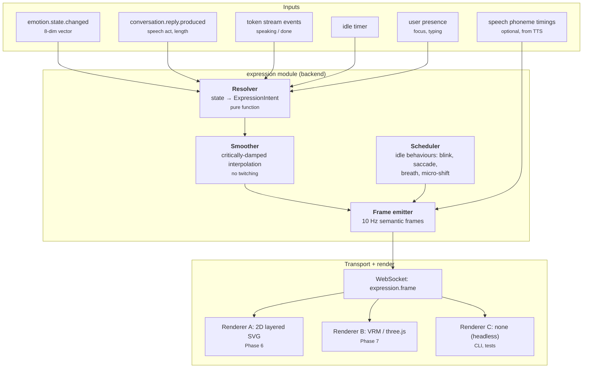
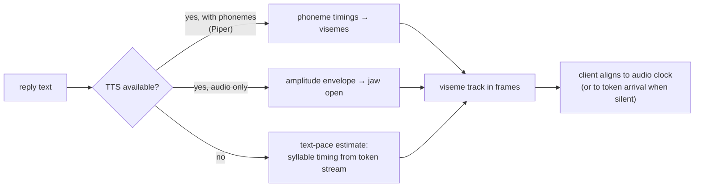
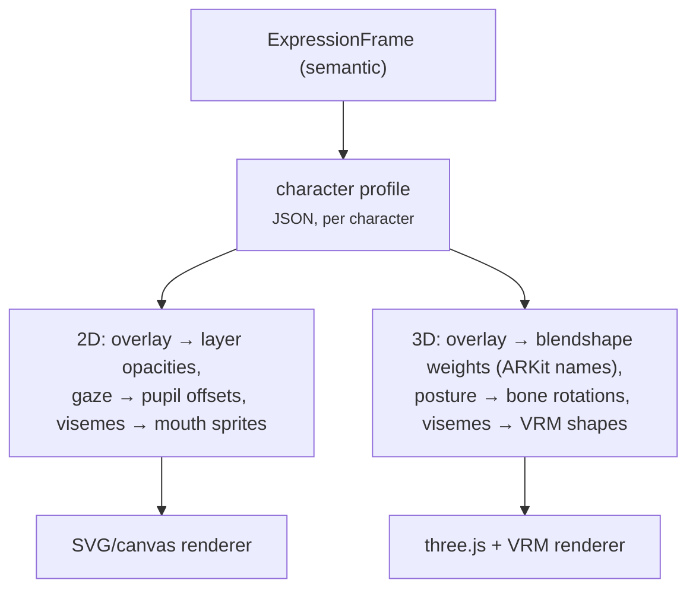

# 15 — Avatar Controller

**Status:** Design · **Depends on:** [09](09-emotion-engine.md), [16](16-api-structure.md) · **Depended on by:** [18](18-frontend-architecture.md)

---

## 1. Purpose

The avatar is HEDWIG's face. The README states the key architectural constraint precisely:
*the avatar reflects internal state rather than directly following LLM outputs.* That single
sentence rules out the usual approach (asking the model to emit `[smiles]` tags) and
determines the whole design.

---

## 2. Why the avatar must not read the model's output

The tempting design is to have the model emit expression markup inline with its reply. It is
wrong for four reasons:

1. **It would make the avatar lie.** The model produces text conditioned on a prompt; the
   emotional state is a separate, durable, inspectable quantity. If the model says
   `[cheerful]` while `valence = −0.3`, the face and the system disagree, and the face is the
   part the user believes.
2. **It would be unbindable.** Emotion's whole justification is that it changes measurable
   behaviour (INV-3). Avatar expression is the most legible binding available. Routing it
   through model output severs it.
3. **It would be model-dependent.** Swap the model and the expressiveness changes, violating
   [01](01-vision-and-scope.md) §5.
4. **It would be brittle.** Markup leaks into replies, small models emit it inconsistently,
   and parsing it is a permanent tax.

So: **expression is derived from state**, deterministically, in code. The model's *content*
influences expression only through the appraisal that content already caused.

---

## 3. Architecture



The critical seam is `ExpressionFrame`: **semantic, not geometric.** The backend never emits
blendshape weights, bone rotations, or sprite indices. It emits *what is being expressed*, and
each renderer maps that to its own capabilities through a character profile.

---

## 4. The frame protocol

```jsonc
{
  "type": "expression.frame",
  "t": 1753900923.114,          // server monotonic seconds
  "seq": 48213,
  "mood": {                      // core affect, continuous
    "valence": 0.34,
    "arousal": 0.52
  },
  "overlay": {                   // named blend, weights sum ≤ 1
    "interest": 0.6,
    "warmth": 0.3,
    "fatigue": 0.1
  },
  "gaze": { "x": 0.12, "y": -0.05, "target": "user" },  // −1..1, or "away"/"thinking"
  "posture": { "lean": 0.2, "openness": 0.6, "energy": 0.55 },
  "action": { "kind": "speaking", "intensity": 0.5 },   // idle|listening|thinking|speaking|reacting
  "gesture": null,               // or {"kind":"nod","phase":0.3}
  "visemes": [                   // only while speaking, when available
    { "at": 0.02, "v": "AA", "w": 0.8 },
    { "at": 0.09, "v": "M",  "w": 0.9 }
  ],
  "blink": false
}
```

Design notes:

- **`mood` is the substrate; `overlay` is the nameable part.** This is exactly why core affect
  was added to the emotion vector ([09](09-emotion-engine.md) §3.1) — a renderer can do
  something reasonable with valence/arousal alone, and refine it with overlays it supports.
- **A renderer may ignore any field it cannot express.** The 2D renderer ignores `posture.lean`;
  the headless renderer ignores everything. Frames are advisory.
- **10 Hz, not 60 Hz.** The backend describes intent; the renderer interpolates and animates
  at display rate. Sending 60 frames/second of semantic state over a WebSocket would be
  wasteful and would still not be smooth without client-side interpolation.
- **`seq` allows drop detection**; frames are lossy by design ([04](04-communication-and-event-bus.md) §7).

### 4.1 Overlay vocabulary

Fixed, small, and every entry is derived from state — no overlay exists that the resolver
cannot produce:

`interest`, `warmth`, `amusement`, `concentration`, `uncertainty`, `fatigue`, `surprise`.

Explicitly absent: anger, sadness, fear, disgust — consistent with
[09](09-emotion-engine.md) §3.2. HEDWIG's face does not perform distress at the user. The most
negative available presentation is low-valence + fatigue + uncertainty, which reads as
"having a hard time" without being emotionally coercive.

---

## 5. Resolution and smoothing

`resolve(emotion, action, presence, personality) -> ExpressionIntent` is a **pure function**,
which means the entire expressive behaviour of the avatar is unit-testable without a renderer.

| Overlay | Formula (illustrative) |
|---|---|
| `interest` | `0.7·curiosity + 0.3·arousal` |
| `warmth` | `0.8·warmth + 0.2·max(0, valence)` |
| `amusement` | `happiness · humour_trait · playfulness_trait` |
| `concentration` | `action == thinking ? 0.5 + 0.4·arousal : 0.1` |
| `uncertainty` | `1 − confidence` |
| `fatigue` | `max(0, 0.5 − energy) · 2` |
| `surprise` | transient from `emotion.threshold.crossed` on novelty, 800 ms envelope |

Gaze: at the user while listening and speaking; away and upward while thinking (a small,
cheap cue that reads as deliberation); periodic saccades so it does not stare.

Smoothing uses a critically-damped spring per channel (time constants: mood 1.2 s, overlays
0.4 s, posture 2.0 s, gaze 0.15 s). Two reasons: emotion already publishes on a 30 s tick, so
a step change would be visible as a jolt; and different channels *should* move at different
speeds — eyes are fast, posture is slow. Getting that wrong is most of what makes digital
characters feel uncanny.

### 5.1 Idle behaviour

Generated by the scheduler, never by the resolver, because idle motion is stochastic and
resolution must stay pure:

| Behaviour | Rate |
|---|---|
| Blink | Poisson, mean 4 s, suppressed mid-viseme |
| Saccade | Poisson, mean 3 s, amplitude scaled by arousal |
| Breath | Sinusoid, period `4.5 − 1.5·arousal` seconds |
| Micro-shift | Every 20–60 s, small posture change |
| Attention drift | After 90 s idle, gaze wanders; returns instantly on user input |

Idle behaviour is what makes an avatar feel alive at rest. Its absence is immediately
noticeable; its presence is invisible. Worth building early and cheaply.

---

## 6. Speech and lip sync



Three degradation levels, all acceptable:

1. **Phoneme-accurate** — Piper (local, fast) gives phoneme timings; 15-viseme mapping.
2. **Amplitude-driven** — any TTS: jaw openness from the envelope. Surprisingly convincing.
3. **Text-paced** — no TTS at all: estimate syllables from streaming tokens and animate a
   generic talking motion. This is the Phase-6 default, because text-only HEDWIG still needs
   a mouth that moves in time with the words appearing.

Sync authority is the **client audio clock** when audio plays, because drift between audio and
mouth is the single most noticeable defect. When there is no audio, the token stream is the
clock.

---

## 7. Renderer independence



The character profile is data, not code:

```jsonc
{
  "name": "hedwig-default",
  "kind": "vrm",
  "overlay_map": {
    "interest":      { "browInnerUp": 0.6, "eyeWide": 0.3 },
    "amusement":     { "mouthSmile": 0.7, "cheekSquint": 0.4 },
    "concentration": { "browDown": 0.4, "eyeSquint": 0.2 }
  },
  "mood_map": { "valence": { "mouthSmile": 0.5 }, "arousal": { "eyeWide": 0.3 } },
  "viseme_map": { "AA": "vrm.A", "M": "vrm.M" },
  "limits": { "max_total_blend": 1.4 }
}
```

Consequences: a new character is a JSON file plus assets, not a code change. Swapping 2D for
3D changes nothing on the backend. And a renderer that cannot do posture simply omits the
mapping.

### 7.1 Phasing

| Phase | Renderer | Rationale |
|---|---|---|
| 6 | 2D layered SVG: eyes, brows, mouth, body tint | Expressive in days, not months; validates the frame protocol against something real |
| 7 | VRM via three.js | Once the protocol is proven, the renderer is a self-contained project |
| later | Unreal/Unity via a WebSocket bridge | The protocol is already renderer-agnostic; this is a client, not a redesign |

Starting 3D would be the classic mistake: months of rigging work before discovering the frame
protocol has the wrong fields. 2D first is not a compromise, it is how you find out.

---

## 8. Data and transport

Owns no tables. Expression frames are **not persisted** — they are derivable from
`emotion_history` plus the turn record, and 10 Hz of frames would be the largest table in the
database by an order of magnitude for no benefit.

Transport: the `expression.frame` message on the existing WebSocket
([16](16-api-structure.md) §5). Frames go **directly from the expression module to the WS hub,
bypassing the event bus** — an explicit, documented exception to
[04](04-communication-and-event-bus.md), because 10 Hz × durable outbox writes would be pure
waste. The bus still carries `avatar.expression.requested` at *intent* granularity (a few per
turn) for the inspector and for tests.

Emission stops entirely when no client is subscribed. An avatar animating for nobody is a
background CPU cost with zero value, and on a laptop that matters.

---

## 9. Tradeoffs

| Decision | Gained | Given up | Revisit if |
|---|---|---|---|
| State-driven, not model-driven | Honest face, model independence, testable | The avatar cannot react to reply *content* nuance beyond appraisal | Never |
| Semantic frames, not geometry | Renderer independence; new characters are data | An extra mapping layer | Never |
| 10 Hz + client interpolation | Bandwidth, CPU, still smooth | Fast transients need the envelope mechanism (surprise) | Renderers need finer input |
| Frames bypass the bus | No wasteful durable writes | An exception to the communication rules | Never; documented here and in ADR-0009 |
| Frames not persisted | No table growth | No exact replay of past expression | Emotion history is enough for the inspector |
| 2D before 3D | Protocol validated early and cheaply | Less impressive early demos | Never |
| No negative-emotion overlays | No emotional coercion of the user | Less dramatic range | Never |
| Pure resolver + separate stochastic idle | Fully testable expression logic | Two components instead of one | Never |
| Client audio clock as sync authority | No perceptible lip-sync drift | Client complexity | Never |

---

## 10. Failure modes

| Failure | Symptom | Mitigation |
|---|---|---|
| **Uncanny twitching** | Jittery face | Per-channel damping, `min_publish_delta` on emotion, frame-rate cap |
| **Frozen face** | Avatar stops moving | Idle scheduler always runs; a watchdog logs if no frame for 5 s while a client is connected |
| **Lip-sync drift** | Mouth trails audio | Audio clock authority, resync every 2 s, envelope fallback |
| **Emotion/face mismatch** | Face contradicts the inspector | Resolver is pure and tested; the inspector shows both state and resolved intent side by side |
| **Renderer starves the UI thread** | Whole page janks | Renderer budget (2 ms/frame), automatic quality reduction, hard 2D fallback |
| **WebSocket backpressure** | Frames queue and arrive late | Frames are lossy: drop rather than queue, keep only the newest |
| **Client without WebGL** | Blank avatar pane | Capability detection at load, 2D fallback, then a static portrait |
| **Battery drain** | Laptop fan spins during idle | Stop emitting when the tab is hidden or no client is subscribed; halve rate on battery |
| **Overlay conflict** | Muddy or broken expression | `max_total_blend` in the character profile; overlays normalised before mapping |

---

## 11. Testing

- **Resolver property tests** — the full state space (sampled) produces valid intents; every
  overlay stays in range; overlays never sum past the cap.
- **Smoothing tests** — a step input converges monotonically within the documented time
  constant; no overshoot past 5 %.
- **Golden frame sequences** — canonical scenarios (greeting after a week away, thinking,
  tool failure, late-night session) produce recorded frame sequences; regressions are diffs.
- **Headless mode test** — nothing in the system depends on a renderer existing (CLI must
  work).
- **Mapping validation** — every character profile is validated: all overlays and visemes in
  the vocabulary are mapped or explicitly declared unsupported.
- **Lip-sync timing test** — with recorded phoneme timings, viseme times fall within 40 ms of
  the audio.
- **Idle-behaviour statistics** — blink and saccade rates match their distributions over a
  simulated hour.
- **Load test** — 10 Hz frames for 10 minutes; assert no memory growth and no queue buildup.

---

## 12. Future improvements

| Improvement | Trigger |
|---|---|
| Full-body posture and gesture library | 3D renderer lands and posture data is under-used |
| Gaze following the user's cursor or camera | Only with explicit consent; camera access is a privacy decision, not a feature decision |
| Emotion-conditioned TTS prosody | TTS supports style parameters |
| Learned idle behaviour from character reference video | Well past Phase 7 |
| Expression during streaming reflecting confidence per clause | Requires per-token confidence, which we do not have |
| Multiple characters / user-selectable appearance | Character profiles already make this cheap; do it when someone asks |
| A "calm mode" that reduces all motion | Accessibility need, and it should probably be a Phase-6 setting rather than a future item |
