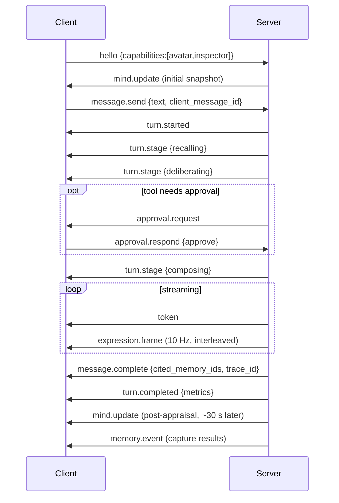

# 16 — API Structure

**Status:** Design · **Depends on:** [07](07-brain-langgraph-workflow.md), [15](15-avatar-controller.md) · **Depended on by:** [18](18-frontend-architecture.md)

---

## 1. Purpose

The API is the boundary between HEDWIG and any client. It exists so that the web UI is *a*
client rather than *the* client — a CLI, a terminal UI, a mobile app or a future avatar
renderer speak the same protocol.

Two surfaces, split by nature of the data:

- **REST** for state you fetch and modify: sessions, memory, mind state, goals, config.
- **WebSocket** for the live channel: token streams, expression frames, state updates,
  notices.

---

## 2. Principles

1. **Versioned from day one.** Everything under `/v1`. WebSocket envelopes carry `v`.
2. **The edge contains no domain logic** ([02](02-system-architecture.md) §3). It validates,
   authenticates, translates and streams.
3. **Introspection is a first-class feature, not an admin afterthought.** Memory, emotion,
   personality, goals, findings and traces are all queryable, because a companion you cannot
   inspect is one you cannot trust ([01](01-vision-and-scope.md) §6).
4. **Loopback by default.** `127.0.0.1`, no exceptions without explicit config.
5. **Errors are typed and machine-readable**, with a stable `code`.
6. **Every response that reflects a cognitive judgement carries provenance** — confidence,
   sources, or a trace id.

---

## 3. Authentication

> **Not yet implemented.** Milestone 1 ships only `/v1/health`, which is a liveness probe
> holding no user data, on a loopback-bound socket. The token below lands with the first
> endpoint that exposes anything personal — no data endpoint ships without it. Tracked in
> [README.md](README.md#implementation-status).

| Deployment | Mechanism |
|---|---|
| Local (default) | Bearer token generated at first run, stored in `~/.hedwig/token`, required on every request including WS. Loopback-bound. |
| Exposed (user opts in) | Same token plus a mandatory TLS terminator in front; a startup warning if bound to a non-loopback address without TLS |

No accounts, no OAuth, no sessions-as-cookies. A single-user local application that grows a
login screen has gained an attack surface and a support burden and lost nothing it needed.
The token exists to stop other processes and other browser tabs on the machine from talking to
HEDWIG, which is a real threat on a shared desktop.

---

## 4. REST resources

Base: `http://127.0.0.1:8730/v1`

### 4.1 Conversation

| Method | Path | Purpose |
|---|---|---|
| `POST` | `/sessions` | Open a session → `{session_id}` |
| `GET` | `/sessions?limit=&before=` | List sessions with summaries |
| `GET` | `/sessions/{id}` | Session detail: turns, mood arc, summary |
| `POST` | `/sessions/{id}/end` | Close a session (triggers T1 reflection) |
| `POST` | `/sessions/{id}/messages` | Send a message. Non-streaming convenience path; returns the complete reply. WS is the primary path. |
| `GET` | `/sessions/{id}/messages?limit=&before=` | Paginated history |
| `POST` | `/messages/{id}/feedback` | `{signal: 1|-1, note?}` → personality evidence + memory reinforcement |

### 4.2 Memory

| Method | Path | Purpose |
|---|---|---|
| `GET` | `/memory/search?q=&kinds=&limit=&min_confidence=` | Search as HEDWIG would, returning scores and score breakdowns |
| `GET` | `/memory/{id}` | One memory with full provenance and derivation lineage |
| `GET` | `/memory/{id}/lineage` | The derivation graph up and down |
| `POST` | `/memory/{id}/pin` · `DELETE` | Protect from forgetting |
| `POST` | `/memory/{id}/forget` | Tombstone (reversible) |
| `POST` | `/memory/{id}/restore` | Undo a tombstone |
| `PATCH` | `/memory/{id}` | Correct content or confidence — user corrections are `USER` trust and supersede |
| `GET` | `/memory/timeline?from=&to=` | Episodes over a period, for the timeline view |
| `GET` | `/entities?q=` · `GET /entities/{id}` | Entities, their memories, relationship state |
| `GET` | `/beliefs?subject=&status=` | Beliefs, including superseded history |

`PATCH /memory/{id}` matters more than it looks: a memory system without user correction
accumulates errors forever, and the user is the highest-trust source available.

### 4.3 Mind state

| Method | Path | Purpose |
|---|---|---|
| `GET` | `/mind` | Full `MindSnapshot` |
| `GET` | `/mind/emotion` · `/mind/emotion/history?from=&to=&resolution=` | Current + timeline |
| `GET` | `/mind/personality` | Traits with anchors, drift, bounds |
| `GET` | `/mind/personality/history` | Every applied change with evidence |
| `POST` | `/mind/personality/revert/{history_id}` | Undo one drift |
| `POST` | `/mind/personality/reset?trait=` | Reset to anchor |
| `GET` | `/mind/personality/proposals?status=` | Pending and rejected proposals with the rule that fired |
| `GET` | `/mind/identity` · `PATCH` | Identity core; PATCH requires `confirm=true` and is audited |
| `GET`/`POST`/`PATCH` | `/goals` | Goal CRUD |
| `GET` | `/relationships` · `/relationships/{entity_id}` | Relationship state and trajectory |
| `GET` | `/mind/snapshots` · `POST /mind/snapshots/{date}/restore` | Identity snapshot rollback |

### 4.4 Curiosity, knowledge, reflection

| Method | Path | Purpose |
|---|---|---|
| `GET` | `/curiosity/gaps?status=` | The gap register — useful even with curiosity disabled |
| `POST` | `/curiosity/gaps` | User-registered question |
| `GET` | `/curiosity/findings?status=` | Findings feed (the passive delivery channel) |
| `POST` | `/curiosity/findings/{id}/dismiss` · `/confirm` | Dismiss (raises the topic threshold) or confirm (promotes to `active`) |
| `GET`/`POST`/`DELETE` | `/sources` | Allowlist management |
| `POST` | `/curiosity/explore` | Manual trigger, still budget-bound |
| `GET`/`POST`/`DELETE` | `/documents` | Ingest, list, remove local documents |
| `POST` | `/documents/reindex` | Re-ingest |
| `GET` | `/reflection/runs?tier=` | Run history and stats |
| `POST` | `/reflection/trigger?tier=` | Manual trigger (dev and impatience) |
| `GET` | `/reflection/report/latest` | The T4 identity report |

### 4.5 System and introspection

| Method | Path | Purpose |
|---|---|---|
| `GET` | `/health` | Liveness plus per-subsystem status (models, db, indexes, jobs) |
| `GET` | `/explain/{message_id}` | **Why HEDWIG said that** — see §6 |
| `GET` | `/traces/{correlation_id}` | The causal event graph for a turn or job |
| `GET` | `/metrics` | Prometheus text format |
| `GET`/`PATCH` | `/config` | Safe config subset; secrets never returned |
| `GET` | `/jobs` · `POST /jobs/{name}/trigger` · `/pause` | Job control |
| `GET` | `/notices` | Unresolved system notices (dead letters, degraded subsystems, pending approvals) |
| `POST` | `/export` | Full portable export (async job → download) |
| `POST` | `/purge` | Privacy purge; requires `confirm` and a scope ([21](21-security-privacy-ethics.md) §7) |

### 4.6 Error format

```jsonc
{
  "error": {
    "code": "capability_unavailable",   // stable, enumerated
    "message": "The conversational model is not available.",
    "detail": { "tier": "conversational", "model": "llama3.1:8b" },
    "correlation_id": "turn_01JQ8Z...",
    "retryable": true
  }
}
```

Codes: `invalid_request`, `not_found`, `conflict`, `capability_unavailable`,
`budget_exhausted`, `approval_required`, `degraded`, `internal`. HTTP status is set
accordingly, but clients branch on `code`.

---

## 5. WebSocket protocol

`ws://127.0.0.1:8730/v1/stream?token=…` — one connection carries everything.

### 5.1 Envelope

```jsonc
{ "v": 1, "id": "01JQ…", "type": "…", "ts": 1753900923.114,
  "corr": "turn_01JQ…", "payload": { } }
```

### 5.2 Client → server

| Type | Payload | Notes |
|---|---|---|
| `hello` | `{client, capabilities: ["avatar","inspector"], subscriptions: [...]}` | Determines what the server sends; frames are not emitted unless `avatar` is present |
| `message.send` | `{session_id, text, client_message_id}` | `client_message_id` makes retries idempotent |
| `interrupt` | `{turn_id}` | Cancel a turn in flight |
| `approval.respond` | `{call_id, decision, edited_args?}` | Answers a tool approval interrupt |
| `feedback` | `{message_id, signal, note?}` | Same as REST, on the live channel |
| `presence` | `{focused, typing}` | Feeds the interruption policy and idle detection |
| `ping` | `{}` | Keepalive |

### 5.3 Server → client

| Type | Payload | Lossy? |
|---|---|---|
| `turn.started` | `{turn_id, session_id}` | no |
| `turn.stage` | `{turn_id, stage, detail?}` | yes — drives "recalling…", "thinking…" progress |
| `token` | `{turn_id, text}` | **no** — reassembled into the reply |
| `message.complete` | `{message_id, text, cited_memory_ids, trace_id}` | no |
| `turn.completed` | `{turn_id, status, metrics}` | no |
| `expression.frame` | see [15](15-avatar-controller.md) §4 | yes |
| `mind.update` | `{emotion?, personality?, goals?}` | yes (snapshots) |
| `memory.event` | `{kind, memory_id, summary}` | yes |
| `notice` | `{level, code, message, actions?}` | no |
| `approval.request` | `{call_id, tool, args, reason}` | no |
| `error` | error object | no |
| `pong` | `{}` | yes |

The lossy column is the same discipline as [04](04-communication-and-event-bus.md) §7: under
backpressure, expression frames and mind updates are dropped newest-wins, while tokens and
completions are never dropped. Getting this wrong produces garbled replies under load, which
looks like a model bug and is not.

### 5.4 Turn lifecycle over WS



### 5.5 Reconnection

Reconnection carries `last_event_id`. The server replays non-lossy messages for in-flight and
recently-completed turns from the turn record. A turn keeps running server-side while the
client is away and is fully persisted — **closing the browser must never lose a reply**, which
is a property that falls out of the turn being checkpointed and persisted rather than being a
property of the connection.

---

## 6. The explain endpoint

`GET /v1/explain/{message_id}` is the feature that makes an emotional, memory-driven agent
debuggable and trustworthy. It is specified here because it constrains what other subsystems
must record.

```jsonc
{
  "message_id": "01JQ…",
  "reply_excerpt": "You mentioned Lisbon last month, so…",
  "mind_at_turn": { "emotion": {...}, "personality": {...}, "goals": [...] },
  "directives": ["Be concise but complete.", "Give a clear recommendation."],
  "retrieval": {
    "queries": ["lisbon move", "user location"],
    "policy": { "...": "..." },
    "items": [
      { "memory_id": "01JQ…", "kind": "belief", "text": "The user lives in Lisbon",
        "score": 0.82,
        "breakdown": { "lexical_rank": 3, "semantic_rank": 1, "salience": 0.71,
                       "confidence": 0.9, "recency": 1.12, "trust": 1.0 },
        "provenance": { "tier": "user", "source_ref": "session_01JQ…" },
        "cited_in_reply": true }
    ],
    "dropped_count": 14
  },
  "tools": [ { "name": "get_datetime", "status": "ok" } ],
  "model": { "tier": "conversational", "model_id": "llama3.1:8b",
             "prompt_version": "compose@7", "tokens_in": 2841, "tokens_out": 190 },
  "trace_id": "turn_01JQ…"
}
```

Everything here is already recorded for other reasons (`working_set_log`, `llm_call`,
`tool_call`, `emotion_history`, `personality_history`) — the endpoint is an assembly, not new
instrumentation. That is deliberate: designing the explain endpoint early is what forced those
tables to carry the right columns.

---

## 7. Streaming, backpressure and limits

| Concern | Approach |
|---|---|
| Backpressure | Per-connection bounded queue (512). Lossy types drop newest-wins; non-lossy types apply backpressure to the producer, and a persistently slow client is disconnected with a notice |
| Rate limits | 60 messages/min, 10 concurrent turns/session (in practice 1) |
| Payload caps | Message text 32 KB; REST body 1 MB |
| Timeouts | Idle WS 5 min without a ping → close; HTTP 30 s except explicitly long endpoints |
| Compression | `permessage-deflate` enabled; expression frames benefit most |
| CORS | Locked to the configured frontend origin; `*` never |
| Pagination | Cursor-based (`before=<ulid>`), never offset — ULIDs make this natural |

---

## 8. Tradeoffs

| Decision | Gained | Given up | Revisit if |
|---|---|---|---|
| REST + one WebSocket | Clear split; one live connection to manage | Two client code paths | Never |
| One WS for chat, avatar and telemetry | One connection, one auth, shared backpressure policy | Frame traffic shares a socket with tokens | Avatar traffic starts affecting token latency → then a second socket |
| Bearer token only | Simple, adequate for local | Not suitable for exposure without TLS | Multi-user (a non-goal) |
| Introspection endpoints as first-class | Debuggability and trust | Surface area to maintain and secure | Never |
| Typed error codes | Clients can branch reliably | An enum to maintain | Never |
| `/explain` as an assembly of existing records | No extra instrumentation cost | Constrains other subsystems to record enough | Never — this constraint is a feature |
| Cursor pagination on ULIDs | Correct under concurrent writes | No random page access | Never |
| Turn survives client disconnect | Never lose a reply | Server does work nobody may read | Never |

---

## 9. Failure modes

| Failure | Response |
|---|---|
| Model unavailable mid-stream | `error` frame with `capability_unavailable`, partial reply preserved and persisted, turn marked `truncated` |
| Client disconnects mid-turn | Turn completes and persists; replayed on reconnect |
| Slow client | Lossy drops first, then disconnect with a notice |
| Duplicate `message.send` (retry) | `client_message_id` dedupe returns the existing turn |
| Approval never answered | Interrupt expires after 10 min; turn composes without the tool |
| Token in a URL query (WS) | Accepted because browsers cannot set WS headers, but logged with the token redacted; a `Sec-WebSocket-Protocol` token path is offered as the preferred alternative |
| Two clients connected | Both receive everything; both may send. Last-write-wins on `presence`. This is a feature (desktop + phone), not a bug |
| Version mismatch | Server rejects unknown `v` with `invalid_request` and the supported range |

---

## 10. Testing

- **Contract tests** — every endpoint against a golden OpenAPI schema (generated by FastAPI,
  checked in, drift fails CI).
- **WS protocol tests** — full turn lifecycle, interrupt, approval, reconnect-with-replay,
  duplicate send, slow-client backpressure.
- **Lossy/non-lossy test** — flood a connection; assert tokens are never dropped and frames
  are.
- **Auth tests** — every route rejects a missing/invalid token; non-loopback bind without TLS
  warns.
- **Explain completeness test** — for a turn using memory and a tool, assert every field is
  populated and every cited memory id resolves.
- **Pagination test** — concurrent writes during pagination never skip or duplicate.
- **CLI-parity test** — the CLI uses only the public API, so the API is proven complete by the
  CLI's existence.

---

## 11. Future improvements

| Improvement | Trigger |
|---|---|
| SSE fallback for token streaming | A client environment cannot use WebSockets |
| Webhook/outbound notifications (desktop notifications for proactive items) | Phase 7 proactivity |
| Read-only "guest" token scope | Sharing the inspector without granting chat |
| Batch endpoints for memory operations | The inspector needs bulk edits |
| gRPC or msgpack for the frame channel | Frame bandwidth becomes measurable |
| API for external avatar renderers (Unreal bridge) | Someone builds one; the protocol already supports it |
