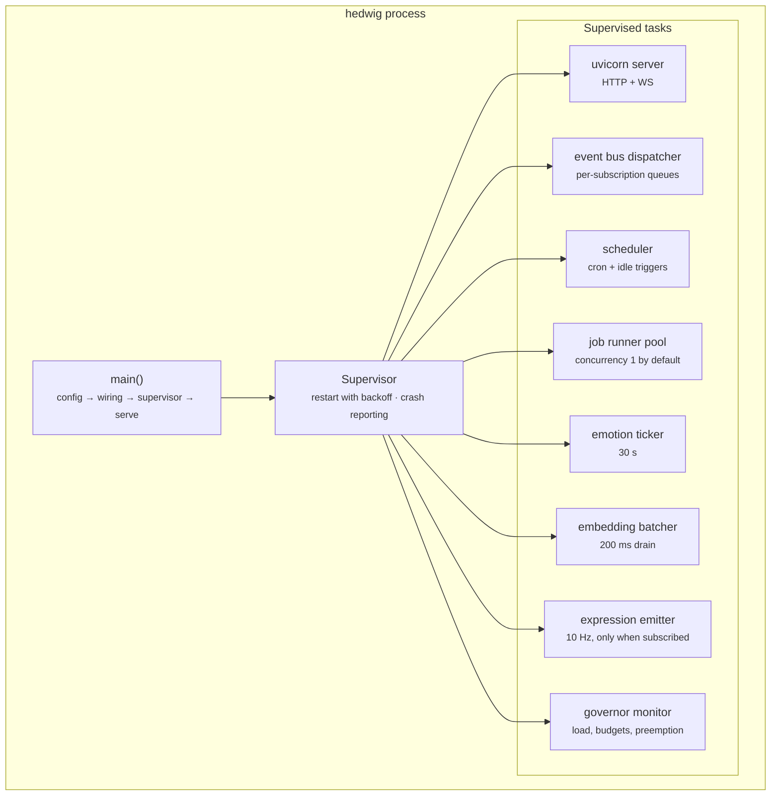
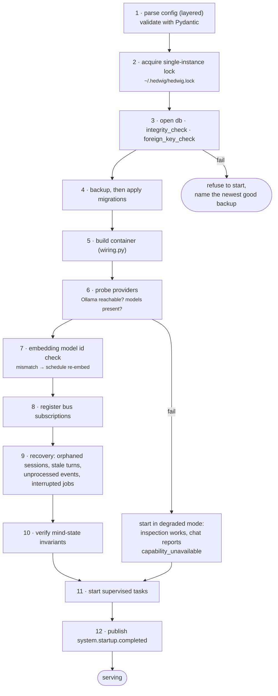
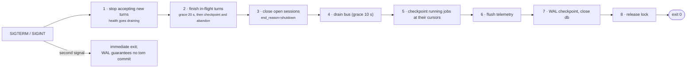
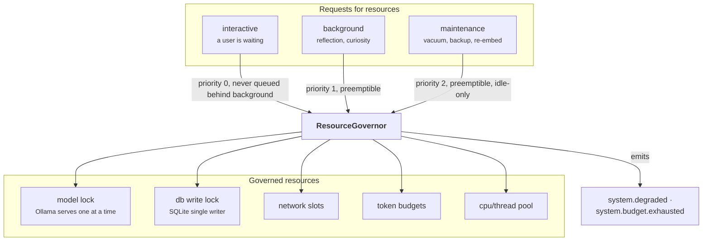

# 17 — Backend Architecture

**Status:** Design · **Depends on:** [02](02-system-architecture.md), [04](04-communication-and-event-bus.md), [16](16-api-structure.md) · **Depended on by:** [22](22-roadmap.md)

---

## 1. Purpose

How the process actually runs: startup, the concurrency model, background workers, resource
governance, shutdown, and packaging. This is the document that keeps a laptop from becoming
unusable while HEDWIG thinks.

---

## 2. Process model

One process, one asyncio event loop, several long-lived tasks under a supervisor.

### 2.1 Why asyncio and not threads or processes

Almost everything HEDWIG does is I/O-bound waiting: on Ollama, on SQLite, on the network, on
the user. The CPU-bound exceptions are small and known:

| CPU-bound work | Handling |
|---|---|
| Embedding (in Ollama) | Out of process already |
| Vector search | C extension, releases the GIL, sub-10 ms |
| Text chunking, sanitisation | Milliseconds; run inline |
| PDF extraction | `asyncio.to_thread` — the one genuine offload |
| Fusion, decay maths | Microseconds |

So a single event loop is sufficient, and it buys enormous simplification: no locks, no shared
mutable state across threads, deterministic ordering within a task, and a debugger that shows
one stack. The escape hatch (`to_thread`, and `ProcessPoolExecutor` if ever needed) is
available without changing the architecture.

### 2.2 The supervisor

Each task is registered with a restart policy:

| Task | Policy | On repeated failure |
|---|---|---|
| uvicorn | Restart, 3 attempts | Exit the process (there is no HEDWIG without an API) |
| bus dispatcher | Restart, unlimited with backoff | Degraded notice; the system still serves reads |
| scheduler, job runner | Restart, backoff | Notice; conversation unaffected |
| emotion ticker, batcher, emitter | Restart, backoff | Notice; feature degrades |

An unhandled exception in one task must never silently stop it. Silent task death is the
characteristic asyncio failure mode, and the symptom is "reflection stopped happening three
weeks ago and nobody noticed" — so every restart emits a `notice` visible in the UI, and a task
that has died is reported in `/health`.

---

## 3. Startup

Two properties worth naming:

- **A missing model does not prevent startup.** The user can still browse memory, read the
  identity report, and fix their Ollama install. Refusing to start because a model is absent
  would be the wrong failure: it turns a recoverable situation into a dead application.
- **Corruption does prevent startup.** The opposite call, for the opposite reason: continuing
  risks compounding damage to the one irreplaceable asset.

Startup target: **under 3 seconds** with a warm database (excluding model loading, which is
Ollama's concern and is lazy).

---

## 4. Shutdown

A double `Ctrl-C` must exit immediately and safely. Users will kill the process; the design
assumption is that this happens regularly, and every mechanism in this document tolerates it.
T1 session reflection is *not* run at shutdown (it needs the model and would delay exit) — the
session is closed and the orphan sweep summarises it at next startup.

---

## 5. The scheduler

| Trigger | Mechanism | Jobs |
|---|---|---|
| Time-based | Cron-like specs, checked each minute against the injected `Clock` | T2 nightly, T3 weekly, T4 monthly, backup, compact |
| Idle-based | Time since `conversation.turn.completed` exceeds a threshold | Curiosity exploration, deferred reflection, re-embed |
| Event-based | Bus subscription | T1 on session end, re-embed on model mismatch |
| Manual | API/CLI | Everything, for development and impatience |

Jobs declare a `JobSpec`: name, trigger, priority, budgets, `max_runtime`, resumability, and
whether concurrent runs are permitted (almost never). Every run is a `job_run` row with a
cursor, so "resumable" is a property of the data, not of the code path.

Missed runs (laptop asleep at 03:00 — the common case, not the edge case) are detected by
comparing `last_successful_run` against the schedule and run at the next idle opportunity,
coalesced: three missed nightly runs produce one catch-up run over the combined window, not
three sequential runs.

---

## 6. Job runner

| Property | Value |
|---|---|
| Concurrency | 1 by default (2 if `background_concurrency` is raised) |
| Priority | Always below interactive |
| Preemption | Checked at every stage/batch boundary; yields within ~2 s |
| Budgets | Token, wall-clock and fetch budgets per job, enforced by the governor |
| Isolation | A job failure never affects the conversation; recorded, notice raised, retried per policy |
| Progress | `job_run.cursor` and `stats` updated per stage, so the UI can show real progress |

---

## 7. Resource governor

The mechanism that makes "background work never starves the conversation" true rather than
aspirational.

Rules:

1. **Interactive never queues behind background.** A background lease is granted only when the
   interactive queue is empty, and background leases are short by construction (batch size 20,
   one model call).
2. **Preemption at boundaries, not mid-call.** Killing a model call in flight wastes the work
   and can leave a partial write; instead every background stage checks
   `lease.should_yield()` between batches. Worst-case yield latency is one utility-model call,
   roughly 400 ms.
3. **Maintenance requires idle plus energy.** Vacuum and re-embed only run when idle and
   `emotion.energy` permits — which is both behaviourally coherent and an honest proxy for
   "the user is probably not using this machine".
4. **Budgets are ledgered, not counted in memory.** `budget_ledger` survives restarts, so a
   restart loop cannot bypass the daily curiosity budget.
5. **Degradation is announced.** Anything the user might notice emits a notice rather than
   silently getting slower.

### 7.1 Observed behaviour targets

| Situation | Target |
|---|---|
| Idle, background running, user sends a message | First token within 2.5 s (0.5 s over baseline) |
| Nightly reflection at full tilt, user starts typing | Reflection yields within 2 s |
| Battery power | Background work halved; maintenance suspended |
| Thermal pressure or load average > cores | Background suspended, notice raised |

---

## 8. Configuration and secrets

Layered config per [02](02-system-architecture.md) §7. Additional runtime rules:

| Rule | Detail |
|---|---|
| Validation at startup | Invalid config refuses to start with a precise message and the offending key path |
| Hot reload | Only keys marked `hot: true` (budgets, thresholds, quiet hours, log level) via `PATCH /v1/config`; a change writes an audit row |
| Structural keys | Data dir, bind address, providers, model ids require a restart, and the API says so |
| Secrets | OS keychain only, via `SecretStore`. Never in config files, never returned by the API, never logged |
| Provenance | `/v1/config` reports where each value came from (default, file, env, CLI) — a small feature that eliminates a whole class of "why is this setting not taking effect?" |

---

## 9. The CLI

`hedwig` is a first-class client, not a debugging afterthought. It talks to the API only,
which is what proves the API is complete (§10 of [16](16-api-structure.md)).

| Command | Purpose |
|---|---|
| `hedwig serve` | Run the backend |
| `hedwig chat` | Interactive terminal chat — **the Phase-0/1 interface, before any frontend exists** |
| `hedwig memory search/show/pin/forget` | Memory inspection from a shell |
| `hedwig mind` | Print the current mind state |
| `hedwig reflect --tier T2` | Trigger reflection |
| `hedwig docs add/list/remove` | Document management |
| `hedwig db backup/restore/compact/check` | Database operations |
| `hedwig export` / `hedwig purge` | Portability and privacy |
| `hedwig model check` | Evaluate a newly configured model ([14](14-language-model-gateway.md) §4.1) |
| `hedwig replay <correlation_id>` | Re-run a turn against recorded fixtures |

Building the CLI first is a deliberate sequencing choice: it forces the API to be complete
before the UI exists, and it means every phase from 0 onward is usable by a human.

---

## 10. Packaging and operations

| Concern | Approach |
|---|---|
| Dependency management | `uv` + `pyproject.toml` with a locked file |
| Python version | 3.12+ (the checked-in 3.9 `.venv` must be deleted — see [22](22-roadmap.md) §Phase 0) |
| Install | `uv tool install hedwig` → one `hedwig` binary on PATH |
| Data location | `~/.hedwig/` (config, db, blobs, archive, backups, logs) |
| Desktop shell | Electron ([ADR-0015](adr/0015-electron-desktop-shell.md)). In a packaged app the shell spawns and supervises `hedwig serve`; in development `scripts/dev.mjs` runs the backend and the shell attaches to it |
| Frontend | Built to static files, loaded from disk by the shell and also servable by the backend at `/` — the browser remains a supported client |
| Autostart | Optional: a launchd plist (macOS) or systemd user unit (Linux), generated by `hedwig install-service` |
| Logs | JSON lines to `~/.hedwig/logs/hedwig.log`, rotated at 50 MB × 5 |
| Docker | Provided for development only, and documented as such: a companion in a container that cannot see the user's documents is missing half the point |
| Upgrades | Migrations run automatically after a backup; `hedwig --version` reports schema version too |

---

## 11. Tradeoffs

| Decision | Gained | Given up | Revisit if |
|---|---|---|---|
| Single process, single loop | No IPC, no locks, one stack trace | No CPU parallelism; one crash takes everything | A genuinely CPU-bound component appears |
| Supervised tasks with notices | Silent task death becomes impossible | Supervisor complexity | Never |
| Degraded start without models | The app is fixable from inside itself | Chat appears broken rather than absent | Never |
| Refuse to start on corruption | Protects the irreplaceable | Frustrating when it happens | Never |
| Governor with priority + preemption | The laptop stays usable | Background work is slower and more complex | Never |
| Budgets ledgered in the database | Restart-proof | A write per consumption | Never |
| CLI as a full API client | Proves API completeness; usable from Phase 0 | Two interfaces to maintain | Never |
| Frontend served by the backend | One process to run | Coupled release cadence | A separate frontend deployment is wanted |
| Docker for dev only | Honest about the local-first design | No easy server deployment | Someone genuinely wants a headless server install |

---

## 12. Failure modes

| Failure | Detection | Response |
|---|---|---|
| Two instances started | Lock file + `SQLITE_BUSY` | Second refuses to start with a clear message |
| Task dies silently | Supervisor | Restart with backoff, notice, `/health` reflects it |
| Event loop blocked >1 s | `asyncio` debug slow-callback logging (on in dev, sampled in prod) | Logged with the offending frame; a lint rule bans known-blocking calls |
| Memory leak | RSS metric with a growth alarm | Reported in `/health`; job-level allocation stats narrow it down |
| Disk full | Pre-write space check | Read-only mode, loud notice, no silent loss |
| Laptop sleeps mid-job | Monotonic-vs-wall-clock gap detected on wake | Job resumes from cursor; missed schedules coalesce |
| Ollama restarts | Per-call failure + health probe | Requests fail typed; recovery is automatic on next success |
| Runaway background CPU | Load monitor | Background suspended, notice raised |
| Clock jumps (NTP, timezone change) | Wall-clock vs monotonic divergence | Schedules recomputed; decay uses wall-clock deltas clamped to sane bounds so a clock jump cannot age memories by a year |

That last one is a real hazard in a system where memory decay is a function of elapsed time: a
misconfigured clock could otherwise destroy months of memory in one nightly pass. The clamp
(max 7 days of decay applied in one pass) is cheap insurance.

---

## 13. Testing

- **Startup/shutdown matrix** — kill at each of the twelve startup steps and each shutdown
  step; assert clean recovery and no Tier-3/4 loss.
- **Supervisor tests** — each task crashes deliberately; assert restart, notice, and `/health`.
- **Governor tests** — background load plus interactive request; assert priority ordering and
  yield latency under 2 s.
- **Budget persistence test** — exhaust a budget, restart, assert it stays exhausted.
- **Sleep/wake simulation** — `FakeClock` jumps hours; assert coalesced catch-up and clamped
  decay.
- **Single-instance test** — second start refuses.
- **Event-loop blocking test** — a synthetic blocking call is detected by the slow-callback
  monitor.
- **CLI end-to-end** — every command against a live process on a temporary data dir.

---

## 14. Future improvements

| Improvement | Trigger |
|---|---|
| `ProcessPoolExecutor` for genuine CPU work | A profiler says so, not before |
| Extract a module to its own process behind the bus transport | A module needs isolation or a different runtime |
| ~~Native desktop shell wrapping the frontend~~ | Done in Milestone 1 — Electron, [ADR-0015](adr/0015-electron-desktop-shell.md) |
| Packaged installers (`electron-builder`, code signing, auto-update) | First distribution to someone other than the author |
| Adaptive scheduling from observed usage patterns | ≥3 months of usage data |
| Multi-machine operation (a home server plus clients) | Explicitly deferred; needs the sync design in [23](23-challenged-assumptions.md) §12 |
| Crash-report bundle command (`hedwig doctor`) | First time debugging a user's install remotely is painful |
