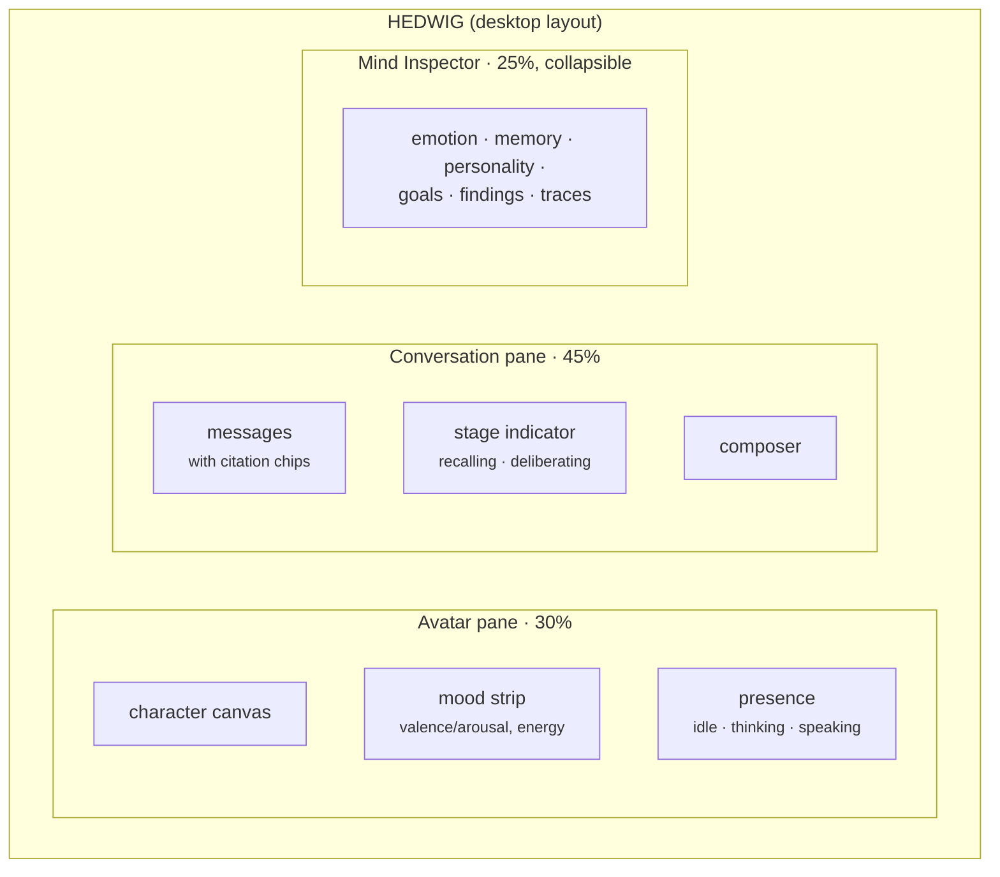
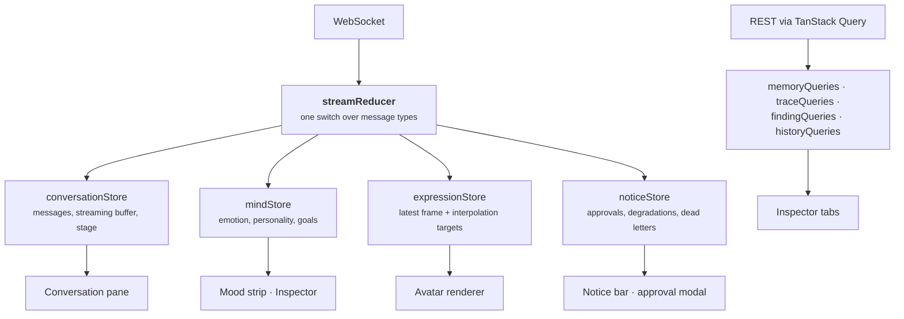
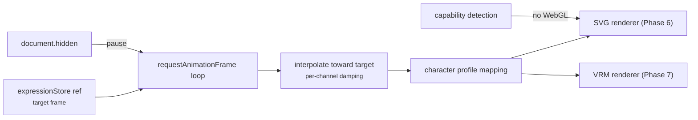
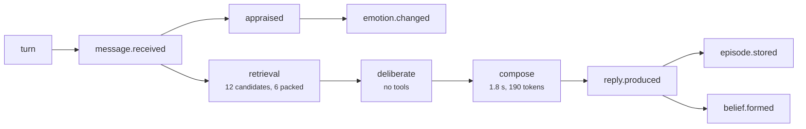

# 18 — Frontend Architecture

**Status:** Design · **Depends on:** [15](15-avatar-controller.md), [16](16-api-structure.md) · **Depended on by:** [22](22-roadmap.md)

---

## 1. Purpose

The web client. Three panes: talk to HEDWIG, see HEDWIG, and *see inside* HEDWIG. The third
is the one that distinguishes this from a chat UI, and it is not optional — a system with
memory, emotion, personality and autonomous background work is undebuggable and untrustworthy
without a window into it ([01](01-vision-and-scope.md) §6).

---

## 2. Layout



Responsive behaviour: below 1100 px the inspector becomes a drawer; below 700 px the avatar
becomes a small header portrait and the conversation takes the screen. The conversation is
never the pane that gets sacrificed.

---

## 3. Stack

| Concern | Choice | Why |
|---|---|---|
| Framework | React 18 + TypeScript | Boring, well-understood, best 3D ecosystem |
| Build | Vite | Fast, minimal config |
| State | Zustand + one WebSocket reducer | Small; mirrors the backend's event-stream model without ceremony |
| Data fetching | TanStack Query for REST | Caching, invalidation, retries — all things we would otherwise write badly |
| Styling | CSS modules + design tokens | No runtime cost, no framework lock-in, theme-able |
| Charts | `visx` (or hand-rolled SVG) | Small bundles; the charts here are simple |
| 3D | three.js + `@pixiv/three-vrm` (Phase 7) | Standard, and VRM is the only practical avatar interchange format |
| 2D avatar | Inline SVG with CSS transforms (Phase 6) | Expressive, tiny, no dependencies |
| Testing | Vitest + Testing Library + Playwright | Unit, component, end-to-end |
| Desktop shell | Electron ([ADR-0015](adr/0015-electron-desktop-shell.md)) | Loads the same app; injects the API base URL through a frozen `window.hedwig` and nothing else |

Deliberately omitted: Redux, a component library, a CSS framework, GraphQL, SSR. Each would add
weight or lock-in for a single-user local app served from the backend.

---

## 4. State flow

The whole client is a projection of one event stream plus REST reads. This is the frontend
mirror of the backend's design, and it keeps the two easy to reason about together.



Rules:

1. **One WebSocket, one reducer.** No component opens its own connection or subscribes
   directly.
2. **The transport layer is isolated** in `src/transport/` — a different client (React
   Native, a terminal UI) reuses it unchanged. It resolves the backend's base URL from
   `window.hedwig` when running inside the desktop shell, and falls back to relative URLs
   so the Vite dev proxy works in a plain browser. Nothing above `transport/` knows which
   of the two it is running in.
3. **Expression frames bypass React state.** They go into a mutable ref consumed by the render
   loop. Sixty state updates a second through React is how a UI becomes unusable.
4. **Optimistic user messages** appear immediately with a pending state, reconciled by
   `client_message_id`.
5. **Reconnection is invisible.** Exponential backoff, `last_event_id` replay, a subtle
   indicator only.

---

## 5. Conversation pane

| Feature | Detail |
|---|---|
| Streaming | Tokens appended to a buffer; render throttled to ~30 fps |
| Stage indicator | `turn.stage` → "recalling…", "reading documentation…", "thinking…". Makes a 2 s wait feel considered rather than broken |
| Citation chips | `cited_memory_ids` render as small chips under a reply; clicking opens the memory in the inspector |
| Confidence surfacing | Claims from `tentative` or `untrusted` sources are marked, hedged in text and visually |
| Feedback | Thumb up/down and "too long"/"too short" on each reply — the cheapest, highest-value personality evidence there is |
| Interrupt | A stop button that sends `interrupt` |
| Approval | Modal showing the exact tool and arguments, with approve / deny / edit |
| Session boundaries | Visible markers with the session summary once T1 has run |
| Markdown | Rendered with a strict sanitiser and syntax highlighting; HEDWIG's output is not trusted as HTML |

Citation chips deserve emphasis: they are how the memory system becomes *visible*. A reply
that says "you mentioned Lisbon last month" with a clickable chip proving it turns an assertion
into something the user can verify — and that single affordance does more for trust than any
amount of tuning.

---

## 6. Avatar pane



| Concern | Approach |
|---|---|
| Frame rate | 60 fps target, 30 fps on battery, paused when the tab is hidden |
| Interpolation | Client-side, per channel, matching the backend's damping constants ([15](15-avatar-controller.md) §5) |
| Renderer selection | `?renderer=2d\|3d\|none`, capability-detected default, hard fallback to 2D |
| Budget | 2 ms/frame; exceeding it for 2 s reduces quality automatically |
| Accessibility | "Reduce motion" honoured (`prefers-reduced-motion`): idle animation off, expression changes become instant |
| Calm mode | A user setting that flattens all expression — for people who find an animated face distracting |
| Renderer independence | The renderer receives semantic frames only; it never reads the mind store |

---

## 7. Mind Inspector

The reason this project is debuggable. Six tabs.

| Tab | Content | Powered by |
|---|---|---|
| **Emotion** | Eight-dimension live readout; timeline with selectable range; the appraisal that caused each change, with the event that triggered it | `/mind/emotion`, `/mind/emotion/history` |
| **Memory** | Search as HEDWIG searches, with score breakdowns; timeline of episodes; belief browser with confidence and supersession history; lineage graph; pin/forget/correct actions | `/memory/*` |
| **Personality** | Trait bars with anchor, current value, bounds, and lifetime drift; change history with evidence; rejected proposals with the rule that fired; revert buttons | `/mind/personality*` |
| **Goals** | Active/blocked/done board; provenance; progress | `/goals` |
| **Findings** | The curiosity feed (the passive delivery channel), gap register, source allowlist, budget usage | `/curiosity/*` |
| **Traces** | Turn list; per turn: the causal event graph, retrieval breakdown, prompt sections, token counts, timings — i.e. `/explain` rendered | `/traces/*`, `/explain/*` |

Design principles for the inspector:

1. **Read-mostly, but not read-only.** Pin, correct, forget, revert drift, dismiss findings.
   Observation without the ability to fix is frustrating.
2. **Every number is traceable.** Clicking a score shows its breakdown; clicking a memory shows
   its provenance; clicking a trait change shows its evidence.
3. **Honest about uncertainty.** Tentative beliefs, untrusted sources and low confidence are
   visually distinct. The inspector must not make HEDWIG look more certain than it is.
4. **It is a debugging tool for the developer and a trust instrument for the user** — the same
   surface serves both, which is why it is built in Phase 5 rather than "later".

### 7.1 The trace view



Rendered from `correlation_id`/`causation_id` ([04](04-communication-and-event-bus.md) §6),
with timings on each node. This is the view that answers "why was that slow?" and "why did it
say that?" in one place.

---

## 8. Component structure

```
frontend/src/
├── transport/          ← WS client, REST client, envelope types (reusable by any client)
│   ├── socket.ts  rest.ts  types.ts  reducer.ts
├── stores/             ← conversation · mind · expression · notices
├── panes/
│   ├── conversation/   ← MessageList, Message, Composer, StageIndicator, CitationChip
│   ├── avatar/         ← AvatarCanvas, renderers/{svg,vrm}, characterProfile.ts
│   └── inspector/      ← tabs/{emotion,memory,personality,goals,findings,traces}
├── components/         ← primitives: Button, Tabs, Sparkline, Gauge, Timeline, LineageGraph
├── design/             ← tokens.css, theme.ts
└── app/                ← layout, routing, error boundaries
```

Rules: panes never import each other; shared behaviour goes to `components/` or `stores/`;
`transport/` imports nothing from the app. The generated API types from the checked-in OpenAPI
schema are the single source of truth for REST shapes, so a backend change that breaks the
client fails the build rather than the browser.

---

## 9. Tradeoffs

| Decision | Gained | Given up | Revisit if |
|---|---|---|---|
| React + TS + Vite | Boring, hireable, good 3D story | Bundle size vs. Svelte/Solid | Bundle size becomes a real problem for a local app (it will not) |
| Zustand + one reducer | Minimal ceremony, mirrors the backend | Less structure than Redux at scale | The reducer exceeds ~300 lines |
| Frames bypass React | Smooth avatar | Expression state is not in the store (dev tools cannot see it) | Add a throttled mirror for debugging only |
| Inspector as a first-class pane | Debuggability and trust | Significant UI work | Never |
| Served by the backend | One process, no CORS in practice | Coupled release | A separate frontend deployment is wanted |
| 2D avatar first | Ships in Phase 6, validates the protocol | Less impressive early | Never |
| Generated types from OpenAPI | Backend/frontend drift is a build error | A codegen step | Never |
| No component library | No lock-in, exact control, tiny bundle | We build primitives ourselves | Primitive count exceeds ~25 |

---

## 10. Failure modes

| Failure | Symptom | Mitigation |
|---|---|---|
| WebSocket drops | UI appears frozen | Backoff reconnect with `last_event_id` replay; a visible but subtle connection indicator |
| Backend unreachable | Blank UI | Explicit "HEDWIG is not running" state with the exact command to start it |
| Model unavailable | Messages fail | Notice bar explains it; the inspector still works, so the user can see everything except chat |
| Avatar jank | Whole UI stutters | Frame budget, quality reduction, 2D fallback, pause when hidden |
| Huge memory result set | Inspector hangs | Cursor pagination, virtualised lists, server-side limits |
| Streaming buffer growth on a very long reply | Memory growth in the tab | Throttled rendering, hard cap with a "reply truncated" marker |
| Stale cache after a memory edit | UI shows old data | TanStack Query invalidation keyed on the memory event stream |
| XSS via model output or fetched content | Script execution | Strict markdown sanitiser, no `dangerouslySetInnerHTML`, CSP header from the backend |
| Two tabs open | Duplicate streams | Both work independently; presence is last-write-wins ([16](16-api-structure.md) §9) |

---

## 11. Testing

- **Reducer unit tests** — every message type, including out-of-order and duplicate delivery.
- **Component tests** — streaming render, citation chips, approval modal, feedback controls.
- **Renderer tests** — golden frame sequences produce expected SVG attribute values; capability
  fallback works; reduced-motion honoured.
- **End-to-end (Playwright)** — a full turn against a real backend with recorded LLM fixtures:
  send, stream, cite, inspect, correct a memory, revert a trait.
- **Reconnection test** — drop the socket mid-stream; assert the reply completes correctly
  after replay.
- **Accessibility** — keyboard navigation of all panes, screen-reader labels on every chart,
  contrast checks, reduced-motion.
- **Type-drift test** — regenerate API types in CI; a diff fails the build.

---

## 12. Future improvements

| Improvement | Trigger |
|---|---|
| ~~Desktop shell~~ | Done in Milestone 1 — Electron, [ADR-0015](adr/0015-electron-desktop-shell.md) |
| OS notifications, tray presence, global shortcut | Phase 7 proactivity, when there is something worth surfacing |
| Voice input/output UI | Speech adapters land |
| Memory graph visualisation (entities and links) | The lineage graph proves useful and users want to browse laterally |
| Diff view for the monthly identity report | T4 lands |
| Mobile client | The WS protocol has been stable for a phase |
| Theming / multiple character skins | Character profiles already support it |
| Offline shell (service worker) with a read-only cached inspector | Users want to browse memory while the backend is stopped |
