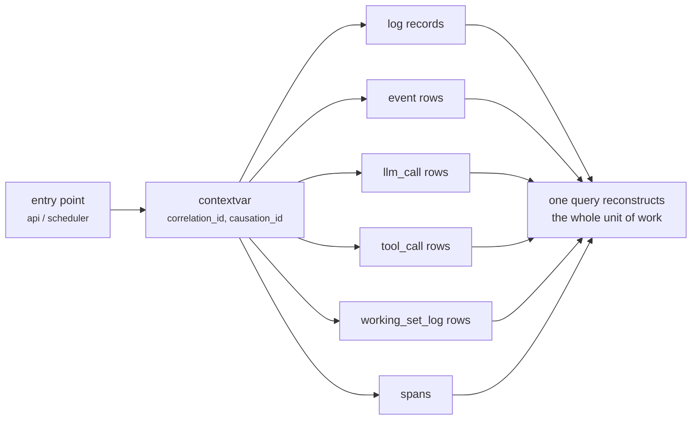

# 19 — Observability

**Status:** Design · **Depends on:** [04](04-communication-and-event-bus.md), [16](16-api-structure.md) · **Depended on by:** [20](20-testing-strategy.md)

---

## 1. Purpose

HEDWIG has emergent behaviour: what it says depends on retrieval, emotion, personality,
procedures and background work that ran while nobody was watching. "Why did it do that?" is the
default question, and an architecture that cannot answer it is unmaintainable regardless of how
clean the module boundaries are.

Observability here is ranked fourth in the quality attributes ([01](01-vision-and-scope.md) §6),
above responsiveness. It is a **product feature**, not operations hygiene: the same records
that let a developer debug a bad answer let the user see why HEDWIG believes something.

---

## 2. The three questions

Everything in this document exists to answer one of three questions cheaply:

| Question | Asked by | Answered by |
|---|---|---|
| **Why did HEDWIG say that?** | User and developer | `/v1/explain/{message_id}` ([16](16-api-structure.md) §6) |
| **What happened in this turn/job, and where did the time go?** | Developer | Trace view over `correlation_id` |
| **Is HEDWIG healthy over time?** | Both | Metrics + `/health` + the weekly report |

---

## 3. Correlation

Every unit of work gets a `correlation_id` at its entry point: `turn_<ulid>` for turns,
`job_<ulid>` for jobs, `req_<ulid>` for bare API requests. It flows through:



Propagation uses `contextvars`, so it survives `await` boundaries and task spawning without
being threaded through every signature. A background task spawned from a turn inherits the
correlation id and records the turn's id as its `causation_id` — which is how "the nightly job
that formed this belief traces back to Tuesday's conversation" becomes a single query.

`causation_id` chains events into the causal graph rendered in the inspector
([04](04-communication-and-event-bus.md) §6).

---

## 4. Logging

Structured JSON lines, one schema:

```jsonc
{
  "ts": "2026-07-30T18:22:03.114Z",
  "level": "info",
  "logger": "hedwig.retrieval",
  "msg": "working set assembled",
  "correlation_id": "turn_01JQ8Z...",
  "span": "recall",
  "duration_ms": 78,
  "fields": { "candidates": 63, "packed": 8, "dropped": 55, "tokens": 2841 }
}
```

| Rule | Detail |
|---|---|
| No string interpolation of data | Data goes in `fields`, so logs are queryable with `jq` |
| Levels mean something | `debug` = developer detail; `info` = a thing happened; `warn` = degraded but handled; `error` = a failure a human should see; nothing else |
| Content redaction | Message text, memory content and prompts are **not** logged by default. Logs carry ids, counts and digests. Full-content tracing is an explicit opt-in flag with a session-scoped lifetime |
| One log line per meaningful operation | Not per loop iteration; verbosity is worse than silence because it hides the signal |
| Rotation | 50 MB × 5 in `~/.hedwig/logs/` |

The redaction default matters: a companion's logs would otherwise be the least protected copy
of the most personal data on the machine.

---

## 5. Tracing

Lightweight in-process spans, written to a `span` table when tracing is enabled (always on for
turns, sampled at 10 % for background jobs).

```
turn_01JQ8Z (2140 ms)
├── ingest              4 ms
├── guard               6 ms
├── snapshot            3 ms
├── plan_queries      148 ms   [llm utility, 62 tok out]
├── recall             78 ms
│   ├── lexical        11 ms   (30 candidates)
│   ├── semantic       26 ms   (30 candidates)
│   ├── structural      9 ms   (14 candidates)
│   ├── fusion          2 ms
│   └── pack            5 ms   (8 items, 2841 tok, 55 dropped)
├── deliberate        162 ms   [llm utility]
├── compose          1690 ms   [llm conversational, first token 620 ms]
├── express             2 ms
└── finalize           31 ms
```

No OpenTelemetry by default: a local single-user application does not need a collector, and the
dependency would be larger than the module it instruments. An OTLP exporter is a future adapter
behind the same span API for anyone who wants one.

**First-token latency is measured separately from total** — it is the number that determines
whether HEDWIG feels responsive, and total duration hides it.

---

## 6. Metrics

Prometheus text format at `/v1/metrics`, scrapeable or just readable by a human.

### 6.1 Health and performance

| Metric | Type | Alert threshold |
|---|---|---|
| `hedwig_turn_duration_seconds` | histogram (by status) | p95 > 6 s |
| `hedwig_first_token_seconds` | histogram | p95 > 2.5 s |
| `hedwig_llm_call_duration_seconds` | histogram (tier, purpose) | — |
| `hedwig_llm_schema_failures_total` | counter (purpose) | rate > 2 % |
| `hedwig_db_query_duration_seconds` | histogram (repository) | p99 > 100 ms |
| `hedwig_bus_queue_depth` | gauge (subscription) | > 100 sustained |
| `hedwig_bus_dead_letters_total` | counter | any |
| `hedwig_task_restarts_total` | counter (task) | > 3/hour |
| `hedwig_governor_yield_seconds` | histogram | p95 > 2 s |

### 6.2 Cognitive health

These are the unusual ones, and the ones that matter most for this system. Each maps to a
failure mode named in a subsystem document.

| Metric | Watching for | Failure it detects |
|---|---|---|
| `hedwig_memories_total{kind,status}` | Store composition over time | Duplicate explosion; store bloat |
| `hedwig_memories_forgotten_total` | Forgetting rate | Mass amnesia ([06](06-memory-architecture.md) §7.3) |
| `hedwig_retrieval_dropped_ratio` | Budget pressure | Context flooding; retrieval starvation |
| `hedwig_retrieval_recall_at_5` | Eval-time recall | Retrieval regression |
| `hedwig_beliefs_tentative_ratio` | Confabulation pressure | Unverified beliefs accumulating |
| `hedwig_emotion_dimension` (gauge per dim) | State distribution | Runaway dimension; flatline ([09](09-emotion-engine.md) §9) |
| `hedwig_emotion_variance_7d` | Is there any emotional life? | Flatline |
| `hedwig_personality_drift_applied_total` | Is personality evolving? | Flatline (the *likely* failure, given seven guardrails) |
| `hedwig_personality_drift_rejected_total{rule}` | Which guardrail fires most | Mis-tuned thresholds |
| `hedwig_reflection_runs_total{tier,status}` | Is reflection happening? | Silent degradation |
| `hedwig_reflection_lag_hours{tier}` | How stale consolidation is | Missed nightly runs |
| `hedwig_curiosity_promotion_ratio` | Findings that were worth it | Budget burn with no value |
| `hedwig_curiosity_dismissal_ratio` | Are proactive items unwanted? | Nagging (>30 % is a design bug) |
| `hedwig_injection_quarantined_total` | Attack attempts | Active exploitation |

`hedwig_personality_drift_applied_total` being zero for eight weeks is a bug report, not a
calm month. Metrics that detect *absence of designed behaviour* are the ones a system like this
most needs, and they are the ones most often missing.

---

## 7. Health endpoint

```jsonc
{
  "status": "degraded",
  "version": "0.7.2", "schema_version": 14,
  "uptime_s": 84213,
  "subsystems": {
    "database":  { "status": "ok", "size_mb": 412, "wal_mb": 3 },
    "models":    { "status": "degraded", "conversational": "ok",
                   "utility": "ok", "embedding": "model_changed_pending_reembed" },
    "indexes":   { "status": "degraded", "vector": "rebuilding", "progress": 0.62 },
    "bus":       { "status": "ok", "max_queue_depth": 3, "dead_letters": 0 },
    "jobs":      { "status": "ok", "last_t2": "2026-07-30T03:12:00Z",
                   "last_t3": "2026-07-26T03:40:00Z" },
    "tasks":     { "status": "ok", "restarts_1h": 0 }
  },
  "notices": [
    { "level": "warn", "code": "reembed_in_progress",
      "message": "Search is lexical-only until re-embedding completes." }
  ]
}
```

Notices are the user-facing channel: anything that changes behaviour in a way the user could
notice appears here and in the notice bar. Silent degradation is the failure mode this prevents
— a HEDWIG whose semantic search has been off for a week while it answered worse is far worse
than one that says so.

---

## 8. Weekly self-report

T3 reflection produces an operational report alongside its cognitive work
([12](12-reflection-engine.md) §6): turn counts and latencies, memory formed/merged/forgotten,
retrieval health, drift applied and rejected, curiosity value, errors and dead letters, database
growth.

Its purpose is to make slow degradation visible. Most failures in a system like this are not
crashes; they are gradual — retrieval quality drifting down, reflection falling behind, the
store filling with duplicates. A weekly report is the cheapest instrument that catches trends a
dashboard nobody opens will not.

---

## 9. Tradeoffs

| Decision | Gained | Given up | Revisit if |
|---|---|---|---|
| Content redacted from logs by default | Privacy by default (INV-8) | Harder debugging without opting in | Never |
| Home-grown spans, not OpenTelemetry | No collector, tiny dependency footprint | No ecosystem tooling | Someone wants to ship traces off-box (then add an exporter) |
| Cognitive metrics as first-class | Detects the failures that matter here | More instrumentation | Never |
| `/explain` as an assembly of existing records | No duplicate instrumentation | Constrains other subsystems to record enough | Never |
| Sampled tracing for background jobs | Bounded storage | Some job detail lost | A job bug is hard to reproduce (then raise the rate temporarily) |
| Weekly report | Catches slow degradation | Effort; may go unread | Never — it is also the input to tuning |
| Metrics in Prometheus format with no server | Human-readable, tool-compatible | No built-in dashboard | Users ask for one; the inspector already covers most needs |

---

## 10. Failure modes

| Failure | Mitigation |
|---|---|
| Observability overhead slows turns | Span writes are batched and async; a budget test asserts <2 % overhead |
| Log growth fills the disk | Rotation, plus the disk-space check in [17](17-backend-architecture.md) §12 |
| Trace tables grow unbounded | 90-day retention aligned with `working_set_log` |
| Sensitive data leaks into logs | Redaction by default; a CI test greps test-run logs for known fixture message text |
| Metrics endpoint exposed | Same auth as the rest of the API |
| Alert fatigue | Only the thresholds in §6 raise notices; everything else is a metric you can look at |
| Nobody looks at any of it | The weekly report and the notice bar push the important parts into the UI |

---

## 11. Testing

- **Correlation propagation test** — one turn; assert every log, event, `llm_call`, `tool_call`
  and span row shares the correlation id, including work in spawned tasks.
- **Explain completeness test** — for a turn using memory, a tool and a drifted personality,
  every field of `/explain` is populated and every reference resolves.
- **Redaction test** — run a turn with known fixture text; grep logs and spans for it; must not
  appear.
- **Overhead test** — turn latency with tracing on vs. off; assert <2 %.
- **Metric presence test** — every metric named in §6 is emitted by a real run (a test that
  catches metrics that were designed and never wired).
- **Causal graph test** — a known event chain reconstructs into the expected tree.

---

## 12. Future improvements

| Improvement | Trigger |
|---|---|
| OTLP exporter behind the span API | Someone wants off-box tracing |
| Retrieval quality dashboard fed by continuous shadow evals | Phase 8 |
| Automatic anomaly detection on cognitive metrics | ≥3 months of baseline data |
| "Time machine": scrub the inspector to any past moment | Identity snapshots + emotion history already make this mostly possible |
| Regression bisection by `prompt_version` × `model_id` | First serious unexplained quality regression |
| Crash-report bundle (`hedwig doctor`) | First remote debugging session |
