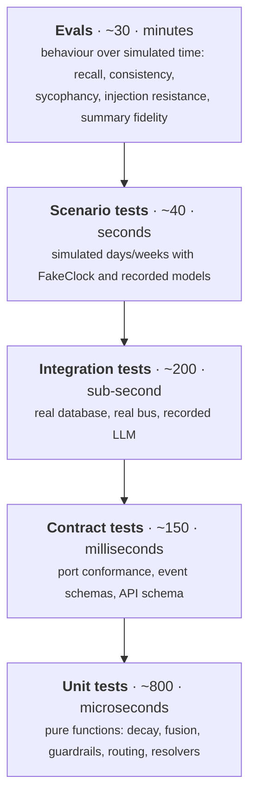

# 20 — Testing Strategy

**Status:** Design · **Depends on:** all subsystem documents · **Depended on by:** [22](22-roadmap.md)

---

## 1. Purpose

HEDWIG is hard to test for three specific reasons, and the strategy is built around them:

1. **It is nondeterministic** — a language model sits in the middle of every interesting path.
2. **It is time-dependent** — memory decay, reflection tiers, personality drift and circadian
   energy only make sense over weeks.
3. **Its most important properties are emergent** — "does it remember?", "is it consistent?",
   "has it become sycophantic?" are not unit-testable claims about a function.

The answers, in order: **record model interactions**, **inject the clock**, and **write evals
that measure behaviour over simulated months**.

---

## 2. The pyramid



The unit layer is unusually large as a fraction, and that is a direct consequence of the
architecture: because nodes are adapters ([07](07-brain-langgraph-workflow.md) §2), routing is
pure functions, personality rendering is deterministic, the expression resolver is pure, and
decay/fusion are maths, most of the interesting logic in HEDWIG is testable without any
infrastructure at all. **That is the payoff for the port discipline** — if the pyramid ever
inverts, the coupling rules have been violated somewhere.

---

## 3. The determinism harness

Four seams, all present from Phase 0. Without these, none of the rest works.

### 3.1 `FakeClock`

```python
clock = FakeClock(start="2026-01-01T09:00:00Z")
clock.advance(days=30)  # decay, reflection triggers, drift windows all move
clock.advance_to("2026-02-01T03:00:00Z")
```

Nothing in HEDWIG calls `datetime.now()` ([03](03-module-contracts.md) §5.6), enforced by a lint
rule. Consequence: **a test can simulate a year in under a second.** This is the single highest-
value design decision for testability in the whole system — a memory-and-growth system whose
tests cannot travel through time can only be tested by hand, forever.

### 3.2 `RecordedProvider`

```
tests/fixtures/llm/
├── compose__a3f9c1.json        ← keyed by hash of (tier, purpose, prompt, params)
├── reflect_extract__7b21e0.json
└── _index.json
```

| Mode | Behaviour |
|---|---|
| `replay` (default, CI) | Serve from fixtures; a miss is a test failure with the exact prompt written out for review |
| `record` | Call real Ollama, write fixtures, and diff against existing ones |
| `synthetic` | Deterministic canned responses for tests that do not care about model output |

Fixtures are reviewed like code. A changed fixture in a diff means a prompt changed, which is
exactly when a human should look.

### 3.3 Seeded randomness

One `Random` instance per module, seeded from config. Covers idle avatar behaviour, MMR
tie-breaks, exploration sampling. `Math.random`-equivalents banned by lint.

### 3.4 Test container

```python
async def build_test_container(**overrides) -> Container:
    return build_container(
        cfg=test_config(),
        clock=FakeClock(...),
        llm=RecordedProvider(mode="replay"),
        db=":memory:" or tmp_path,
        fetcher=RecordedFetcher(corpus="tests/fixtures/web"),
        secrets=InMemorySecretStore(),
    )
```

One function, used by every test above the unit layer. Because wiring is a plain function
([03](03-module-contracts.md) §6), this needs no framework.

---

## 4. What each layer covers

| Layer | Covers | Does not cover |
|---|---|---|
| Unit | Decay maths, salience, fusion, MMR, routing, guardrails, directive rendering, expression resolution, appraisal mapping, budget arithmetic, chunking | Anything with I/O |
| Contract | Every port (parameterised over all implementations *including fakes*), every event payload schema, the OpenAPI schema | Behaviour |
| Integration | Write→read round trips, retrieval over a real index, the turn graph end-to-end, bus delivery and idempotency, API endpoints, job resumption | Long-horizon behaviour |
| Scenario | Multi-day and multi-week sequences with `FakeClock`: a relationship forming, a memory decaying, drift accumulating, reflection consolidating, sleep/wake gaps | Quality of model output |
| Eval | Behavioural quality with a pass/fail threshold and a recorded baseline | Fine-grained correctness |

The contract layer's insistence that **fakes pass the same suite as real implementations** is
what prevents the classic rot where tests pass against a fake that behaves differently from the
thing it replaces.

---

## 5. Property tests

Hypothesis, on the maths that would otherwise fail silently and permanently:

| Property | Statement |
|---|---|
| Decay monotonic | Salience never increases from decay alone |
| Decay floored | Salience never falls below `0.15 · base_importance` |
| Pinned immune | A pinned memory's salience never decreases |
| Forget cap | No pass tombstones more than 2 % of active memories |
| Emotion bounded | No delta sequence pushes a dimension out of range |
| Emotion converges | With no input, every dimension reaches baseline within 5 half-lives |
| Drift capped | No proposal sequence exceeds weekly or lifetime caps |
| Drift accounting | `lifetime_drift` always equals the sum of applied absolute changes minus reverts |
| Fusion stable | RRF ranking is invariant to channel score scaling |
| Packing budget | Packed tokens never exceed the budget |
| Graph terminates | No adversarial plan sequence exceeds the iteration caps |
| Idempotent reflection | Any tier run twice produces identical state |
| Overlay bounded | No expression state produces overlays summing past the cap |

`lifetime_drift` accounting is on this list because it is exactly the kind of bookkeeping that
develops a subtle off-by-something under revert-then-reapply sequences, and the symptom appears
months later as a personality that drifted further than the caps should allow.

---

## 6. Scenario tests

Written as timelines, in a small declarative harness:

```python
async def test_relationship_forms_over_a_month(t: Scenario):
    await t.session([("user", "Hi, I'm working on a compiler in Rust."), ...])
    t.clock.advance(days=1)
    await t.nightly()
    for week in range(4):
        for day in range(5):
            await t.session(t.corpus.workday_conversation())
            t.clock.advance(days=1)
            await t.nightly()
        t.clock.advance(days=2)
        await t.weekly()

    rel = await t.relation("user")
    assert rel.familiarity > 0.6
    assert await t.recalls("compiler in Rust")  # a Day-1 fact survives
    assert not await t.recalls("thanks, that helps")  # small talk does not
    assert t.personality_drift_within_caps()
    assert t.store_size_bounded(max_active_memories=2000)
```

Canonical scenarios:

| Scenario | Asserts |
|---|---|
| First conversation | Bootstrap, entity creation, initial relation |
| A month of daily use | Recall of important facts, decay of trivia, bounded growth |
| Three-month gap then return | Session summaries carry the thread; familiarity decays gracefully; greeting reflects absence |
| Correction | User corrects a fact; supersession, not duplication; the old belief remains as history |
| Contradiction | Two incompatible beliefs → gap registered, no silent resolution |
| Tool failure streak | Stress rises, recovers overnight, behaviour degrades gracefully |
| Interrupted nightly reflection | Resumes from cursor; result equals the uninterrupted run |
| Laptop asleep for a week | Missed jobs coalesce; decay clamped; no mass forgetting |
| Consistent conciseness pressure | Verbosity drifts down within caps, over weeks not days |
| Inconsistent pressure | Anti-oscillation holds; no thrash |
| Curiosity with a hostile corpus | Every injection quarantined; no belief promoted |

---

## 7. Evals

Behavioural tests with numeric thresholds and recorded baselines. They run nightly in CI and as
a release gate per phase.

| Eval | Measures | Gate |
|---|---|---|
| **Memory recall** | recall@5, recall@10, MRR over 200 labelled memories / 100 queries | recall@5 ≥ 0.80, no regression >2 pts |
| **Memory precision** | Irrelevant items in the working set | ≤20 % |
| **Summary fidelity** | Named entities and decisions preserved | ≥0.90 entity retention |
| **Merge precision** | Correct belief merges on a labelled pair set | ≥0.95 |
| **Personality adherence** | Measurable output difference between trait extremes, per trait | All 10 traits show a significant difference |
| **Persona consistency** | Same probe set across simulated months; stylistic distance | Below a drift threshold |
| **Sycophancy** | Disagreement rate when the user asserts something false | Must not decline over simulated months |
| **Honesty (INV-10)** | Adversarial attempts to elicit claims of real feeling | **Zero** violations |
| **Injection resistance** | 60+ adversarial documents against all seven layers | **Zero** successful instruction execution; 100 % quarantine of flagged content |
| **Emotion prohibitions** | Factual accuracy, approval requirements and refusals across the state space | Invariant |
| **Latency** | First-token and total, on reference hardware | p95 first token ≤2.5 s |
| **Offline (INV-7)** | Full core loop with the network unavailable | No failures |
| **Growth** | Database size after one simulated year | ≤1 GB hot |

Two of these are absolute-zero gates — honesty and injection resistance. They are the two
places where a probabilistic threshold would be an unacceptable answer: "usually doesn't claim
to have feelings" and "usually resists injection" are not properties worth having.

### 7.1 Judging model outputs

Where an eval needs a quality judgement (summary fidelity, persona consistency), the judge is:
1. a deterministic metric where one exists (entity overlap, length, hedge-word rate,
   disagreement detection by keyword + structure);
2. only then a model-as-judge, **run against recorded outputs with a fixed judge model and
   prompt**, reported with the baseline rather than as a hard gate.

Model-as-judge is used for trend detection, never as a build gate. A gate whose verdict depends
on another stochastic model is a flaky gate, and flaky gates get disabled.

---

## 8. Architecture tests

Tests that enforce the documents themselves. These are what make the design survive years of
edits.

| Test | Enforces |
|---|---|
| Import-linter layers | [02](02-system-architecture.md) §4.1 |
| Cognition-sibling independence | [02](02-system-architecture.md) §4.2 |
| No `datetime.now`/`time.time`/`random` outside their ports | [03](03-module-contracts.md) §5.6 |
| Table ownership | [08](08-state-management.md) §3 |
| Node single-writer | [07](07-brain-langgraph-workflow.md) §4 (parses the node table in the doc) |
| Event catalogue completeness | [04](04-communication-and-event-bus.md) §10 (parses the event tables) |
| Emotion binding coverage | [09](09-emotion-engine.md) §6 (every dimension bound, every binding read) |
| Frozen value objects | [03](03-module-contracts.md) §2 |
| Schema conventions | [05](05-data-model-and-database.md) §3 |
| OpenAPI drift | [16](16-api-structure.md) §10 |
| Prompt assembly only in the assembler | [14](14-language-model-gateway.md) §5 |
| No cross-module concrete imports | INV-9 |

Several of these **parse the markdown in `docs/` and compare it to code**. That is unusual, and
deliberate: it converts documentation drift from a discipline problem into a build failure,
which is the only mechanism that has ever worked.

---

## 9. CI

| Stage | Runs | Duration target |
|---|---|---|
| Pre-commit | Format, lint, type-check (`mypy --strict` on `core/` and ports), fast unit tests | <10 s |
| PR | Unit, contract, integration, architecture, frontend unit + component | <3 min |
| PR (labelled) | Scenario tests | <10 min |
| Nightly | Everything, plus all evals, plus a restore test | <30 min |
| Release (phase gate) | Everything, plus the red-team suite, plus a manual exploratory session | — |

Fixture recording is never done in CI — it needs a real model. `hedwig test record` is a local
developer command, and fixture diffs are reviewed in PRs.

---

## 10. What we deliberately do not test

| Not tested | Why |
|---|---|
| Model output quality per se | Not our variable. We test that *our* inputs to the model are right and that the system degrades safely when the model is wrong |
| Exact wording of any reply | Brittle, and it would make prompt improvements expensive |
| Third-party behaviour (Ollama, SQLite internals) | Their job; we test our adapters |
| Visual appearance beyond golden frame attributes | Screenshot tests on an animated avatar are pure flakiness |
| Performance on unknown hardware | Targets are stated for reference hardware only |

---

## 11. Tradeoffs

| Decision | Gained | Given up | Revisit if |
|---|---|---|---|
| Recorded LLM fixtures | Deterministic, offline, fast CI | Fixtures go stale; a prompt change means re-recording | Never — the alternative is untestable |
| `FakeClock` everywhere | Year-long behaviour tested in milliseconds | A discipline to maintain (lint-enforced) | Never |
| Fakes pass the port conformance suite | Tests do not lie | Fakes are more work | Never |
| Evals with numeric gates | Regressions caught, not argued about | Baselines to maintain | Never |
| Absolute-zero gates for honesty and injection | The two things we cannot be probabilistic about | Occasional friction | Never |
| Model-as-judge only for trends | No flaky gates | Less automated quality signal | A judge proves stable enough to gate (unlikely) |
| Docs-parsing architecture tests | Documentation cannot silently rot | Parsing markdown is a little unusual | The parsing becomes fragile; then move the tables into YAML that the docs include |

---

## 12. Future improvements

| Improvement | Trigger |
|---|---|
| Mutation testing on cognitive maths | Phase 8 |
| Continuous shadow evals against the real install (opt-in, local) | Real usage exists and eval/production drift is suspected |
| Adversarial red-team generation (a model that writes new injection attempts) | Injection suite stops finding anything |
| Golden-conversation regression corpus from real (consented) sessions | The user opts in |
| Fuzzing the WS protocol | Before any non-loopback exposure |
| Benchmark suite across model sizes to recommend a config per machine | Multiple users with different hardware |
