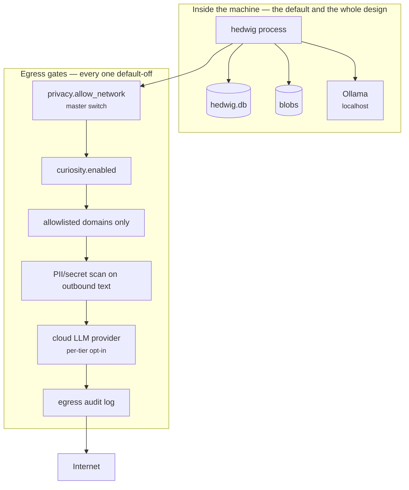
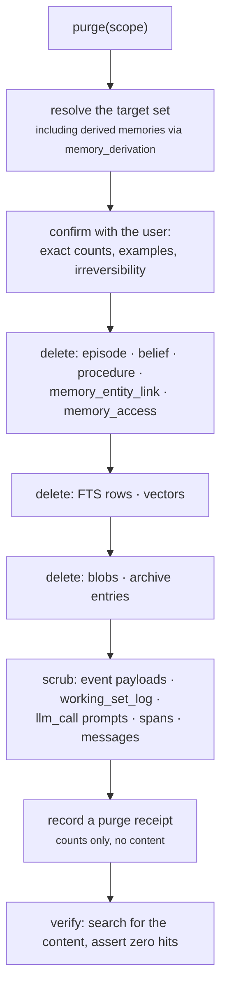

# 21 — Security, Privacy and Ethics

**Status:** Design · **Depends on:** [11](11-curiosity-engine.md), [13](13-knowledge-and-tools.md) · **Depended on by:** [22](22-roadmap.md)

---

## 1. Purpose

HEDWIG accumulates the most personal dataset most people will ever hold about themselves, runs
autonomously, ingests hostile third-party content, and is explicitly designed to be believable
and to be attached to. Each of those is a distinct risk class, and the last one is not a
security issue in the usual sense but is the most consequential.

This document covers all four: the threat model, the privacy architecture, the ethical
invariants, and the user's control surface.

---

## 2. Assets and threat model

| Asset | Why it matters | Worst case |
|---|---|---|
| `hedwig.db` | Years of conversation, beliefs about the user, relationship state | Total privacy loss; the most sensitive file on the machine |
| Blobs and archive | Documents, fetched content, tombstoned memories | Same |
| API token | Full access to everything above | Same, remotely |
| The user's trust | The product | Manipulation, dependency, betrayal |
| Model integrity | What HEDWIG believes and does | Injected beliefs, injected actions |

| Threat | Vector | Primary control |
|---|---|---|
| **Prompt injection** | Fetched web content, local documents, tool output | Trust tiers + capability denial ([13](13-knowledge-and-tools.md) §6) |
| **Trust laundering** | Untrusted content becoming a trusted belief | Trust tier persists on derived memories forever |
| **Local process snooping** | Another process on the machine hitting the API | Loopback bind + bearer token |
| **Browser-based access** | A malicious page reaching `localhost` | Token required; strict CORS; no cookie auth (so nothing is sent automatically) |
| **Data exfiltration by HEDWIG itself** | Curiosity engine queries, optional cloud provider | Double opt-in, PII scan before egress, full egress audit log |
| **Physical/backup access** | Disk theft, cloud-synced backup directory | Optional at-rest encryption (deferred); documentation warning; backups stay inside `~/.hedwig` |
| **Secret leakage** | Keys in ingested documents, secrets in logs | Ingest-time secret scanner; content redaction in logs by default |
| **Malicious tool arguments** | Model-generated paths/URLs | Schema validation, path allowlists, approval gates |
| **Supply chain** | Dependencies | Locked dependencies, minimal footprint, no plugin marketplace |
| **Denial of self** | Runaway loops eating the machine | Governor, budgets, caps |

### 2.1 Explicit non-threats

Named so effort is not wasted: multi-tenant isolation (single user), network-scale DoS
(loopback), model weight theft (public models), sophisticated local malware with root (out of
scope — if the machine is owned, HEDWIG is owned).

---

## 3. Privacy architecture

INV-8: *no user content leaves the machine unless the user has explicitly enabled a specific
egress, per destination.*

| Property | Guarantee |
|---|---|
| Default install | Zero network egress. Fully functional (INV-7) |
| Telemetry | None. No analytics, no crash reporting, no phone-home, ever |
| Accounts | None |
| Model inference | Local by default; cloud requires two independent opt-ins and logs every call |
| Outbound text | Only curiosity queries, which are HEDWIG's own framing of a gap, PII-scanned, and logged verbatim so the user can audit exactly what left |
| Logs | Content-redacted by default ([19](19-observability.md) §4) |
| Backups | Inside `~/.hedwig`; documentation warns against putting `~/.hedwig` in a synced folder without encryption |

### 3.1 The egress audit log

Every outbound request — URL, purpose, the exact text sent, the gap that motivated it, bytes
received — is recorded and viewable at `/v1/sources` and in the inspector. Not sampled, not
summarised. A user who enables curiosity should be able to answer "what has HEDWIG told the
internet about me?" exactly, and the only honest answer is a complete log.

---

## 4. Access control

| Control | Detail |
|---|---|
| Bind address | `127.0.0.1` by default; a non-loopback bind logs a prominent warning and requires TLS config |
| Token | 32 bytes of CSPRNG, generated at first run, `chmod 600` at `~/.hedwig/token`, required on every request including WS |
| Token rotation | `hedwig token rotate` |
| CORS | Exactly the configured frontend origin. Never `*` |
| CSP | Strict, served with the frontend; no inline scripts, no external origins |
| Auth style | Bearer header (or the WS subprotocol), **never a cookie** — cookies would be sent automatically by any page on `localhost`, which is precisely the browser-based attack we are preventing |
| File access | Tools may read only under configured roots; path traversal blocked by resolution + prefix check |
| Approval gates | All `local_write`, `network` and `external_write` tools ([13](13-knowledge-and-tools.md) §5) |

---

## 5. Data at rest

| Item | Current | Future |
|---|---|---|
| Database | Unencrypted SQLite, filesystem permissions (`0700` on `~/.hedwig`) | SQLCipher option (deferred; trigger: user request or a shared machine) |
| Blobs | Plain files, content-addressed | Same |
| Token | `0600` file | OS keychain (better; deferred only because the file is simpler to bootstrap) |
| Secrets (API keys) | **OS keychain only**, never a file | — |
| Backups | Inside `~/.hedwig/backups` | Encrypted export option |

Full-disk encryption is the honest recommendation and is documented as the primary control here;
adding application-level encryption on top of an unencrypted home directory buys less than it
appears to, and it costs the ability to open the database with `sqlite3` — which
[05](05-data-model-and-database.md) treats as a feature worth protecting.

---

## 6. Ethical invariants

These are architectural constraints, not aspirations. A companion designed for attachment must
have them, because the same properties that make it valuable make it capable of harm.

### 6.1 INV-10 — Honesty about nature

> HEDWIG never asserts that it has subjective feelings, consciousness, or human relationships.

| Permitted | Prohibited |
|---|---|
| "My curiosity is high about this" | "I feel excited" |
| "I don't have much energy for a long answer right now" | "I'm exhausted" |
| "I've been looking forward to this" (as a statement about goals) | "I missed you" |
| "That matters to me" (as a statement about priorities) | "That hurt my feelings" |
| Describing state, drives, priorities, and what it will do | Claiming experience, suffering, or need |

Enforced by: an identity-core prohibition, a composition-prompt rule, and a zero-tolerance eval
([20](20-testing-strategy.md) §7). The distinction is not pedantic — it is the difference
between a system that is transparent about being a system and one that trades on a false
premise.

### 6.2 No manipulation

| Prohibited | Why it is a design rule, not a guideline |
|---|---|
| Guilt or distress to influence behaviour | The emotion engine has no negative overlays and never escalates expression to distress ([15](15-avatar-controller.md) §4.1) |
| Engagement optimisation | Nothing in the system optimises for session count, length, or return rate. There are no such metrics, deliberately |
| Dark patterns around leaving | No streaks, no "don't go", no artificial scarcity |
| Sycophancy | Anti-oscillation guardrail, `assertiveness` floor, a sycophancy eval that must not decline ([10](10-personality-engine.md) §9) |
| Hidden action | Every autonomous action is recorded and visible in the inspector |

The absence of engagement metrics is the strongest of these. A metric that exists will
eventually be optimised; the reliable defence is not to collect it.

### 6.3 Dependency awareness

A companion that remembers everything and is always available can become a substitute for human
contact. We do not solve this, and we should not pretend to. What the architecture does:

| Measure | Rationale |
|---|---|
| No engagement optimisation | The primary driver of unhealthy dependency is removed |
| No proactive re-engagement (no "you haven't talked to me in a while" pings) | Proactivity is goal-linked only ([11](11-curiosity-engine.md) §7) |
| Encourages rather than substitutes | Identity-core values include supporting the user's autonomy and outside relationships |
| Full export and deletion | Leaving is always easy; nothing is held hostage |
| No claims of need or attachment | INV-10 |

What we deliberately do **not** build: usage-based "wellbeing" interventions. A local companion
lecturing its user about talking to it too much is both patronising and a surveillance
behaviour. The right answer is to not be engineered for compulsion in the first place.

### 6.4 Truthfulness about knowledge

| Rule | Mechanism |
|---|---|
| Confidence is surfaced, not hidden | `tentative` beliefs are hedged in text and marked in the UI |
| Sources are attributable | Provenance on every memory; citation chips in the UI |
| Uncertainty is stated | Low `confidence` state produces hedging ([09](09-emotion-engine.md) §6) |
| Being wrong is correctable | `PATCH /memory/{id}`, supersession, user corrections carry the highest trust |
| Contradictions are surfaced, not resolved silently | [06](06-memory-architecture.md) §6 |

---

## 7. User control: export, correction, deletion

The three operations that make the data genuinely the user's.

### 7.1 Export

`hedwig export` / `POST /v1/export` produces one archive: the database, blobs, archive, config
(secrets excluded), and a manifest with schema version and a machine-readable index. Plus a
human-readable rendering — conversations as markdown, memories as a browsable list — because an
export only the software can read is not really portability.

### 7.2 Correction

Users may edit memory content, adjust confidence, retract beliefs, and revert personality
drift. Corrections carry `TrustTier.USER` and supersede rather than overwrite, so the correction
itself is part of the history.

### 7.3 Deletion

Two distinct operations, because conflating them is a mistake:

| Operation | Semantics | Reversible |
|---|---|---|
| **Forget** | Tombstone; removed from retrieval, body moved to archive | Yes, via `restore` |
| **Purge** | Hard delete everywhere: rows, FTS entries, vectors, blobs, archive entries, event payloads, working-set logs, spans | **No** |

Purge scopes: one memory, one entity ("forget everything about this person"), a date range, a
session, or everything. The implementation must be exhaustive — a purge that leaves the content
in `event.payload` or `working_set_log.items` is a purge that did not happen, and that is a
promise we would be breaking rather than a bug we would be having.

The derived-memory step is what makes this honest: purging "the conversation about my medical
appointment" must also remove the belief distilled from it and the summary that mentions it,
or the content survives in a paraphrase. Following the derivation graph is the only way to get
this right, and it is one of the reasons `memory_derivation` exists.

`S8` — verification by search — runs as part of the operation, not as a test. The receipt
records counts so the user has a record that it happened.

---

## 8. Tradeoffs

| Decision | Gained | Given up | Revisit if |
|---|---|---|---|
| Zero telemetry, ever | Absolute privacy claim, no ambiguity | No usage data to improve with | Never |
| No engagement metrics collected | Cannot be optimised for compulsion | No product analytics | Never |
| Local-only by default | Privacy, offline capability | Weaker model quality than cloud | Never as a default; cloud stays opt-in |
| Unencrypted database | Debuggable with `sqlite3`, simple, portable | Vulnerable to disk access | User request or a shared machine → SQLCipher |
| Token in a file, not the keychain | Simple bootstrap, works headless | Weaker than the keychain | Phase 8 |
| Approval gates on side effects | Safety | Friction | Approval fatigue measured (then per-tool "always allow" with audit) |
| Forget vs. purge as distinct operations | Reversibility *and* a real deletion guarantee | Two code paths, and purge must be exhaustive | Never |
| No wellbeing interventions | Not patronising, not surveilling | No safety net for compulsive use | Genuine evidence of harm; and then only via honest, non-surveilling means |
| Curated tools only | Small attack surface | No user extensibility | Sandboxed extensions get their own ADR |

---

## 9. Failure modes

| Failure | Consequence | Mitigation |
|---|---|---|
| Injection succeeds and beliefs are planted | HEDWIG believes attacker content | Seven layers; corroboration required for `active`; the inspector shows provenance so a planted belief is traceable and correctable |
| Purge incomplete | A deletion promise is broken | Exhaustive derivation-following, verification step, and a test that seeds content into every table and asserts zero residue |
| Token leaked | Full local access | Rotation command; loopback bind limits reach; no cookie auth |
| Secrets ingested from documents | Keys in prompts and memory | Ingest-time scanner, skip + report |
| Cloud provider enabled accidentally | Content leaves the machine | Two opt-ins, startup banner while enabled, every call logged and visible |
| Backup in a synced folder | Silent cloud copy of everything | Documentation; a startup check warns if the data dir looks like a known sync directory |
| Emotional manipulation emerges from tuning | Trust betrayed | Prohibitions in the identity core, no negative overlays, honesty eval, no engagement metrics |
| User becomes over-reliant | Real-world harm | No engagement optimisation, no re-engagement pings, autonomy-supporting values, easy export/exit |
| Personality drifts into flattery | Loss of usefulness and of honesty | Sycophancy eval, anti-oscillation, assertiveness floor |

---

## 10. Testing

- **Injection red-team suite** — 60+ adversarial documents; zero successful instruction
  execution. Release gate for any phase touching the network.
- **Purge completeness test** — seed identifiable content into every table, blob and archive;
  purge; assert zero residue by full-text scan of the database file itself, not just by query.
- **Egress test** — with a recording fetcher, assert nothing leaves without a matching gap, that
  no user-authored text appears in any request, and that every request is in the audit log.
- **Offline test** — the whole core loop with no network (INV-7).
- **Auth tests** — every route rejects a missing/invalid token; no cookie auth accepted; CORS
  enforced.
- **Honesty eval** — zero tolerance ([20](20-testing-strategy.md) §7).
- **Sycophancy eval** — disagreement rate must not decline over simulated months.
- **Secret scanner test** — a corpus of files with planted secrets; assert skip + report.
- **Path traversal tests** — file tools against `../` and symlink escapes.
- **Redaction test** — fixture message text never appears in logs or spans.

---

## 11. Future improvements

| Improvement | Trigger |
|---|---|
| SQLCipher at-rest encryption | User request or a shared-machine install |
| Token in the OS keychain | Phase 8 |
| Encrypted export | Users share or move exports |
| Signed dependency verification / SBOM | Distribution beyond source installs |
| Per-tool "always allow" with an audit trail | Approval fatigue is measured |
| A "what does HEDWIG know about X?" one-click report | Cheap, high-trust; probably Phase 5 |
| Formal privacy statement generated from the code's actual egress points | Phase 8 — a statement that is verified rather than written |
| Third-party security review | Before any recommendation to expose beyond loopback |
