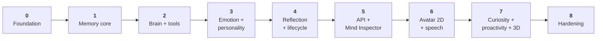

# 22 — Development Roadmap

**Status:** Design · **Depends on:** all subsystem documents

---

## 1. Principles

1. **Every phase ends with something a human can use.** No phase produces only internal
   plumbing. From Phase 0 onward there is a working `hedwig chat`.
2. **Exit criteria are binary.** A phase is done when its criteria pass, not when it feels
   done. No phase begins before the previous one's criteria pass.
3. **The determinism harness comes first.** `FakeClock`, `RecordedProvider` and the test
   container are Phase-0 work. Retrofitting them later is impossible in practice.
4. **The vertical slice comes before the breadth.** Phase 1 is a thin end-to-end path through
   memory; Phase 4 makes it deep. A system that is deep in one subsystem and absent in others
   cannot be evaluated.
5. **Observability precedes the features it observes** where cheap. Correlation ids and the
   `llm_call`/`working_set_log` records land in Phase 1–2, before the cognition that needs
   explaining.
6. **Documentation and code land in the same commit.** A phase whose docs were not updated is
   not complete ([CLAUDE.md](../CLAUDE.md)).

---

## 2. Sequencing rationale

Why this order and not the obvious alternative (avatar early, because it demos well):

- **Memory before everything** — it is the differentiator and the hardest thing to retrofit.
  Every other subsystem reads from it.
- **Emotion and personality before reflection** — reflection *proposes drift*, so its consumer
  must exist first.
- **Reflection before the inspector** — otherwise the inspector has little interesting to show.
- **The inspector before the avatar** — you cannot debug an emotional system by looking at its
  face, and by Phase 6 there is real cognitive behaviour worth expressing.
- **Curiosity last of the features** — it is the only network-facing subsystem, and it should be
  built when the injection defences can be tested against a mature system rather than a
  skeleton.

---

## 3. Phases

### Phase 0 — Foundation — **delivered (Milestone 1)**

**Goal:** a skeleton with all the seams in place, and something a human can run.

Phase 0 was split during implementation. Everything requiring a database or a model moved
to Phase 1, leaving Phase 0 as *structure and seams only*. The reason: the value of this
phase is that the clock, the ports, the layering rules and the composition root exist before
any feature is written against them — and none of that needs a model. Shipping the shell
early also means every later phase is demonstrable from day one.

| Deliverable | Status |
|---|---|
| Repo, `pyproject.toml`, `uv` lock, CI (three jobs: backend, frontend, architecture) | Done. The Python 3.9 `.venv` was deleted; the project is pinned to 3.12 |
| `core/`: config (layered TOML → `.env` → env → CLI), clock, ids (monotonic ULID), logging, correlation context, typed errors | Done |
| `core/ports/`: `Clock`, `EventBus` | Done — `EventBus` is an interface only, deliberately ([04](04-communication-and-event-bus.md)) |
| `wiring.py` composition root, `hedwig serve` / `config` / `version` | Done |
| API: `/v1/health`, error envelope, correlation middleware, CORS | Done |
| Frontend: React + Vite + TS, isolated transport layer, health view | Done |
| Electron desktop shell | Done — [ADR-0015](adr/0015-electron-desktop-shell.md) |
| `scripts/dev.mjs`: one command, ordered startup, unified logs, clean shutdown | Done |
| Determinism harness: `FakeClock`, test container | Done. `RecordedProvider` moves to the phase that adds the LLM gateway |
| Architecture tests: import-linter contracts, clock-seam scan, port purity, frozen value objects | Done |
| Docker (development only) | Done — [17](17-backend-architecture.md) §10 |
| Store + migrations, event bus implementation, LLM gateway, `hedwig chat` | **Moved to Phase 1** |

**Exit criteria — met**

- One command (`npm run dev`) starts the backend, the renderer and the shell, with unified
  logs and hot reload on both sides.
- `/v1/health` reports per-subsystem status; every response carries a correlation id.
- The whole suite runs offline and deterministically in under a second (73 tests).
- Import-linter passes; a deliberate layering violation fails CI.
- Ctrl-C shuts every process down cleanly and leaves no orphans.

**Deferred to Phase 1** — API auth ([16](16-api-structure.md) §3), because no endpoint
exposes user data yet and the token design should land with the first one that does.

---

### Phase 1 — Memory core

**Goal:** HEDWIG remembers across sessions. The vertical slice.

| Deliverable | Notes |
|---|---|
| **Carried from Phase 0:** store + migration runner, event bus implementation, LLM gateway, `hedwig chat`, `RecordedProvider`, API auth token | Everything Phase 0 deferred because it needs a database or a model |
| Memory schema: episodes, beliefs, entities, links, derivation, access, tombstones | [05](05-data-model-and-database.md) §5.2 |
| `SqliteMemoryStore` | Full `MemoryStore` port |
| Embeddings + `sqlite-vec` + FTS5, with `embedding_state` guarding | Model-id mismatch detection from the start |
| Hybrid retrieval: multi-query, RRF, rescoring, MMR, packing, `working_set_log` | [06](06-memory-architecture.md) §5 |
| T0 capture (extraction + capture filter) | [12](12-reflection-engine.md) §3 |
| Recent-turn window, separate from retrieval | INV-1 |
| `hedwig memory search/show/pin/forget` | |
| Recall eval corpus and baseline | The regression gate for all later retrieval work |

**Exit criteria**

- A fact stated in session 1 is used correctly in session 5 without being in context.
- recall@5 ≥ 0.80 on the eval corpus.
- Duplicate statements reinforce rather than duplicate (novelty gate works).
- Every retrieved item has provenance and a score breakdown.
- Retrieval p95 < 150 ms on a 10 k-memory corpus.

---

### Phase 2 — Brain and tools

**Goal:** proper orchestration, tool use, and traces.

| Deliverable | Notes |
|---|---|
| LangGraph turn graph, all nodes, pure routing, `SqliteSaver` checkpointing | [07](07-brain-langgraph-workflow.md) |
| Guard node: trust classification, safety, injection scoring | |
| Tool registry, schema validation, approval via interrupt, `tool_call` audit | [13](13-knowledge-and-tools.md) §5 |
| Phase-2 tool set: `search_memory`, `search_documents`, `read_file`, `get_datetime`, `calculate` | |
| Local document ingestion: chunking, heading paths, secret scanning, `forget_path` | |
| Spans, correlation propagation, `hedwig replay <correlation_id>` | |
| Resource governor with the model lock | Before background work exists, so background work is born governed |

**Exit criteria**

- A turn needing a tool completes; approval interrupt works and survives a restart.
- Iteration and token caps degrade to a reply, never to an error.
- `hedwig replay` reproduces a turn byte-identically from fixtures.
- Node single-writer and graph-termination tests pass.
- Documents are retrievable with correct attribution; a planted secret is skipped and reported.

---

### Phase 3 — Emotion and personality

**Goal:** internal state that measurably changes behaviour, and an identity that can drift.

| Deliverable | Notes |
|---|---|
| Emotion: appraisal (rules + model), mapping matrix, integrator, 30 s tick, history | [09](09-emotion-engine.md) |
| All behaviour bindings, plus the prohibition tests | §6 of that doc |
| Personality: traits, anchors, bounds, deterministic directive rendering | [10](10-personality-engine.md) |
| Identity core, bootstrap | |
| Drift application path with all seven guardrails, history, revert | Proposals still come from Phase 4 |
| `MindStateProvider`; retrieval policy derived from mind state | The cognition→knowledge seam, proven |
| `hedwig mind`; emotion and personality REST endpoints | |
| Explainability records complete: `/explain` assembles | [16](16-api-structure.md) §6 |

**Exit criteria**

- Every emotion dimension has a binding, and the binding-coverage test proves it (INV-3).
- All ten traits show measurable output differences at their extremes (INV-2).
- Emotion at every extreme leaves factual accuracy, approvals and refusals unchanged.
- The honesty eval passes with zero violations (INV-10).
- `/explain` returns a complete, resolvable record for a memory-and-tool turn.
- A simulated month shows plausible emotional arcs and no runaway or flatline.

---

### Phase 4 — Reflection and memory lifecycle

**Goal:** memory that organises itself, and personality that actually evolves.

| Deliverable | Notes |
|---|---|
| T1 session reflection: summaries, entity and relation updates | |
| T2 nightly: the twelve-stage graph, cursor-resumable, preemptible | [12](12-reflection-engine.md) §5 |
| Decay, reinforcement, forgetting with the 2 %/night cap | [06](06-memory-architecture.md) §7 |
| Belief merging, contradiction resolution, tentative promotion | |
| Procedural memory: candidate → active → retired | |
| Drift proposals from evidence; rejection reporting | |
| T3 weekly and T4 monthly, including the identity report | |
| Scheduler: cron, idle detection, coalesced catch-up, job resumption | [17](17-backend-architecture.md) §5 |
| Identity snapshots and rollback | |
| Cognitive metrics ([19](19-observability.md) §6.2) | |

**Exit criteria**

- Every tier is idempotent: running twice changes nothing.
- Interrupting T2 at any stage resumes correctly and matches an uninterrupted run.
- A simulated 90 days: important memories survive, trivia decays, store size bounded, drift
  within caps, no orphaned lineage.
- Interactive latency during full-tilt T2 stays within 0.5 s of baseline; yield < 2 s.
- A week asleep produces one coalesced catch-up run and no mass forgetting.
- Summary fidelity and merge precision evals pass.

---

### Phase 5 — API and Mind Inspector

**Goal:** HEDWIG becomes visible.

| Deliverable | Notes |
|---|---|
| Complete REST surface, OpenAPI checked in, type generation | [16](16-api-structure.md) |
| WebSocket protocol: streaming, stages, approvals, mind updates, notices, reconnect replay | |
| React app: conversation pane with citations, feedback, approval modal | [18](18-frontend-architecture.md) |
| Mind Inspector: emotion, memory, personality, goals, findings, traces | The centrepiece of this phase |
| Memory editing: pin, correct, forget, restore | |
| Goals module: lifecycle, retrieval and initiative influence | [08](08-state-management.md) §6 |
| `/health`, notices, `/metrics`, weekly self-report | |
| Export and purge, with the purge-completeness test | [21](21-security-privacy-ethics.md) §7 |

**Exit criteria**

- CLI-parity: the CLI uses only the public API, and every UI action has an API equivalent.
- The trace view reconstructs a full causal graph for any turn.
- A user can find a wrong memory, correct it, and see the correction take effect in the next
  reply.
- Purge leaves zero residue on a full-file scan.
- Reconnecting mid-stream loses nothing.
- Accessibility: keyboard navigation and reduced-motion throughout.

---

### Phase 6 — Avatar and speech

**Goal:** HEDWIG has a face that tells the truth.

| Deliverable | Notes |
|---|---|
| Expression module: pure resolver, damped smoothing, idle scheduler, 10 Hz emitter | [15](15-avatar-controller.md) |
| Frame protocol, character profile format, mapping validation | |
| 2D layered SVG renderer, capability fallback, calm mode, reduced motion | |
| TTS adapter (Piper) with phoneme timings; amplitude and text-paced fallbacks | |
| ASR adapter (Whisper.cpp), opt-in | |
| Frame-budget and battery behaviour | |

**Exit criteria**

- Golden frame sequences for the canonical scenarios are stable.
- Emotion state and rendered expression never disagree (verified side-by-side in the inspector).
- Headless mode works: nothing depends on a renderer existing.
- Lip sync within 40 ms of audio with phoneme timings; text-paced fallback is convincing.
- 10 minutes of frames: no memory growth, no queue buildup, paused when hidden.

---

### Phase 7 — Curiosity, proactivity, 3D

**Goal:** HEDWIG acts between conversations — carefully.

| Deliverable | Notes |
|---|---|
| Gap detection for all six origins (works with the network off) | [11](11-curiosity-engine.md) §3 |
| Fetcher: allowlist, robots, caching, sanitisation, egress audit log | |
| CuriosityGraph: local-first, budgeted, assessment, quarantine | |
| Interruption policy, three delivery modes, asymmetric dismissal learning | §7 of that doc |
| InitiativeGraph | [07](07-brain-langgraph-workflow.md) §5 |
| The full seven-layer injection defence, and the red-team suite | [13](13-knowledge-and-tools.md) §6 |
| VRM/three.js renderer | Same frame protocol, no backend change |

**Exit criteria**

- Injection red-team: **zero** successful instruction execution, 100 % quarantine of flagged
  content. Release gate.
- Egress audit is complete and contains no user-authored text.
- With the network off, gap detection and local exploration work unchanged (INV-7).
- Dismissal rate below 30 % in a simulated usage scenario; rate limits and quiet hours hold.
- Curiosity promotion rate above baseline; budgets never exceeded across a restart.
- Swapping 2D → 3D requires zero backend changes.

---

### Phase 8 — Hardening

**Goal:** something that can be relied on for years.

| Deliverable | Notes |
|---|---|
| Full eval suite in nightly CI with baselines | [20](20-testing-strategy.md) §7 |
| Long-horizon soak: one simulated year, plus a real 30-day install | |
| Backup, restore, compaction, `hedwig doctor` | |
| Packaging: `uv tool install`, service install, upgrade path with migration backups | |
| Token in the OS keychain; optional SQLCipher | |
| Performance pass against the stated latency and growth targets | |
| Documentation review: every doc matches the code; ADRs current | |

**Exit criteria**

- All evals pass at or above baseline; the two zero-tolerance gates hold.
- A one-year simulated install: database under 1 GB hot, retrieval quality not regressed,
  personality within caps, no unbounded table.
- Backup → corrupt → restore verified.
- A fresh install on a clean machine works from one command.
- Every document's status header is current and its diagrams match the code.

---

## 4. Cross-cutting work per phase

| Phase | Docs to update | New architecture tests |
|---|---|---|
| 0 | 02, 03, 04, 05, 14, 17 | Layering, clock/random lint, schema lint |
| 1 | 05, 06 | Table ownership, frozen types |
| 2 | 07, 13, 19 | Node single-writer, graph termination, event catalogue |
| 3 | 09, 10, 16 | Emotion binding coverage, trait adherence |
| 4 | 06, 08, 12 | Idempotency, property tests on decay and drift |
| 5 | 16, 18, 19, 21 | OpenAPI drift, purge completeness, CLI parity |
| 6 | 15, 18 | Golden frames, mapping validation |
| 7 | 11, 13, 21 | Red-team gate, egress audit |
| 8 | all | Full suite; doc/code consistency |

---

## 5. Estimated effort

Deliberately in relative units, not calendar time: one developer's rough sense of proportion,
useful for sequencing decisions and useless as a schedule.

| Phase | Relative size | Risk | Main risk |
|---|---|---|---|
| 0 Foundation | 3 | Low | Over-building the platform before any feature needs it |
| 1 Memory core | 5 | **High** | Retrieval quality; this is where the project succeeds or fails |
| 2 Brain + tools | 3 | Medium | LangGraph API churn; logic leaking into nodes |
| 3 Emotion + personality | 4 | Medium | Bindings that do not actually change behaviour |
| 4 Reflection + lifecycle | 5 | **High** | Idempotency and resumability; silent memory corruption |
| 5 API + Inspector | 5 | Low | Scope creep in the UI |
| 6 Avatar + speech | 4 | Medium | Uncanny-valley polish absorbing unbounded time |
| 7 Curiosity + 3D | 5 | **High** | Injection; nagging; 3D scope |
| 8 Hardening | 3 | Low | Never feeling finished |

The two highest-risk phases (1 and 4) are both memory. That is the correct distribution of risk
for this project — it is a memory system with a face, not a face with a memory.

---

## 6. Beyond Phase 8

Not scheduled. Each needs an ADR and a trigger, and each is listed in the "future improvements"
section of the relevant subsystem document.

| Candidate | Gate |
|---|---|
| Fine-tuning on accumulated memory | ≥6 months of real data; retrieval quality plateaued |
| Voice-first interaction | Latency budget has headroom |
| Multi-device sync | The conflict-resolution design in [23](23-challenged-assumptions.md) §12 is solved |
| Sandboxed user tools | Genuine demand; its own threat model |
| Multi-user | Explicit non-goal today ([01](01-vision-and-scope.md) §4) |
| Mobile client | WS protocol stable for a full phase |
| Vision input | Multi-modal memory design exists |
