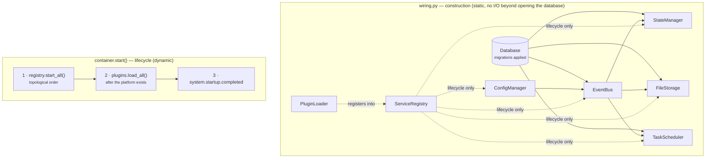

# 25 — Core Infrastructure (Milestone 2)

**Status:** Implemented · **Depends on:** [03](03-module-contracts.md), [04](04-communication-and-event-bus.md), [05](05-data-model-and-database.md), [08](08-state-management.md), [17](17-backend-architecture.md)

---

## 1. Purpose

Milestone 1 built the skeleton and the seams. Milestone 2 fills seven of them with working
platform services. This document is the map: what exists, which port it implements, which
architecture document it realises, and where its tests are.

Nothing here knows what a memory, an emotion or a model is. That is the point — every
service in this milestone could be lifted into an unrelated project unchanged, which is the
test of whether Layer 6 stayed honest ([02](02-system-architecture.md) §3).

---

## 2. What was built

| Service | Port | Implementation | Realises | Tests |
|---|---|---|---|---|
| **Event bus** | `EventBus` | `core/bus/in_process.py` | [04](04-communication-and-event-bus.md) §3 | `tests/unit/test_event_bus.py` |
| **Configuration manager** | `ConfigManager` | `core/config_manager.py` | [02](02-system-architecture.md) §7, [17](17-backend-architecture.md) §8 | `tests/unit/test_config_manager.py` |
| **Plugin loader** | `PluginLoader` | `core/plugins.py` | [ADR-0016](adr/0016-in-tree-plugin-loader.md) | `tests/unit/test_plugins.py` |
| **State manager** | `StateManager` | `core/state.py` | [08](08-state-management.md) §3-4, §7 | `tests/unit/test_state.py` |
| **Service registry** | `ServiceRegistry` | `core/registry.py` | [ADR-0017](adr/0017-service-registry-not-a-service-locator.md), [17](17-backend-architecture.md) §3-4 | `tests/unit/test_registry.py` |
| **Task scheduler** | `TaskScheduler` | `core/scheduler/` | [17](17-backend-architecture.md) §5-6 | `tests/unit/test_scheduler.py` |
| **File storage** | `FileStorage` | `core/storage.py` | [05](05-data-model-and-database.md) §2 | `tests/unit/test_storage.py` |

Supporting: `core/store/` (connection, pragmas, transactions, migrations) and
`migrations/0001_platform.sql` (event outbox, state documents, task runs, blob metadata —
no domain tables).

---

## 3. How they fit together



Start order is `config → bus → {state, storage, scheduler} → plugins`; stop is exactly the
reverse, then the database closes. Both are asserted by tests rather than hoped for.

### 3.1 Construction and lifecycle are separate

`build_container()` builds and returns; it starts nothing. `container.start()` runs the
lifecycle. This is what makes it possible for a test to build the whole graph, inspect it,
and never run it — and it is the reason `tests/unit/test_wiring.py` can assert the shape of
the system in microseconds.

---

## 4. Design decisions worth knowing

### 4.1 The bus is durable before it is fast

Every event is written to the `event` table *before* any handler sees it. A crash between
"it happened" and "someone handled it" therefore loses nothing, and a restart re-delivers
from the per-subscription cursor. The cost is one insert per event (~10 µs on WAL SQLite),
which at HEDWIG's event volume is free.

At-least-once delivery means **every handler must be idempotent**. `processed_event` makes
that cheap: a handler that has already run for an event id is skipped on redelivery.

### 4.2 Lossiness is declared, never discovered

Each subscription states at registration whether losing an event is acceptable. Durable
subscribers apply backpressure to the publisher; lossy ones drop the oldest, keep the
newest, and **count the drop**. A silent drop is how an event system starts lying to you.

### 4.3 State enforces one writer per namespace

docs/08 §3 says exactly one module writes each piece of state. Here it is mechanical: a
namespace has a registered owner, and a write from anyone else raises. Updates are deltas
applied through `mutate()`, which re-reads and re-applies on conflict — correct precisely
because the mutator is a delta rather than an absolute value.

Snapshots are per-namespace, so rolling back a month of drifted personality never touches
memory (docs/08 §7.1). A restore is itself a versioned write, so the rollback appears in
history rather than erasing it.

### 4.4 Storage is content-addressed

The identifier of a blob is the SHA-256 of its bytes. Deduplication, verifiable integrity
and the absence of path traversal all fall out of that one choice — a path is derived from a
hash, never from input. Writes are atomic: temp file, fsync, rename.

### 4.5 Configuration provenance costs one extra pass

pydantic-settings resolves values but does not report which layer won. `LayeredConfigManager`
re-reads each source independently to answer "where did this come from?", which is the most
common question a layered-configuration system produces. Only three settings are
hot-reloadable; everything else refuses loudly and names itself, because a setting that
appears to change and does not is worse than one that says it cannot.

### 4.6 The scheduler assumes the laptop was asleep

Missed runs coalesce rather than stacking up, runs persist a cursor so an interrupted task
resumes, one run per task is enforced by a unique partial index rather than by hoping, and
every task has a deadline. Triggers are pure functions of time and last success, so the
entire schedule is testable against `FakeClock` without waiting for anything.

---

## 5. A bug this milestone fixed

`InProcessBus.drain()` returned while a retry was still scheduled. Because `stop()` calls
`drain()`, a durable event that was one retry away from succeeding could be dropped at
shutdown — the exact failure the outbox exists to prevent.

The cause: a handler that has just failed schedules its retry through `call_soon`, so the
moment immediately after the queue empties *looks* idle and is not. `drain()` now yields
twice and checks three conditions together (nothing queued, nothing in flight, no retry
outstanding), bounded by `MAX_DRAIN_PASSES` so a busy bus cannot hang a shutdown.
Regression: `test_failures_retry_then_dead_letter`.

---

## 6. What is deliberately absent

| Not built | Why |
|---|---|
| Resource governor | Documented in [17](17-backend-architecture.md) §7; needs the LLM gateway to govern. The scheduler already carries `Priority` on every spec so the governor has something to read. |
| Event payload JSON Schemas | The catalogue validates type names and required keys. Full schemas per type are the upgrade in [04](04-communication-and-event-bus.md) §11, worth doing when there are more than ~30 types. |
| Any first-party plugin | The loader is exercised by tests; the allowlist ships empty. A speech adapter is the likely first one. |
| Config `/v1/config` endpoint | The manager supports it; the route lands with the rest of the API surface in [16](16-api-structure.md). |
| Domain tables | Migration 0001 is platform only. Episodes, beliefs and entities arrive with memory ([05](05-data-model-and-database.md) §5.2). |

---

## 7. Verification

```bash
uv run pytest -q          # 217 tests
uv run ruff check .       # lint
uv run mypy               # strict, 57 files
uv run pytest -m architecture -v   # layering and convention contracts
```

The architecture tests are the ones that matter for longevity: they parse `docs/` and fail
the build when code and documentation disagree ([20](20-testing-strategy.md) §8).

---

## 8. Future improvements

| Improvement | Trigger |
|---|---|
| Socket transport behind the bus's queue seam | First module extracted from the process ([02](02-system-architecture.md) §2) |
| Per-type payload schemas with generated types | Event types exceed ~30 |
| `asyncio.to_thread` inside `Database` | Profiling shows SQLite blocking the loop (it does not today) |
| Snapshot retention policy | Snapshots accumulate; today nothing prunes them |
| Scheduler preemption against interactive work | The resource governor lands |
| Blob reference counting | Something other than the privacy purge needs to delete blobs safely |
