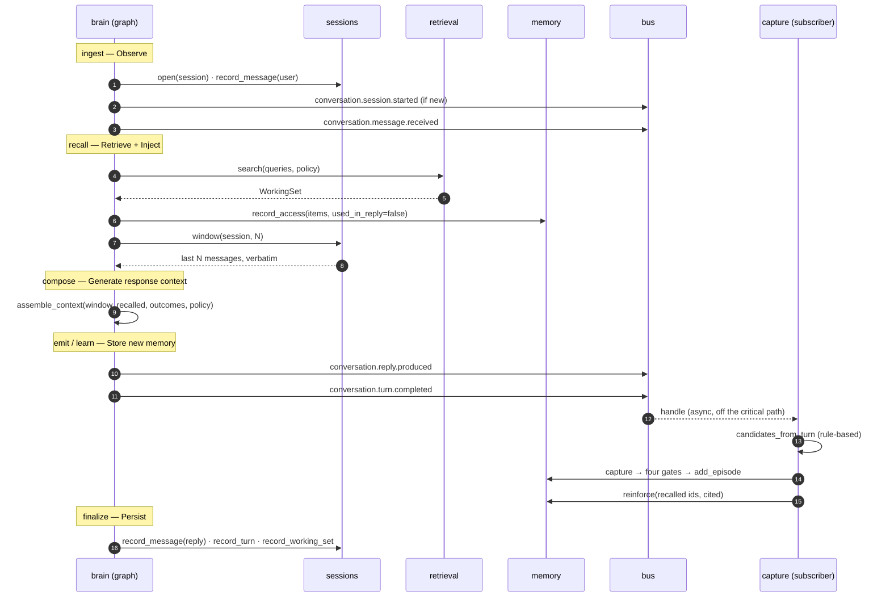

# 26 — The Turn/Memory Loop (Milestone 6)

**Status:** Implemented (Milestone 6) · **Depends on:** [04](04-communication-and-event-bus.md), [05](05-data-model-and-database.md), [06](06-memory-architecture.md), [07](07-brain-langgraph-workflow.md) · **Depended on by:** [12](12-reflection-engine.md), [16](16-api-structure.md)

---

## 1. Purpose

Milestone 5 connected memory to the graph on the **read** side only: `recall` retrieves,
and nothing else about the turn touches the database. The graph is a closed loop over
ephemeral state — it opens no session, writes no message, records no turn, and teaches
memory nothing. Every conversation is the first conversation.

This milestone closes the loop:

```
Observe → Retrieve → Inject → Generate response context → Store new memory → Persist
```

After it, a turn leaves three durable traces (the conversation log, the turn record, and
whatever memory decided was worth keeping) and memory gets feedback about what was useful.

**Out of scope, deliberately:** emotion, personality, curiosity, and model-backed
extraction. The candidate builder here is rule-based, exactly as `RulePlanner` was in
Milestone 4 — a real implementation behind the seam the model-backed one will take over.

---

## 2. Where each stage lands

The requested pipeline is not a new graph; it is the documented graph
([07](07-brain-langgraph-workflow.md) §3) finally doing what its node table always said it
did. No node is added, no edge changes.

| Stage | Node | What was there before | What it does now |
|---|---|---|---|
| **Observe** | `ingest` | minted ids | opens/resumes the session, writes the user message, announces `conversation.session.started` + `conversation.message.received` |
| **Retrieve memories** | `recall` | retrieval only | retrieval **and** the recent-turn window ([06](06-memory-architecture.md) §5.1) |
| **Inject into graph state** | `recall` | `context` | `context`, `window`, `working_set_id` |
| **Generate response context** | `compose` | passed `RecalledContext` straight through | calls the pure `assemble_context`, which orders, labels by trust and accounts for tokens |
| **Store new memory** | `learn` → subscriber | nothing | announces `conversation.turn.completed`; the memory subscriber captures and reinforces |
| **Persist** | `finalize` | computed a status | writes the reply message, the turn row and the working-set log |

Two of these deserve their justification stated rather than assumed.

**Why `compose` assembles rather than a new `assemble` node.** A node would make the stage
visible in the graph, but the composition stage is reached from three different routing
decisions (`deliberate`, `approve`, `act`), all of which return the literal `"compose"`.
Inserting a node means either rewriting those routing literals — which describe an
*intent*, not a node name — or mapping `"compose" → "assemble"` in the edge table, where a
reader tracing the graph lands somewhere other than where they were sent. Assembly is a
pure function called by one node: the stage is named, tested in isolation, and the graph
stays readable. Simplicity over literalism ([01](01-vision-and-scope.md)).

**Why capture is a subscriber and not a node.** [07](07-brain-langgraph-workflow.md) §3.1
already requires it: *"Capture is a subscriber to `conversation.turn.completed`, which
keeps the graph short and lets capture take its time."* When extraction becomes a utility
model call it will cost 150–400 ms, and that is latency the user should not pay
([06](06-memory-architecture.md) §4.3).

---

## 3. The loop



### 3.1 Ordering: publish before persist

[07](07-brain-langgraph-workflow.md) §3 puts `learn` before `finalize`;
[06](06-memory-architecture.md) §4 draws the persist first. The documents disagree, and the
disagreement is real rather than cosmetic, so it is resolved here rather than left for a
reader to trip over.

**Resolution: the graph order stands (`learn` then `finalize`), and the capture subscriber
is made not to care.** The event payload carries everything capture needs — the input text,
the reply, the status, the recalled memory ids — so capture never reads the turn row back.
Its only database prerequisite is the `session` row, which `ingest` wrote at the start of
the turn.

The consequence is stated plainly: if the process dies between `learn` and `finalize`, a
memory can exist for a turn that has no turn row. That is survivable — the message log
([05](05-data-model-and-database.md) §7) is the authoritative record and is written at
`ingest`; the turn row is a timing and status record. The reverse ordering would have the
worse failure: a persisted turn that memory never saw, which is silent data loss of exactly
the kind the whole system exists to prevent. [ADR-0018](adr/0018-capture-reads-the-event-not-the-turn-row.md).

---

## 4. New module: `sessions`

`session`, `message` and `turn` are owned by `sessions`
([05](05-data-model-and-database.md) §5.1), and until now nothing implemented that owner.
The tables existed (migration 0003) with exactly one reader and no writer.

```python
class Conversation(Protocol):                      # core/ports/sessions.py
    async def open(self, session_id: str, *, channel: str = "api") -> bool
    async def record_message(self, *, session_id, message_id, role, text, trust, ...) -> int
    async def window(self, session_id, *, limit=None) -> Sequence[WindowMessage]
    async def record_turn(self, record: TurnRecord) -> None
    async def record_working_set(self, record: WorkingSetRecord) -> None
```

The port is shaped for its consumer, like every other port here
([03](03-module-contracts.md) §5): these five methods are what a node needs, not a general
conversation API. `SqliteSessionStore` implements it directly, so no adapter is needed —
unlike `Recaller`, whose implementation (`HybridRetrieval`) predated the port.

**The recent-turn window moves here.** It was `memory/window.py`, reading a table `memory`
does not own. [08](08-state-management.md) §3 is explicit that the owner is the only module
permitted to write; letting a non-owner define the *read* is the same mistake one step
removed, and it left two `SELECT`s over `message` in two modules. The design claim of
[06](06-memory-architecture.md) §2 is unchanged and unchallenged — short-term memory is
still a query, not a store. The query now lives with the table.

Moving it also put the layering back where [02](02-system-architecture.md) §5.1 always had
it: `sessions` is a Layer 2 module, above `memory`, and now genuinely is — `memory` imports
nothing from it.

---

## 5. Generating the response context

```python
@dataclass(frozen=True, slots=True)
class ResponseContext:
    window: tuple[WindowMessage, ...] = ()       # verbatim, never budgeted
    recalled: tuple[ContextItem, ...] = ()       # already budgeted by retrieval
    outcomes: tuple[ToolOutcome, ...] = ()       # trust: TOOL
    window_tokens: int = 0
    recalled_tokens: int = 0
    dropped: int = 0
    cited_memory_ids: tuple[str, ...] = ()
    has_untrusted: bool = False
```

`assemble_context` is pure and makes four decisions:

1. **Order.** Recalled memories first (oldest first), then tool outcomes, then the window
   last — closest to the question, because the previous sentence must never be outranked by
   a two-year-old memory ([06](06-memory-architecture.md) §5.1).
2. **The window is never charged to the retrieval budget**, but its tokens are counted, so
   the true size of the context is visible rather than pleasantly understated.
3. **Trust is carried per item, and `has_untrusted` is hoisted**, so a responder cannot
   forget to delimit untrusted material ([13](13-knowledge-and-tools.md) §6).
4. **`cited_memory_ids`** records what was actually shown to the model. That set is the
   input to reinforcement.

**It produces structure, not prose.** [07](07-brain-langgraph-workflow.md) §1 says the
brain owns no prompt content, and that rule survives this milestone: rendering a
`ResponseContext` into a prompt is the responder's job, which today is a stub and tomorrow
is the gateway from Milestone 3.

---

## 6. Teaching memory

### 6.1 What is captured

`candidates_from_turn` is a pure function producing at most one `interaction` episode from
a completed turn, which then faces the four capture gates unchanged
([06](06-memory-architecture.md) §4.1). It is deliberately unclever:

| Signal | Rule |
|---|---|
| Title | the user's input, trimmed to a line |
| Content | the exchange, both sides, verbatim |
| `user_flagged` | the input contains an explicit marker: *remember*, *don't forget*, *keep in mind*, *note that*, *for future reference* |
| Trust | `USER` — the content originates with the principal |
| Refused and failed turns | produce nothing |

Everything else — entity centrality, goal relevance, emotional charge — is left at zero
because the engines that would supply it do not exist yet, and a fabricated signal is worse
than an absent one. The novelty and redundancy terms come from the gates themselves, which
already compare against what is stored.

This is where a model-backed extractor ([12](12-reflection-engine.md) §3) will replace the
rule, behind the same function signature.

### 6.2 What is reinforced

[06](06-memory-architecture.md) §7.2 orders reinforcement by how much use was proven:
retrieved < cited < corroborated < validated. Two of the four are now observable:

* **Retrieved** — recorded by `MemoryRecaller` when a search returns an item. Every item in
  the working set gets it, with `used_in_reply=false`.
* **Cited** — recorded by the subscriber, for the memories that reached the assembled
  context of a turn that actually produced a reply.

"Cited" is an approximation: it means *shown to the model*, not *used by the model*. The
honest version needs the model to declare its citations in structured output, which is a
Milestone-7 concern. The approximation is stated here so nobody later reads the access log
as stronger evidence than it is.

---

## 7. Data

Migration `0005_working_set.sql`:

```sql
CREATE TABLE working_set_log (...);              -- docs/05 §5.1, previously unimplemented
ALTER TABLE turn ADD COLUMN working_set_id TEXT; -- the turn's retrieval, for /v1/explain
```

`working_set_log` is what makes "why did you bring that up?" answerable
([16](16-api-structure.md) §6): the queries, the policy, and every item with its score
breakdown. Pruned after 90 days ([05](05-data-model-and-database.md) §7) — it is
explanatory, not authoritative.

### 7.1 Events

Four types are registered in the catalogue, matching
[04](04-communication-and-event-bus.md) §5:

| Type | Published by | Payload |
|---|---|---|
| `conversation.session.started` | `ingest` | session_id, channel |
| `conversation.message.received` | `ingest` | session_id, message_id, text, trust |
| `conversation.reply.produced` | `emit` | session_id, message_id, text, working_set_ref |
| `conversation.turn.completed` | `learn` | turn_id, session_id, status, input, reply, intent, recalled_memory_ids, tool_calls, latency_ms |

`conversation.turn.completed` carries more than §5 lists, for the reason in §3.1: the
payload is the capture subscriber's whole input. §5's list was always "key fields", not a
schema.

Nodes do not touch the bus directly. A narrow `TurnAnnouncer` port sits between them, with
`BusAnnouncer` behind it, so `nodes.py` keeps its property of calling ports and nothing
else.

---

## 8. Tradeoffs

| Decision | Gained | Given up | Revisit if |
|---|---|---|---|
| Assembly as a pure function, not a node | Routing stays honest; the stage is unit-testable | The pipeline stage is not visible in the graph picture | Assembly needs to run more than once per turn |
| Capture in a subscriber | Short graph; capture can be slow later | Capture failures are quieter than turn failures | A capture-lag metric shows drift ([07](07-brain-langgraph-workflow.md) §9) |
| Publish before persist | No turn is ever invisible to memory | A memory can outlive its missing turn row | The turn row becomes load-bearing for anything but reporting |
| Rule-based candidate builder | Real behaviour with no model dependency; exhaustively testable | Captures the exchange, not the *fact* inside it | Reflection lands — that is the trigger, and it is the next milestone |
| "Cited" = shown to the model | Reinforcement gets a second, stronger signal today | It over-counts: shown is not used | Structured output can return citations |
| Window moved to `sessions` | One query, one owner | A file moved, and docs/06 now points elsewhere for it | Never |
| Pre-minting the reply message id at `ingest` | `emit` can announce an id that `finalize` writes | An id exists briefly for a row that may never be written | Ids become expensive or meaningful beyond identity |

---

## 9. Failure modes

| Failure | Where | Behaviour |
|---|---|---|
| Session row missing (deleted mid-turn) | `ingest` | `open` is an upsert; a missing session is recreated rather than failing the turn |
| Retrieval raises | `recall` | Already handled: the turn proceeds with the window only |
| Window query fails | `recall` | Empty window, logged; the turn continues — degraded, not dead |
| Capture subscriber raises | bus | Retried per the bus's policy, then dead-lettered. The turn is unaffected, the message log still holds the raw material, and re-extraction remains possible ([05](05-data-model-and-database.md) §7) |
| Duplicate delivery of `turn.completed` | subscriber | `processed_event` dedupes by (subscription, event id); the novelty gate is the second line of defence |
| `finalize` write fails | `finalize` | Logged at error with the full turn, `persisted=0` in metrics, status unchanged. The durable spool of [07](07-brain-langgraph-workflow.md) §8 is **not** built — see §11 |
| Reply produced but process dies before `finalize` | — | The user saw the reply; the message log has the input; the turn row is missing. Recorded, not silently lost |

---

## 10. Testing

* **`assemble_context` unit tests** — ordering, window-outside-budget, trust hoisting,
  citation set. Pure function, no graph.
* **`candidates_from_turn` unit tests** — the flag markers, refused turns, empty replies.
* **Session store unit tests** — sequence numbering under concurrent appends, window
  ordering, turn status round-trip, working-set serialisation.
* **Graph integration test** — one turn through a real container: assert a session row, two
  messages, one turn row, one working-set row, and an episode after the bus drains.
* **The loop test** — turn 1 states a fact; drain; turn 2 asks about it and recalls it.
  This is the milestone's whole claim in one test.
* **Reinforcement test** — a memory recalled and cited gains more salience than one merely
  retrieved.
* **Idempotency test** — the same `turn.completed` delivered twice captures once.

---

## 11. Future improvements

| Improvement | Trigger |
|---|---|
| Model-backed extraction (facts, not transcripts) | Milestone 7 — reflection |
| Model-declared citations, replacing "shown to the model" | Structured output in `compose` |
| The durable spool for `finalize` failures ([07](07-brain-langgraph-workflow.md) §8) | The first observed persist failure, or the first turn that is expensive to lose |
| `conversation.session.ended` and T1 reflection | Sessions gain an explicit end (an API or a timeout) |
| Working-set log pruning job | 90 days of turns exist, or the table crosses ~100 MB |
| Streaming: `emit` before `compose` finishes | The WebSocket channel lands |
| A title that is not a prefix of the content | See §12.3 — it costs tokens on every recall |

---

## 12. Implementation record

| Piece | Where |
|---|---|
| Conversation ports | `core/ports/sessions.py` |
| Conversation store | `sessions/store.py` |
| Response-context assembly | `brain/context.py` |
| Turn announcements | `brain/announcer.py` |
| Nodes, now doing what §3.1 of [07](07-brain-langgraph-workflow.md) always said | `brain/nodes.py` |
| Candidate builder and subscriber | `memory/turn_capture.py` |
| Retrieval access logging | `memory/recaller.py` |
| Schema | `migrations/0005_working_set.sql` |
| Tests | `tests/unit/test_sessions.py`, `tests/unit/test_brain_context.py`, `tests/unit/test_turn_capture.py`, `tests/integration/test_turn_memory_loop.py` |

537 tests pass; `ruff`, `mypy --strict` and the three `import-linter` contracts are clean.

### 12.1 What is genuinely built

* All six stages, on a real database, verified end to end — including the one assertion the
  milestone exists for: **a second turn recalls what the first turn taught it.** Before
  this, that test could not have been written.
* One turn leaves three durable traces: two messages, a turn row with both message ids and
  a latency, and (after the bus drains) an episode.
* The reinforcement loop is closed. A memory that is retrieved gains the `retrieved`
  increment; one shown in a reply gains `cited` on top. Salience now responds to use rather
  than only to time.
* `working_set_log` exists and is written on every turn that searched — including turns
  that found nothing, because "we looked and there was nothing" is also an explanation.
* Health went from four stubbed capabilities to four different ones: `recaller`,
  `conversation` and `announcer` are real; `guard`, `mind`, `responder` and `tools` are
  still honest stubs.

### 12.2 Deviations from this document

**No durable spool in `finalize`.** [07](07-brain-langgraph-workflow.md) §8 asks for one. A
persist failure is logged at error with everything needed to reconstruct the write, and
`persisted=0` appears in the turn's metrics — visible, but not recoverable without a human.
The trigger for building it is in §11, and it is deliberately not "before the first
failure": the reply has already reached the user, and the message log already holds the
input.

**Capture reads a fatter event than [04](04-communication-and-event-bus.md) §5 lists.**
Argued in [ADR-0018](adr/0018-capture-reads-the-event-not-the-turn-row.md).

### 12.3 Known costs

**A captured memory repeats its own title.** The title is the user's line; the content is
the whole exchange, which begins with that same line. Retrieval renders `title: content`,
so every recalled interaction spends the user's sentence twice. Fixing it properly means a
model writing a real title, which is the extraction work of the next milestone — a regex
that trims the duplicate would make the title worse, not the memory smaller.

**"Cited" over-counts.** Stated in §6.2 and worth repeating here, because the access log
will outlive this note: it records what was *shown to the model*, not what the model used.

### 12.4 Next

Reflection ([12](12-reflection-engine.md)): a utility model turning a captured exchange into
the *fact* inside it, behind `candidates_from_turn`'s signature. That is also what makes
belief formation — the semantic half of [06](06-memory-architecture.md) — start doing
anything, since nothing currently produces a `BeliefCandidate`.
